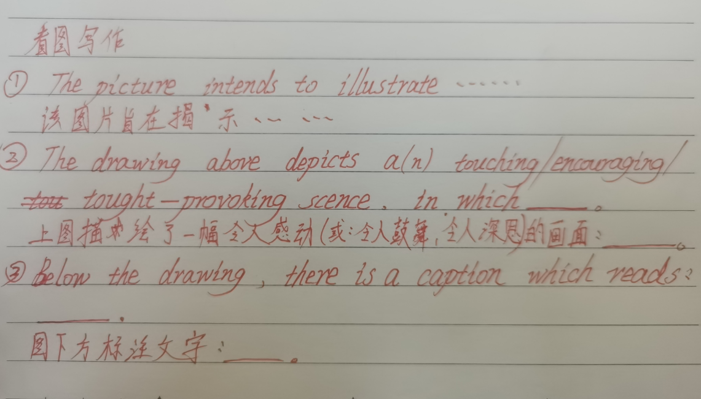
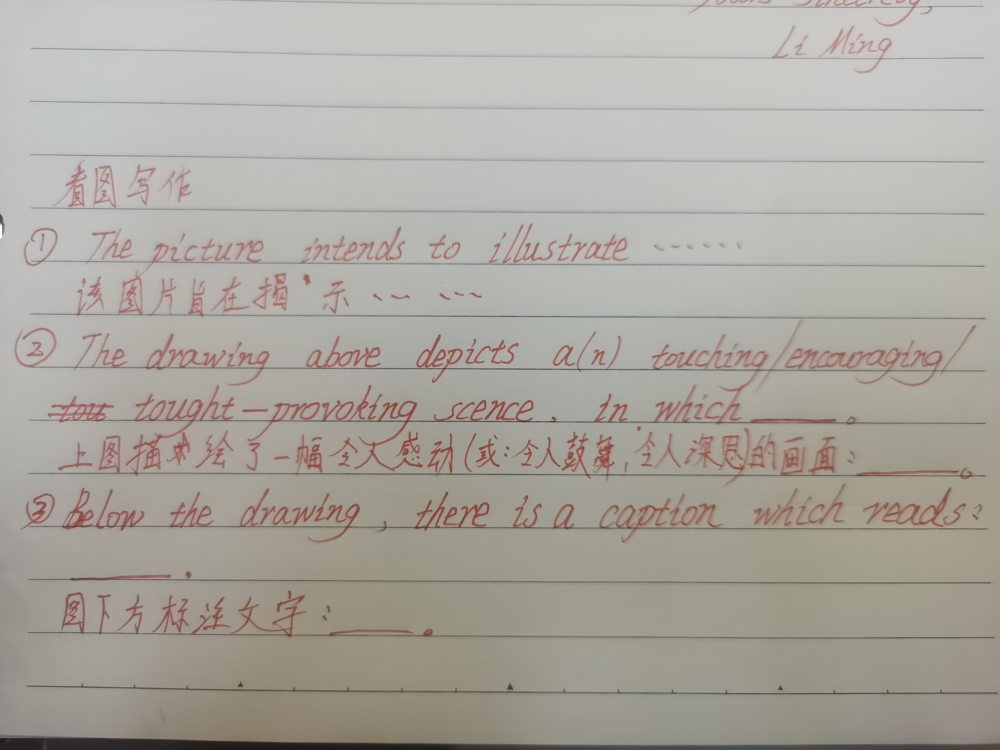

# 看图写作

# 模板：项目活动/安排

# 活动应聘

# caption

n.
(图片、漫画等的)说明文字
vt.
给(图片、照片等)加说明文字

# All countries have been benefiting greatly from absorbing different but complementary cultures,which accelerates the development of both material and spiritual civilization of human society.

各个国家都因为汲取各不相同但相辅相成的文化而受益匪浅，促进了人类社会物质文明和精神文明的发展。

# what lies behind the picture is clear: ......

图片背后的含义清晰可见：......

# 毫不夸张的说.....

It is no exaggeration to say that .....

# Therefore,we should realize its value and strive to pursue it.

因此，我们应该认识到它的价值，并为之努力。

# 社会文化 模板

# 冬季运动会

winter sports meeting
