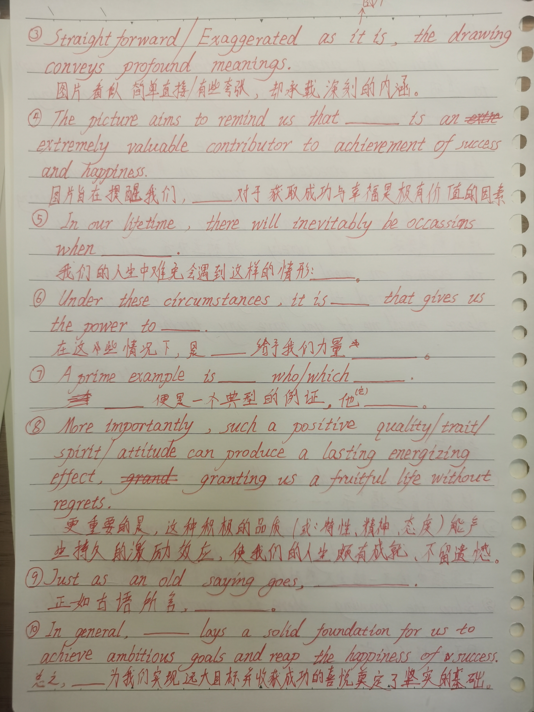

# 看图写作

# 模板：项目活动/安排

# 活动应聘

# caption

n.
(图片、漫画等的)说明文字
vt.
给(图片、照片等)加说明文字

# All countries have been benefiting greatly from absorbing different but complementary cultures,which accelerates the development of both material and spiritual civilization of human society.

各个国家都因为汲取各不相同但相辅相成的文化而受益匪浅，促进了人类社会物质文明和精神文明的发展。

# what lies behind the picture is clear: ......

图片背后的含义清晰可见：......

# 毫不夸张的说.....

It is no exaggeration to say that .....

# Therefore,we should realize its value and strive to pursue it.

因此，我们应该认识到它的价值，并为之努力。

# 社会文化 模板

# 冬季运动会

winter sports meeting

# 音乐会（通知）

# 看图作文 自律

# dedication

奉献

# cooperation 

  n.合作;  配合;  协作;  协助;  

# progress 

n.
进展;进步;进程;前进;行进
vi.
进展;进步;前进;改进;行进;(时间上)推移，流逝

# caption

n.
(图片、漫画等的)说明文字
vt.
给(图片、照片等)加说明文字

# illustrate

vt.
说明;(用示例、图画等)解释;显示…存在;加插图于;表明…真实;给(书等)做图表

# depict

vt.
描绘;描述;描写;刻画;描画

# scene

n.
场景;(尤指不愉快事件发生的)地点，现场;场面;景象;情景;镜头;事件;（戏剧或歌剧的）场;片段;争吵，吵闹;活动领域;表现…景色的绘画（或摄影）作品
