# 2023.10.7  试卷2008

1. 第二型曲面

   转换投影（化二重积分），注意曲面方向

   高斯公式（化三重积分），（无源场）散度div F =0可换面

   两类曲面积分关系

2. 第二型曲线

   化定积分

   格林公式（化二重积分）

   可变终点

   凑微分法

   两类曲线积分的关系

   利用斯托克斯（空间）转化为第二型曲面或者第一型曲面、旋度rot F=0 可换路径

3. 多元极值

   AC-B^2^,大于零时，A正为极小值

   拉格朗日乘数法

4. 积分中值定理

5. 高阶常微分

6. 傅里叶

7. 数学归纳法求行列式

   数学归纳法（低价-->高阶）

   递推法（高价-->低阶）

8. 克拉默法则

   线性方程组求单个x~i~

9. 统计量

# 2023.10.8  试卷2015

1. 标准型 转换

2. 概率不等式

3. 全微分

4. 三重积分的轮换对称性，积分区域等式代换进要注意是否所有积分点都在等式上否则不能代入

5. 泰勒

6. 方向导数的最大值，与梯度的关系，

   

   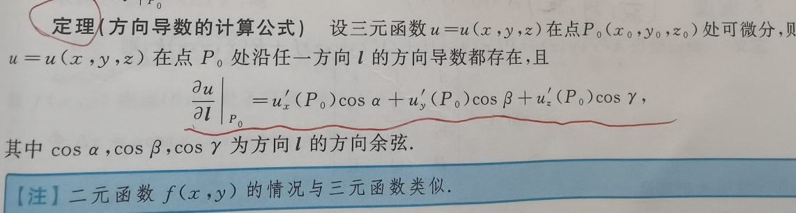

   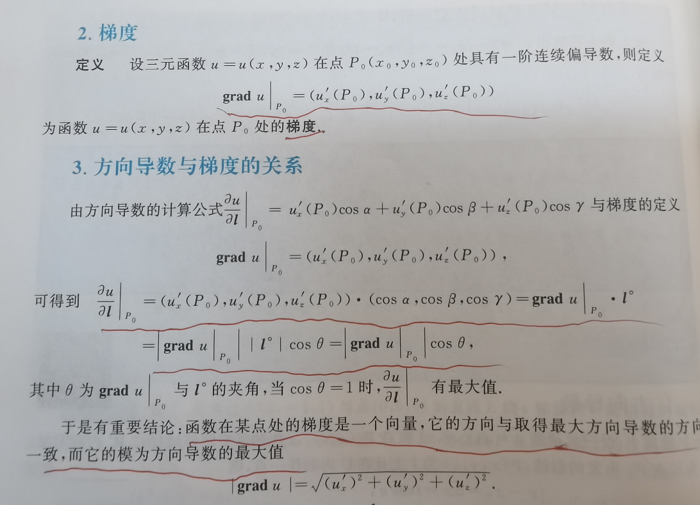

7. 拉格朗日乘数法求极值

8. 第二型曲线积分，格林公式的正方向（左手在内），空间曲线时斯托克斯公式化为第二型曲面积分的面方向以及化为第一型曲面积分的面法向量方向（右手规则）

9. 向量组，基，坐标变换

10. 几何分布的拓展，如二中即停，可以利用几何分布的无记忆性，也可以按部就班+无穷级数

# 2023.10.9  试卷2018

1. 等价(PAQ=B)、相似(P^-1^AP=B)、合同(P^T^AP=B)。  **A、B相似，r(A-特征值\*E）=r(B-特征值\*E)**
2. 等价(PAQ=B)，**初等变换秩不变**，可利用秩不变求等价时等式中的未知数。
3. 相似对角化，利用特征值的N重根和秩的关系。
4. 秩的不等式、矩阵相乘的意义
5. **三元函数u(X,Y,Z)：方向导数、梯度。向量场A(x,y,z)=P(x,y,z)i+Q(x,y,z)j+R(x,y,z)k：散度（加法那个）、旋度（行列式那个）**
6. 散度，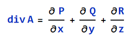第二型曲面积分高斯公式
7. 旋度，行列式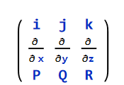
8. 二重积分换元，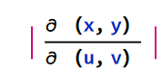，其中绝对值里面的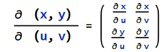
9. 三重积分换元，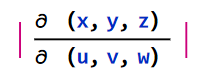
10. 第二型曲线积分，斯托克斯公式，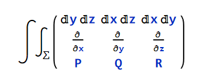化为第二型曲面积分，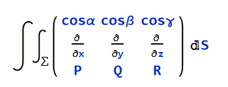化为第一型曲线积分。（cosα，cosβ，cosγ)为∑的单位外法向量。
11. 两类曲线积分关系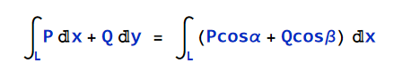，其中（cosα，cosβ)为L上点(x,y)处与L同向的单位切向量。
12. 点到直线\面的距离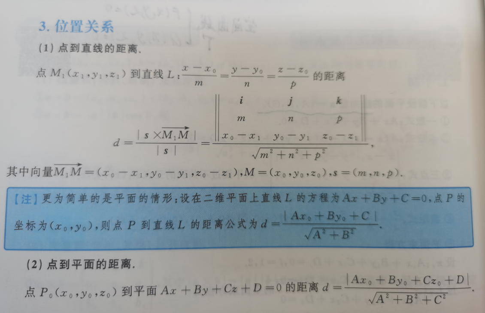
13. 向量积、混合积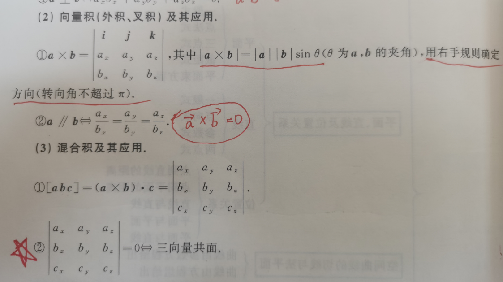
14. 隐函数求导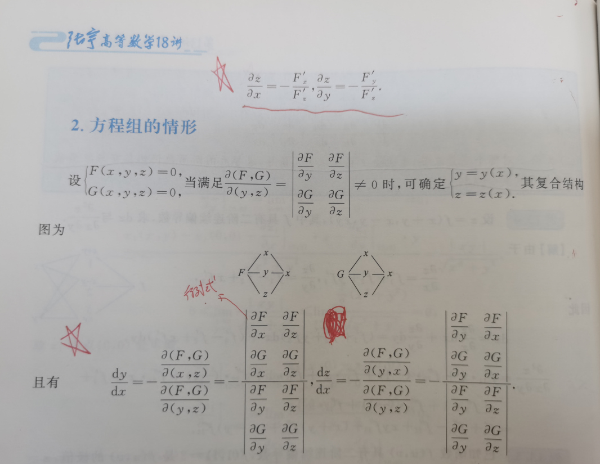
15. 轮换对称性
16. 条件极值，拉格朗日乘数法
17. 第二型曲面积分，补面，高斯公式，化三重积分
18. 微分方程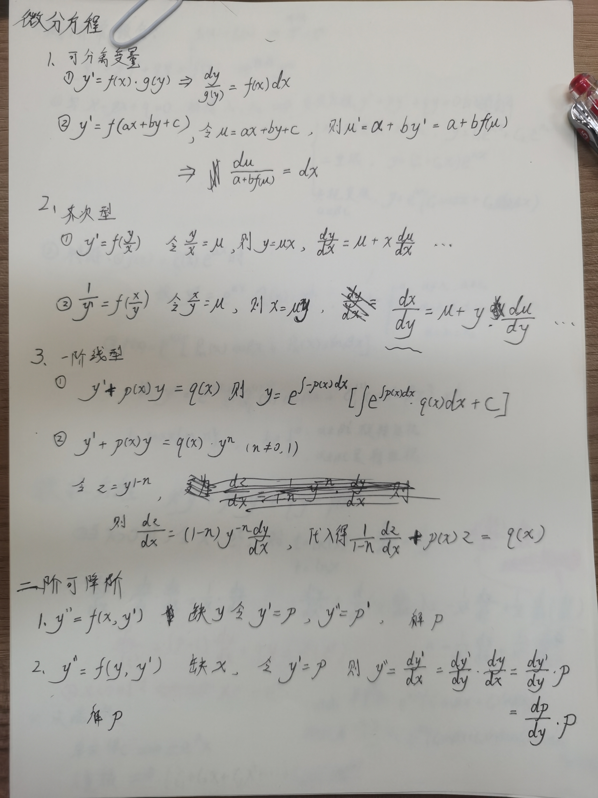
19. **级数判敛+求极限**，**单调递减有下界**，利用0或1来拉格朗日中值定理，**设极限值为x代入求极限**
20. 中值定理
21. 二次型的标准型，规范型（-1，0，1）
22. 泊松分布取值0，1，2……

# 2023.10.10  试卷2016

1. **反常积分敛散性：比较判敛法、指数函数、分数函数**

2. 导数**求原函数**，原函数一定是连续函数，原函数的跳跃点左右极限相等，**可导必连续**

3. 导数**求原函数**，另一种方法，利用变限积分函数来表示原函数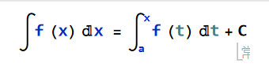对于分段函数f(x)，往往a取分段点更易计算

4. 线性微分方程解的结构。有两个解a、b，则a-b为其齐次方程的解，(a+b)/2为其非齐次方程的一个特解

5. 矩阵相似推论

6. **二次型**------>**标准型**----->**特征值**  ---------->**正负指数** ---------->**曲面类型**

7. 化标准正态判断概率，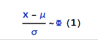

8. 高阶导数，可利用幂级数展开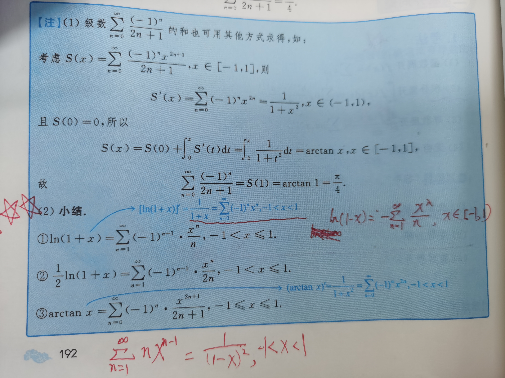

   

9. 行列式，余子式、代数余子式

10. 华理士公式

11. 锥体积公式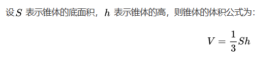

12. 第二型曲面积分，高斯公式、三重积分，计算时注意取值范围

13. **无穷级数判敛散性**，**求极限设未知数代入**，**级数和的极限**，介值定理

14. 利用分布函数的概率不等判断不独立

# 2023.10.11

1. 第一型曲面积分，转换投影

2. 第一型曲面积分，利用对称性，还可以利用质心/形心坐标

3. 梯度与斯托克斯公式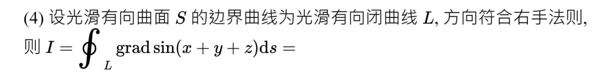

   ​	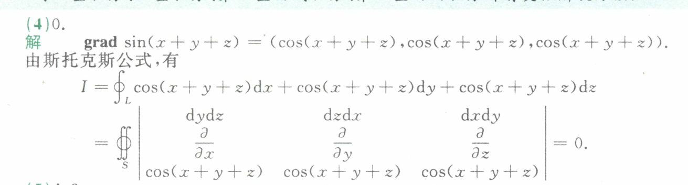

4. 
