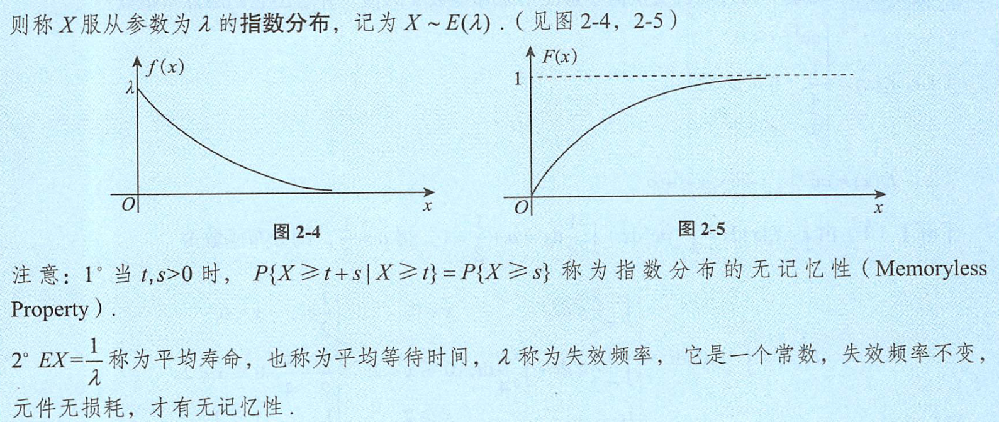
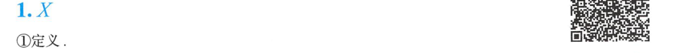
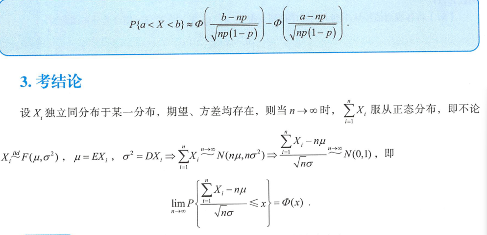

# 随机事件和概率

## 独立

# 分布函数

# 连续型 --> 连续型

# 多维随机变量

## 二维正态

## 求边缘分布

## 求条件分布

## 判独立

# 多维随机变量函数的分布

# 数学期望

# 方差

# 常用分布的EX、DX

# 协方差

# ┏函数

# 独立性与不相关性

# 切比雪夫不等式

# 大数定律

# 统计量及其分布

# 参数估计

# 区间估计

# 假设检验

# 两类错误

