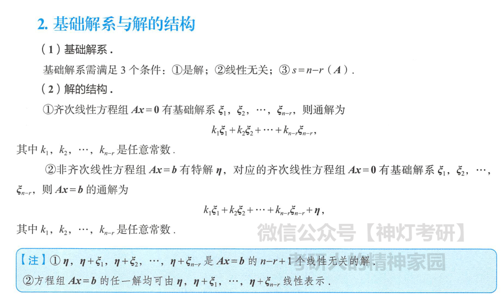
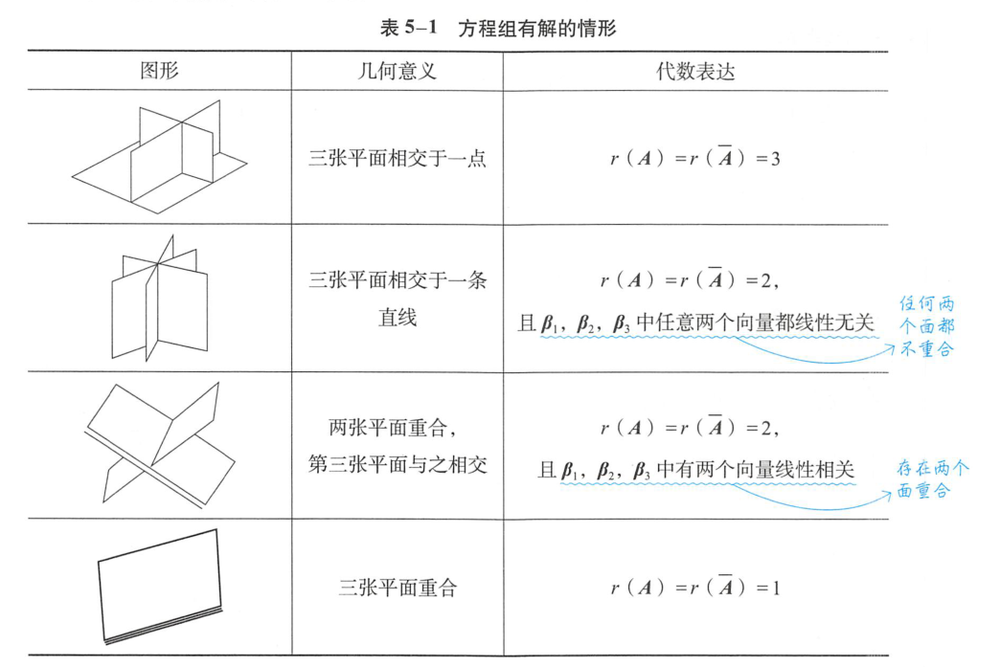
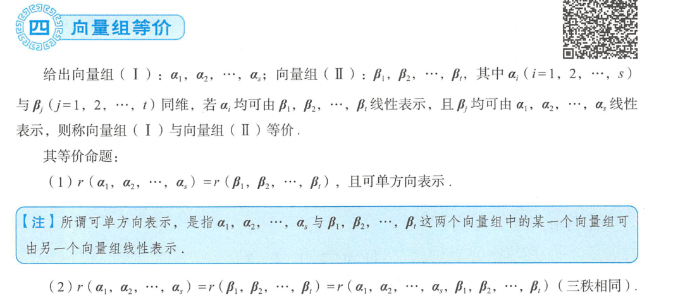
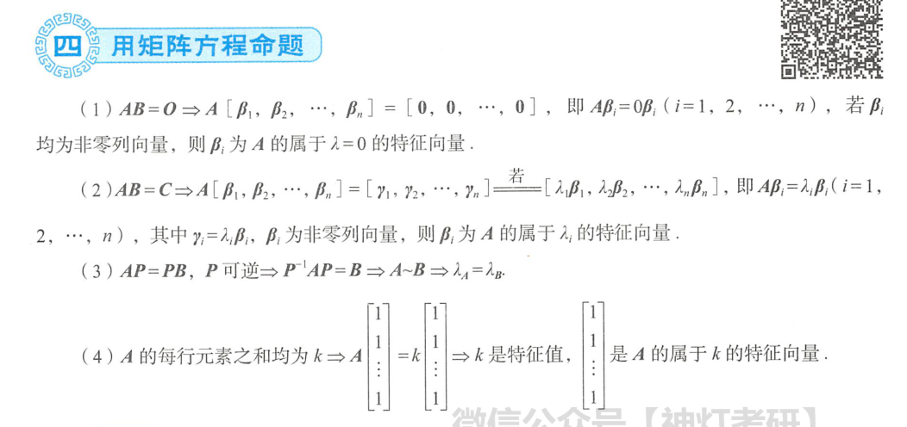
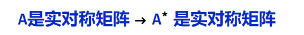
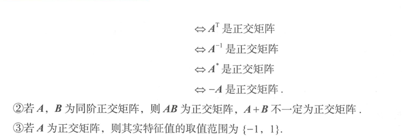

# 线性代数

# 行列式

### 范德蒙行列式

### 数学归纳法、递推法

# 伴随的特征值

# 矩阵运算

## 伴随

## 逆

## 初等矩阵

## 矩阵等价

## 分块矩阵

## 矩阵方程

# 秩

# 线性方程组

## 齐次

## 非齐次

## 解方程

# 公共解与同解

## 解的判定与结构

## 几何意义

# 向量组

## 判别线性相关

## 向量关系

## 向量组等价

## 向量空间

注意：过渡矩阵可逆。

## 正交单位化

# 特征值

# 相似

## 相似对角化

## 矩阵相似

## 实对称矩阵

## 正交矩阵

# 二次型

## 二次型

## 线性变换

## 二次型的标准型与规范型

## 配方法

## 正交变换法

## 几何

## 实对称矩阵的合同

## 正定二次型

