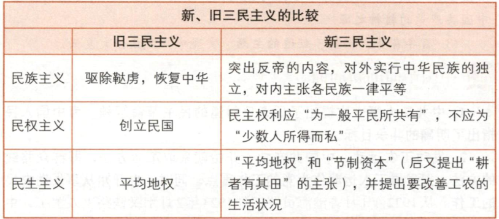

# 杂项

- 和平合作、开放包容、互学互鉴、互利共赢的丝路精神，是共建“一带一路”最重要的力量源泉。
- 物质生产活动及生产方式决定社会的结构、性质和面貌，制约着人们的经济生活、政治生活和精神生活等全部社会生活。
- 货币是在长期交换过程中形成的充当一般等价物的商品，是商品经济内在矛盾发展的产物，货币的本质体现一种社会关系。
- 劳动力成为商品，标志着商品生产发展到资本主义商品生产的新阶段。
- 抗日民族统一战线中，中间势力主要是指民族资产阶级、开明绅士和地方实力派，不存在谁代表谁的关系。
- 毛泽东系统解决了如何把以农民为主要成分的革命军队建设成为一支无产阶级性质的、具有严格纪律的、同人民群众保持亲密联系的新型人民军队的问题，解决了如何开展人民革命战争，应当实行什么样的战略战术，如何巩固国防等一系列重大问题。
- 马克思主义政党的最高目标是实现共产主义，并把实现人的自由而全面发展作为共产主义的本质特征。
- 建成世界一流军队是中国特色社会主义新时代的强军目标。
- 中国共产党领导关系中国特色社会主义的性质、方向、命运。
- 中国特色社会主义之所以是社会主义，究其根本就在于坚持科学社会主义基本原则，在于坚持中国共产党的领导。
- 意识形态关乎旗帜、关乎道路、关乎国家政治安全，决定文化前进方向和发展道路。
- 意识形态工作是为国家立心、为民族立魂的工作
- 中华民族的优秀传统文化是民族的根脉，根植在中国人的内心，形成了中国人看待世界、看待社会、看待人生的独特价值体系、文化内涵和精神品质。
- 任何文化要立得住、行得远，要有领导力、凝聚力、塑造力、辐射力，就必须有自己的主体性。有了文化主体性，就有了文化意义上坚定的自我，文化自信就有了根本依托，中国共产党就有了引领时代的强大文化力量，中华民族和中国人民就有了国家认同的坚实文化基础，中华文明就有了和世界其他文明交流互鉴的鲜明文化特性。
- 从根本上说，个人理想是由社会理想规定的。个人理想的确立要以社会理想为导向，个人理想的实现依赖于社会理想的指引。社会理想是个人理想的汇聚和升华。
- 习近平法治思想是全面依法治国的根本遵循和行动指南。
- 走中国特色社会主义法治道路，是历史的必然结论，是由我国社会主义国家性质所决定的，是立足我国基本国情的必然选择。
- 坚持自信自立，突出强调和体现的就是要把尊重客观规律和激发创新创造活力贯通起来，在中国特色社会主义建设中，坚定“四个自信”，坚持走自立自强之路。
- 守正创新深刻揭示了“变”与“不变”、继承与发展的辩证统一。
- 增强问题意识、坚持问题导向，就是承认矛盾的普遍性、客观性，就是要把认识和化解矛盾作为打开工作局面的突破口。
- 把握底线思维，就要“凡事从坏处准备，努力争取最好结果，这样才能有备无患、遇事不慌，牢牢把握主动权。
- 认识是一个反复循环和无限发展的过程。
- 人的本质属性是社会属性
- 具体劳动，反映的是人与自然的关系，是劳动的自然属性，创造商品的使用价值；抽象劳动，反映的是商品生产者的社会关系，是劳动的社会属性，形成商品的价值。
- 空间上并存、时间上继起是产业资本运动必须具备的两个基本前提条件。
- 金融资本形成的主要途径：金融联系、资本参与、人士参与。（通过金融联系、资本参与、人士参与，银行垄断资本和工业垄断资本密切的融合在一起，产生了一种新型的垄断资本，即金融资本）
- 自由竞争引起生产集中和资本集中，生产集中和资本集中发展到一定阶段必然引起垄断。
- 金融自由化和金融创新是金融垄断资本得以形成和壮大的重要制度条件。
- 土地改革的主要和直接任务，就是满足贫雇农群众的要求。
- 马克思主义深刻揭示了社会主义必然取代资本主义的客观规律，这是我们坚定“四个自信”的理论支撑和根本依据。
- 调查研究是谋事之基、成事之道，没有调查就没有发言权、没有调查就没有决策权；正确的决策离不开调查研究，正确的贯彻落实同样离不开调查研究；调查研究是获得真知灼见的源头活水。
- 一个人知识的获得，不外直接经验和间接经验两部分。就知识的源头来说，任何知识都不能离开直接经验。但是，这并不意味着事事都必须去直接经验，一个人的多数知识还是来自间接惊叹，是从书本和传授中得来的。直接经验和间接经验不存在谁更重要的问题。
- 内因规定着事物的本质和发展方向。
- 群众路线是我们党的生命线和根本工作线，是我们党永葆青春活力和战斗力的重要传家宝。群众路线本质上体现的是马克思主义关于人民群众是历史的创造者这一基本原理。只有坚持这一基本原理，我们才能把握历史前进的基本规律。
- 人民立场是中国共产党的根本政治立场。
- 中国共产党的坚强领导，是中国特色社会主义最本质的特征、中国特色社会主义制度最大的优势；我们有新中国成立、改革开放以来特别是党的十八大以来形成的更为完善的制度保证、更为坚实的物质基础、更为主动的精神力量，时与势在我们一边，这是中国特色社会主义所独具的发展优势；我们有连绵不绝的中华5000多年文明，这是中国特色社会主义的文化根脉和突出优势，是我们在世界风云激荡中站稳脚跟的根基。
- 创新性是中华文明的突出特性之一，创新性从根本上决定了中华民族守正不守旧、尊古不复古的进取精神，决定了不惧新挑战、用于接受新事物的无畏品格。
- 中华文明的连续性从根本上决定了中华民族必然走自己的路。中华文明在长期历史演进中形成多元一体的格局。
- 抗日战争的伟大胜利是中华民族从近代以来陷入深重危机走向伟大复兴的历史转折点。

# 五四运动

由于五四运动是在新的社会历史条件下发生的，它具有以辛亥革命为代表的旧民主主义革命所不具备的历史特点，具有伟大意义：

- 是一场以先进青年知识分子为先锋、广大人民群众参加的彻底的反帝反封建的伟大爱国革命运动。
- 是一场中国人民为拯救民族危亡、捍卫民族尊严、凝聚民族力量而掀起的伟大社会革命运动。
- 是一场传播新思想、新文化、新知识的伟大思想启蒙运动和新文化运动。
- 以磅礴之力鼓动了中国人民和中华民族实现民族复兴的志向和信心。

# 邓小平的社会主义市场经济理论

计划经济和市场经济不是划分社会制度的标准，计划经济不等于社会主义，市场经济不等于资本主义。

计划和市场都是经济手段，对经济活动的调节各有优劣，社会主义实行市场经济是要把二者优势结合起来。

市场经济作为资源配置手段本身不具有制度属性，可以和不同的社会制度结合，从而表现出不同的性质。

计划和市场都是经济手段，可以结合。而计划经济（市场经济）是指资源配置中计划（市场）起决定性作用的经济体制。对于一个国家的经济体制而言，起决定性作用的要么是计划，要么是市场，二者是不可能结合的。

# 四项基本原则

 为了全面贯彻落实十一届三中全会确立的党的路线、方针、政策，克服来自“左”的和右的干扰，1979年3月30日，邓小平在党的理论工作务虚会上明确指出：在中国实现四个现代化，必须在思想政治上坚持四项基本原则，这是实现四个现代化的根本前提。 这四项基本原则就是：**必须坚持社会主义道路；必须坚持无产阶级专政；必须坚持共产党的领导；必须坚持马列主义、毛泽东思想**

# 全党全国各族人民团结奋斗的共同思想基础是习近平中国特色社会主义思想体系

# 供给侧管理和需求侧管理是**调控宏观经济的两个基本手段**

**需求侧管理，重在解决总量性问题，注重短期调控**，主要是通过调节税收、财政支出、货币信贷等来刺激或抑制需求，进而推动经济增长。

**供给侧管理，重在解决结构性问题，注重激发经济增长动力**，主要通过优化要素配置和调整生产结构来提高供给体系质量和效率，进而推动经济增长。

# 抗战

9月2日 日本代表在投降书上签字。侵华日军128万人向中国投降。至此，中国抗日战争胜利结束，世界反法西斯战争也胜利结束。9月3日成为中国人民抗日战争胜利纪念日。10月25日，中国政府在台湾举行受降仪式。被日本占领50年之久的台湾以及澎湖列岛，重归中国主权管辖之下。中国人民抗日战争是近代以来中国人民反抗外敌入侵持续时间最长、规模最大、牺牲最多的民族解放斗争，也是第一次取得完全胜利的民族解放斗争。中国人民抗日战争的胜利，成为中华民族走向复兴的历史转折点，也对世界文明进步具有重大而深远的意义。中国人民在抗日战争中付出了巨大的民族牺牲。据不完全统计，战争期间中国军民伤亡3500多万人；按1937年的比值折算，中国直接经济损失1000多亿美元，间接经济损失5000多亿美元。中国共产党在全民族抗战中发挥了中流砥柱作用。这是中国人民抗日战争取得完全胜利的决定性因素。八路军、新四军和其他人民抗日武装对敌作战12.5万余次，钳制和歼灭日军大量兵力，歼灭大部分伪军，敌后战场逐渐成为中国人民抗日战争的主战场。到抗战结束时，人民军队发展到约132万人，民兵发展到260余万人；中国共产党领导的抗日民主根据地即解放区已有19块，面积达到近100万平方公里，人口近1亿。中国共产党在全国社会政治生活中所占的比重，和抗日战争前相比大大增加。这为在取得中国人民抗日战争伟大胜利基础上，最终取得新民主主义革命胜利，创造了前所未有的有利条件。中国人民在抗日战争的壮阔进程中孕育出伟大抗战精神，向世界展示了天下兴亡、匹夫有责的爱国情怀，视死如归、宁死不屈的民族气节，不畏强暴、血战到底的英雄气概，百折不挠、坚忍不拔的必胜信念。

# 抗美援朝

抗美援朝战争伟大胜利，是中国人民站起来后屹立于世界东方的宣言书，是中华民族走向伟大复兴的重要里程碑。抗美援朝战争中，英雄的中国人民志愿军始终发扬祖国和人民利益高于一切、为了祖国和民族的尊严而奋不顾身的爱国主义精神，英勇顽强、舍生忘死的革命英雄主义精神，不畏艰难困苦、始终保持高昂士气的革命乐观主义精神，为完成祖国和人民赋予的使命、慷慨奉献自己一切的革命忠诚精神，为了人类和平与正义事业而奋斗的国际主义精神，锻造了伟大抗美援朝精神。

# 一国两制

“一国”和“两制”不能相互割裂，更不能相互对立。“一国”就是要维护中央依法享有的权力，维护国家主权、统一、安全。“两制”就是要保障香港特别行政区依法享有的高度自治权，支持行政长官和特别行政区政府依法施政。

# 中央委员会第n次全体会议

改革开放以来，通常每一届**中央委员会**要召开七次全体会议，也就是从一中全会到七中全会。十三大后，这项制度被写入党章：中央委员会全体会议由中央政治局召集，**每年至少举行一次**。按惯例，一中全会和二中全会分别讨论党和国家机构的人事问题，三中通常要为本届中央和政府做一个“大题目”，七中则担负着“承上启下”的重任。

**一中、二中围绕“人”**，**“大题目”易出自三中全会**，**四中、五中 中央军委大调整**，**六中主要抓精神文明**，**七中承上启下，多有人事问题**

**一中全会：一般在党代会闭幕第二天召开，会后新中央领导班子与中外记者见面**

**二中全会：一般在党代会第二年的两会前召开，为其提交中央机构人选**

**三中到六中：从党代会第二年起，中间三年将召开这四次中央会议**

**七中全会：一般在下次党代会开幕前一周左右召开，完成承前启后作用**

“一中全会”一般紧接着党的代表大会之后召开，聚焦“人事”，讨论、选举党的领导；

“二中全会”一般在全国两会之前召开，主题也以“人事”为主，讨论新一届国家机构的人事安排；

“三中全会”则以“经济与改革”为主题，改革开放以来历届三中全会的决策部署，对中国发展产生了深远影响。如十八届三中全会审议通过了《中共中央关于全面深化改革若干重大问题的决定》。

“四中全会”，一般与“三中全会”相隔一年左右，会期一般4天，会议内容通常全面落实、深化“三中全会”的决策部署。主要议程是中共中央政治局向中央委员会报告工作，研究全面推进依法治国重大问题。 

# 中国共产党人的初心和使命

为中国人民谋幸福，为中华民族谋复兴。

# 中国共产党的建党精神

坚持真理、坚守理想，践行初心、担当使命，不怕牺牲、英勇斗争，对党忠诚、不负人民。

伟大的建党精神是中国共产党的**精神之源**。

# 百年奋斗、牺牲、创造的主题

实现中华民族伟大复兴。

# 新三民主义

# 国民党

国民党实行的是代表地主阶级、买办性的大资产阶级利益的一党专政和军事独裁统治。

# 国共合作

# 全民族抗战期间的方针

对国民党采取“又团结又斗争、以斗争求团结”的方针

针对出现中途妥协和内部分裂两大危险，明确提出三大口号：1、“坚持抗战到底，反对中途妥协”。2、“巩固国内团结，反对内部分裂”。3、“力求全国进步，反对向后倒退”

为了坚持、扩大和巩固抗日民族统一战线，制定了“发展进步势力，争取中间势力，孤立顽固势力”的策略总方针。

进步势力：主要指工人、农民、城市小资产阶级。他们是统一战线的基础、抗日战争的主要依靠力量。

中间势力：主要是民族资产阶级、开明绅士、地方实力派。争取中间势力的条件：一是共产党要有足够的力量；二是尊重他们的利益；三是要同顽固派作坚决的斗争，并能一步一步的取得胜利。

顽固势力：指大地主、大资产阶级的抗日派，即以蒋介石集团为代表的国民党亲英美派。中国共产党对顽固派贯彻又联合又斗争的政策。在同顽固派作斗争时，坚持有理、有利、有节地原则。

# 三座大山

我国新民主主义革命时期的三大敌人：帝国主义、封建主义、官僚资本主义

# 十三个成就

# 共产主义社会的三个基本特征

物质财富极大丰富

消费资料按需分配，社会关系高度和谐

人民精神境界极大提高

# 推进手工业合作化的过程中采取的方针

积极引导、稳步推进

# 中共八大（1956.9）坚持的经济建设方针

既反保守又反冒进

# 法律的普遍适用、优先适用和不可违反

法律的普遍适用，是指法律在本国主权范围内对所有人具有普遍的约束力。所有的国家机关、社会组织和公民个人都必须遵守法律，依法享有和行使法定职权与权利，承担和履行法定职责与义务。

法律的优先适用，是指当同一项社会关系同时收到多种社会规范的调制而多种社会规范又相互矛盾时，要优先考虑法律规范的适用。

法律的不可违反，是指法律必须遵守，违反法律要受到惩罚。任何人不论权力大小、职位高低，只要有违法犯罪行为，就要受到法律制裁。

