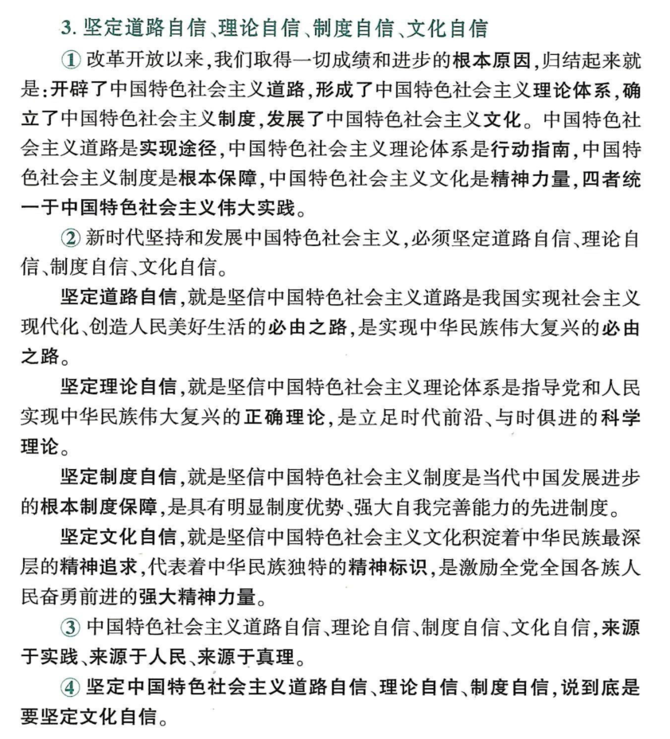
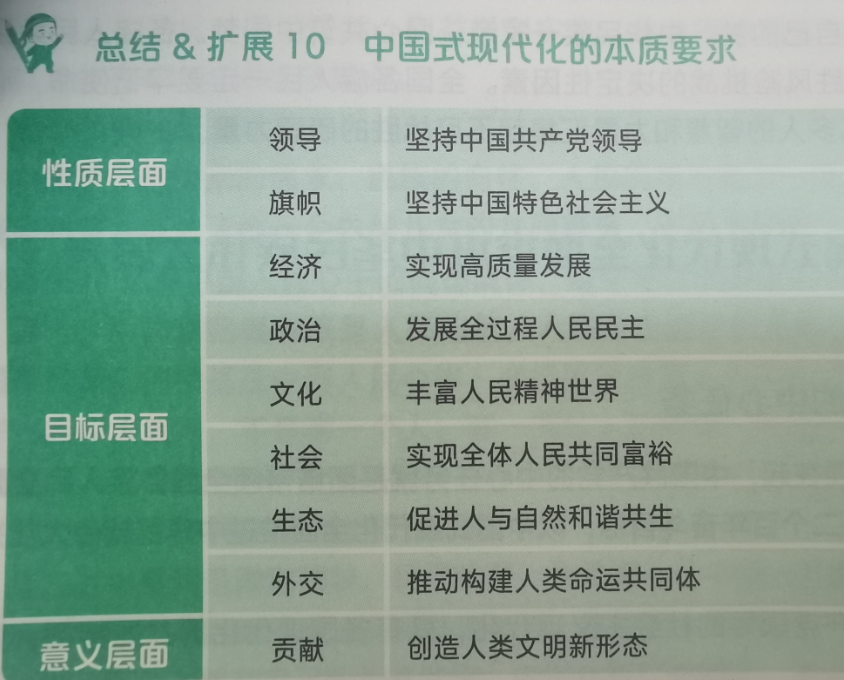
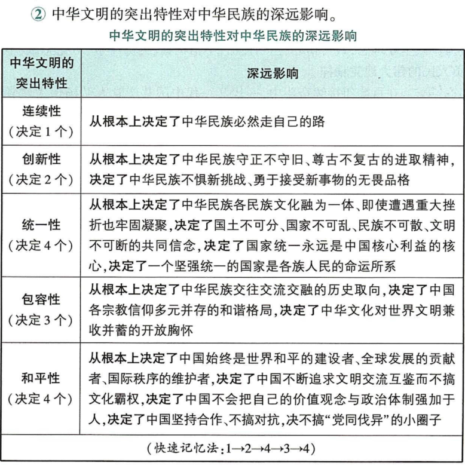

# 习思

两个结合：**习近平新时代中国特色社会主义思想是马克思主义基本原理同中国具体实际相结合、同中国优秀传统文化相结合的重大成功。**

# 习思历史条件

党的十八大以来，中国特色社会主义进入新时代，中国特色社会主义新时代是我国发展新的历史方位，标志着中国特色社会主义事业进入了新的发展阶段。

新时代依据：

- 社会主要矛盾发生新变化（基本依据）
- 党的主要任务发生新变化
- 中国和世界的关系发生新的变化

改革开放必然结果

十年来三件大事：建党一百周年、进入新时代、完成脱贫、小康

标志性成功：

1. 创立思想
2. 明确中国特色社会主义最本质的特征是党的领导
3. 科学完整的战略部署：“五位一体”总体布局、“四个全面”战略布局
4. 打赢脱贫攻坚战
5. 经济实力历史性跃升
6. 各领域基础制度框架基本建立
7. 对外开放格局
8. 全面依法治国总体格局基本形成
9. 意识形态领域形势发生全局性、根本性转变
10. 建成世界上规模最大的教育体系、社会保障体系、医疗卫生体系
11. 生态环境保护发生历史性、转折性、全局性变化。
12. 总体国家安全观
13. 牢固树立战斗力这个唯一的根本标准，坚决把全军工作重心归正到备战打仗上来
14. 推动香港进入由乱到治走向由治及兴的新阶段，香港、澳门保持长期稳定发展良好态势。
15. 全面推进中国特色大国外交
16. 党找到了自我革命这一跳出治乱兴衰历史周期律的第二个答案

**中国特色社会主义进入新时代**是我国社会主要矛盾转化的必然结果

2017年党的十九大，**我国社会主要矛盾已转化为人民日益增长的美好生活需要和不平衡不充分的发展之间的矛盾。**

主要矛盾变化的依据：

1. 社会生产力水平总体上显著提高
2. 人民生活水平显著提高，对美好生活的向往更加强烈，不仅对物质文化生活提出了更高的要求，而且在民主、法治、公平、正义、安全、环境等方面的要求日益增长。
3. 发展的不平衡不充分

基本国情没变（社初）、国际地位没变（最大的发展中）

五个是：从历史脉络看.....从实践主题看.....从人民性看.....从民族性看.....从世界性看.....

三个意味：

1. 从中华民族复习的历史进程
2. 从科学社会主义发展
3. 从人类文明进程

## 百年未有之大变局

当前国际格局和国际体系正在发生深刻调整，全球治理体系正在发生深刻改革，国际力量对比正在发生近代以来最具革命性的变化，世界范围呈现出影响人类历史进程和趋向的重大态势。

和平和发展仍然是时代的主题，中国日益成为世界格局演变的主要推动力量。

## 中华民族伟大复习正处于关键时期

中国共产党是实现中华民族伟大复习的根本保证

中华优秀传统文化是中华民族的根和魂，是中国特色社会主义根植的文化沃土。

## 中国式现代化全面推进拓展

## 科学社会主义在21世纪的中国焕发新的蓬勃生机

## 中国共产党自我革命开辟新的境界

# ~科学体系

## 核心要义

新时代坚持和发展什么样的中国特色社会主义、怎样坚持和发展中国特色社会主义，建设什么样的社会主义现代化强国、怎样建设社会主义现代化强国，建设什么样的长期执政的马克思主义政党、怎样建设长期执政的马克思主义政党等重大时代课题。

核心要义，就是坚持和发展中国特色社会主义，这也是改革开放以来我们党全部理论和实践的鲜明主题。

## 习近平新时代中国特色社会主义思想的主要内容

### 十个“明确”

"十个明确"是习思的**主体内容**，集中体现了这一体系的主要观点和基本精神，构成了这一思想的四梁八柱，发挥着统摄作用。

1. 明确中国特色社会主义最本质的特征是中国共产党**领导**，中国特色社会主义制度的最大优势是中国共产党领导

2. 明确总**任务**是实现社会主义现代化和中华民族伟大复兴

3. 明确主要**矛盾**是人民日益增长的美好生活需要和不平衡不充分的发展之间的矛盾

4. 明确总体布局是经济建设、政治建设、文化建设、社会建设、生态文明建设**五位一体**

   战略布局是全面建设社会主义现代化国家、全面深化改革、全面依法治国、全面从严治党**四个全面**

5. 明确全面**深化改革**总目标是完善和发展中国特色社会主义制度、推进国家治理体系和治理能力现代化

6. 明确全面推进**依法治国**总目标是建设中国特色社会主义法治体系、建设社会主义法治国家

7. 明确必须坚持和完善社会主义基本**经济制度**，使市场在资源配置中起决定性作用，更好发挥政府作用

8. 明确党在新时代的**强军**目标是建设一支听党指挥、能打胜仗、作风优良的人民军队，把人民军队建设成为世界一流军队

9. 明确中国特色**大国外交**要服务民族复习、促进人类进步，推动建设新型国家关系，推动构建人类命运共同体

10. 明确全面**从严治党**的战略方针，提出新时代党的建设总要求。

### 十四个坚持

十四个坚持：是习思的重要组成部分，是在治国理政各方面作出的理论分析和政策指导，构成了新时代坚持和发展中国特色社会主义的基本方略。

- **第一，坚持党对一切工作的领导**
- **第二，坚持以人民为中心**
- **第三，坚持全面深化改革**
- **第四，坚持新发展理念**
- **第五，坚持人民当家作主**
- **第六，坚持全面依法治国**
- **第七，坚持社会主义核心价值体系**
- **第八，坚持在发展中保障和改善民生**
- **第九，坚持人与自然和谐共生**
- **第十，坚持总体国家安全观**
- **第十一，坚持党对人民军队的绝对领导**
- **第十二，坚持“一国两制”和推进祖国统一**
- **第十三，坚持推动构建人类命运共同体**
- **第十四，坚持全面从严治党。**

以上十四条，构成新时代坚持和发展中国特色社会主义的基本方略。全党同志必须全面贯彻党的基本理论、基本路线、基本方略，更好引领党和人民事业发展。

### “十三个方面成就”

对新时代伟大实践进行了科学总结，全景式地展示了习近平新时代中国特色社会主义思想地理论与实践成果。

1. 在坚持党的全面领导上
2. 在全面从严治党上
3. 在经济建设上
4. 在全面深化改革上
5. 在政治建设上
6. 在全面依法治国上
7. 在文化建设上
8. 在社会建设上
9. 在生态文明建设上
10. 在国防军事建设上
11. 在维护国家安全上
12. 在坚持“一国两制”和推进祖国统一上
13. 在外交工作上

# 习近平新时代中国特色社会主义思想的世界观和方法论

## 六个必须坚持

“六个必须坚持”赋予了马克思主义世界观和方法论以新的时代内涵，彰显了习近平新时代中国特色社会主义思想地理论品格和鲜明特征。

- 人民至上
- 自信自立
- 守正创新
- 问题导向
- 系统观念
- 胸怀天下

# 历史地位及意义

21世纪、深化、与时俱进

实现中华民族伟大复兴的行动指南：共同思想基础、根本指引、基本遵循、思想武器

建设美好世界的中国智慧和中国方案

# 坚持和发展中国特色社会主义

## 中国特色社会主义是历史人民的选择

中国特色社会主义，是党和人民历尽千辛万苦、付出巨大代价取得的根本成就、是实现中华民族伟大复兴的正确道路

中国特色社会主义具有深厚的历史渊源和广泛的现实基础：

- 是改革开放40多年的伟大实践中得来的
- 是在新中国成立70多年的持续探索中得来的
- 是在中国共产党领导人民进行伟大社会革命100多年的实践中得来的
- 实在近代以来中华民族由衰到盛180多年的历史进程中得来的
- 是在世界社会主义500多年波澜壮阔的发展历程中得来的
- 是在对中华文明5000多年的传承发展中得来的

## 是科学社会主义理论逻辑和中国社会主义发展历史逻辑的辩证统一

## （四个自信）坚定道路自信、理论自信、制度自信、文化自信

道路自信：必由之路、必由之路

理论自信：正确理论

制度自信：根本制度保证

文化自信：精神追求、精神标识、强大精神力量

来源于实践、人民、真理

说到底是要坚定文化自信

马克思主义深刻揭示了社会主义必然取代资本主义的客观规律，这是我们坚定“四个自信”的理论支撑和根本依据。

## 新时代坚持和发展中国特色社会主义要一以贯之

### 统筹推进“五位一体”总体布局和协调推进“四个全面”战略布局

中国特色社会主义事业是全面发展、全面进步的事业。“五位一体”总体布局和“四个全面”战略布局相互促进、统筹联动，从全局上确立了新时代坚持和发展中国特色社会主义的战略规划和部署。新征程上，统筹推进“五位一体”总体布局和协调推进“四个全面”战略布局，必须紧紧扭住全面建设社会主义现代化国家这个战略目标不动摇，紧紧扭住全面深化改革、全面依法治国、全面从严治党三个战略举措不放松，在推动经济发展的基础上，建设社会主义市场经济、民主政治、先进文化、和谐社会、生态文明，协同推进人民富裕、国家强盛、中国美丽。

### 全面贯彻党的基本理论、基本路线、基本方略

党的基本理论是坚持和发展中国特色社会主义的行动指南

党的基本路线是国家的生命线、人民的幸福线

党的十九大概括的以”十四个坚持“为主要内容的基本方略，反映了我们党对建设中国特色社会主义的规律性认识。

# ”两个确立“

坚强的领导核心和科学的理论指导是关乎党和国家前途命运、党和人民事业成败的根本性问题

党的十九届六中全会指出，党确立习近平同志党中央的核心、全党的核心地位，确立习近平中国特色社会主义思想的指导地位，反映了全党全军全国各族人民共同心愿。

""两个确立“,是党在新时代取得的重大政治成功，对新时代党和国家事业发展、对推进中华民族伟大复习历史进程具有决定性意义

# 坚持和发展中国特色社会主义的总任务

## 实现中华民族伟大复习的中国梦

是坚持和发展中国特色社会主义的总任务

本质：国家富强、民族振兴、人民幸福

怎样才能实现：

1. 必须走中国道路，这就是中国特色社会主义道路
2. 必须弘扬中国精神，这就是以爱国主义为核心的民族精神和以改革创新为核心的时代精神
3. 必须凝聚中国力量，这就是全国各族人民大团结的力量。

## 以中国式现代化全面推进中华民族伟大复兴

二十大：从现在起，中国共产党的中心任务就是团结带领全国各族人民全面建设社会主义现代化强国、实现第二个百年奋斗目标，以中国式现代化全面推进中华民族伟大复兴。

中国特色：

- 人口规模巨大
- 全体人民共同富裕
- 物质文明和精神文明相协调
- 人与自然和谐共生
- 走和平发展道路

中国式现代化的本质要求：

重大原则：

- 第一，坚持和加强党的全面领导（领导力量）
- 第二，坚持中国特色社会主义道路（方向道路）
- 第三，坚持以人民为中心的发展思想（价值立场）
- 第四，坚持深化改革（根本动力）
- 第五，坚持发扬斗争精神（精神状态）

中国式现代化是中国共产党领导人民长期探索和实践的伟大成果

党的领导：直接关系中国式现代化的根本方向、前途命运、最终成本

- 决定中国式现代化的根本性质（是社会主义现代化）
- 确保中国式现代化锚定奋斗目标行稳致远（一代一代地接力推进）
- 激发建设中国式现代化的强劲动力（改革开放）
- 凝聚建设中国式现代化的磅礴力量（汇集全体人民的智慧和力量）

## 建设社会主义现代化国家的战略导向

立足新的发展阶段：全面建成小康社会、实现第一个百年奋斗目标之后，我们乘势而上开启全面建设社会主义现代化国家新征程、向第二个百年奋斗目标进军，这标志着我国进入了一个新发展阶段。

- 第一，从理论依据来看，马克思主义是远大理想和现实目标相结合、历史必然性和发展阶段性相统一的统一论者，坚信人类社会必然走向共产主义，但实现这一崇高目标必然经历若干历史阶段。
- 第二，从历史依据来看，新发展阶段是我们党带领人民迎来从站起来、富起来到强起来历史性跨越的新阶段。
- 第三，从现实依据看，我们已经拥有开启新征途、实现新的更高目标的雄厚物质基础。

## 贯彻新的发展理念

- **创新：**引领发展的第一动力
- **协调：**持续健康发展的内在要求
- **绿色：**永续发展的必要条件和人民对美好生活追求的重要体现。
- **开放：**国家繁荣发展的必由之路
- **共享：**中国特色社会主义的本质要求

## 构建新发展格局

**要致力构建以国内大循环为主体、国内国际双循环相互促进的新发展格局。**

牢牢守住安全发展这条底线是构建新发展格局的重要前提和保障。

为什么要构建：是与时俱进提升我国经济发展水平的战略抉择，也是塑造我国国际经济合作和竞争新优势的战略抉择。

怎么构建：

- 关键在于经济循环的畅通无阻，必须坚持**深化供给侧结构性改革**这条主线。
- 最本质特征是实现高水平的自立自强
- 要释放内需潜力，必须发挥我们市场资源优势，以巨大国内市场形成构建新发展格局的雄厚支持
- 要实行高水平对外开放

明确历史方位、贯彻知道原则、构建路径选择、

现实依据、行动指南、战略选择

## 全面建成社会主义现代化强国

## 全面建成小康社会

# ”五位一体“总体布局

- 经济建设（实现经济高质量发展）
- 政治建设（发展社会主义民主政治）
- 文化建设（建设社会主义文化强国）
- 社会建设（加强以民生为重点的社会建设）
- 生态文明建设（建设美丽中国）

## 经济建设（实现经济高质量发展）

- 坚持习近平经济思想
- 坚持和完善我国社会主义基本经济制度
- 深化供给侧结构性改革
- 着力推动高质量发展
- 正确认识政府和市场的作用

### 坚持习近平经济思想

七点主要内容：

- 第一，坚持加强党对经济工作的集中统一**领导**。
- 第二，坚持以**人民为中心**的发展思想
- 第三，坚持**适应把握引领经济发展新常态**
- 第四，坚持使市场在资源配置中起决定性作用，更好发挥政府作用，推动**有效市场和有为政府**更好结合。
- 第五，坚持**适应我国经济发展主要矛盾变化、完善宏观调控**。
- 第六，坚持**问题导向**部署经济发展新战略。
- 第七，坚持**正确工作策略和方法**。

习近平经济思想系统回答了新时代中国特色社会主义经济发展的一系列重大问题，是我国经济发展实践的理论结晶，是中国特色社会主义政治经济学的最新成果，开拓了马克思主义政治经济学新境界，为推动中国经济持续健康发展提供了科学指南。

### 坚持和完善我国社会主义基本经济制度

#### 所有制：两个毫不动摇

公有制经济和非公有制经济都是社会主义市场经济的重要组成部分，都是我国经济社会发展的重要基础

要**毫不动摇**巩固和发展公有制经济，深化国资国企改革，深化国有企业混合所有制改革

要**毫不动摇**鼓励、支持、引导非公有制经济发展

民营经济是社会主义市场经济发展的重要成果，是推动社会主义市场经济发展的重要力量，是推进供给侧结构性改革、推动高质量发展建设现代化经济体系的重要主体，也是我们党长期执政、团结带领全国人民全面建成社会主义现代化强国和实现中华民族伟大复兴中国梦的重要力量。

#### 分配制：完善分配制度

分配制度是促进共同富裕的基础性制度。要坚持按劳分配为主体、多种分配方式并存，构建初次分配、再分配、第三次分配协调配套的制度体系。

第三次分配中，要引导、支持有意愿有能力的企业、社会组织和个人和极参与公益慈善事业。

#### 体制机制层面：构建高水平社会主义市场经济体制

经济体制改革必须以完善产权制度和要素市场化配置为重点

构建全国统一大市场，深化要素市场化改革，建设高标准市场体系。

着力**扩大内需**，增加消费对经济发展额基础性作用和投机对优化供给结构的关键作用。

### 深化供给侧结构性改革

供给和需求是市场经济内在关系的两个基本方面

供给侧管理和需求侧管理是**调控宏观经济的两个基本手段**

**需求侧管理，重在解决总量性问题，注重短期调控**，主要是通过调节税收、财政支出、货币信贷等来刺激或抑制需求，进而推动经济增长。

**供给侧管理，重在解决结构性问题，注重激发经济增长动力**，主要通过优化要素配置和调整生产结构来提高供给体系质量和效率，进而推动经济增长。

因此，供给侧结构性改革的根本，就是使我国供给能力更好满足广大人民日益增长的美好生活需要

#### 深化供给侧结构性改革的举措：

关键在于理解“结构性”

**供给侧结构性改革的重点**: 解放和发展社会生产力，用改革的办法推进结构调整，减少无效和低端供给，扩大有效和中高端供给，提升供给体系对国内需求的适配性，实现低水平供需平衡向高水平供需平衡跃升。

**深化供给侧结构性改革的举措:**

- **第一，推进增长动能转换**，加快实施**创新驱动发展战略**。
- **第二，深化要素市场化配置改革**，实现由以价取胜向**以质取胜**的转变。
- **第三，加大人力资本培育力度**，更加注重调动和保护人的积极性。人是生产力中最活跃的因素。高素质的企业家、工匠和劳模是推动供给侧结构性改革、振兴实体经济发展的重要力量要激发和保护企业家精神，建设知识型、技能型、创新型劳动者大军。弘扬劳模精神、劳动精神、工匠精神，营造劳动光荣的社会风尚和精益求精的敬业风气。
- **第四，激发各类市场主体活力**，加快建设世界一流企业。
- **第五，持续推进“三去一降一补”**，优化市场供求结构。**坚持去产能、去库存、去杠杆、降成本、补短板，优化存量资源配置，扩大优质增量供给。**

### 着力推动高质量发展

**高质量发展是全面建设社会主义现代化强国的首要任务。**

**发展是党执政兴国的第一要务。**

我们要坚持以推动高质量发展为主题

#### 建设现代化产业体系（发展实体经济）

**实体经济是一国经济的立身之本，是财富创造的根本源泉，是国家强盛的重要支柱，是现代化经济体系的坚实基础。**

**发展实体经济必须以先进制造业为重点，必须坚持质量第一、效益优先，以供给侧结构性改革为主线。**

新型工业化、产业基础再造工程和重大技术装备公关工程、新兴产业融合集群发展、高效的服务业新体系、物联网、数字经济、现代化基础设施体系。

#### 实施科教兴国战略、人才强国战略、创新驱动发展战略（强化人才支撑）

教育、科技、人才是全面建设社会主义现代化强国的基础性、战略性支撑。

必须坚持**科技是第一生产力、人才是第一资源、创新是第一动力**。

1. 第一，加快实施创新驱动发展战略
2. 第二，完善科技创新体系
3. 第三，深入实施人才强国战略

#### 促进区域协调发展（缩小区域差距）

构建优势互补、高质量发展的区域经济布局和国土空间体系

#### 全面推进乡村振兴（弥合城乡差距）

我国人民日益增长的美好生活需要和不平衡不充分的发展之间的矛盾在乡村最为突出，我国仍处于并将长期处于社会主义初级阶段的特征很大程度上表现在乡村。

实施乡村振兴战略的目标要求：

- 总目标是农业农村现代化，总方针是坚持农业农村优先发展
- 总要求是产业兴旺、生态宜居、乡风文明、治理有效、生活富裕
- 制度保障是建立健全城乡融合发展体制机制和政策体系。

乡村振兴的具体举措：

- 坚持农业农村优先发展
- 牢牢守住**十八亿亩耕地红线**
- 巩固拓展脱贫攻坚成果，增强脱贫地区和脱贫群众内生发展动力
- 巩固和完善农村基本经营制度，发展新型农村集体经济，发展新型农业经营主体和社会化服务，发展农业适度规模经营
- 深化农村土地制度改革，赋予农民更加充分的财产权益
- 保障进城落户农民合法土地权益，鼓励依法自愿有偿转让。

### 使市场在资源配置中起决定作用、更好发挥政府作用

市场的作用：**市场决定资源配置**是市场经济的一般规律，市场经济本质上就是市场决定资源配置的经济。推动资源配置实现效益最大化和效率最优化

政府的作用：市场在资源配置中起决定性作用，并不是起全部作用。我国实行的是社会主义市场经济制度，仍然要坚持发挥社会主义制度的优越性、发挥党和政府的积极作用。

**政府的职责和作用主要是保持宏观经济稳定，加强和优化公共服务，保障公平竞争，加强市场监督，维护市场秩序，推动可持续发展，促进共同富裕，弥补市场失灵。**

要在保证市场发挥决定性作用的前提下，管好那些市场管不了或管不好的事情。

## 政治建设（发展社会主义民主政治）

### 坚持走中国特色社会主义政治发展道路

**人民当家做主是社会主义民主政治的核心**，其内涵有：

- 第一，国家一切权力属于人民，体现在国家根本性质 (即**国体**) 上，就是工人阶级领导的、以工农联盟为基础的人民民主专政的社会主义国家；体现在国家政权组织形式 (即**政体**)上就是人民通过各级人民代表大会行使国家权力。
- 第二，国家建立健全**法律制度和体制机制**，保证人民依照法律规定，通过各种途径和形式管理国家事务，管理经济文化事业，管理社会事务。
- 第三，一切国家机关和国家工作人员**必须依靠人民**的支持，保持同人民的密切联系，倾听人民的意见和建议，接受人民的监督，努力为人民服务。
- 第四，国家制定实施的法律法规和方针政策，必须体现人民意志、尊重人民意愿、得到人民拥护，维护最广大人民根本利益。
- 第五，国家各方面事业和各方面工作，必须**坚持以人民为中心的发展思想**，不断满足人民日益增长的美好生活需要，促进人的全面发展。

走中国特色社会主义政治发展道路的要求:

- 走中国特色社会主义政治发展道路，必须**坚持党的领导、人民当家作主、依法治国有机统一**。党的领导是人民当家作主和依法治国的根本**保证**，人民当家作主是社会主义民主政治的本质**特征**，依法治国是党领导人民治理国家的基本**方式**，三者统一于我国社会主义民主政治伟大实践。
- 走中国特色政治发展道路，必须坚持正确政治方向。我们需要借鉴国外政治文明有益成果，但绝不能放弃中国政治制度的根本。

### 健全人民当家作主制度

#### 根本政治制度：人民代表大会制度

人民行使国家权力的机关就是全国人民代表大会和地方各级人民代表大会

#### 基本政治制度

- **中国共产党领导的多党合作和政治协商制度**：
  - **人民政协**是具有中国特色的制度安排，是社会主义协商民主的重要渠道和专门协商机构。人民政协工作要**坚持人民政协为人民，聚焦党和国家中心任务，围绕团结和民主两大主题。**
  - 中国共产党领导的多党合作和政治协商制度是中国共产党、中国人民和各民主党派、无党派人士的伟大政治创造，是从中国土壤中生长出来的新型党政制度
  - 坚持和完善~的举措：...
- **民族区域自治制度**
  - 核心：**保障少数民族当家作主，管理本民族、本地方事务的权利**
  - 处理民族问题的基本原则：**维护祖国统一，反对民族分裂，坚持民族平等、民族团结、各民族共同繁荣。**
  - 坚持和完善民族区域自治制度的举措：坚定不移走中国特色解决民族问题的正确道路，坚持各民族一律平等，坚持各民族共同团结奋斗、共同繁荣发展，保证民族自治地方依法行使自治权，保障少数民族合法权益，巩固和发展平等团结互助和谐的社会主义民族关系。坚持不懈开展马克思主义祖国观、民族观、文化观、历史观宣传教育，打牢中华民族共同体思想基础。全面深入持久开展民族团结进步创建工作，加强各民族交往交流交融。支持和帮助民族地区加快发展，不断提高各族群众生活水平。
- **基层群众自治制度**
  - 我国基层自治组织：农民村民委员会、城市居民委员会、企业职工代表大会
  - 积极发展基层民主的举措：**基层民主是全过程人民民主的重要体现；自我管理、自我服务、自我教育、自我监督**

#### 发挥社会主义协商民主的重要作用

**社会主义协商民主**的内涵：人民内部各部分围绕改革发展稳定重大问题和涉及群众利益的实际问题，在决策之前和决策实施中，开展广泛协商，努力形成共识的重要民主形式。

重要性：协商民主是实践全过程人民民主的重要形式，是中国社会主义民主政治的特有形式和独特优势。

举措：......

#### 全过程人民民主

人民民主是社会主义的生命，是全面建设社会主义现代化国家的应有之义。全过程人民民主是社会主义民主政治的本质属性，是最广泛、最真实、最管用的民主。

- 评价民主与否的八个“能否”
- 评价民主与否的四个重要
- 评价世界各国民主的标尺：一个国家是不是民主，应该由这个国家的人民来评判，而不应该由外部少数人指手画脚来评判。国际社会哪个国家是不是民主的，应该由国际社会共同来评判，而不应该由自以为是的少数国家来评判。
- **推进全过程人民民主建设：人民代表大会制度是实现我国全过程人民民主的重要制度载体**

全过程人民民主，既有完善的制度程序，也有完整的参与实践，把民主选举、民主协商、民主决策、民主管理、民主监督贯通起来，涵盖经济、政治、文化、社会、生态文明等各个方面，聚焦国家大事、社会治理难事、百姓日常琐事，具有时间上的连续性、内容上的整体性，运行上的协同性、人民参与上的广泛性和持续性。

### 巩固和发展最广泛的爱国统一战线

- 构成：社会主义的建设事业必须依靠工人、农民和知识分子，团结一切可以团结的力量。在长期的革命、建设和改革过程中，已经结成了由中国共产党领导的，有各民主党派和各人民团体参加的，包括全体社会主义劳动者、社会主义事业的建设者、拥护社会主义的爱国者、拥护祖国统一和致力于中华民族伟大复兴的爱国者的广泛的爱国统一战线。
- 牢牢把握**大团结大联合的主题**，坚持一致性和多样性的统一
- **统一战线工作的原则**：一要坚持中国共产党的领导:二要坚持高举爱国主义、社会主义旗帜:三要坚持围绕中心服务大局:四要坚持大团结大联合，五要坚持正确处理一致性和多样性关系:六要坚持尊重维护和照顾同盟者利益，七要坚持广交、深交党外朋友，八要坚持大统战工作格局。
- 新时代巩固发展爱国统一战线工作的**重要任务**
  - 第一，坚持长期共存、互相监督、肝胆相照、荣辱与共，支持民主党派按照中国特色社会主义参政党要求更好履行职能。
  - 第二，深化民族团结进步教育，铸牢中华民族共同体意识
  - 第三，全面贯彻党的宗教工作基本方针，坚持我国宗教的中国化方向，积极引导宗教与社会主义社会相适应。无论本土宗教还是外来宗教，都要不断适应我国社会发展，充实时代内涵。要用社会主义核心价值观引领、用中华文化浸润我国各种宗教，支持宗教界对宗教思想、教规教义进行符合时代进步要求的阐释，坚决防范西方意识形态渗透，自觉抵御极端主义思潮影响。要提高宗教工作法治化水平，辩证看待宗教的社会作用，重视发挥宗教界人士作用，引导宗教人士努力为促进经济发展、社会和谐、文化繁荣、民族团结、祖国统一服务。
  - 第四，牢牢把握大团结大联合的主题

## 文化建设（建设社会主义文化强国）

### 建设中国特色社会主义文化发展道路

文化是一个国家、一个民族的灵魂。文化自信是更基础、更广泛、更深厚的自信，是一个国家、一个民族发展中更基本、更深沉、更持久的力量。

### 建设具有具有强大凝聚力和引领力的社会主义意识形态

意识形态工作是为国家立心、为民族立魂的工作

- 第一，牢牢掌握党对意识形态工作领导权
- 第二，健全用党的创新理论武装全党、教育人民、指导实践工作体系
- 第三，深入实施马克思主义理论研究和建设工作，加快构建中国特色社会主义哲学社会科学学科体系、学术体系、话语体系，培育壮大哲学社会科学人才队伍
- 第四，加强全媒体传播体系建设，塑造主流舆论新格局
- 第五，健全网络综合治理体系，推动形成良好网络生态

### 广泛践行社会主义核心价值观

#### 重要意义

社会主义核心价值观体现社会主义意识形态的本质要求，体现了社会主义制度在思想精神层面的质的规定性，以其先进性、人民性、真实性站在人类道义制高点上，彰显出独特而强大的价值观优势。

**核心价值观是一个民族赖以维系的精神纽带，是一个国家共同的思想道德基础。社会主义核心价值观是凝聚人心、汇聚民力的强大力量。**

**国家层面：富强、民主、文明、和谐**

**社会层面：自由、平等、公正、法制**

**公民层面：爱国、敬业、诚信、友善**

**回答了我们要建设什么样的国家、建设什么样的社会、培育什么样的公民**

社会主义核心价值观和社会主义核心价值体系的关系：

- 一方面，二者方向一致，都体现了社会主义意识形态的本质要求，体现了社会主义制度在思想和精神层面的质的规定性，凝结着社会主义先进文化的精髓
- 另一方面，二者各有侧重，相比于社会主义核心价值体系，社会主义核心价值观更加突出核心要素、更加注重凝练表达、更加强化实践导向。

如何践行社会主义核心价值观：

- 第一，弘扬以伟大建党精神为源头的中国共产党人精神谱系，用好红色资源，深入开展社会主义核心价值观宣传教育
- 第二，推动理想信念教育常态化制度化
- 第三，用社会主义核心价值观铸魂育人，完善思想政治工作体系，推进大中小学思想政治
- 第四，坚持依法治国和以德治国相结合，把社会主义核心价值观融入法治建设、融入社会发展、融入日常生活。

### 坚定文化自信，繁荣发展社会主义文化

**文化的重要性：文化是一个国家、一个民族的灵魂，是人民的精神家园，也是政党的精神旗帜。**

文化强国的内涵：文化强国是指一个国家**具有强大的文化力量**。这种力量既表现为**具有高度文化素养的国民**，也表现为**发达的文化产业**，还表现为**强大的文化软实力**。

**建设文化强国具体举措：**

- 第一，坚定**文化自信**，是事关国运兴衰、事关文化安全、事关民族精神独立性的大问题。坚定中国特色社会主义道路自信、理论自信、制度自信，说到底就是要坚定文化自信。
- 第二，**推动中华优秀传统文化创造性转化、创新性发展**。中华优秀传统文化是中华民族的“根”和“魂”，是最深厚的文化软实力，是中国特色社会主义植根的沃土，是我们在世界文化激荡中站稳脚跟的根基。
- 第三，提升**公共文化服务水平**。
- 第四，大力发展**文化事业和文化产业**。坚持把社会效益放在首位、社会效益和经济效益相统一，深化文化体制改革，完善文化经济政策。
- 第五，提高国家**文化软实力**。要讲好中国故事，传播好中国声音。

### 中华文明的突出特性

## 社会建设（加强以民生为重点的社会建设）

### 在发展中保证和改善民生

**为民造福是立党为公、执政为民的本质要求。**

**如何保证和改善民生：**

- 办好人民满意的**教育**
  - **培育什么人、怎样培养人、为谁培养人是教育的根本问题**
  - **第一，全面贯彻党的教育方针，落实立德树人根本任务，培养德智体美劳全面发展的社会主义建设者和接班人**
  - **第二，加快义务教育优质均衡发展和城乡一体化**
  - **第三，深化教育领域综合改革**
  - **第四，加强师德师风建设**
  - **第五，推进教育数字化**
  - 2023年5月29日，中共中央政治局就建设教育强国进行第五次集体学习。习近平在主持学习时强调，我们要建设的教育强国，是中国特色社会主义教育强国，必须以坚持党对教育事业的全面领导为**根本保证**，以立德树人为**根本任务**，以为党育人、为国育才为**根本目标**，以服务中华民族伟大复兴为**重要使命**，以教育理念、体系、制度、内容、方法、治理现代化为**基本路径**，以支撑引领中国式现代化为**核心功能**，**最终**是办好人民满意的教育。
- 实施**就业优先战略**
  - **就业是最基本的民生**。强化就业优先政策，健全就业促进机制，促进高质量充分就业
- **健全社会保障体系**
  - 社会保障体系是人民生活得安全网和社会运行的稳定器。健全覆盖全面、统筹全乡、公平统一、安全规范、可持续的多层次社会保障体系。
- **推进健康中国建设**
  - 人民健康是民族昌盛和国家强盛的重要标志。

**如何强化和创新社会治理：**

- 第一，**创新社会治理制度**。打造共建共治共享的社会治理格局
- 第二，**完善正确处理新形势下人民内部矛盾有效机制**
- 第三，**完善社会治安防控体系**
- 第四，**构建基础社会治理新格局**。要尽可能把资源、服务、管理放到社区，使社区有职有权有物，更好为群众提供精准高效的服务和管理。

## 生态文明建设（建设美丽中国）

### 坚持习近平生态文明思想

- 坚持人与自然和谐共生。人与自然是生命共同体，人类社会正日益形成这样的普遍共识：人因自然而生，人与自然是一种共生关系，**对自然的 伤害最终会伤及人类自身**，这个客观规律谁也无法抗拒。**要坚持节约优先、保护优先、自然恢复为主的方针**
- **绿水青山就是金山银山**
- **树立尊重自然、顺应自然、保护自然的生态文明理念**
- **良好生态环境就是最普惠的民生福祉**
- **统筹山水林田湖草沙系统治理**
- 用**最严格制度最严密法治**保护生态环境
- 共谋**全球**生态文明建设

### 推动绿色发展，促进人与自然和谐共生

- 加快发展方式绿色转型。推动经济社会发展绿色化、低碳化是实现高质量发展的关键环节。
- 深入推进环境污染防治
- 提升生态系统多样性、稳定性、持续性。以国家重点生态功能区、生态保护红线、自然保护地等为重点。推进以国家公园为主体的自然保护地体系建设
- 积极稳妥推进碳达峰碳中和。

### 新时代我国生态文明建设的重大成就

- 生态文明建设战略地位更加凸显
- 生态文明制度体系更加健全
- 污染治理和生态保护更加有力。

现状：我国生态环境保护结构性、根源性、趋势性压力尚未根本缓解，生态文明建设仍处于压力叠加、负重前行的关键期。

# “四个全面”战略布局

- 全面建设社会主义现代化国家(引领地位)
- 全面深化改革

- 全面依法治国
- 全面从严治党

## 全面建设社会主义现代化国家

现代化的最终目标是实现人自由而全面的发展。

### 开启全面建设社会主义现代化强国地新征程。

全面建成社会主义现代化强国，总的战略安排是分两步走：从2020年到2035年基本实现社会主义现代化；从2035年到21世纪中叶把我国建成富强民主文明和谐美丽的社会主义现代化强国。

### 未来五年的主要目标任务

未来五年是全面建设社会主义现代化国家开局起步的关键时期，主要目标任务是：经济高质量发展取得新突破，科技自立自强能力显著提升，构建新发展格局和建设现代化经济体系取得重大进展；改革开放迈出新步伐，国家治理体系和治理能力现代化深入推进，社会主义市场经济体制更加完善，更高水平开放型经济新体制基本形成；全过程人民民主制度化、规范化、程序化水平进一步提高，中国特色社会主义法治体系更加完善；人民精神文化生活更加丰富，中华民族 凝聚力和中华文化影响力不断增强；居民收入增长和经济增长基本同步，劳动报酬提高和劳动生产率提高基本同步，基本公共服务均等化水平明显提升，多层次社会保障体系更加健全；城乡人居环境明显改善，美丽中国建设成效显著；国家安全更为巩固，建军一百年奋斗目标如期实现，平安中国建设扎实推进；中国国际地位和影响进一步提高，在全球治理中发挥更大作用。

### 到2035年，我国基本实现社会主义现代化的远景目标

**经济实力、科技实力、综合国力**大幅跃升，**人均国内生产总值迈上新的大台阶，达到中等发达国家水平**；实现高水平科技自立自强，**进入创新型国家前列**；**建成现代化经济体系，形成新发展格局**，基本实现新型工业化、信息化、城镇化、农业现代化，基本实现国家治理体系和治理能力现代化，全过程人民民主制度更加健全，基本建成法治国家、法治政府、法治社会**建成教育强国、科技强国、人才强国、文化强国、体育强国、健康中国**，国家文化软实力显著增强；人民生活更加幸福美好，居民人均可支配收入再上新台阶，中等收入群体比重明显提高**基本公共服务实现均等化**，农村基本具备现代生活条件，社会保持长期稳定，人的全面发展、**全体人民共同富裕取得更为明显的实质性进展**；**广泛形成绿色生产生活方式，碳排放达峰后稳中有降，生态环境根本好转**，美丽中国目标基本实现，国家安全体系和能力全面加强，基本实现国防和军队现代化。

### 从2035年到21世纪中叶，建成社会主义现代化强国的目标要求

- **物质文明层面**：我国将拥有高度的物质文明，社会生产力水平大幅提高，核心竞争力名列世界前茅，经济总量和市场规模超越其他国家，建成富强的社会主义现代化强国。
- **政治文明层面**：我国将拥有高度的政治文明，形成又有集中又有民主、又有纪律又有自由又有统一意志又有个人心情舒畅生动活泼的政治局面，依法治国和以德治国有机结合，建成民主的社会主义现代化强国。
- **精神文明层面**：我国将拥有高度的精神文明，践行社会主义核心价值观成为全社会自觉行动，国民素质显著提高，中国精神、中国价值、中国力量成为中国发展的重要影响力和推动力，建成文明的社会主义现代化强国。
- **社会文明方面**： 我国将拥有高度的社会文明，城乡居民将普遍拥有较高的收入、富裕的生活、健全的基本公共服务，享有更加幸福安康的生活，全体人民共同富裕基本实现，公平正义普遍彰显，社会充满活力而又规范有序，建成和谐的社会主义现代化强国。
- **生态文明方面**：我国将拥有高度的生态文明，天蓝、地绿、水清的优美生态环境成为普遍常态，开创人与自然和谐共生新境界，建成美丽的社会主义现代化强国。

## 全面深化改革

必要性：

- 是顺应当今世界发展大势的必然选择
- 是解决中国现实问题的根本途径
- 关系党和人民事业前途命运，关系党的执政基础和执政地位

**解放思想**，是改革开放事业的**思想前提**，也是新时代全面深化改革开放的**思想前提**；

**解放和发展生产力**，是改革开放的**鲜明特征**和**首要任务**，也是新时代贯彻新发展理念、构建新发展格局、推动高质量发展的**必然要求**。

**解放和增强社会活力**，是社会主义改革的**内在要求**和**基本目的**，也是新时代全面深化改革的**关键所在**。

### 全面深化改革的方向、立场和原则

- 必须坚持和完善中国特色社会主义制度和国家治理体系

- 必须坚持改革沿着中国特色社会主义方向前进

- 必须坚持党对改革的集中统一领导

- 必须坚持改革往有利于维护社会公平正义、增进人民福祉方向前进

  促进社会公平正义、增进人民福祉是全面深化改革的出发点和落脚点，是坚持党全心全意为人民服务根本宗旨的必然要求

- 必须坚持社会主义市场经济改革方向

### 全面深化改革的总目标和主要内容

#### 总目标

- 党的十八届三中全会，提出全面深化改革的总目标是完善和发展中国特色社会主义制度，推进国家治理体系和治理能力现代化。
- 根本方向：完善和发展中国特色社会主义制度
- 实现路径：推进国家治理体系和治理能力现代化

#### 国家治理体系和治理能力及其关系

- 国家治理体系：在党领导下管理国家的制度体系
- 国家治理能力：运用国家制度管理社会各方面事物的能力
- 二者关系：......

### 国家制度和国家治理体系的显著优势

主要是:

1. 坚持**党的集中统一领导**，坚持党的科学理论，保持政治稳定，确保主义方向前进的显著优势;
2.  坚持**人民当家作主**，发展人民民主，密切联系群众，紧紧依靠人民推动国家发展的显著优势
3. 坚持**全面依法治国**，建设社会主义法治国家，切实保障社会公平正义和人民权利的显著优势
4. 坚持**全国一盘棋**，调动各方面积极性，集中力量办大事的显著优势
5. 坚持各**民族一律平等**，铸牢中华民族共同体意识，实现共同团结奋斗、共同繁荣发展的显著优势
6.  坚持公有制为主体、多种所有制**经济**共同发展和按劳分配为主体多种**分配**方式并存，把社会主义制度和市场经济有机结合起来，不断解放和发展社会生产力的显著优势
7. 坚持共同的理想信念、价值理念、道德观念，弘扬中华优秀传统文化、革命文化、社会主义先进**文化**，促进全体人民在**思想上**精神上紧紧团结在一起的显著优势
8. 坚持**以人民为中心**的发展思想，不断保障和改善民生、增进人民福祉，走共同富裕道路的显著优势
9. 坚持**改革创新、与时俱进**，善于自我完善、自我发展，使社会始终充满生机活力的显著优势
10. 坚持德才兼备、选贤任能，聚天下英才而用之，培养造就更多更优秀**人才**的显著优势:
11. 坚持**党指挥枪**，确保人民军队绝对忠诚于党和人民，有力保障国家主权、安全、发展利益的显著优势
12. 坚持**“一国两制”**，保持香港、澳门长期繁荣稳定，促进祖国和平统一的显著优势
13. 坚持**独立自主和对外开放相统一**，积极参与全球治理，为构建人类命运共同体不断作出贡献的显著优势。这些显著优势，是我们坚定中国特色社会主义道路自信、理论自信、制度自信、文化自信的基本依据。

### 全面深化改革要坚持正确的方法论

注重系统性、整体性、协同性是全面深化改革的内在要求，也是推进改革的重要方法。

1. 加强顶层设计和摸着石头过河相结合，是富有中国特色、符合中国国情的改革方法。

   摸着石头过河和加强顶层设计是辩证统一的，推进局部的阶段性改革要在加强顶层设计的前提下进行，加强顶层设计要在推进局部的阶段性改革的基础上来谋划。

2. 全面深化改革胆子要大，但步子一定要稳

3. 改革、发展、稳定是我国社会主义现代化建设的三个重要支点

   - 改革是经济社会发展的强大动力；
   - 发展是解决一切经济社会问题的关键；
   - 稳定是改革发展的前提；
   - 要坚持把改革的力度、发展的速度和社会可承受的程度统一起来，在保持社会稳定中推进改革发展，通过改革发展促进社会稳定。

4. 第四，凡属重大改革都要于法有据。改革和法治如鸟之两翼、车之两轮，相辅相成、相伴而生。

### 推动全面开放

全面开放是实现国家繁荣富强的根本出路。

如何推进高水平对外开放：

1. 第一，依托我国超大规模市场优势，以国内大循环吸引全球资源要素，增强国内国际两个市场两种资源联动效应，提升贸易投资合作质量和水平。
2. 第二，有序推进人民币国际化，稳步扩大规则、规制、管理、标准等制度型开放，推动共建“一带一路”高质量发展。
3. 第三，推动货物贸易优化升级，创新服务贸易发展机制，发展数字贸易，加快建设贸易强国。
4. 第四，合理缩减外资准入负面清单，依法保护外商投资权益，营造市场化、法治化、国际化一流营商环境。
5. 第五，优化区域开放布局，巩固东部沿海地区开放先导地位，提高中西部和东北地区开放水平，加快建设西部陆海新通道。
6. 第六，加快建设海南自由贸易港，实施自由贸易试验区提升战略，扩大面向全球的高标准自由贸易区网络。
7. 第七，深度参与全球产业分工和合作，维护多元稳定的国际经济格局和经贸关系。

## 全面依法治国

科学立法、严格执法、公正司法、全民守法

法治国家是法治建设的目标

法治政府是建设法治国家的重点、法治政府建设对法治国家、法治社会建设具有示范带动作用。

法治社会是构筑法治国家的基础

### 坚持习近平法治思想

习近平法治思想的重大意义：全面依法治国是中国特色社会主义的本质要求和重要保障

习近平法治思想内涵，其主要内容有十一各方面：

1. 坚持党对全面依法治国的领导。党的领导是推进全面依法治国的根本保证。
2. 坚持以人民为中心。推进全面依法治国，根本目的是依法保障人民权益。
3. 坚持中国特色社会主义法治道路。中国特色社会主义法治道路本质上是中国特色社会主义道路在法治领域的具体体现。
4. 坚持依宪治国、依宪执政。
5. 坚持在法治轨道上推进国家治理体系和治理能力的现代化。法治是国家治理体系和治理能力的重要依托，要更好发挥法治固根本、稳预期、利长远的重要作用
6. 坚持建设中国特色社会主义法治体系。中国特色社会主义法治体系是推进全面依法治国的总抓手。要加快形成完备的法律规范体系、高效的法治实施体系、严密的法治监督体系、有力的法治保障体系，形成完善的党内法规体系
7. 坚持依法治国、依法执政、依法行政共同推进，法治国家、法治政府、法治社会一体建设。法治政府建设是重点任务和主体工程，要率先突破
8. 坚持全面推进科学立法、严格执法、公正司法、全民守法。公平正义是司法的灵魂和生命。
9. 坚持统筹推进国内法治和涉外法治。
10. 坚持建设德才兼备的高素质法治工作队伍。
11. 坚持抓住领导干部这个“关键少数”

### 走中国特色社会主义法治道路

#### 五个坚持

1. 第一，坚持中国共产党的领导。党的领导和依法治国是高度统一的。

2. 第二，坚持人民在全面依法治国中的主体地位。

3. 第三，坚持法律面前人人平等。

4. 第四，坚持依法治国和以德治国相结合。

   要发挥好法律的规范作用，依法治体现道德理念、强化法律对道德建设的促进作用；

   同时要充分发挥好道德的教化作用，以道德滋养法律精神、强化道德对法治文化的支撑作用

5. 第五，坚持从中国实际出发

### 推进法治中国建设

- 第一，完善以宪法为核心的中国特色社会主义法律体系。坚持依法治国首先要坚持依宪治国，坚持依法执政首先要坚持依宪执政
- 第二，扎实推进依法行政。法治政府建设是全面依法治国的重点任务和主体工程。
- 第三，严格公正司法。公正司法是维护社会公平正义的最后一道防线。
- 第四，加快建设法治社会。法治社会是构筑法治国家的基础

公正是法治的生命线，是司法活动最高的价值追求。严格公正司法是维护社会公平正义的最后一道防线。

立法是法治的龙头环节。

全民守法是法治社会的基础工程。

中国特色社会主义法律体系：完备的法律规范体系，是中国特色社会主义法治体系的**前提**，是法治国家、法治政府、法治社会的**制度基础**；建设高效的法治实施体系，是建设中国特色社会主义法治体系的**重点**；有力的法治保障体系，是全面依法治国的**重要依托**；严密的法治监督体系，是宪法法律有效实施的**重要保障**。

## 全面从严治党

### 全面从严治党是伟大的自我革命

党找到了自我革命这一跳出治乱兴衰历史周期率的第二个答案

在进行社会革命的同时不断进行自我革命，是我们党区别于其他政党最显著的标志

我们党作为世界上最大的马克思主义执政党，要始终赢得人民用户、巩固长期执政地位，必须时刻保持解决大党独有难题的清醒和坚定。

### 新时代党的建设总要求

我们党面临的执政环境是复杂的，影响党的先进性、弱化党的纯洁性的因素也是复杂的，党内存在的思想不纯、组织不纯、作风不纯等突出问题尚未得到根本解决。党面临的**执政考验、改革开放考验、市场经济考验、外部环境考验**具有长期性和复杂性，党面临的**精神懈怠危险、能力不足危险、脱离群众危险、消极腐败危险**具有尖锐性和严峻性。**我们要落实新时代党的建设总要求，健全全面从严治党体系，全面推进党的自我净化、自我完善、自我革新、自我提高，使我们党坚守初心使命，始终成为中国特色社会主义事业的坚强领导核心。**

**总要求**：坚持和加强党的全面领导，坚持党要管党、全面从严治党，以加强党的长期执政能力建设、先进性和纯洁性建设为**主线**，以党的政治建设为**统领**，以坚定理想信念宗旨为**根基**，以调动全党积极性、主动性、创造性为**着力点**，全面推进党的政治建设、思想建设、组织建设、作风建设、纪律建设，**把制度建设贯穿其中**，深入推进反腐败斗争，不断提高党的建设质量，把党建设成为始终走在时代前列、人民衷心拥护、勇于自我革命、经得起各种风浪考验、朝气蓬勃的马克思主义执政党。

- 第一，原则是坚持和加强党的全面领导
- 第二，方针是坚持党要管党，全面从严治党。“全面”是基础；“严”是关键；“治”是要害；
- 第三，主线是加强党的长期执政能力建设、先进性和纯洁性建设
- 第四，布局是以党的政治建设为统领，全面推进党的政治建设、思想建设、组织建设、作风建设、纪律建设，把制度建设贯穿其中，深入推进反腐败斗争
- 第五，目标是建设始终走在时代前列、人民衷心拥护、勇于自我革命、经得起各种风浪考验、朝气蓬勃的马克思主义执政党。

### 把党的政治建设摆在首位

党的十九大首次把党的政治建设纳入党的建设总体布局

原因：

- 第一，气质鲜明讲政治是我们党作为马克思主义政党的根本要求
- 第二，党的政治建设是党的根本性建设，决定党的建设方向和效果
- 第三，注重抓党的政治建设是党的十八大以来全面从严治党的成功经验

党政治建设的首要任务：保证全党服从中央，坚持党中央权威和集中统一领导

### 把全面从严治党引向深入

- 第一，加强党的思想建设。思想建设是党的基础性建设。坚持以科学理论引领、用科学理论武装，是我们党永葆先进性、纯洁性的根本保证

- 第二，加强党的组织建设

- 第三，加强党的作风建设

  作风建设的核心是保持党和人民群众的血肉联系。

- 第四，加强党的纪律建设

  严明党的纪律，首要的是严明政治纪律

- 第五，讲制度建设贯穿党的各项建设之中。

  制度问题带有根本性、全局性、稳定性、长期性，加强制度建设是全面从严治党的长远之策、根本之策。

- 第六，巩固发展反腐败斗争压倒性胜利。廉政建设和反腐败斗争，是从严治党的重中之重。

# 实现中华民族伟大复兴的重要保障

- 坚持总体国家安全观
- 加快国防和军队现代化
- 坚持“一国两制”，推进祖国统一

## 坚持总体国家安全观

### 科学内涵

国家安全是民族复习的根基，社会稳定是国家强盛的前提

政治安全是维护人民安全和国家利益的根本保证。首要位置、首要任务。

人民安全居于中心地位，国家安全归根结底是保障人民利益；

国家利益至上是实现政治安全和人民安全的要求和原则。

要把政治安全、人民安全、国家利益至上三者统一起来，确保实现党的长期执政、人民安居乐业、国家长治久安。

实践要求：以人民安全为宗旨，以政治安全为根本，以经济安全为基础，以军事、科技、文化、社会安全为保障，以促进国际安全为依托。

丰富内涵：。。。。。。

重大意义：。。。。。。

具体措施：

1. 健全国家安全体系
2. 增强维护国家安全能力
3. 提高公共安全治理水平
4. 完善社会治理体系

要统筹：

1. 发展问题和安全问题
2. 外部安全和内部安全
3. 国土安全和国民安全
4. 传统安全和非传统安全
5. 自身安全和共同安全

### 坚持走中国特色国家安全道路

1. 坚持统筹发展和安全两件大事
2. 坚持人民安全、政治安全、国家利益至上有机统一。
3. 坚持维护和塑造国家安全
4. 坚持科学统筹的根本方法
5. 坚持党对国家安全工作的绝对领导

### 着力防范化解重大风险

## 加快国防和军队现代化

### 坚持习近平强军思想

#### 科学内涵

1. 强军使命。明确强国必须强军，巩固国防和强大人民军队是新时代坚持和发展中国特色社会主义、实现中华民族伟大复兴的战略支撑。
2. 强军目标。明确党在新时代的强军目标是建设一支听党指挥、能打胜仗、作风优良的人民军队，必须听国家现代化进程相一致，力争到2035年基本实现国防和军队现代化，到21世纪中叶把人民军队全面建成世界一流军队。
3. 强军之魂。明确党对军队的绝对领导是人民军队的建军之本、强军之魂。
4. 强军之要。明确军队是要准备打仗的
5. 强军之基。明确作风优良是我军鲜明特色和政治优势。
6. 强军布局，明确推进强军事业必须坚持政治建军、改革强军、科技强军、人才强军、依法治军，全面提高革命化现代化正规化水平。政治建军是人民军队的立军之本；改革是我军发展壮大、制胜未来的关键一招；科技是现代战争的核心战斗力，一流军队必须有一流军事科技；依法治军、从严治军是我们党建军治军的基本方略。
7. 强军关键。明确改革是强军的必由之路
8. 强军动力。明确创新是引领发展的第一动力，必须坚持向科技创新要战斗力
9. 强军保障。明确现代化军队必须构建中国特色军事法治体系
10. 强军路径。明确军民融合发展是兴国之举、强军之策，必须坚持发展和安全兼顾、富国和强军统一，形成全要素、多领域、高效益军民融合深度发展格局

### 实现党在新时代的强军目标

1. 听党指挥是灵魂，决定军队建设的政治方向。党对军队军队领导的根本原则和制度，发端于南昌起义，奠基于三湾改编，定型于古田会议，是人民军队完全区别于一切旧军队的政治特征和根本优势。
2. 能打胜仗是核心，反映军队的根本职能和军队建设的根本方向。能打仗、打胜仗是党和人民对军队的根本要求，是军队使命职责之所在、军队存在的根本价值治所在。牢固树立战斗力这个唯一的根本的标准。
3. 作风优良是保证，关系军队的性质、宗旨、本色。在长期实践中，我军培养和形成了一整套光荣传统和优良作风。

### 构建一体化的国家战略体系和能力（军民融合发展战略）

经济建设是国防建设的基本依托。

只有把国防建设搞上去，经济建设才能有更加坚强的安全保障。

## 坚持“一国两制”，推进祖国统一

### 全面准确贯彻“一国两制”方针

内涵：“一国”是实行“两制”的前提和基础，“两制”从属和派生于“一国”，并统一于“一国”之内。“一国两制”的提出是为了实现和维护国家统一。国家主体坚持实行社会主义制度，是香港、澳门实行资本主义制度、保持繁荣稳定的前提和保障；香港、澳门依照基本法实行“港人治港”、“澳人治澳”、高度自治，必须充分尊重国家主体实行的社会主义制度。

底线：任何危害国家主权安全，挑战中央权力和特别行政区基本法权威，利用香港、澳门对内地进行渗透破坏的活动，都是对底线的触碰，都是绝不能允许的。

意义：是中国为国际社会解决类似问题提供的一个新思路新方案，是中华民族为世界和平与发展作出的新贡献。“一国两制”是解决历史遗留的香港、澳门问题的最佳方案，也是香港、澳门回归后保持长期繁荣稳定的最佳制度

### 坚持和完善“一国两制”：”四个必须“

2022年7月1日，习近平在庆祝香港回归祖国25周年大会暨香港特别行政区第六届政府就职典礼上的讲话强调了“四个必须”

- 第一，必须全面贯彻“一国两制”方针。
- 第二，必须坚持中央全面管治权和保障特别行政区高度自治权相统一。中央政府对特别行政区拥有全面管治权，这是特别行政区高度自治权的源头，同时中央充分尊重和坚定维护特别行政区依法享有的高度自治权。
- 第三，必须落实“爱国者治港”。把香港特别行政区管治权牢牢掌握在爱国者手中，这是保证香港长治久安的必然要求。
- 第四，必须保持香港的独特地位和优势。

## 实行祖国完全统一

- 第一，一个中国原则是两岸关系的政治基础
- 第二，体现一个中国原则的“九二共识”明确界定了两岸关系的根本性质，是确保两岸关系和平发展的关键
- 第三，“和平统一、一国两制”是实现国家统一的最佳方式
- 第四，坚决反对和遏制任何形式的“台独”。“台独”分裂势力及其活动损害国家主权和领土完整，是两岸关系和平发展的最大障碍，是台海和平稳定的最大威胁。
- 第五，台湾问题是中国的内政，事关中国核心利益和中国人民民族情感，不容任何外来干涉。

# 中国特色大国外交

- 坚持习近平外交思想
- 坚持走和平发展道路
- 推动构建人类命运共同体

## 坚持习近平外交思想

科学内涵

核心要义，十个方面：

- (1) 坚持以维护党中央权威为统领，加强党对对外工作的集中统一领导
- (2) 坚持以实现中华民族伟大复兴为使命推进中国特色大国外交
- (3) 坚持以维护世界和平、促进共同发展为宗旨推动构建人类命运共同体。
- (4)坚持以中国特色社会主义为根本增强战略自信。
- (5)坚持以共商共建共享为原则推动“一带一路”建设
- (6)坚持以相互尊重、合作共赢为基础走和平发展道路
- (7) 坚持以深化外交布局为依托打造全球伙伴关系,
- (8)坚持以公平正义为理念引领全球治理体系改革
- (9)坚持以国家核心利益为底线维护国家主权、安全、发展利益。
- (10)坚持以对外工作优良传统和时代特征相结合为方向塑造中国外交独特风范

根本遵循：

- (1)习近平外交思想是对新中国外交理论的继承与发展。
- (2)习近平外交思想是 21 世纪马克思主义在外交领域的最新成果。
- (3)习近平外交思想是对中华优秀传统文化的传承创新
- (4)习近平外交思想是对传统国际关系理论的扬弃超越。

中国始终将周边置于外交全局的首要位置，秉持**亲诚惠容的周边外交理念**，着力深化互利共赢格局，找准同周边国家互利合作的战略契合点，构建区域经济一体化新格局，不断深化区域金融合作。

**与邻为善、与邻为伴是中国周边外交方针**

真实亲诚是中国加强同发展中国家团结合作的理念。

## 坚持走和平发展道路

### 世界正处于大发展大变革大调整时期

具体表现:

1. 世界多极化
2. 经济全球化
3. 文化多样化
4. 社会信息化
5. 科学技术孕育新突破

### 坚持独立自主和平外交政策

中国独立自主的和平外交政策的内涵：

- 就是把国家主权和安全放在第一位，坚定地维护我国的国家利益，反对任何国家损害我国的独立、主权、安全和尊严
- 就是从我国人民和世界人民的根本利益出发，对于一切国际事务，都要根据事情本身的是非曲直决定自己的立场和政策秉持公道，伸张正义，不屈从于任何外来压力
- 就是坚持各国的事务应由本国政府和人民决定世界上的事情应由各国政府和人民平等协商，反对一切形式的霸权主义和强权政治
- 就是主张和平解决国际争端和热点问题，反对动辄诉诸武力或以武力相威胁，反对颠覆别国合法政权反对一切形式的恐怖主义
- 就是奉行防御性的国防政策，中国的发展是世界和平力量的增长无论发展到什么程度，中国永远不称霸、永远不搞扩张。

中国坚定不移地信奉独立自主地和平外交政策地依据：

- 第一，走和平发展道路，是由我国的社会主义性质和在国际上的地位所决定的，是从历史、现实、未来的客观判断中得出的结论，是思想自信和实践自觉的有机统一
- 第二，中国走和平发展道路的自信和自觉，来源于中华文明的深厚渊源，来源于对实现中国发展目标条件的认知，来源于对世界发展大势的把握。

中国走和平发展道路地意义：走和平发展道路，对中国有利，对亚洲有利，对世界也有利。

### 推进建设新型国际关系

”新“在合作共赢

中国倡导建立相互尊重、公平正义、合作共赢地新型国际关系的核心：维护联合国宪章的宗旨和原则，维护不干涉别国内政和尊重国家主权、独立、领土完整的国际关系基本准则，维护联合国及其安理会对世界和平承担的首要责任，开展对话和合作，而不是对抗；实现双赢和共赢，而不是单赢。

基本主张：

- 第一，要坚持维护国家核心利益。中国始终把坚决维护国家主权、安全、发展利益作为外交工作的基本出发点和落脚点。
- 第二，要在和平共处五项原则基础上发展同世界各国的友好合作。要按照大国是关键、周边是首要、发展中国家是基础、多边是舞台的外交工作布局，建立新型国际关系。
- 第三，要积极参与全球治理体系改革和建设。中国践行共商共建共享的全球治理观
- 第四，要加强涉外法律工作，完善涉外法律 法规体系。

## 推动构建人类命运共同体

提出背景：2015

构建人类命运共同体思想，具有鲜明的时代背景：从国际上看、从国内来看

科学内涵：核心就是“建设持久和平、普遍安全、共同繁荣、开放包容、清洁美丽的世界”

重大意义：

### 促进“一带一路”国际合作

提出背景：2013年，共建“丝绸之路经济带”、“21世纪海上丝绸之路”重大倡议。

共建“一带一路”倡议，目的是聚焦互联互通，深化务实合作，携手应对人类面临的各种风险挑战，实现互利共赢、共同发展

“一带一路”倡议的基本主张：共建“一带一路”倡议的核心内涵，是**促进基础设施建设和互联互通，加强经济政策协调和发展战略对接，促进协同联动发展，实现共同繁荣**。这一倡议秉持和遵循共商**共建共享原则，努力实现政策沟通、设施联通、贸易畅通、资金融通、民心相通**，这是发展的倡议、合作的倡议、开放的倡议。这一倡议要实现的最高目标就是各方携手应对世界经济面临的挑战，开创发展新机遇，谋求发展新动力，拓展发展新空间，实现优势互补、互利共赢，不断朝着人类命运共同体方向迈进。

取得的积极成果：我国统筹谋划推动高质量发展、构建新发展格局和共建“一带一路”，以基础设施“硬联通作为重要方向，以规则标准“软联通”作为重要支撑，把同共建国家人民“心联通”作为重要基础，推动共建“一带一路”高质量发展，取得实打实、沉甸甸的成就。通过共建“一带一路“提高了国内各区域开放水平，拓展了对外开放领域，推动了制度型开放，构建了广泛的朋友圈探索了促进共同发展的新路子，实现了同共建国家互利共赢。

推动共建”一带一路”高质量发展

1. 夯实发展根基
2. 稳步拓展合作新领域
3. 更好服务构建新发展格局
4. 全面强化风险防控
5. 强化统筹协调

# 坚持和强化党的领导

## 实现中华民族伟大复习关键在党

### 中国共产党的领导地位是历史和人民的选择

中国共产党是中国工人阶级的先锋队，同时使中国人民和中华民族的先锋队，是中国特色社会主义事业的领导核心。

百年来，党领导人民浴血奋战、百折不挠，创造了新民主主义革命的伟大成就；自力更生、奋发图强，创造了社会主义革命和建设的伟大成就；解放思想、锐意进取，创造了改革开放和社会主义现代化建设的伟大成就；自信自强、守正创新，创造了新时代中国特色社会主义的伟大成就。

### 中国特色社会主义最本质的特征

党的领导是中国特色社会主义最本质的特征

党的领导是中国特色社会主义最本质的特征的原因：

- 第一，这是由科学社会主义的理论逻辑所决定的
- 第二，这是由中国特色社会主义产生与发展的历史逻辑所决定的
- 第三，这是由中国特色社会主义迈向新征程的实践逻辑所决定的。

党的领导是中国特色社会主义制度的最大优势

党的领导是中国特色社会主义制度的最大优势的原因：

- 第一，中国特色社会主义制度是党领导人民创建的
- 第二，党的领导是充分发挥中国特色社会主义制度优势的根本保障
- 第三，党的自身优势是中国特色社会主义制度优势的来源。

### 新时代中国共产党的历史使命

统揽伟大斗争、伟大工程、伟大事业、伟大梦想。

在全面建成小康社会的基础上全面建成社会主义现代化强国，实现中华民族伟大复兴。
实现伟大梦想，必须进行具有许多新的历史特点的伟大斗争。
实现伟大梦想，必须深入推进党的建设新的伟大工程
实现伟大梦想，必须推进中国特色社会主义伟大事业。

“四个伟大”的关系:伟大斗争、伟大工程、伟大事业、伟大梦想是一个紧密联系、相互贯通、相互作用、有机统一的整体，统一于新时代坚持和发展中国特色社会主义伟大实践

起决定性作用的是党的建设伟大工程。

## 坚持党对一切工作的领导

- 党是最高政治领导力量
- 党的领导制度是我国的根本领导制度
- 确保党始终总揽全局协调各方
  - 必须增强政治意识、大局意识、核心意识、看齐意识，自觉维护党中央权威和集中统一领导，自觉在思想上政治上行动上同党中央保持高度一致。
  - 必须坚持和完善党的领导的机制体制
  - 必须坚持党的民主集中制原则。
- 全面增强党的执政本领
  - 增强学习本领
  - 增强政治领导本领
  - 增强改革创新本领
  - 增强科学发展本领
  - 增强依法执政本领
  - 增强群众工作本领
  - 增强狠抓落实本领
  - 增强驾驭风险本领

### 深入推进新时代党的建设新的伟大工程

党的二十大报告强调，要健全全面从严治党体系，全面推进党的自我净化、自我完善、自我革新、自我提高，使我们党坚守初心使命，始终成为中国特色社会主义事业的坚强领导核心。

- 第一，坚持和加强党中央集中统一领导。
- 第二，坚持不懈用新时代中国特色社会主义思想凝心铸魂。用党的创新理论武装全党是党的思想建设的根本任务。
- 第三，完善党的自我革命制度规范体系。坚持制度治党、依规治党，以党章为根本，以民主集中制为核心，完善党内法规制度体系，增强党内法规权威性和执行力，形成坚持真理、修正错误，发现问题、纠正偏差的机制。
- 第四，建设堪当民族复兴重任的高素质干部队伍。
- 第五，增强党组织政治功能和组织功能。严密的组织体系是党的优势所在、力量所在。
- 第六，坚持以严的基调强化正风肃纪。党风问题关系执政党的生死存亡。
- 第七，坚决打赢反腐败斗争攻坚战持久战。腐败是危害党的生命力和战斗力的最大毒瘤反腐败是最彻底的自我革命

# 杂项

## 新型政党关系

求同存异、相互尊重、互学互鉴是中国构建新型政党关系的理念。

# 创新

创新性是中华文明的突出特性之一，创新性从根本上决定了中华民族守正不守旧、尊古不复古的进取精神，决定了不惧新挑战、用于接受新事物的无畏品格。

