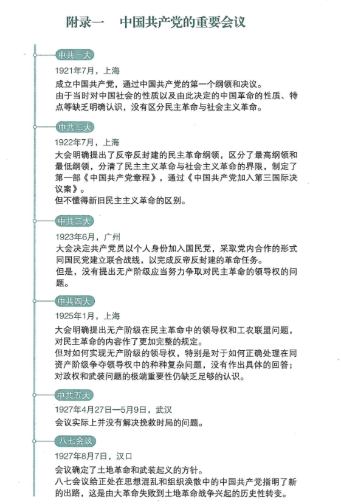
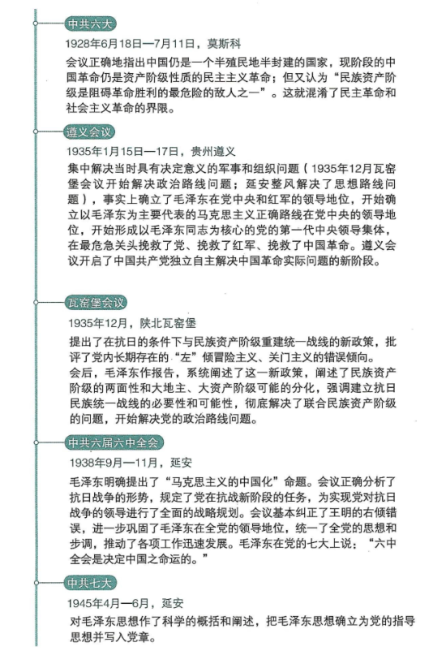
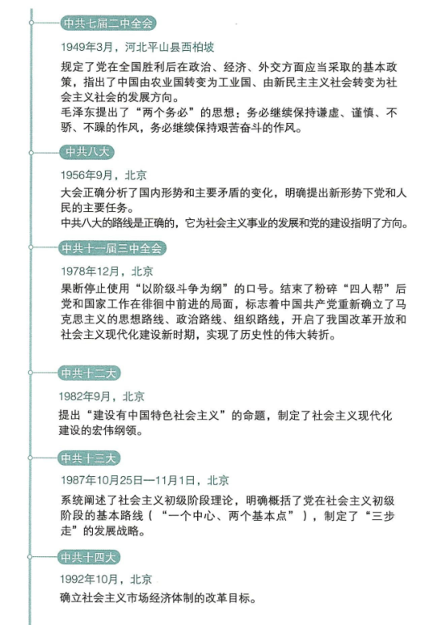
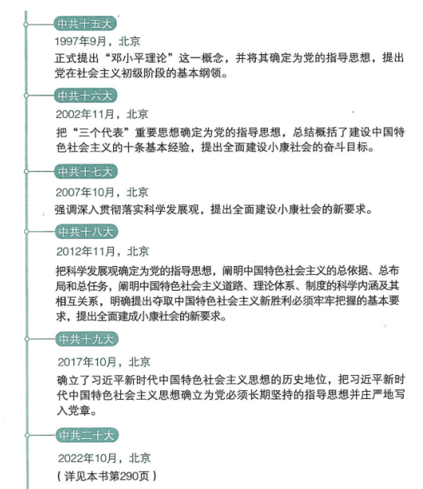
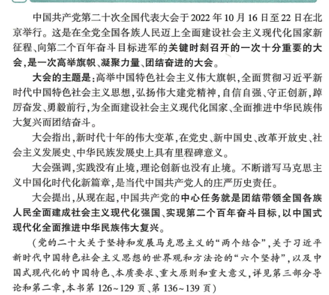

# 1840年之前

18世纪60年代—19世纪40年代：:star: **第一次工业革命**

1785年:star:瓦特改良蒸汽机，蒸汽时代

1839年。:star: 6月**虎门销烟**

1840年。:star: 6月**鸦片战争**。:star: 本年，英国的大机器生产基本上取代了传统的工厂手工业，第一次工业革命基本完成，英国成为世界上第一个工业国家

# **1840年到1919年：:star:旧民主主义革命时期**

1841年。:star: 三元里抗英，中国近代史上中国人民第一次大规模的反侵略武装斗争。

1842年。:star: 8月29日中英**《南京条约》**，第一次鸦片战争结束

1843年。:star: 10月中英《虎门条约》。:star: 魏源《海国图志》“师夷长技以制夷”。:star: 中英《五口通商章程》。

1844年。:star: 7月中美《望厦条约》。:star: 10月中法《黄埔条约》。

1846年。:star: 美墨战争（1848年结束）。

1848年。:star: 2月24日《共产党宣言》。

**1851年-1864年：:star:太平天国运动**

1853年。:star: 太平天国攻克武昌、江宁，定都天京，颁布《天朝田亩制度》；:star: 日本黑船事件。

1853年~1856年：:star:克里米亚战争（俄国对抗奥斯曼、英法）

1856年。:star: 天京事变。

1856年10月至1860年10月:star:**二次鸦片战争**（英法）

1857年。:star: 6月石达开率部出走。

1858年。:star: 5月中俄《瑷珲条约》。:star: 6月中英《天津条约》。

1859年。:star: 太平天国《资政新篇》（中国近代史上第一个比较系统的发展资本主义的方案）。

**1860年至1890年：:star:洋务运动兴起（19世纪60年代初至19世纪90年代，自强求富）**

1860年。:star: 10月第二次鸦片战争结束，中英法俄《北京条约》。:star: 上海江南制造总局（曾国藩支持、李鸿章筹办）。:star: 金陵机器局（李鸿章）。

1861年4月12日 至 1865年4月9日，:star:**美国南北战争**。

1864年。:star:2月至10月普丹战争。:star:本年太平天国覆灭。

1865年。:star:福州船政局（左宗棠）。:star:4月，美国南北战争结束。

1866年。:star:普奥战争。

1867年。:star:天津机器局。

1868年。:star:明治继位宣布“王政复古”，成立新政府，**明治维新**。

19世纪60年代后期:star:**第二次工业革命**

19世纪七八十年代：:star:以煤气和汽油为燃料的内燃机相继诞生，实际可用的发电机问世。

1870年，:star:普法战争

1871年。:star:1月德意志帝国成立。:star:3月18日到5月28日，巴黎公社。

1877年。:star:日本倒幕运动尾声，日本封建军国主义国家建立，日本资本主义革命结束。

1877 年-1878年：:star:第十次俄土战争。

1885年。:star:镇南关大捷（中法）；

1894年。:star:甲午战争。:star:孙中山创立兴中会喊出“振兴中华”

1895年。:star:4月甲午战败（洋务运动失败）《马关条约》。:star:公车上书。:star:沙俄联合法、德干涉日本割占中国辽东半岛。:star:严复《救亡决论》。

1897年。:star:严复翻译并发表《天演论》“物竞天择，适者生存”。

1898年。:star:6月11日**戊戌变法**（戊戌维新运动，中国民族资产阶级登上政治舞台的第一次表演）。:star:7月3日京师大学堂。:star:9月21日慈禧太后等发动戊戌政变，历时103天的变法失败；:star:《时局图》

**1899年秋—1900年9月7日：义和团运动**

1900年。:star:八国联军侵华（英法美德俄日意奥）。:star:7月俄罗斯派兵占领中国东北三省。

1901年。:star:《辛丑条约》。

1902年。:star:4月中俄签订《交收东三省条约》，但当年10月俄罗斯第一次撤兵之后，便不肯继续履行。

1904年2月—1905年9月：:star:日俄战争（日俄在中国东北争夺在华利益，清政府宣布局外中立，俄屡遭失败，美国出面调停，日俄议和，中国被排斥于和谈之外，最终无奈地接受日俄重新划分东北势力范围）。

1905年至1911年：:star:清政府立宪运动、清末新政

1905年。:star:8月20日中国同盟会在日本东京建立（近代中国第一个领导资产阶级革命的全国性政党，广义上的辛亥革命开始）。:star:五大臣出洋考察。:star:科举制度被废除

1906年。:star:下诏预备立宪。

1907年。:star:预备立宪公会。:star:英法俄三国协约。

1908年。:star:钦定宪法大纲。

1909年。:star:咨议局选举。

1910年。:star:资政院开院礼。

1911年。:star:任命内阁（皇族内阁）。:star:4月27日黄花岗起义。:star:6月四省保路风潮。:star:10月10日武昌起义（**辛亥革命**开始，开创了完全意义上的近代民族民主革命，没有彻底反帝反封建的革命纲领。）。

**1912年。:star:中华民国成立**。

1912年。:star:1月1日中华民国成立孙中山任临时大总统。:star:2月12日清帝退位。:star:3月10日袁世凯就任临时大总统

**1912年~1928年：:star:北洋军阀统治中国达16年**

1912年~1919年：**民族工业短暂春天**

1913年。:star:3月宋教仁被暗杀。:star:7月至9月武力镇压”二次革命“

1914年。:star:袁世凯撕毁《临时约法》。:star:孙中山在日本创建中华革命党。:star:7月28日一战爆发

1915年。:star:袁世凯基本接受日本”二十一条“要求。:star:蔡锷等在云南组织护国军，开始护国运动。:star:9月陈独秀在上海创办《青年杂志》（后改名《新青年》）

**1915年-1923年：:star:新文化运动**

1916年。:star:1月1日袁世凯称帝。:star:3月23日取消帝制。:star:6月6日袁世凯去世，皖系军阀段祺瑞掌握了北洋政府。:star:孙中山举起“护法”旗帜（护法运动）。

1917年。:star:1月蔡元培任北大校长，聘陈独秀为文科学长，《新青年》迁至北京。:star:3月俄国爆发二月革命。:star:4月6日，美国向德国宣战，次日向奥匈宣战。:star:6月张勋复辟（仅12天）。:star:8月14日大总统冯国璋在8月14日发布《大总统布告》，声明自当日上午10时起，对德国、奥匈帝国宣战。:star:9月在广州成立以孙中山为大元帅的护法军政府。:star:11月7日，**俄国十月革命**，苏维埃政权确立，苏俄内战。

1918年。3月，苏俄 与同盟国达成协议，苏俄退出一战。:star:5月21日，孙中山看透了西南实力派名为护法、实为争夺地盘的面目，愤然离开广州去上海，护法运动失败。:star:7月，李大钊《法俄革命之比较观》（宣传了十月革命胜利的世界历史意义）。:star:11月11日一战结束。:star:11月李大钊《庶民的胜利》《布尔什维主义的胜利》（连同七月，三篇文章的发表，对于马克思主义在中国的传播起到了先导的作用）。

1919年。:star:1月巴黎和会召开。:star:3月，共产国际（第三国际）成立。:star:5月五四运动。:star:6月5日上海工人罢工。:star:6月28日中国代表未出席巴黎和约的签字仪式。:star:9月李大钊《我的马克思主义观》（标志着马克思主义在中国进入比较系统的传播阶段）:star:旧民主主义革命时期至此结束，新民主主义革命时期的开端。

# **1919年到1949年：:star:新民主主义革命时期**

## **1919~1927：:star:大革命时期**

1920年。:star:3月李大钊成立马克思主义学说研究会。:star:4月俄共来华会见陈李。:star:8月共产党早期组织在上海《新青年》编辑部成立，陈独秀为书记。:star:8月陈望道翻译的《共产党宣言》出版。:star:10月李大钊等在北京成立共产党早期组织，并在11月定名为中国共产党北京支部，李大钊任书记。:star:11月，上海机器工会。

1921年。:star:苏维埃俄国内战结束，苏维埃俄国实现新经济政策，取代了战时共产主义（向社会主义过渡的经济政策，以征收粮食税代替余粮收集制，允许外资企业管理国家暂时无力经营的企业，恢复商品货币关系，进行调节生产的作用，后来，因斯大林上台而被逐步取消）。:star:7月23日，中国共产党第一次全国代表大会（**党一大**，上海，最后一天的会议转移到浙江嘉兴南湖的游船上举行，成立中国共产党，通过了中共第一个纲领和决议，没有区分民主革命和社会主义革命）。:star:9月中国第一个农民协会，开展反抗地主压迫斗争

1922年。:star:1月香港海员罢工。:star:6月粤系陈炯明叛乱，指使所部叛变，炮轰孙中山驻地后回任粤军总司令。:star:6月15日，中共中央发表《中国共产党对于时局的主张》，指出解决时局的关键，是用革命手段打倒帝国主义和封建军阀，建立民主政治，这是中国共产党第一次向社会各界公开自己的政治主张。:star:7月中国共产党第二次全国代表大会（**党二大**，上海，提出反帝反封建的民主革命纲领，区分了最高纲领和最低纲领，分清了民主主义革命与社会主义革命的界限，但不懂得新旧民主主义革命的界限，制定了第一部《中国共产党章程》，通过《中国共产党加入第三国际决议案》、《关于“民主的联合战线”的决议案》正式提出统一战线政策，决定中国共产党加入共产国际）。:star:12月，苏俄内战结束，30日，苏联正式成立。

1923年。:star:1月孙中山与苏俄代表《孙文越飞联合宣言》。:star:2月，京汉铁路工人罢工，成为工人运动第一次高潮的顶点，反动军阀进行血腥镇压，造成二七惨案。:star:6月，中国共产党第三次全国代表大会（**党三大**，广州，大会决定共产党员以个人身份加入国民党，以实现国共合作，大会规定共产党员加入国民党时，党必须在政治上、思想上、组织上保持自己的独立性，采取党内合作的形式同国民党建立联合战线，以完成反帝反封建的革命任务，没有提出无产阶级应当努力争取对民主革命的领导权的问题）。

1924年。:star:1月国民党一大（新三民主义，联俄联共，扶助和依靠农工，第一次国共合作的正式形成）。:star:1月陈炯明被滇、桂、粤联军组成的西路讨贼军击败率部退守东江（1925年国民革命军两次东征彻底消灭其势力）。:star:工人运动开始复兴。:star:创办黄埔军校。

**1925年:star:大革命开始**

1925年。:star:1月中国共产党第四次全国代表大会（**党四大**，上海，明确提出无产阶级在民主革命中的领导权和工农联盟问题，对民主革命的内容作了更加完整的规定，但对如何实行无产阶级的领导权特别是对于如何正确处理在同资产阶级争夺领导权中的种种复杂问题没有作出具体回答，对政权和武装问题的极端重要性缺乏足够的认识）。:star:2月，国民革命军第一次东征（征讨盘踞在广东东部的军阀陈炯明）。:star:3月12日孙中山逝世。:star:5月，五卅惨案（工人罢工的斗争，遭到日本帝国主义和北洋军阀的镇压）、五卅运动（反帝爱国运动），广大的工人、学生和部分工商业者，在许多城市和县镇举行游行示威和罢工、罢课、罢市，形成了全国规模的反帝爱国运动高潮，掀起全国范围大革命（1925~1927）的高潮。:star:10月，国民革命军第二次东征（征讨盘踞在广东东部的军阀陈炯明，此次陈炯明势力被消灭）。

1926年。:star:7月**北伐战争**。:star:9月1日毛泽东《国民革命与农民运动》。

1926年到1927年3月，:star:仅10个月时间，国民革命军便从广州打到武汉、南京和上海，打垮了吴佩孚、孙传芳两大军阀，革命势力从珠江流域一直推进到长江流域。:star:到1927年6月，武汉政府的北伐军与北方国民军会师中原，革命势力便发展到黄河流域，席卷大半个中国。

1927年，:star:3月，蒋介石制造中山舰事件。:star:4月12日，蒋介石上海**四一二反革命政变**，并在南京建立国民政府，国民政府宁汉分裂。:star:4月，李大钊惨遭反动军阀绞杀。:star:4月中国共产党第五次全国代表大会（**党五大**，武汉，会议实际上并没有解决挽救时局的问题，修改党章，正式提出党内实行民主集中制的组织原则）。:star:7月15日汪精卫武汉国民政府发动七一五反革命政变，国共合作全面破裂，大革命失败。:star:7月，中共中央政治局常委会决定三件大事（土地革命兴起）。:star:8月7日中共秘密召开**八七会议**（汉口，确定了土地革命和武装起义方针、清算右倾机会主义错误，给正处于思想混乱和组织涣散的中国共产党指明了新的出路，这是由大革命失败到土地革命兴起的历史性转变）。:star:8月1日，**南昌起义**。:star:9月，宁汉合流。:star:9月9日，秋收起义（打出来“工农革命军”旗帜，攻打长沙受挫后南下向农村区域转移）。:star:9月底，三湾改编，从政治上、组织上保证了党对军队的绝对领导，标志着毛泽东建设人民军队思想的开始形成。:star:12月11日，广州起义。

## **1927~1937：:star:土地革命时期**

1927~1937:star:土地革命时期（十年内战时期、第二次国内革命战争；苏维埃政权，工农民主专政）

1928年。:star:4月讨伐张作霖。:star:6月张作霖被日本炸死。:star:6月中国共产党第六次全国代表大会（**党六大**，莫斯科，指出中国仍是一个半殖民地半封建的国家，现阶段中国革命仍是资产阶级性质的民主主义革命，但又认为“民族资产阶级是阻碍革命胜利的最危险的敌人之一”，这就混淆了民主革命和社会革命的界限）。:star:10月和11月，毛泽东《中国的红色政权为什么能够存在？》、《井冈山的斗争》（工农武装割据思想）。:star:12月毛泽东主持制定中共第一个土地法**《井冈山土地法》**（没收一切土地归苏维埃政府所有，禁止土地买卖等）。:star:12月29日**东北易帜**，北洋军阀不再作为独立的政治力量存在，国民党在全国范围内建立了自己的统治。

1928-1929年：:star:中国民族工商业短暂繁荣。

1929年。:star:2月蒋桂战争、蒋冯战争。:star:4月，毛泽东主持制定中共第二个土地法**《兴国土地法》**（将没收一切土地变为没收一切公用土地及地主阶级的土地，保护了中农的利益使之不受侵犯）。:star:10月，由美国开始的经济危机席卷整个资本主义世界。:star:12月红四军党的第九次代表大会（**古田会议**，思想建党、政治建军）。

1930年。:star:1月毛泽东《星星之火，可以燎原》（党的中心转移到农村）。:star:5月毛泽东《反对本本主义》（理论与实际相结合。农村包围城市、武装夺取政权。毛泽东思想的初步形成）。:star:5月至10月，中原大战。:star:10月蒋介石开始”围剿“中共。

1930年10月~1931年7月，:star:连续粉碎三次”围剿“。

## **1931~1945：:star:抗日战争时期**

1931年。:star:2月明确规定农民已经分得的田归农民个人所有，可以自主租借买卖（土地革命中的阶级路线和土地分配方法主要是：坚定地依靠贫农、雇农，联合中农，限制富农，保护中小工商业者.消灭地主阶级;以乡为单位，按人口平分土地，在原耕地的基础上.实行抽多补少、抽肥补瘦）。:star:2月汤山事件（约法之争上，蒋介石拘禁国民政府立法院长胡汉民，引起了中国国民党内部的公开分裂，造成了宁粤对立的局面）。:star:5月5日召开国民会议在会议上通过了《中华民国训政时期约法》（蒋介石随后又根据约法通过了《中华民国国民政府组织法》，确立了以国府主席为中心的集权体制，从法理上确保了蒋介石掌握至高无上的权力）。:star:5月汪精卫、孙科等人成立广州国民政府和蒋介石南京政府相对抗。:star:7月蒋介石提出“攘外必先安内”方针。:star:9月1日，广州国民政府下达总动员令，出师讨蒋（一度占领湖南衡州。旋因爆发九一八事变，被迫停战）。:star:9月18日，**九一八事变**。:star:9月20日中共中央号召全国农工武装起来。:star:11月中华苏维埃第一次全国工农兵代表大会举行，**中华苏维埃共和国**临时中央政府在江西中央苏区成立，主席毛泽东，定都瑞金（中央苏区-瑞金县），《中华苏维埃共和国宪法大纲》，红色中华通讯社成立（1937年1月改名为新华社）。:star:12月蒋介石下野、宁粤合流，但依旧没有弥合裂隙。:star:本年，经过三年多实践，党的**土地革命路线基本形成**，即：依靠贫农、雇农，联合中农，限制富农，消灭地主阶级，变封建土地所有制为农民土地所有制，保护中小工商业者，以乡为单位，按人口平分土地，在原耕地基础上，实行抽多补少、抽肥补瘦。

1932年。:star:中共中央号召各界民众组织义勇军，支援国民党第十九路军的抗日作战。:star:1月5日广州国民政府宣布取消（但粤方势力新设西南两机关，继续维持割据状态，直到1936年两广事变和平解决为止。:star:1月28日日本进攻上海（一·二八事变），第一次淞沪抗战开始（粤系政府无法指挥，蒋介石复出任军事委员会委员长，汪精卫任行政院长）。:star:1月，原西北军将领冯玉祥在张家口成立察哈尔民众抗日同盟军。:star:2月东北全境沦陷，“伪满洲国”。:star:4月15日中华苏维埃共和国临时中央政府宣布对日作战。:star:11月，福建事变（国民党军第十九路军公开宣布抗日反蒋）。:star:年底取得第四次反”围剿“成功，鄂豫皖、湘鄂西等根据地反“围剿”战争也取得重大胜利。:star:本年，苏联第一个五年计划完成，苏联从农业国变成工业国。

1933年。:star:3月至5月长城抗战。:star:5月5日签订了《淞沪停战协定》（中国军队不能在上海布防，从而使上海门户大开）。:star:5月31日，中日《塘沽协定》（中国军队撤出长城以南大片地区）。:star:9月25日第五次反“围剿”。

1934年。:star:1月福建事变失败。:star:10月，第五次反“围剿”失败，被迫实行战略性转移，**长征**。

1935年。:star:华北事变（日本策动、拼凑了一些地方性傀儡政权）。:star:意大利入侵埃塞俄比亚。:star:1月**遵义会议**（确立以毛泽东正确路线的领导地位，坚持真理、修正错误，集中解决了在当时具有决定意义的军事问题和组织问题，事实上确立了毛泽东在党中央和红军的领导地位，开始确立以毛泽东同志为核心的党的第一代中央领导集体，在最危急关头挽救了党、挽救了红军、挽救了中国革命。遵义会议开启了中国共产党独立自主解决中国革命实际问题的新阶段）。:star:5月，中共西北特委组建中华苏维埃共和国西北联邦，中华苏维埃共和国政治体制演变为联邦制。:star:6月27日《察哈尔协定》丧失了察哈尔省主权，为日本吞并华北大开方便之门。:star:8月1日，《为抗日救国告全体同胞书》（八一宣言，呼吁停止内战一致抗日）。:star:11月，中华苏维埃共和国变更对外名义称“中华苏维埃共和国中央政府西北办事处”。:star:12月，中华苏维埃政权改国名为“中华苏维埃人民共和国”，宣布迁都延安。:star:12月9日，一二九运动(北平抗日游行、反对华北自治，标志着中国人民抗日救亡运动新高潮的到来）。:star:12月党的**瓦窑堡会议**（提出了在抗日条件下与民族资产阶级重建统一战线的新政策，批评了党内长期存在的“左”倾冒险主义、关门主义的错误倾向。会后，毛泽东作报告，系统阐述了这一新政策，阐述了民族资产阶级的两面性和大地主、大资产阶级可能的分化，强调了建立抗日民族统一战线的必要性和可能性，彻底解决了联合民族资产阶级的问题，开始解决党内的政治路线问题）。:star:12月毛泽东《论反对日本帝国主义的策略》（阐明了党的抗日民族统一战线新政策，系统说明了党的政治策略上的诸问题）。

1936年。:star:5月毛朱《停战议和一致抗日通电》（放弃了“反蒋”口号，第一次公开把蒋介石作为联合对象）。:star:6月至9月两广事变（两广军阀势力以抗日名义举兵反蒋，双方达成政治妥协而和平结束）:star:。10月红军会师，**长征结束**。:star:12月毛泽东《中国革命战争的战略问题》（总结土地革命战争中党内在军事问题上的争论，系统说明了有关中国战争战略方面的诸问题）。:star:12月12日**西安事变**（和平解决，十年内战基本结束）。

1936年7月—1939年4月:star:西班牙内战（二战前奏，共和政府军与左翼联盟对抗以法西斯弗朗哥为中心的西班牙国民军右翼集团）。

**1937年:star:全民族抗战开始**（抗日民族统一战线性质的政权）

1937年。:star:2月国民党五届三中全会（国共两党第二次合作不可阻挡）。:star:夏，毛泽东《实践论》《矛盾论》（克服教条主义）。:star:7月7日，**卢沟桥事变（七七事变）**，日本全面侵华战争由此开始，21天后北平沦陷。:star:8月国共两党达成协议（八路军、新四军）。:star:8月中共洛川会议（抗日救国十大纲领，全民族抗战）。:star:8月13日—11月12日，淞沪会战，上海沦陷。:star:9月6日，中华苏维埃共和国中央政府西北办事处更名“中华民国陕甘宁边区政府”:star:。9月22日，**正式结束苏维埃国家政权形式**，陕甘宁边区政府成为民国的一个特别行政区。:star:9月—11月太原会战（9月八路军平型关大捷，11月太原失守，在华北以国民党为主体的正规战争结束，以共产党为主体的游击战争上升到主要地位）。:star:9月22日国民党《中国共产党为公布国共合作宣言》。:star:9月23日蒋介石发表实际承认共产党合法地位的谈话。:star:11月华北战场忻口会战。:star:11月20日迁移国民政府于重庆。:star:11月，中国第一个抗日根据地——晋察冀抗日根据地成立（抗日民主根据地的建设：工作人员分配上实行“三三制”原则，共产党员大体占三分之一，左派进步分子大体占三分之一，中间分子和其他分子大体占三分之一；土地政策是减息减租，不是实行没收地主土地的政策；"发展经济，保障供给"，“自己动手，丰衣足食”）。:star:12月南京沦陷（**南京大屠杀**）。:star:本年，苏联第二个五年计划完成，苏联的工业生产总值跃居欧洲第一，世界第二。

1938年。:star:1月至5月台儿庄战役、徐州会战。:star:5月毛泽东《论持久战》。:star:6月至10月武汉会战，武汉失守。:star:9月至11月，**中共六届六中全会**（明确提出了“马克思主义中国化”命题。会议正确分析了抗日战争的形式，规定了党在抗战新阶段的任务，为实现党对抗日战争的领导进行了全面的战略规划。会议基本纠正了王明的右倾错误，进一步巩固了毛泽东在全党的领导地位，统一了全党的思想和步调，推动了各项工作迅速发展。六中全会是决定中国之命运的）。:star:10月广州失守。:star:10月从战略防御阶段转为战略相持阶段，日本开始”以华制华“和”以战养战“策略。:star:10月—12月 八路军晋察冀部队在第一二〇师配合下，粉碎2万余日军对北岳区的大“扫荡”。在黄土岭伏击战中击毙日军中将旅团长，这是抗日战争中八路军击毙的日军最高级别指挥官。:star:12月中国国民党副总裁汪精卫投降日本。

1939年。:star:1月，毛泽东发表《新民主主义论》，系统阐述新民主主义理论，新民主主义理论的提出和系统阐明，是马克思主义中国化的重大理论成果，标志着毛泽东思想得到多方面展开而趋于成熟。:star:1月国民党“防共委员会”。:star:1月—3月，八路军第一二九师主力同冀南军区部队一起进行反“扫荡”作战，巩固了冀南抗日根据地。:star:1月至4月，八路军第一二〇师主力会合冀中军区部队，连续粉碎日、伪军多次围攻。:star:5月到9月苏日诺门罕战役，日军战败，日本政府被迫签订《苏日停战协定》。:star:7月至8月，晋冀豫抗日根据地军民在八路军总部统一指挥下，反击日军5万余人的大“扫荡”。:star:8月23日《苏德互不侵犯条约》。:star:8月20日—翌年1月下旬，八路军总部在华北发动了一次大规模的对日军的进攻（百团大战）。:star:9月1日德国进攻波兰（**一战欧洲部分爆发**）。:star:9月第一次长沙会战。:star:10月，宪政运动（批评国民党一党专政）。:star:11月，苏芬战争。:star:12月毛泽东《中国革命和中国共产党》（第一次提出新民主主义革命的科学概念和总路线的内容）。

1940年。:star:3月汪精卫在南京成立**伪“中华民国国民政府”**。:star:3月苏芬战争结束。:star:4月9日德国攻击丹麦和挪威。:star:5月敦刻尔克大撤退。:star:6月22日，法国正式投降。:star:8月至次年1月，百团大战。:star:8月，创办延安自然科学院。:star:10月19日，国民政府致电(即“**皓电**”)八路军新四军对中国共产党及其领导的武装力量进行种种攻击和诬蔑（其中特别列举抗战以来华北、华中各地发生的摩擦事件，并将其原因归结于八路军和新四军），成为第二次反共高潮的起点。

1941年。:star:1月皖南事变（国民党反动派在皖南有预谋地围袭新四军，反诬新四军“叛变”，宣布取消新四军番号，事变发生后，中共采取了坚决的斗争政策。不仅严厉谴责国民党顽固派的罪恶阴谋，而且严正地宣布重建新四军，国民党发动的第二次反共高潮）。:star:3月，中国民主政团同盟成立（民盟）。:star:3月，八路军进驻了作为陕甘宁边区南大门的南泥湾，一边练兵，一边屯田垦荒，培育和形成了以艰苦奋斗、自力更生为核心的南泥湾精神。:star:5月毛泽东《改造我们的学习》，标志着**延安整风运动**的开始，反对主观主义（主观主义：教条主义、经验主义。最主要任务）以整顿学风，反对党派主义以整顿党风，反对党八股以整顿文风。:star:6月22日，**苏德战争爆发**。:star:9月第二次长沙会战。:star:11月皖南事变而引起的一系列斗争结束。:star:12月7日**偷袭珍珠港**，太平洋战争爆发。

1942年。:star:1月《联合国家宣言》。:star:1月，第三次长沙会战（给日军有力打击）。:star:2月，中国**远征军**进入缅甸抗日。:star:2月《整顿党的作风》《反对党八股》（提出反对主观主义以整顿学风、反对宗派主义以整顿党风、反对党八股以整顿文风；整风运动在全党普遍展开）。:star:7月—次年2月，**斯大林格勒战役**（二战转折点）。:star:**中途岛海战**，太平洋战争转折点。

1943年。:star:6月10日， 共产国际正式解散。:star:11月《开罗宣言》（协调对日作战的共同军事问题和战后处置日本等，从法律上明确了日本侵占台湾的非法性，确认了台湾是中国领土）。:star:11月德黑兰会议（开辟西欧第二战场，建立维护和平的国际组织，巴尔干、法国、远东、芬兰以及波兰疆界等问题，《德黑兰宣言》）。

1944年。:star:5月11日，豫湘桂战役（国民党军队大溃退）。:star:5月21日—翌年4月20日，中共扩大的六届七中全会在延安召开。全会通过毛泽东为中央委员会主席的提议，原则通过《关于若干历史问题的决议》，肯定了确立毛泽东在全党的领导地位的重大意义，使全党尤其是党的高级干部对中国民主革命基本问题的认识达到在马克思列宁主义基础上的一致。至此，整风运动胜利结束。整风运动是一次深刻的马克思主义思想教育运动，收到巨大成效。通过整风运动，实现了在以毛泽东同志为核心的党中央领导下全党新的团结和统一，为抗日战争的胜利和新民主主义革命在全国的胜利，奠定了重要的思想政治基础。延安整风运动所积累的经验对党的建设具有重大而深远的意义。:star:6月**诺曼底登陆**。:star:7月联合国国际货币金融会议（布雷顿森林货币体系，二战后以美元为中心的国际货币体系，外汇自由化、资本自由化和贸易自由化为主要内容的多边经济制度，构成资本主义集团的核心内容）。:star:9月，提出联合政府主张。:star:本年 中国共产党领导敌后军民在华北、华中、华南地区发起局部反攻，歼灭日、伪军近20万人，收复大片国土，解放人口1700多万。

1945年。:star:春夏，中国共产党领导人民抗日武装继续进行攻势作战，抗日力量和抗日根据地不断发展，为转入全面反攻、夺取抗战最后胜利创造了有利条件。:star:2月雅尔塔会议（制定战后新秩序和列强利益分配的首脑会议，雅尔塔体系）。:star:3月至5月豫西鄂北会战。:star:4月中国共产党第七次全国代表大会（**党七大**，延安，制定了党的政治路线；三大作风：理论和实际相结合的作风、和人民群众紧密联系在一起的作风、自我批评的作风；正式命名**毛泽东思想**并规定为党一切工作的指针，对毛泽东思想作了科学的概括和阐述，把毛泽东思想确立为党的指导思想并写入党章；党在政治上思想上理论上走向成熟，以“团结的大会，胜利的大会”载入党的史册）。:star:4月至6月，联合国制宪会议《联合国宪章》，中国成为联合国的创始会员国之一和安理会五个常任理事国之一。:star:4月-6月，湘西会战。:star:5月**德国投降**。:star:7月《波茨坦公告》。:star:8月，苏联进入中国东北对日作战。:star:8月6日广岛”小男孩“。:star:8月9日长崎“胖子”。:star:8月9日，毛泽东发表《对日寇的最后一战》的声明，随后，朱德发布七道全面反攻命令，中国**抗日战争进入全面反攻阶段**。:star:8月15日，日本**《终战诏书》**。:star:8月29日至10月10日，经过43天谈判，《政府与中共代表会谈纪要》（**双十协定**，确定和平建国基本方针，同意“长期合作，坚决避免内战”）。:star:8月25日中共中央在《对目前时局的宣言》中明确提出和平、民主、团结的口号。:star:9月2日，日本签署向同盟国投降书。:star:9月3日，中国人民抗日战争胜利纪念日。:star:9月19日，中共中央提出“向北发展，向南防御”的战略方针，强调全党全军目前的主要任务是完全控制热河、察哈尔两省，发展东北力量并争取控制东北。:star:10月25日中国政府举行受降仪式。:star:10月25日中国政府在台湾举行受降仪式，根据《波茨坦公告》，被日本占领50年之久的台湾以及澎湖列岛，重归中国主权管辖，这是抗日战争取得完全胜利的重要标志。:star:12月，一二·一运动（反内战、争民主的爱国民主运动）。

## **1945~1949：:star:解放战争时期**

1945~1949：解放战争时期（各革命阶级的联合专政）

1946年。:star:1月5日，国共双方达成关于停止国内军事冲突的协定，10日，双方下达停战令。:star:1月10日重庆政治协商会议，五项协议（还不是新民主主义性质的），全党为实现政协协议而奋斗，但同时提高警惕做好自卫战争的准备，目前解放区的中心工作是练兵、减租与生产。:star:5月4日**《关于清算、减租及土地问题的指示》**（**五四指示**，将全民族抗战时期的减租减息改变为“耕者有其田”政策，并指出解决解放区的土地问题是党目前最基本的历史任务，各解放区迅速开展土地改革运动）。:star:6月23日下关惨案（南京下关的国民党特务殴打民主人士）。:star:6月26日，国民党撕毁停战协定和政协协议，进攻中原解放军，挑起了全国性的内战，**解放战争**爆发。:star:8月6日 毛泽东同美国记者安娜·路易斯·斯特朗谈话时提出“一切反动派都是纸老虎”的著名论断。:star:12月30日一二·三〇运动（抗议美军暴行）。

1946年至1947年6月：:star:战略防御阶段

1947年。:star:2月，国民党政府先后通知共产党驻南京、上海、重庆等地担任谈判联络工作的代表全部撤回。3月上旬，共产党驻上述三地人员分别撤回延安。国共关系完全破裂。:star:5月1日 ，内蒙古自治政府正式成立，这是中国共产党领导的第一个省级少数民族自治政府。:star:5月20日，五二〇运动（学生“反饥饿、反迫害、反内战”，遭到了国民党军警的残暴镇压）。:star:6月，千里跃进大别山。:star:7月，**《中国土地法大纲》**（解放区广大农村掀起土改高潮，“废除封建性及半封建性剥削的土地制度，实行耕者有其田的土地制度”，“乡村中一切地主的土地及公地，由乡村农会接收”，分配给无地或少地的农民）。:star:8月下旬，晋冀鲁豫野战军一部渡过黄河，挺进豫西。:star:9月，华东野战军主力越过陇海铁路南下，进入豫皖苏平原。:star:10月，国民党宣布民盟为“非法团体”。:star:10月10日，中国人民解放军总部发表宣言提出“打倒蒋介石，解放全中国”的口号。

1948年。:star:秋，人民解放战争进入夺取全国胜利的决定性的阶段。:star:6月 《人民日报》创刊。:star:9月16日—24日 华东野战军进行济南战役，解放济南。:star:9月12日 至 11月2日辽沈战役，东北全境解放，从此，解放军不但在质量上占有优势，而且在数量上也取得优势，中国人民革命的军事形势达到一个新的转折点。:star:11月6日 至 次年1月10日淮海战役，长江中下游以北广大地区解放。:star:1948年11月29日 至 1949年1月31日平津战役，华北全境基本解放，其间，1949年1月31日北平和平解放。:star:12月1日，中国人民银行成立并发行人民币。

1949年。:star:1月22日民主派和无党派人士《对时局的意见》（接受共产党的领导）。:star:1月31日—2月7日 ，毛泽东提出“打扫干净屋子再请客”的方针，在此前后还提出“另起炉灶”和“一边倒”的方针，由此奠定了新中国外交政策的基础。:star:3月，**中共七届二中全会**（西柏坡，规定了党在全国胜利后在政治经济外交方面应采取的基本政策，指出中国由农业国转变为工业国、由新民主主义社会转变为社会主义社会的发展方向，提出了两个”务必“的思想：务必保持谦虚谨慎不骄不躁的作风、务必保持艰苦奋斗的作风；制定和实现了“公私兼顾、劳资两利、城乡互补、内外交流”的新民主主义经济建设的方针政策，简称为“四面八方”政策）。4月1日提出《国内和平协定》并宣布4月20日为最后签字时间。:star:4月4日，北大西洋公约组织。:star:4月20日国民党政府拒绝接受《国内和平协定》，解放军遂发起渡江战役，国民党政府“划江而治”的图谋破产。:star:4月21日，《向全国进军的命令》，:star:20日夜至21日发起渡江战役。百万雄师强渡长江。:star:4月23日，南京解放，宣告**国民党反动派统治覆灭**。:star:5月27日解放上海。:star:6月30日，毛泽东《论人民民主专政》，提出主要经验、主要纲领就是人民民主专政，指出人民民主专政需要工人阶级的领导。:star:8月14日—9月16日，毛泽东连续为新华社撰写《丢掉幻想，准备斗争》等五篇评论，揭露美国对华政策的帝国主义本质，批评国内一部分人对帝国主义不切实际的幻想，并对中国革命的发生和胜利的原因作理论上的说明。:star:9月21日，中国人民政治协商会议第一届全体会议，《中国人民政治协商会议组织法》《中华人民共和国中央人民政府组织法》《中国人民政治协商会议共同纲领》（**共同纲领**，宪法前身，“四面八方”政策组为新民主主义经济工作的政策）。:star:10月1日**中华人民共和国成立**。:star:10月2日，苏联政府决定同新中国建立外交关系。:star:10月9日 中国人民政治协商会议第一届全国委员会第一次会议举行。会议选举毛泽东为政协第一届全国委员会主席。:star:10月21日 中央人民政府政务院成立。

社会主义革命和建设时期。

# 1949年10月到1978年12月：:star:社会主义革命和建设时期

## **1949年至1956年年底:star:社会主义过渡时期**。

**1949年至1956年年底:star:社会主义过渡时期**。（人民民主专政）

### **1949至1953年：:star:国民经济的恢复和初步发展时期。**

1950年。:star:2月14日《中苏友好同盟互助条约》。:star:5月1日，新中国成立后制定的第一部法律《中华人民共和国婚姻法》。:star:5月1日，中共中央发出《关于在全党全军开展整风运动的指示》，全党开展以提高干部和一般党员的思想水平和政治水平，克服工作中所犯的错误，克服居功自傲和官僚主义、命令主义，改善党和人民的关系为主要任务的整风运动，至年底整风运动结束。:star:5月1日，海南岛解放。:star:6月中共第七届三中全会，**《中华人民共和国土地改革法》**（保护富农政策），国民经济恢复时期的中心任务是争取国家财政经济状况的基本好转，**土地改革**（1950年至1953年春）。:star:6月，朝鲜内战。:star:10月**抗美援朝**。:star:10月10日 中共中央发出《关于镇压反革命活动的指示》，到1951年10月底，全国规模的镇压反革命运动基本结束。

1951年。:star:5月西藏和平解放。:star:1951年底至1952年10月：“三反”运动（在中国共产党和国家机关内部开展的“反贪污 、反浪费、反官僚主义 ”的运动）。

1952年。:star:上半年，“五反”运动（在资本主义工商业者中开展的反行贿、反偷税漏税、反盗骗国家财产、反偷工减料、反盗窃国家经济情报的斗争）。:star:年底，除一部分少数民族地区外，土地改革在中国大陆基本完成，封建土地所有制被彻底摧毁，新民主主义革命遗留任务的顺利完成。

1953年。:star:7月**抗美援朝胜利**。:star:5月15日 中苏两国政府签订《关于苏维埃社会主义共和国联盟政府援助中华人民共和国中央人民政府发展中国国民经济的协定》。:star:6月15日，中央政治局召开会议，会议确定对资本主义工商业实行利用、限制和改造的方针。:star:10月16日 中共中央作出《关于实行粮食的计划收购与计划供应的决议》。:star:11月15日，作出《关于在全国实行计划收购油料的决定》。:star:12月“过渡时期总路线”，明确地向全党和全国人民提出了向社会主义过渡的任务，即：逐步实现国家的社会主义工业化和国家对农业、手工业、资本主义工商业的社会主义改造（**一化三改**）。:star:本年，我国开始执行发展国民经济的第一个五年计划（**“一五”计划**），农民的个体所有制变为集体所有制，到2021年6月，共编制执行十四个五年计划、规划。:star:12月31日，周恩来在接见参加中印有关问题谈判的印度代表团时首次提出和平共处五项原则。

### **1953至1956年：:star:社会主义工业化和三大改造时期。**

1954年。:star:9月第一届全国人民代表大会，20日**第一部《中华人民共和国宪法》**在第一次会议上通过（宪法1.0）。:star:6月—9月 长江、淮河流域发生百年未遇的大水灾。:star:9月，政务院下达对棉布实行计划收购和计划供应、对棉花实行计划收购的命令（国家对粮食等主要农产品实行统购统销政策，并延续到20世纪80年代中期，之后逐步取消）。:star:10月成立新疆军区生产建设兵团（1975年3月，兵团撤销，成立新疆维吾尔自治区农垦总局。1981年12月3日，中共中央、国务院、中央军委作出《关于恢复新疆生产建设兵团的决定》）。:star:12月21日—25日，全国政协二届一次会议举行，周恩来作政治报告，指出，由于一届全国人大一次会议已经召开，政协代行全国人大职权的政权机关的作用已经失去，但政协本身的统一战线作用仍然存在，通过《中国人民政治协商会议章程》。

1955年。:star:4月18日—24日，周恩来，亚非会议，中国代表团本着“求同存异”的方针，同其他与会国家一起，共同倡导形成“万隆精神”，通过这次会议，中国打开了与亚非国家广泛交往的大门。:star:10月1日，新疆维吾尔自治区成立。:star:5月14日，华沙条约组织（华约）建立。

1956年。:star:4月25日毛泽东**《论十大关系》**（中国共产党人开始探索自己的社会主义建设道路的标志，基本方针是调度一切积极因素为社会主义建设服务，农轻重，两条腿走路的工业化发展思路；四个现代化：工业、农业、科学、国防；报告强调要调动国内外一切积极因素，为建设强大的社会主义国家而奋斗，并初步总结我国社会主义建设经验，提出探索适合中国情况的建设社会主义道路的任务，报告还提出共产党和民主党派“长期共存，互相监督”的方针）。:star:9月中国共产党第八次全国代表大会（**党八大**，北京，正确分析了国内形势和主要矛盾的变化，明确提出新形势下党和人民的主要任务；提出了正确的路线，为社会主义事业的发展和党的建设指明了方向；我们国内的主要矛盾，已经是人民对于建立先进的工业国的要求同落后的农业国的现实之间的矛盾，已经是人民对于经济文化迅速发展的需要同当前经济文化不能满足人民需要的状况之间的矛盾。全国人民的主要任务是集中力量发展社会生产力，实现国家工业化，逐步满足人民日益增长的物质文化需要；经济建设方针是在综合平衡中稳步前进）。:star:到年底，生产资料私有制的社会主义改造取得决定性胜利。:star:1月至2月，普通话、简体字和拼音。:star:年底，**社会主义三大改造基本完成**，社会主义过渡时期结束。

## **1956年年底至1966年5月:star:全面建设社会主义时期。**

1957年。:star:2月**《关于正确处理人民内部矛盾的问题》**（解决敌我矛盾用专政的方法，分清敌我；解决人民内部矛盾采用民主的方法，分清是非，思想政治领域“团结-批判-团结”；共产党和民主党派之间的矛盾，坚持社会主义道路和党领导的前提下的“长期共存、互相监督”）。:star:4月《关于整风运动的指示》（整风运动，以正确处理人民内部矛盾为主题，以反对官僚主义、宗派主义和主观主义为主要内容的整风运动全面展开；在整风过程中，极少数右派分子乘机向党和新生的社会主义制度发动进攻）。:star:夏，《一九五七年夏季的形势》。:star:6月，整风运动的重点开始由党内整风转向反右派斗争。:star:本年 “一五”计划超额完成，“一五”计划取得巨大成就，为中国社会主义工业化奠定了初步基础，为社会主义建设积累了宝贵经验。

1958年。:star:3月5日，广西僮族自治区成立（1965年10月12日改称广西壮族自治区）。:star:5月5日—23日，中共八大二次会议召开，会议正式通过“鼓足干劲、力争上游、多快好省地建设社会主义”总路线，会后，**“大跃进”运动**在全国展开（”大跃进“至1960年）。:star:夏季，整风运动和反右派斗争完全结束，对右派分子的进攻进行反击是正确和必要的，但反右派斗争被严重扩大化。:star:8月17日—30日 ，中央政治局扩大会议会后，全国很快掀起**大炼钢铁**和**人民公社化运动**的高潮，以高指标、瞎指挥、浮夸风和“共产风”为主要标志的“左”倾错误严重泛滥开来。:star:10月25日，宁夏回族自治区成立。:star:11月第一次郑州会议作出初步纠正“左”倾错误的努力、党中央领导整顿人民公社（到1959年7月，中共中央相继召开中共八届六中全会、第二次郑州会议、中共八届七中全会等一系列会议，初步纠正已经察觉到的“大跃进”和人民公社化运动中出现的“左”的错误）。:star:本年，苏联提出要在中国领土和领海上建立中苏共有共管的长波电台和共同舰队，遭到坚决拒绝，**中苏关系开始恶化**。

1959年至1961年：:star:**三年困难**时期（自然灾害）

1959年。:star:3月10日，西藏上层反动集团撕毁关于和平解放西藏办法的“十七条协议”，发动武装叛乱。:star:3月20日，人民解放军驻藏部队奉命进行平叛作战；:star:3月22日，中共中央发出在平叛中实行民主改革的指示。:star:6月苏联政府撕毁两国关于国防新技术协定。:star:7月2日—8月1日 中央政治局扩大会议在江西庐山召开，原定议题是总结“大跃进”以来的经验教训，继续纠正“左”的错误，但会议后期错误地发动了对彭德怀等人的批判，纠正“左”倾错误的努力被庐山会议“反右倾”斗争中断。:star:8月2日至16日，中共八届八中全会在庐山召开。会后，在全党错误地开展了“反右倾”斗争。:star:8月，中印第一次边境冲突，苏方不问是非曲直发表偏袒印度的声明，中苏关系进一步恶化。

1960年。:star:1月28日 中缅两国签订《中华人民共和国政府和缅甸联邦政府关于两国边界问题的协定》、《中华人民共和国和缅甸联邦之间的友好和互不侵犯条约》。:star:10月1日，双方签订《中华人民共和国和缅甸联邦边界条约》（这是中国与邻国成功解决边界问题的第一例，为以后解决类似问题树立了良好范例；此后，中国又陆续与尼泊尔、蒙古、巴基斯坦和阿富汗等国签订了边界协定或条约）。:star:11月3日 ，中共中央发出《关于农村人民公社当前政策问题的紧急指示信》，要求坚决纠正农村人民公社的“共产风”。:star:石油输出国组织（“欧佩克”）建立。:star:年底，西藏民主改革基本完成，彻底摧毁了政教合一的封建农奴制度，实现百万农奴和奴隶翻身解放。

1961至1975年：:star:美国对越南发动的侵略战争。

1961年。:star:1月**党的八届九中全会**（全会通过对国民经济实行“调整、巩固、充实、提高”的方针，国民经济转入调整的轨道）。:star:3月”农业六十条“，对农村政策进行调整；随后，工业、商业、手工业、科学、教育、文艺领域也进行调整，并相继制定了工作条例。

1962年。:star:1月，”七千人大会“（总结了”大跃进“以来经济建设工作的经验教训，开展批评和自我批评，强调加强民主集中制，切实贯彻调整国民经济的方针，以迅速扭转国民经济困难的局面）。:star:10月**中印边境自卫反击战**，11月结束。

1962年到1966年：:star:国民经济得到了比较顺利的恢复和发展。

1963年。:star:2月，在农村开展以“四清”（清理账目、清理仓库、清理财物、清理工分）为主要内容的社会主义教育运动，在城市开展反对贪污盗窃、反对投机倒把、反对铺张浪费、反对分散主义、反对官僚主义的“五反”运动。:star:夏开始，各项建设事业呈现明显的健康发展势头。

1964年。:star:10月中国研制的**第一颗原子弹**爆炸成功。:star:12月三届全国人大。:star:年底，周恩来”四个现代化“。

1965年。:star:9月9日，西藏自治区成立。:star:年底，调整国民经济的任务全面完成。

1966年。:star:3月苏共召开二十三大，中国共产党决定不派代表出席，中苏两党关系基本中断。:star:5月中共中央政治局扩大会议《中国共产党中央委员会通知》（”五一六通知“）。:star:8月中共八届十一中全会《中国共产党中央委员会关于无产阶级文化大革命》简称”十六条“（标志着**“文化大革命”**的全面发动）。

## **1966年5月至1976年10月：:star:文化大革命时期**

1967年。:star:1月起”文化大革命“进入”全面夺权“阶段（打倒一切、全面内战）。:star:2月，批判“文化大革命”的老一辈革命家被诬为”二月逆流“。:star:6月，于敏等参与研制的中国第一颗氢弹空爆试验成功爆炸

1968年。:star:苏修社会帝国主义镇压**布拉格之春**。:star:9月，各地先后成立革命委员会（一定程度上结束了”文化大革命“前期的无政府状态）。:star:10月，主席刘少奇被开除党籍（一年后，刘少奇含冤病逝）。

1969年。:star:3月 苏联军队入侵乌苏里江主航道中国一侧的珍宝岛，造成严重流血事件，中国边防部队被迫进行自卫反击作战。:star:4月中共第九次全国代表大会（**党九大**，使”文化大革命“的理论和实践进一步系统化、合法化）。

1970年。:star:1月第一枚**中远程导弹**发射成功。:star:4月24日，中国用**长征一号**运载火箭，成功地发射中国的第一颗人造卫星-- **东方红一号**。:star:1970年至1971年间：林彪反革命集团阴谋夺取最高权力、策动反革命武装政变（**林彪政变**，客观上宣告”文化大革命“理论和实践的失败）。:star:9月，林彪等人乘飞机仓皇出逃，在蒙古温都尔汗机毁人亡。

1971年。:star:8月15日布雷顿森林体系被尼克松政府宣告结束。:star:10月25日**重返联合国**，恢复中华人民共和国在联合国的一切合法权利，并立即把蒋介石集团的“代表”从联合国及其所属一切机构中驱逐出去。

1972年。:star:周恩来提出批判极”左“思潮（使得各方面工作有了明显起色）。:star:2月，美国总统**尼克松访华**，之后中美双方在上海发表《联合公报》，标志两国关系正常化进程的开始。

1973年。:star:3月，根据毛泽东的意见，周恩来主持中央政治局会议，决定邓小平正式参加国务院业务组工作，并以国务院副总理身份参加外事活动。:star:3月，美国撤离越南。:star:8月，中共第十次全国代表大会（**党十大**，继续肯定了中共九大的政治路线和组织路线），此后**”四人帮“**企图全面篡夺党和国家的最高权力。

1975年。:star:1月，四届全国人大（任周恩来为总理，邓小平为第一副总理），第二部《中华人民共和国宪法》通过（’七五宪法”，有严重缺点、错误的宪法，宪法2.0）。:star:3月新疆军区生产建设兵团撤销，成立新疆维吾尔自治区农垦总局。:star:11月成功发射中国第一颗返回式遥感人造地球卫星。

1976年。:star:1月8日，**周恩来逝世**。:star:4月7日邓小平被错误地撤销党内外一切职务。:star:7月6日，**朱德逝世**。:star:7月越南战争结束。:star:7月28日 ，河北唐山、丰南地区发生里氏7.8级强烈地震。:star:9月9日，**毛泽东逝世**。:star:10月6日，华国锋、叶剑英代表中共中央政治局对“四人帮”隔离审查，14日党中央公布**粉碎”四人帮“**消息，**结束了文化大革命**。

## **1976年10月到1978年12月：:star:徘徊中前进的时期**

1977年。:star:2月7日，两个“凡是”错误观点的提出（“凡是毛主席作出的决策，我们都坚决维护，凡是毛主席的指示，我们都始终不渝地遵循”。其实质是又延续毛泽东晚年的“左”倾错误）。:star:7月决定恢复邓小平中共中央副主席、中央军委副主席、国务院副总理等职务。:star:8月中共第十一次全国代表大会举行（**党十一大**，大会宣告“文化大革命”已经结束，重申在20世纪内把中国建设成为社会主义现代化强国，但未能从根本上纠正“文化大革命”的错误）。:star:10月恢复“文化大革命”中被废弃的高考制度。

1977－1978年：:star:党中央主要领导人继续犯”左”的错误，指导思想没有改变，经济建设急于求成。:star:教科文事业面貌一新，国民经济较快恢复。:star:真理标准问题讨论解放了人们的思想。

1978年。:star:3月第五届全国人民代表大会（提前一年召开）第一次会议上第三部《中华人民共和国宪法》通过（七八宪法，宪法3.0）。:star:11月安徽小岗村”**大包干**“。:star:11月，邓小平**《解放思想、实事求是，团结一致向前看》**（冲破两个”凡是“，开辟了中国特色社会主义新道路、新理论）。:star:12月16日，中美公布关于建立外交关系的联合公报，宣布自1979年1月1日起互相承认并建立外交关系，美国宣布于1979年1月1日断绝同台湾当局的所谓“外交关系”。:star:12月 至 1991年10月，柬越战争（越南社会主义共和国和民主柬埔寨）。:star:12月18日至22日，**中共十一届三中全会**（伟大转折，彻底否定两个”凡是“、工作重心转移、以邓小平为核心、**改革开放**）。

# **1978年12月：:star:中国开始走上改革开放的道路。**

1979年12月24日 至 1989年2月15日：:star:苏联-阿富汗战争。

1979年。:star:1月1日 全国人大常委会发表**《告台湾同胞书》**，郑重宣示争取祖国和平统一的大政方针，国防部长徐向前发表声明，即日起停止自1958年8月23日开始的对金门等岛屿的炮击，两岸关系由此揭开新篇章。:star:1月29日—2月5日 ，邓小平对美国进行国事访问。这是新中国成立后中国国家领导人第一次访问美国。:star:2月17日—3月16日，中国边防部队实施**对越自卫反击战**（打乱了苏联和越南的战略部署，摧毁了越南北部的工矿业，对于保护中国国家主权和领土完整以及东南亚地区乃至世界的和平与稳定都有重要的意义）。:star:3月30日，邓小平**《坚持四项基本原则》**（立国之本。坚持社会主义道路，坚持人民民主专政，坚持中国共产党的领导，坚持马克思列宁主义毛泽东思想）。:star:4月对国民经济实行”调整、改革、整顿、提高“的新八字方针（用三年时间调整国民经济，纠正经济工作中的失误，认真清理过去在这方面长期存在的”左倾错误“）。:star:7月1日， 五届全国人大二次会议通过《关于修正〈中华人民共和国宪法〉若干规定的决议》和《中华人民共和国刑法》、《中华人民共和国刑事诉讼法》、《中华人民共和国中外合资经营企业法》等七部法律。:star:8月，五届全国人大常委会第十五次会议批准广东、福建两省在深圳、珠海、汕头、厦门设置**经济特区**。:star:11月中共十一届四中全会《中共中央关于加快农业发展若干问题的决定》（加快发展农业生产，逐步实现农业现代化）。:star:11月，在邓小平主持下，中共中央着手起草《关于建国以来党的若干历史问题的决议》（确立毛泽东同志的历史地位，坚持和发展毛泽东思想；对建国三十年来历史上的大事，要进行实事求是的分析，包括一些负责同志的功过是非，要作出公正的评价；这个总结宜粗不宜细，总结过去是为了引导大家团结一致向前看）。

1980年。:star:5月，邓小平在重要谈话中肯定大包干，农村改革势在必行。:star:9月，《关于进一步加强和完善农业生产责任制的几个问题》，肯定在生产队领导下实行的包产到户，不会脱离社会主义轨道。

1981年。:star:6月中共十一届六中全会通过了**《关于建国以来党的若干历史问题的决议》**（科学评价毛泽东及其思想，标志着党在指导思想上拨乱反正的胜利完成，主要矛盾是人民日益增长的物质文化需要同落后的社会生产之间的矛盾）。:star:12月3日《关于恢复新疆生产建设兵团的决定》。

1982年。:star:1月1日明确指出包产到户、包干到户都是社会主义集体经济的生产责任制（**家庭联产承包责任制**）。:star:1月11日首次提出“一个国家，两种制度”概念。:star:12月4日，中华人民共和国第四部宪法（**八二宪法**，宪法4.0）在第五届全国人大第五次会议上正式通过并颁布。

1982年。:star:9月中共第十二次全国代表大会（**党十二大**，胡耀邦《全面开创社会主义现代化建设的新局面》，社会主义现代化纲领，真正不结盟，提出了“建设有中国特色社会主义”的重大命题，制定了社会主义现代化建设的宏伟纲领，实行计划生育确立为中国的一项基本国策，提出处理党际关系的独立自主、完全平等、互相尊重和互不干涉内部事务四项原则）。:star:9月1日—11日中国共产党第十二次全国代表大会举行（邓小平在致开幕词时提出，把马克思主义的普遍真理同我国的具体实际结合起来，走自己的道路，建设有中国特色的社会主义；《全面开创社会主义现代化建设的新局面》，提出分两步走，在20世纪末实现工农业年总产值翻两番的目标）。:star:9月24日，邓小平会见英国首相撒切尔夫人，阐述中国政府对香港问题的基本立场。指出，主权问题不是一个可以讨论的问题。

1983年。:star:4月建立海南省、海南经济特区。:star:10月**废除人民公社**，建立乡（镇）政府作为基层政权，村民委员会。

1984年。:star:基本上实现了以家庭联产承包责任制为中心的农村改革的第一步。:star:5月，开放14个沿海城市。:star:5月31日 六届全国人大二次会议通过**《中华人民共和国民族区域自治法》**:star:10月中共十二届三中全会**《中共中央关于经济体制改革的决定》**（马克思主义基本原理和中国社会主义实践相结合的政治经济学）。

1985年。:star:农村改革第二步提上日程（发展农村的商品结构、改变农村的产业结构）。:star:2月，三个开放区。

1986年。:star:八六学潮。:star:12月30日，邓小平在同几位中央负责同志谈话时指出，要旗帜鲜明地坚持四项基本原则，反对资产阶级自由化。

1987年。:star:4月13日 ，中葡两国政府在北京正式签署《中华人民共和国政府和葡萄牙共和国政府关于澳门问题的联合声明》，确认中国政府于1999年12月20日对澳门恢复行使主权。:star:10月，中共第十三次全国代表大会（**党十三大**，系统阐述了社会主义初级阶段理论，明确概括了党在社会主义初级阶段的基本路线**“一个中心、两个基本点”**， 一个中心即以经济建设为中心，两个基本点即四项基本原则和改革开放，提出党在社会主义初级阶段的基本路线，制定到21世纪中叶分三步走、实现现代化的发展战略）。:star:11月2日，第一批探亲台胞经香港赴大陆。至此，长达38年之久的两岸隔绝状态被打破，两岸人员往来和经济文化交流逐步展开。

1988年。:star:3月14日，人民解放军海军进行南沙群岛自卫还击作战。:star:3月至3月七届全国人大一次会议举行，会议决定设立海南省、建立海南经济特区。

1989年。:star:八九春夏之交政治风波。:star:5月，戈尔巴乔夫访华（**中苏关系正常化**）。:star:6月23日—24日，中共十三届四中全会召开，全会通过《关于赵紫阳同志在反党反社会主义的动乱中所犯错误的报告》，选举江泽民为中央委员会总书记，江泽民指出，在对待党的十一届三中全会以来的路线和基本政策这个最基本的问题上，要明确两句话：一句是坚定不移，毫不动摇；一句是全面执行，一以贯之。:star:12月30日，中共中央印发《关于坚持和完善中国共产党领导的多党合作和政治协商制度的意见》，指出“长期共存、互相监督、肝胆相照、荣辱与共”是中国共产党同各民主党派合作的基本方针，明确中国共产党领导的多党合作和政治协商制度是我国一项基本政治制度。

1990年8月2日 至 1991年2月28日： :star:海湾战争。

1990年。:star:12月，上海浦东新区成为我国首个国家级新区。

1991年。:star:7月1日，华沙条约组织正式解散。:star:11月，十三届八中全会《中共中央关于进一步加强农业和农村工作的决定》提出把以家庭联产承包为主的责任制、统分结合的双层经营体制作为我国乡村集体经济组织的一项基本制度长期稳定下来，并不断充实完善。:star:12月8日独立国家联合体（独联体）。:star:12月26日**苏联解体**。

1992年。:star:1月至2月21日，**南方谈话**（把改革开放和现代化建设推向新阶段，坚持党的十一届三中全会以来的路线、方针、政策，关键是坚持“一个中心、两个基本点”，基本路线要管一百年；判断姓“社”姓“资”的标准，应该主要看是否有利于发展社会主义社会的生产力，是否有利于增强社会主义国家的综合国力，是否有利于提高人民的生活水平；要抓住时机，发展自己，发展才是硬道理。特别强调，计划多一点还是市场多一点，不是社会主义与资本主义的本质区别。社会主义的本质，是解放生产力，发展生产力，消灭剥削，消除两极分化，最终达到共同富裕。这次谈话是把改革开放和现代化建设推进到新阶段的又一个解放思想、实事求是的宣言书）。:star:10月中共第十四次全国代表大会（**党十四大**，总结党的十一届三中全会以来14年的实践经验，决定抓住机遇，加快发展；确定我国经济体制改革的目标是建立社会主义市场经济体制；提出用邓小平同志建设有中国特色社会主义的理论武装全党，将邓小平同志建设有中国特色社会主义的理论和党在社会主义初级阶段的基本路线写入党章）。:star:11月，**九二共识**（海峡两岸关系协会与台湾海峡交流基金会，就解决两岸事务性商谈中如何表述坚持一个中国原则的问题，达成“海峡两岸同属一个中国，共同努力谋求国家统一”的共识）。

1993年。:star:3月15日—31日 ，八届全国人大一次会议举行，肯定中国正处于社会主义初级阶段，国家实行社会主义市场经济；明确中国共产党领导的多党合作和政治协商制度将长期存在和发展；通过《中华人民共和国澳门特别行政区基本法》、《关于〈中华人民共和国澳门特别行政区基本法〉的决定》、《关于设立中华人民共和国澳门特别行政区的决定》；会议批准国务院机构改革方案，首次明确提出机构改革的重点是转变政府职能。:star:11月7日，江泽民指出，要继续巩固和发展社会主义的民族关系，坚持和完善民族区域自治制度，加快民族地区的经济发展和社会进步；要全面、正确地贯彻执行党的宗教政策，依法加强对宗教事务的管理，积极引导宗教与社会主义社会相适应。:star:11月11日—14日，中共十四届三中全会召开，全会通过《关于建立社会主义市场经济体制若干问题的决定》，勾画了社会主义市场经济体制的基本框架，指出，社会主义市场经济体制是同社会主义基本制度结合在一起的，建立社会主义市场经济体制，就是要使市场在国家宏观调控下对资源配置起基础性作用；要进一步转换国有企业经营机制，建立适应市场经济要求，产权清晰、权责明确、政企分开、管理科学的现代企业制度。

1994年。:star:1月11日 ，国务院作出《关于进一步深化对外贸易体制改革的决定》，指出，我国外贸体制改革的目标是：统一政策、放开经营、平等竞争、自负盈亏、工贸结合、推行代理制，建立适应国际经济通行规则的运行机制。:star:3月19日，全国政协八届二次会议审议通过《中国人民政治协商会议章程》（修正案），把政治协商、民主监督、参政议政并列为人民政协的主要职能。:star:12月第一次车臣战争。

1995年。:star:1月1日，世界贸易组织正式开始运作。

1996年。:star:8月31日第一次车臣战争停火，车臣获得非正式的独立地位。:star:10月7日—10日，中共十四届六中全会召开。全会通过《关于加强社会主义精神文明建设若干重要问题的决议》，指出，社会主义社会是全面发展、全面进步的社会，社会主义现代化事业是物质文明和精神文明协调发展的事业。

1997年。:star:2月19日邓小平逝世。:star:7月1日**香港回归**。:star:7月，亚洲金融危机爆发。:star:9月中共第十五次全国代表大会（**党十五大**，正式提出“邓小平理论”这一概念，并将其确定为党的指导思想，江泽民提出党在社会主义初级阶段的基本纲领：建设有中国特色社会主义的经济、政治、文化的基本目标和基本政策；着重阐述邓小平理论的历史地位和指导意义；明确公有制为主体、多种所有制经济共同发展是我国社会主义初级阶段的一项基本经济制度；强调依法治国，建设社会主义法治国家；明确我国改革开放和现代化建设跨世纪发展的宏伟目标。把邓小平理论同马克思列宁主义、毛泽东思想一道确立为党的指导思想并载入党章）。

1999年。:star:8月第二次车臣战争。:star:12月20日**澳门回归**。

2000年。:star:第二次车臣战争基本结束。:star:2月，江泽民从全面总结党的历史经验和如何适应新形势新任务的要求出发，首次提出 并比较全面地阐述了**“三个代表”重要思想**，具体内容为中国共产党始终代表中国先进生产力的发展要求、始终代表中国先进文化的前进方向、始终代表中国最广大人民的根本利益，“三个代表”重要思想是我们党的立党之本、执政之基、力量之源。:star:10月，中共十五届五中全会召开，指出，人民生活总体上达到了小康水平，从新世纪开始，将进入全面建设小康社会、加快推进社会主义现代化的新的发展阶段。

2001年。:star:2月28日，九届全国人大常委会第二十次会议通过《关于修改〈中华人民共和国民族区域自治法〉的决定》，明确规定民族区域自治是国家的一项基本政治制度。:star:9月11日，911事件。:star:6月15日 中国、俄罗斯、哈萨克斯坦、吉尔吉斯斯坦、塔吉克斯坦、乌兹别克斯坦六国元首共同签署《上海合作组织成立宣言》，在中国、俄罗斯、哈萨克斯坦、吉尔吉斯斯坦、塔吉克斯坦五国元首会晤机制基础上正式建立上海合作组织，并将以互信、互利、平等、协商、尊重多样文明、谋求共同发展为基本内容的“上海精神”写入成立宣言。:star:10月7日，阿富汗战争爆发。:star:12月11日，中国正式**加入世界贸易组织**。

2002年。:star:1月10日，全面启动退耕还林工程。:star:9月12日 江泽民提出就业是民生之本。:star:11月中共第十六大全国代表大会（**党十六大**，把“三个代表”重要思想确定为党的指导思想写入党章，总结概括了建设中国特色社会主义的十条基本经验，提出全面建成小康社会的奋斗目标，党的执政能力建设）。:star:12月14日，国务院发布《退耕还林条例》。:star:12月27日 ，南水北调工程开工典礼

2003年3月20日 至 2011年12月18日：:star:伊拉克战争。

2003年。:star:春，我国遭遇非典型肺炎重大疫情。:star:1月8日 ，胡锦涛指出，必须统筹城乡经济社会发展，把解决好农业、农村和农民问题作为全党工作的重中之重，放在更加突出的位置；要坚持“多予、少取、放活”的方针，发挥城市对农村带动作用，实现城乡经济社会一体化发展。:star:9月初，胡锦涛同志在江西考察时提出**“科学发展观”**概念，指出要牢固树立协调发展、全面发展、可持续发展的科学发展观。:star:10月11日—14日，中共十六届三中全会召开，全会通过《关于完善社会主义市场经济体制若干问题的决定》，明确完善社会主义市场经济体制的主要任务，提出坚持以人为本，树立全面、协调、可持续的发展观，促进经济社会和人的全面发展。:star:12月19日，胡锦涛指出，落实好人才强国战略，必须树立适应新形势新任务要求的科学人才观，使我国由人口大国转化为人才资源强国。

2004年。:star:3月10日，胡锦涛在中央人口资源环境工作座谈会上讲话，全面阐述科学发展观的深刻内涵和基本要求。:star:9月中共十六届四中全会（提出构建社会主义和谐社会的战略任务）。:star:12月24日，胡锦涛提出新世纪新阶段人民解放军的历史使命：为党巩固执政地位提供重要力量保证，为维护国家发展的重要战略机遇期提供坚强安全保障，为维护国家利益提供有力战略支撑，为维护世界和平与促进共同发展发挥重要作用。

2005年。:star:2月全面论述构建社会主义和谐社会的重大战略思想。:star:3月5日—14日 ，十届全国人大三次会议举行，会议通过**《反分裂国家法》**，明确国家绝不允许“台独”分裂势力以任何名义、任何方式把台湾从中国分裂出去。:star:4月29日 中共中央总书记胡锦涛在北京同中国国民党主席连战举行正式会谈，会后双方共同发布“两岸和平发展共同愿景”，这是60年来国共两党主要领导人首次会谈。

2006年。:star:1月26日 ，提出增强自主创新能力，努力建设创新型国家。:star:10月8日—11日，中共十六届六中全会召开。全会通过《关于构建社会主义和谐社会若干重大问题的决定》，指出，社会和谐是中国特色社会主义的本质属性，强调要按照民主法治、公平正义、诚信友爱、充满活力、安定有序、人与自然和谐相处的总要求，构建社会主义和谐社会，推动社会建设与经济建设、政治建设、文化建设协调发展。

2007年。:star:7月11日 国务院发出《关于在全国建立农村最低生活保障制度的通知》。指出，将符合条件的农村贫困人口全部纳入保障范围，稳定、持久、有效地解决全国农村贫困人口的温饱问题。:star:10月，**党十七大**，《高举中国特色社会主义伟大旗帜，为夺取全面建设小康社会新胜利而奋斗》，全面阐述科学发展观的科学内涵、精神实质和根本要求，明确科学发展观第一要义是发展，核心是以人为本，基本要求是全面协调可持续，根本方法是统筹兼顾。把科学发展观写入党章；改革开放的深化，强调深入贯彻落实科学发展观，提出全面建设小康社会的新要求。

2008年。:star:1月15日，胡锦涛指出，要着力加强以完善惩治和预防腐败体系为重点的**反腐倡廉建设**。:star:5月12日，四川汶川发生里氏8.0级特大地震（在中共中央、国务院和中央军委领导下，我国组织开展了历史上救援速度最快、动员范围最广、投入力量最大的抗震救灾斗争，夺取了抗震救灾斗争的重大胜利，形成了万众一心、众志成城，不畏艰险、百折不挠，以人为本、尊重科学的伟大抗震救灾精神）。:star:8月8日—24日、9月6日—17日 第29届夏季奥运会、第13届夏季残奥会先后在北京成功举办，这是中国首次举办夏季奥运会、残奥会。:star:8月31日，两岸定期航班正式开通，至此，两岸实现全面、直接、双向“三通”。:star:8月，**次贷危机**开始席卷美国、欧盟和日本等世界主要金融市场，它致使全球主要金融市场出现流动性不足危机。

2009年。:star:3月，指出建设覆盖城乡居民的基本医疗卫生制度。:star:9月中共十七届四中全会（提出加强和改进党的建设的总体要求、目标任务、重要举措）。

2010年。:star:1月1日，中国—东盟自由贸易区正式全面启动。:star:4月30日 2010年上海世界博览会举行开幕式。这是中国首次举办的综合性世界博览会，10月31日，博览会闭幕。:star:本年，中国成为世界第二大经济体。

2011年。:star:10月，中共十七届六中全会召开，提出坚持中国特色社会主义文化发展道路、努力建设社会主义文化强国的战略任务。

2012年。:star:11月中共第十八次全国代表大会（**党十八大**，标志着中国已经进入全面建成小康社会的决定性阶段，开启了中国特色社会主义新时代，确定全面建成小康社会和全面深化改革开放的目标，提出全面建成小康社会的新要求，阐明中国特色社会主义道路、理论体系、制度的科学内涵及其相互联系，把科学发展观确定为党的指导思想，阐明中国特色社会主义的总依据、总布局和总任务，明确提出夺取中国特色社会主义新胜利必须牢牢把握的基本要求）。:star:11月15日，中共十八届一中全会选举习近平为中央委员会总书记，决定习近平为中央军委主席。:star:2012年十八大结束后不久习近平提出“实现中华民族伟大复兴就是中华民族以来最伟大的梦想”。十八大以来，党统筹推进**“五位一体”**总体布局，协调推进**“四个全面”**战略布局。:star:12月，习近平首次提出**“强军梦”**，年底提出“为建设一支听党指挥、能打胜仗、作风优良的人民军队而奋斗”。

# **2012年11月：:star:进入中国特色社会主义新时代**

**2012年11月:star:党的十八大标志着进入中国特色社会主义新时代**

2013年。:star:1月21日—22日 十八届中央纪委二次全会召开，习近平讲话强调，要坚持“老虎”、“苍蝇”一起打，既坚决查处领导干部违纪违法案件，又切实解决发生在群众身边的不正之风和腐败问题；要加强对权力运行的制约和监督，把权力关进制度的笼子里。:star:3月中华人民共和国**第十二届全国人民代表大会，习近平当选为中华人民共和国主席、中华人民共和国中央军事委员会主席**，李克强同志为中华人民共和国国务院总理，会上习近平进一步强调（实现中华民族伟大复兴的中国梦，就是要实现国家富强、民族振兴、人民幸福，走中国道路，弘扬中国精神，凝聚中国力量，依靠人民实现）。:star:3月习近平莫斯科演说首次提出**人类命运共同体**理念。:star:3月，习近平指出，建设一支听党指挥、能打胜仗、作风优良的人民军队，是党在新形势下的强军目标。:star:3月17日，习近平在十二届全国人大一次会议闭幕会上讲话指出，实现中华民族伟大复兴的中国梦，就是要实现国家富强、民族振兴、人民幸福。实现中国梦，必须走中国道路、弘扬中国精神、凝聚中国力量。:star:6月，习近平明确提出信念坚定、为民服务、勤政务实、敢于担当、清正廉洁的好干部标准。:star:9月7日、10月3日 ，习近平分别在哈萨克斯坦纳扎尔巴耶夫大学、印度尼西亚国会发表演讲，先后提出共同建设“丝绸之路经济带”与“21世纪海上丝绸之路”，即**“一带一路”**倡议。:star:11月，习近平在考察湖南时提出“**精准扶贫**”的理念。:star:11月15日，南水北调东线一期工程正式通水。:star:12月11日，中共中央办公厅印发**《关于培育和践行社会主义核心价值观的意见》**。指出，富强、民主、文明、和谐，自由、平等、公正、法治，爱国、敬业、诚信、友善，是社会主义核心价值观的基本内容。

2014年。:star:2月习近平指出，努力把我国建设成为网络强国，强调要把握好网上舆论引导的时、度、效，使网络空间清朗起来。:star:2月，将12月13日设立为南京大屠杀死难者国家公祭日。:star:3月克里米亚独立公投其后被批准入俄。:star:4月乌克兰冲突。:star:4月15日，习近平在中央国家安全委员会第一次会议上讲话指出，要坚持总体国家安全观，以人民安全为宗旨，以政治安全为根本，以经济安全为基础，以军事、文化、社会安全为保障，以促进国际安全为依托，走出一条中国特色国家安全道路。:star:11月19日—21日，首届世界互联网大会在浙江乌镇召开，会议确定乌镇为世界互联网大会永久会址。:star:11月习近平提出推进**中国特色大国外交**的战略思想（要高举和平、发展、合作、共赢的旗帜，统筹国内国际两个大局，统筹发展安全两件大事，牢牢把握坚持和平发展、促进民族复兴这条主线，维护国家主权、安全、发展利益，为和平发展营造更加有利的国际环境，维护和延长我国发展的重要战略机遇期，为实现“两个一百年”奋斗目标、实现中华民族伟大复兴的中国梦提供有力保障）。:star:12月，习近平在江苏考察工作期间讲话指出，要主动把握和积极适应经济发展新常态，协调推进全面建成小康社会、全面深化改革、全面依法治国、全面从严治党。:star:12月12日，南水北调中线一期工程正式通水。

2015年。:star:1月5日，中共中央印发《关于加强社会主义协商民主建设的意见》，对新形势下开展政党协商、人大协商、政府协商、政协协商、人民团体协商、基层协商、社会组织协商等作出全面部署，推进社会主义协商民主广泛多层制度化发展。:star:2月乌克兰东部冲突双方达成《明斯克协议》实行停火。:star:8月，中央第六次西藏工作座谈会召开，习近平讲话强调，必须坚持治国必治边、治边先稳藏的战略思想，坚持依法治藏、富民兴藏、长期建藏、凝聚人心、夯实基础的重要原则，不断增进各族群众对伟大祖国、中华民族、中华文化、中国共产党、中国特色社会主义的认同。

2016年。:star:8月16日，中国成功发射世界首颗量子科学实验卫星“墨子号”。:star:9月3日，习近平出席在浙江杭州召开的二十国集团工商峰会开幕式并发表主旨演讲，提出建设创新、开放、联动、包容型世界经济，强调全球经济治理应该以平等为基础，更好反映世界经济格局新现实。:star:10月党的十八届六中全会（全会明确习近平总书记党中央的核心、全党的核心地位，号召全党同志紧密团结在以习近平同志为核心的党中央周围，牢固树立政治意识、大局意识、核心意识、看齐意识，坚定不移维护党中央权威和党中央集中统一领导）。:star:10月21日，纪念红军长征胜利80周年大会召开，习近平讲话指出，每一代人有每一代人的长征路，每一代人都要走好自己的长征路，我们这一代人的长征，就是要实现“两个一百年”奋斗目标，实现中华民族伟大复兴的中国梦，要大力弘扬伟大长征精神，在新的长征路上继续奋勇前进。:star:12月7日，习近平在全国高校思想政治工作会议上讲话指出，要坚持把立德树人作为中心环节，把思想政治工作贯穿教育教学全过程，实现全程育人、全方位育人。:star:本年，**台湾民进党上台**拒不承认九二共识。:star:本年，《关于农村土地所有权承包权经营权分置办法的意见》，将农村土地产权中的土地承包经营权进一步划分为承包权和经营权，实行所有权、承包权、经营权分置并行（三权分置）。

2017年。:star:1月习近平联合国日内瓦总部演讲，系统阐述人类命运共同体的理论内涵和目标路径。:star:3月，”构建人类命运共同体“被写入联合国安理会第2344号决议。:star:5月，“一带一路”国际合作高峰论坛在北京举行，强调要坚持以和平合作、开放包容、互学互鉴、互利共赢为核心的丝路精神，将“一带一路”建成和平、繁荣、开放、创新、文明之路。:star:10月，党的第十九次全国代表大会（**党十九大**，确立了习近平新时代中国特色社会主义思想的历史地位，把习近平新时代中国特色社会主义思想确立为党必须长期坚持的指导思想并庄严的写入党章；把习近平总书记党的核心、全党的核心地位写入党章；主题：不忘初心，牢记使命，高举中国特色社会主义伟大旗帜，决胜全面建成小康社会，夺取新时代中国特色社会主义伟大胜利；**主要矛盾**：**人民日益增长的美好生活需要和不平衡不充分的发展之间的矛盾**；提出新时代坚持和发展中国特色社会主义的基本方略，确定决胜全面建成小康社会、开启全面建设社会主义现代化国家新征程的目标；2020到21世纪中叶两个阶段；党的建设；第二轮土地承包到期后再延长30年）。:star:11月8日－10日，美国总统特朗普对中国进行国事访问，习近平同特朗普会谈，强调中方愿同美方一道，相互尊重、互利互惠，聚焦合作、管控分歧，给两国人民带来更多获得感，给地区及世界人民带来更多获得感。:star:12月22日，习近平在中央军委扩大会议上阐明新时代党的强军思想，提出人民军队新时代使命任务：为巩固中国共产党领导和我国社会主义制度提供战略支撑，为捍卫国家主权、统一、领土完整提供战略支撑，为维护我国海外利益提供战略支撑，为促进世界和平与发展提供战略支撑。

2018年。:star:1月11日，中共中央、国务院发出《关于开展扫黑除恶专项斗争的通知》。:star:1月11日－13日，十九届中央纪委二次全会举行，习近平讲话总结和阐述党的十八大以来全面从严治党的经验：坚持思想建党和制度治党相统一，坚持使命引领和问题导向相统一，坚持抓“关键少数”和管“绝大多数”相统一，坚持行使权力和担当责任相统一，坚持严格管理和关心信任相统一，坚持党内监督和群众监督相统一。:star:3月以来，针对美国政府单方面挑起的中美经贸摩擦，中国不得不采取中止关税减让义务、加征关税等反制措施，并在相互尊重、平等互利的原则基础上进行协商，坚决捍卫国家和人民利益。:star:3月十三届全国人大《中华人民共和国宪法修正案》（以根本法形式确立党的领导地位）。:star:4月17日，习近平主持召开十九届中央国家安全委员会第一次会议，强调全面贯彻落实总体国家安全观，必须坚持统筹发展和安全两件大事，坚持人民安全、政治安全、国家利益至上的有机统一，坚持立足于防，又有效处置风险，坚持维护和塑造国家安全，坚持科学统筹。:star:5月18日－19日，全国生态环境保护大会举行，习近平讲话提出新时代推进生态文明建设的原则，强调要加快构建生态文明体系，大会总结并阐述了习近平生态文明思想。:star:6月，上海合作组织青岛峰会举行，10日，习近平主持并讲话，强调要提倡创新、协调、绿色、开放、共享的发展观，践行共同、综合、合作、可持续的安全观，秉持开放、融通、互利、共赢的合作观，树立平等、互鉴、对话、包容的文明观，坚持共商共建共享的全球治理观，不断改革完善全球治理体系，推动各国携手建设人类命运共同体。:star:7月，中共中央政治局召开会议，提出做好“六稳”工作，即稳就业、稳金融、稳外贸、稳外资、稳投资、稳预期。

2019年。:star:1月2日，《告台湾同胞书》发表40周年纪念会举行，习近平发表《为实现民族伟大复兴、推进祖国和平统一而共同奋斗》的讲话，阐述立足新时代、在民族复兴伟大征程中推进祖国和平统一的5项重大政策主张：携手推动民族复兴，实现和平统一目标；探索“两制”台湾方案，丰富和平统一实践；坚持一个中国原则，维护和平统一前景；深化两岸融合发展，夯实和平统一基础；实现同胞心灵契合，增进和平统一认同。:star:6月香港爆发”修例风波“，以习近平同志为核心的党中央审时度势、果断决策，坚定支持香港特别行政区行政长官和政府及警队采取一系列举措，依法打击和惩治暴力犯罪活动，止暴制乱，恢复秩序。:star:7月5日，深化党和国家机构改革总结会议举行，习近平讲话指出，深化党和国家机构改革是对党和国家组织结构和管理体制的一次系统性、整体性重构，为完善和发展中国特色社会主义制度、推进国家治理体系和治理能力现代化提供了有力组织保障。:star:10月，党的十九届四中全会，提出坚持和完善中国特色社会主义制度，推进国家治理体系和治理能力现代化的目标。:star:12月湖北省武汉市疾控中心通报发现，首例“不明原因”肺炎病例，此后上海广州北京等地都发现不明原因肺炎病例样本。

2020年。:star:是全面建成小康社会的决胜期。:star:1月不明原因肺炎初步判定为新型冠状病毒。:star:1月15日，中美双方签署第一阶段经贸协议。:star:1月20日，钟南山证实新冠病毒“人传人”。:star:1月，**新冠疫情爆发**。:star:1月23日，武汉封城。:star:2月2日火神山医院交付使用。:star:2月7日李文亮殉职。:star:2月8日雷神山医院交付使用。:star:2月党中央决定成立中央港澳工作领导小组，取代原来设立的中央港澳工作协调小组。:star:2月23日，统筹推进新冠肺炎疫情防控和经济社会发展工作部署会议举行，习近平强调，要变压力为动力、善于化危为机，有序恢复生产生活秩序，强化“六稳”举措，加大政策调节力度，把我国发展的巨大潜力和强大动能充分释放出来。:star:3月5日，李文亮等34人被追授疫情防控先进个人称号。:star:3月12日世卫组织宣布新冠肺炎为全球性流行病。:star:3月13日美国进入“国家紧急状态”。:star:4月湖北省评定李文亮、夏思思等14名在疫情防控牺牲的一线人员为首批烈士。:star:4月4日天安门广场下半旗哀悼疫情牺牲烈士和逝世同胞。:star:4月8日零时零分，封城76天后，武汉解封。:star:4月17日，中央政治局会议提出，在加大“六稳”工作力度的同时，全面落实“六保”任务，即保居民就业、保基本民生、保市场主体、保粮食能源安全、保产业链供应链稳定、保基层运转。:star:5月22日－28日，十三届全国人大三次会议举行，会议通过**《中华人民共和国民法典》**，自2021年1月1日起施行，这是新中国成立以来第一部以“法典”命名的法律，是新时代我国社会主义法治建设的重大成果。:star:6月，十三届全国人大常委会第二十次会议通过《中华人民共和国香港特别行政区维护国家安全法》（**香港国安法**），并将其列入香港基本法附件三，明确由香港特别行政区在当地公布实施，对香港特别行政区维护国家安全制度机制作出法律化、规范化、明晰化的具体安排。:star:6月，6·15中印加勒万河谷边境冲突。:star:6月，北京疫情。:star:9月8日，全国抗击新冠肺炎疫情表彰大会举行。习近平讲话指出，在这场同严重疫情的殊死较量中，中国人民和中华民族以敢于斗争、敢于胜利的大无畏气概，铸就了生命至上、举国同心、舍生忘死、尊重科学、命运与共的伟大抗疫精神。:star:10月，党的十九届五中全会，《中共中央关于制定国民经济和社会发展第十四个五年规划和二〇三五年远景目标的建议》（《建议》，”十四五“规划的明确）。:star:11月，全国832个贫困县全部摘帽、12.8万个贫困村全部出列、近一亿贫困人口实现脱贫，消除了绝对贫困和区域性整体贫困。:star:12月28日－29日，中央农村工作会议举行，习近平讲话强调，脱贫攻坚取得胜利后，要全面推进乡村振兴，这是“三农”工作重心的历史性转移，坚持把解决好**“三农”问题**作为全党工作重中之重，举全党全社会之力推动乡村振兴。

2020年到2035年：:star:在小康社会的基础上，在奋斗15年，基本实现社会主义现代化。

2021年。:star:1月，吉林通化疫情。:star:2月25日全国脱贫攻坚总结表彰大会（我国脱贫攻坚战取得了全面胜利）。:star:3月，云南瑞丽疫情。:star:3月29日，全国扫黑除恶专项斗争总结表彰大会举行，强调要常态化推进扫黑除恶斗争。:star:6月28日　《中俄睦邻友好合作条约》延期。:star:7月1日中国共产党成立100周年。:star:7月17日-23日，河南郑州“7·20”特大暴雨灾害。:star:7月，江苏南京疫情（8月中旬结束）。:star:11月11日党的十九届六中全会（确立习思指导地位，《中共中央关于党的百年奋斗重大成就和历史经验的决议》：十个坚持）。:star:12月西安疫情。次年新冠疫苗开始接种。

2022年。:star:2月吉林市长春市疫情（4月下旬基本控制）。:star:3月上海疫情2020年以来最严重一次。:star:4月1日上海全域静态管理。:star:5月5日，习近平强调，要毫不动摇坚持“动态清零”总方针，坚决同一切歪曲、怀疑、否定我国防疫方针政策的言行作斗争。:star:6月1日上海解除全域静态管理。:star: 7月29日－30日，中央统战工作会议举行，习近平充分肯定百年统战的历史性贡献和新时代统战工作取得的历史性成就，阐明关于做好新时代党的统一战线工作的重要思想，分析新时代统战工作的历史方位，提出做好新时代统战工作的指导思想、基本任务、工作重点、政策举措，强调要加强党对统战工作的全面领导，坚持爱国统一战线发展的正确方向，促进政党关系、民族关系、宗教关系、阶层关系、海内外同胞关系和谐，促进海内外中华儿女团结奋斗，为全面建成社会主义现代化强国、实现中华民族伟大复兴汇聚伟力。:star:8月三亚疫情（全域静态管理，9月初基本得到控制）。:star:10月郑州疫情。:star:10月中国共产党第二十次全国代表大会（**党二十大**，主题：高举中国特色社会主义旗帜，全面贯彻新时代中国特色社会主义思想，弘扬伟大建党精神，自信自强、守正创新、踔厉奋发、勇毅前行，为全面建设社会主义现代化国家、全面推进中华民族伟大复兴而团结奋斗。中心任务是团结带领全国各族人民全面建成社会主义现代化强国、实现第二个百年奋斗目标，以中国式现代化全面推进中华民族伟大复兴；两个结合；六个坚持；中国式现代化的中国特色、本质要求、重大原则和重大意义）。:star:11月社会面病例数不断波动上升，部分地区静态管理。:star:12月7日除养老院、福利院、医疗机构、托幼机构、中小学等特殊场所外，不再查验核酸检测阴性证明，不再查验健康码和行程码；对于跨地区流动人员也不再查验，不再开展落地检，**疫情封控逐步放开**（全国各地）。:star:12月新增感染者快速增长。:star:12月25日，国家卫健委网站发布说明，从即日起，不再发布每日疫情信息，将由中国疾控中心发布相关疫情信息，供参考和研究使用。

2023年。:star:年初疫情放开后的全国大规模感染（死亡率较低）。:star:2月24日国务院联防联控机制23日召开新闻发布会（“保健康、防重症”，我国取得疫情防控重大决定性胜利，接种新冠病毒疫苗34亿9226.5万剂次，接种总人数达13亿1040.3万，已完成全程接种12亿7691.1万)。:star:2月26日至28日第二十届二中全会。:star:3月中华人民共和国**第十四届全国人民代表大会**。:star:10月18日，第三届“一带一路”国际合作高峰论坛（提出这一倡议的初心，是借鉴古丝绸之路，以互联互通为主线，同各国加强政策沟通、设施联通、贸易畅通、资金融通、民心相通，为世界经济增长注入新动能，为全球发展开辟新空间，为国际经济合作打造新平台。共建“一带一路”的八项行动：一、构建“一带一路”立体互联互通网络。二、支持建设开放型世界经济。三、开展务实合作。四、促进绿色发展。五、推动科技创新。六、支持民间交往。七、建设廉洁之路。八、完善“一带一路”国际合作机制）。 

2035年到21世纪中叶：:star:在基本实现现代化的基础上，在奋斗15年，把我国建成富强民主文明和谐美丽的社会主义现代化强国。

# 中国共产党的重要会议

