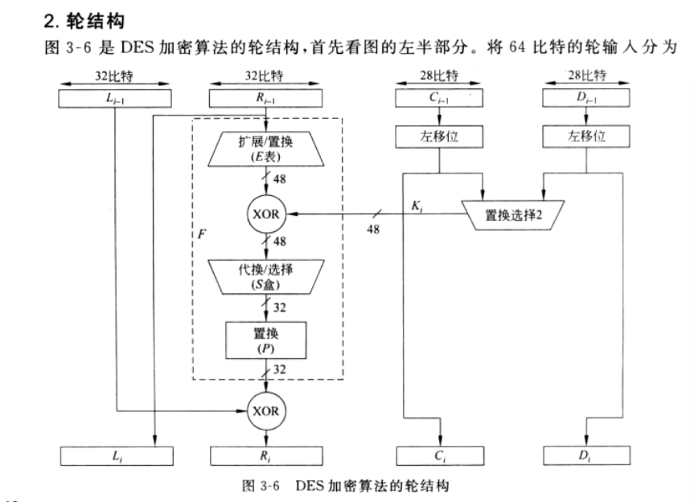

# 单向函数、陷门单向函数

p112

单项函数

# 数学困难问题

# 代换和置换

- 代换：将明文字符替换成其他的字母、数字或符号

  如果明文和密文的分组长都为n比特，则明文的每一个分组都有2^n^个可能的取值。为使加密运算可逆，明文的每一个分组都应产生唯一的一个密文分组，这样的变换是可逆的，称明文分组到密文分组的可逆变换为代换。不同可逆变换的个数有2^n^！个

- 置换：明文的字母相同，但被打乱了

代换密码是将明文字母用不同的密文字母代替，生成的密文中可能有明文未包含的字母，而置换密码是仅仅打乱明文字母的位置和顺序

# 扩散和混淆

# Feistel的公式和图

解密和加密的不同：

# DES（考不细，主要考流程）

明文分组长64比特，密钥长56比特

初始置换

16轮变换

逆初始置换

记一下虚线图

S盒输入输出

二重DES、两个密钥的三重DES、三重DES

# 分组密码的运行模式

要求知道英文名、中文名

# AES

加法、乘法

最后一轮没有列混合

