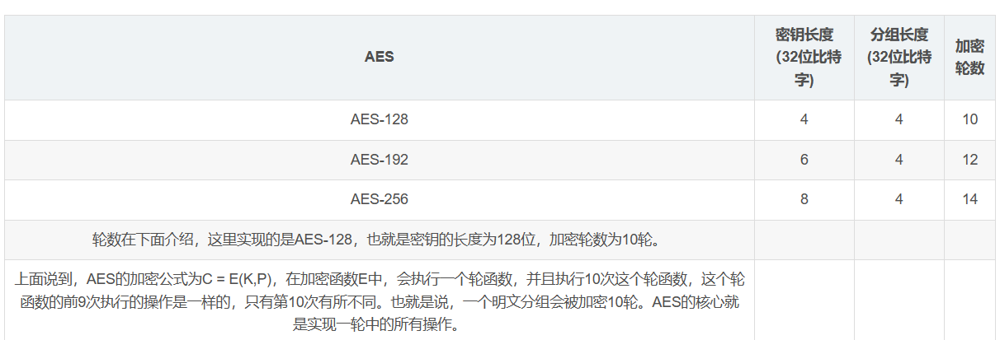
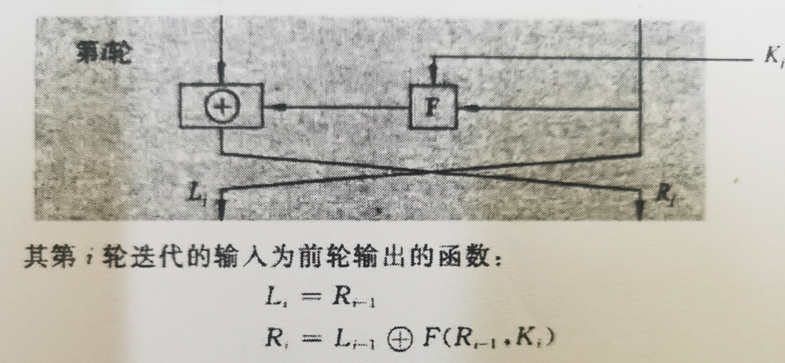
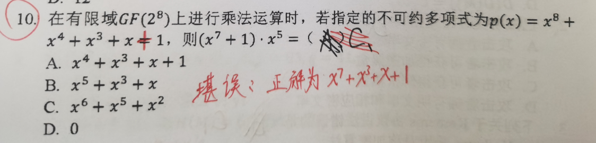
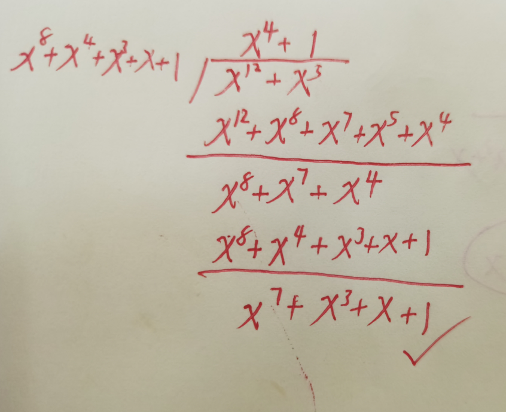
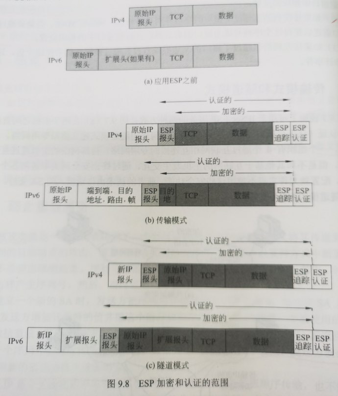

# AES

# Feistel轮结构

# GF(2^8^)上的多项式乘法

# **计算鉴别数据时覆盖AH报文下述字段：**

1. **IP首部（隧道模式下时是外层IP首部）中传输过程中不需改变的字段值，如源和目的IP地址等。**
2. **AH中除鉴别数据以为的其他字段值，如SPI、序号等**
3. **AH报文中的净荷，如果是隧道模式，净荷是包括内层IP首部的整个IP分组。**

