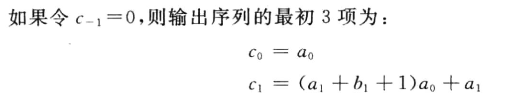
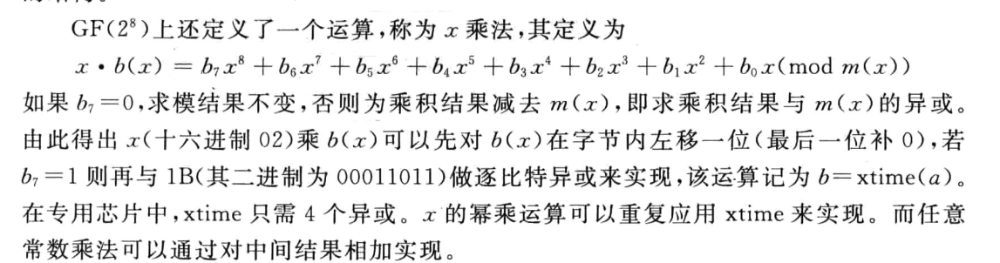
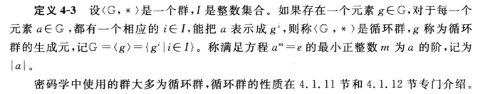
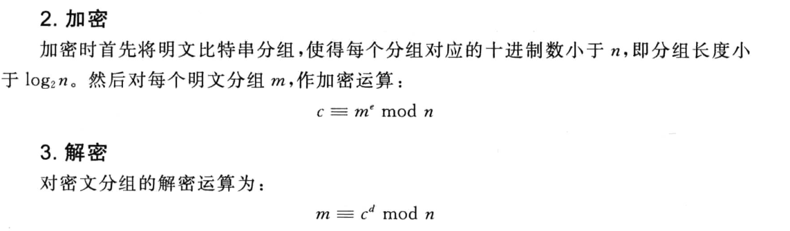
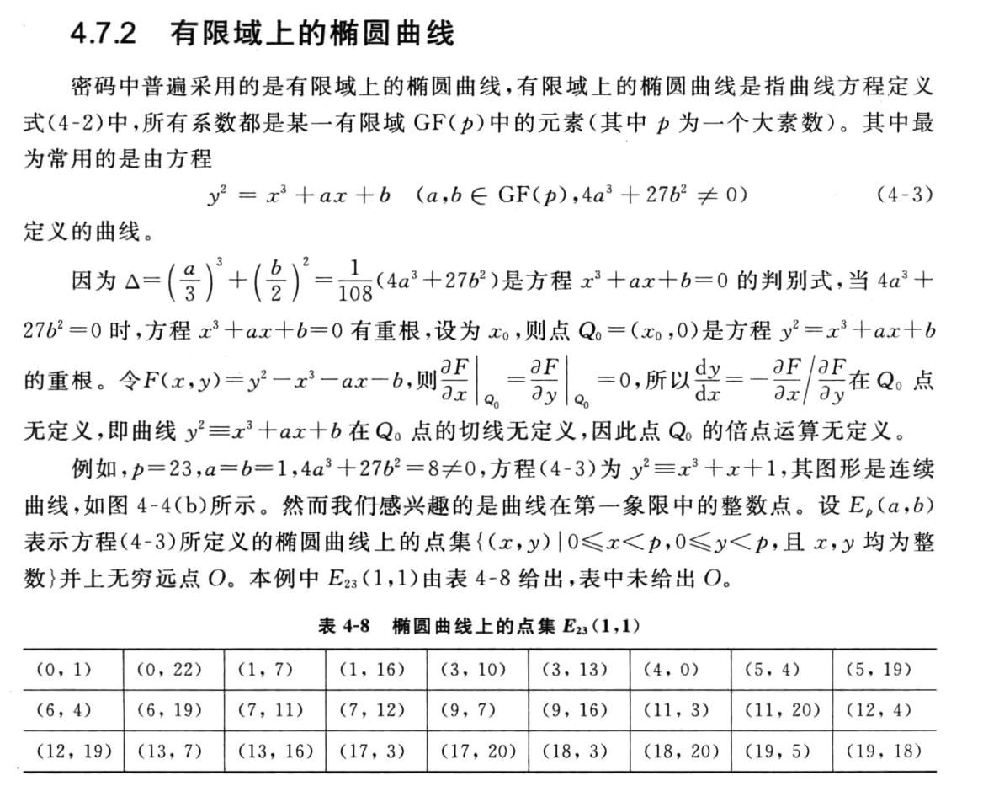
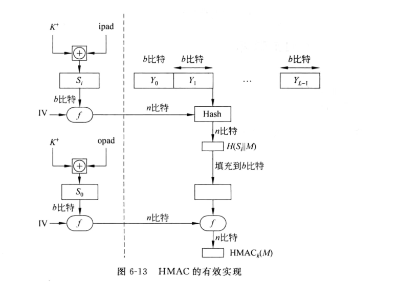
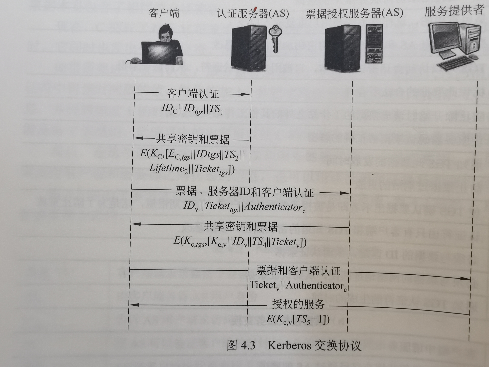

# 欧几里得算法（扩展的）

求最大公因数 求最大公倍数 求逆元

求最大公因数 最大公倍数 也可以分解素因子

# 同余定理P21

# 同余式

# 同余式求解P30

# 第一章

系统的保密性不依赖于对加密体制或算法的保密，而依赖于密钥

明文消息空间、密文消息空间、加密变换、解密变换、密钥空间

密码体制分类：单钥体制、公钥体制

单钥体制：流密码、分组密码。

对密码系统的攻击类型：

1. 唯密文攻击
2. 已知明文攻击
3. 选择明文攻击
4. 选择密文攻击

# 流密码

## 同步流密码

密钥流产生器、加密变换器

抗线性分析、抗统计分析

## 有限状态自动机

初始状态、序列（从左往右）、输出、状态转变，转移图、状态序列、输出序列

## 密钥流产生器

## 线性反馈移位寄存器（LFSR）

周期

n级线性移位反馈寄存器，**m序列：周期等于2^n^-1**

## 线性移位寄存器的一元多项式表示

递推关系。

LFSR的**特征多项式**：p(x)=1+c~1~x+c~2~x^2^+……+c~n-1~x^n-1^+c~n~x^n^

**G(p(x))**：n级线性移位寄存器的非恒零的2^n^-1个递推序列

给定序列{a~i~}，幂级数称为该序列的**生成函数**。

设p(x)=1+c~1~x+c~2~x^2^+……+c~n-1~x^n-1^+c~n~x^n^是GF(2)上的多项式，G(p(x))中任一序列{a~i~}的生成函数A(x)满足

p(x)|q(x)的充要条件G(p(x))⊂G(q(x))

设p(x)是GF(2)上的多项式，使p(x)|(x^p^-1)的最小p称为p(x)的周期或阶

若序列{a~i~}的特征多项式p(x)定义在GF(2)上，p使p(x)的周期，则{a~i~}的周期r|p。

仅能被非0常数或自身的常数倍除尽，但不能被其他多项式除尽的多项式称为即约多项式或不可约多项式

设p(x)是n次不可约多项式，周期为m，序列{a~i~}∈G(p(x))，则{a~i~}的周期为m。

n级LSFR产生的序列有最大周期2^n^-1的必要条件是其特征多项式不可约。

若n次不可约多项式p(x)的阶为2^n^-1，则p(x)是n次 本原多项式。

设{a~i~}∈G(p(x))，{a~i~}为m序列的充分条件是p(x)为本原多项式。

游程

GF(2)上周期为T的序列{a~i~}的自相关函数为

## 非线性序列

### Geffe序列生成器

LFSR~i~的特征多项式分别为n~i~次本原多项式，且n~i~两两互素，则Geffe序列的周期为

### 利用JK触发器的非线性序列生成器

### Pless生成器

### 钟控序列生成器

# 分组密码体制

DES采用56比特密钥、IDEA采用128比特密钥

## 代换

S盒

## 扩散和混淆

目的是抗击敌手对密码系统的统计分析。

扩散，就是将明文的统计特性散布到密文中去，实现方式是使得密文中每一位由明文中多位产生。

扩散的目的是使明文和密文之间的统计关系变得尽可能复杂，以使敌手无法得到密钥。

混淆是使密文和密钥之间的统计关系变得尽可能复杂，以使敌手无法得到密钥。因此即使敌手能得到密文的一些统计关系，由于密钥和密文之间统计关系复杂化，敌手无法得到密钥。使用复杂的代换算法可得预期的混淆效果，而简单的线性代换函数得到的混淆效果不够理想。

## Feistel密码结构

Feistel提出利用**乘积密码**可获得简单的代换密码。乘积密码指顺序地执行两个或多个基本密码系统，使得最后结果的密码强度高于每个基本密码系统产生的结果。

Feistel网络的实现与以下参数和特性有关：
(1)分组大小。分组越大则安全性越高，但加密速度就越慢。分组密码设计中最为普遍使用的分组大小是64比特。
(2)密钥大小。密钥越长则安全性越高，但加密速度就越慢。现在普遍认为64比特或更短的密钥是不安全的，通常使用128比特长的密钥。(3)轮数。单轮结构远不足以保证安全性，多轮结构可提供足够的安全性。典型地，轮数取为16。
(4)子密钥产生算法。该算法的复杂性越高，则密码分析的困难性就越大。
(5)轮函数。轮函数的复杂性越高，密码分析的困难性也越大。

在设计Feistel网络时，还要考虑以下两个问题：
(1)快速的软件实现。在很多情况下，算法是被镶嵌在应用程序中，因而无法用硬件实现。此时算法的执行速度是考虑的关键。
(2)算法容易分析。如果算法能被无疑义地解释清楚，就可容易地分析算法抵抗攻击的能力，有助于设计高强度的算法。

## 数据加密标准（DES）

分组长度64比特
密钥长度56比特

三个阶段：

1. 初始置换IP
2. 16轮变换
3. 逆初始

从而产生64比特的密文。

密钥首先通过一个置换函数，然后，对加密过程的每一轮，通过一个左循环移位和一个置换产生一个子密钥。其中每轮的置换都相同，但由于密钥被重复迭代，所以每轮产生的子密钥都不相同。

### 初始置换

初始置换输入64bit，每一位bit按其位对应表中的数值进行移位，如第1位换到第58位，第二位换到第50位

### 轮结构

扩展将32比特变为48比特。

8个S盒，每个S盒的输入为6比特，输出为4比特。八个S盒一共48比特输入后输出一共32比特。

### 密钥的产生

56比特密钥先经过一个置换运算。

分两部分，进入轮函数，各进行循环左移位，移位位数由表给出，得到的输出①作为下一轮输入；②进行置换选择2后作为本轮子密钥。

### 解密

和Feistel密码一样，DES的解密和加密使用同一算法，但子密钥使用的顺序相反。

### 二重DES

**二重DES产生的映射不会等价于单重DES加密。**

#### 中途相遇攻击

但对二重DES有以下一种称为**中途相遇攻击**的攻击方案，已知明文密文对

### 两个密钥的三重DES

### 3个密钥的三重DES

## 差分密码分析

差分密码分析的基本思想：通过分析明文对的差值对密文对的差值的影响来恢复某些密钥比特。

一种攻击的复杂度可以分为两部分：**数据复杂度**和**处理复杂度**。数据复杂度是实施该攻击所需输人的数据量；处理复杂度是处理这些数据所需的计算量。这两部分主要用来刻画该攻击的复杂度。

## 线性密码分析

线性密码分析是对迭代密码的一种已知明文攻击，它利用的是密码算法中的“不平衡（有效）的线性逼近”。

## 分组密码的运行模式

### 电码本(ECB)模式

一次对一个64比特长的明文分组加密，而且**每次的加密密钥都相同**，

如图3-10所示。当密钥取定时，对明文的每一个分组，都有一个唯一的密文与之对应。因此可以形象地认为有一个非常大的
电码本，对任意一个可能的明文分组，电码本中都有一项与之对应的密文。

如果消息长于64比特，则将其分为长为64比特的分组，最后一个分组如果不够64比特，则需要**填充**。

解密过程也是一次对一个分组解密，而且每次解密都使用同一密钥。

ECB在用于短数据（如加密密钥）时非常理想，因此如果需要安全地传递DES密钥，ECB是最合适的模式。

ECB的最大特性是若同一明文分组在消息中重复出现，则产生的密文分组也相同。

ECB用于长消息时可能不够安全，如果消息有固定结构，密码分析者有可能找出这种关系。例如，如果已知消息总是以某个预定义字段开始，那么分析者就可能得到很多明文密文对。如果消息有重复的元素而重复的周期是64的倍数，那么密码分析者就能够识别这些元素。以上这些特性都有助于密码分析者，有可能为其提供对分组的代换或重排的机会。

### 密码分组链接（CBC）模式

为了解决ECB的安全缺陷，可以让重复的明文分组产生不同的密文分组，密码分组链接(Cipher Block Chaining,CBC)模式就可满足这一要求。
图3-11是CBC模式的示意图，它一次对一个明文分组加密，**每次加密使用同一密钥，加密算法的输入是当前明文分组和前一次密文分组的异或**，因此加密算法的输入不会显示出与这次的明文分组之间的固定关系，所以重复的明文分组不会在密文中暴露出这
种重复关系。
解密时，每一个密文分组被解密后，再与前一个密文分组异或，即：

因而产生出明文分组。
在产生第一个密文分组时，需要有一个初始向量V与第一个明文分组异或。解密时，IV和解密算法对第一个密文分组的输出进行异或以恢复第一个明文分组。

IV对于收发双方都应是已知的，为使安全性最高，**IV应像密钥一样被保护，可使用ECB加密模式来发送IV**。保护IV的原因如下：如果敌手能欺骗接收方使用不同的IV值，敌手就能够在明文的第一个分组中插入自己选择的比特值，这是因为：

用X(i)表示64比特分组X的第i个比特，那么,由异或的性质得：

其中撇号表示比特补。上式意味着如果敌手篡改了IV中的某些比特，则接收方收到的P~1~中相应的比特也发生变化。

由于CBC模式的链接机制，CBC模式对加密长于64比特的消息非常合适。

CBC模式除能够获得保密性外，还能用于**认证**。

### 密码反馈(CFB)模式

如上所述，DES是分组长为64比特的分组密码，但**利用密码反馈(Cipher FeedBack,CFB)模式或输出反馈模式(OFB)模式可将DES转换为流密码**。流密码不需要对消息填充，而且运行是实时的。因此如果传送字母流，可使用流密码对每个字母直接加密并传送。
流密码具有密文和明文一样长这一性质，因此，如果需要发送的每个字符长为8比特，就应使用8比特密钥来加密每个字符。如果密钥长超过8比特，则造成浪费。
图3-12是CFB模式示意图，设传送的每个单元（如一个字符）是j比特长，通常取j=8,与CBC模式一样，明文单元被链接在一起，使得密文是前面所有明文的函数。

加密时，加密算法的输入是64比特移位寄存器，其初值为某个初始向量IV。加密算法输出的最左（最高有效位）j比特与明文的第一个单元P~1~异或，产生出密文的第一个单元C~1~,并传送该单元。然后将移位寄存器的内容左移j位并将C~1~送入移位寄存器最右边（最低有效位）j位。这一过程继续到明文的所有单元都被加密为止。解密时，将收到的密文单元与加密函数的输出进行异或。注意这时仍然使用加密算
法而不是解密算法，原因如下：
设S,(X)是X的j个最高有效位，那么,因此可证明以后各步也有类似的这种关系。

CFB模式除能获得保密性外，还能用于认证。

### 输出反馈（OFB）模式

输出反馈(Output FeedBack,OFB)模式的结构类似于CFB,如图3-l3所示。不同之处如下：**OFB模式是将加密算法的输出反馈到移位寄存器，而CFB模式是将密文单元反馈到移位寄存器。**

OFB模式的优点是**传输过程中的比特错误不会被传播。**例如，C~1~中出现一比特错误，在解密结果中只有P~1~受到影响，以后各明文单元则不受影响。而在CFB中，C~1~也作为移位寄存器的输人，因此它的一比特错误会影响解密结果中各明文单元的值。
OFB的缺点是它**比CFB模式更易受到对消息流的篡改攻击**，例如在密文中取1比特的补，那么在恢复的明文中相应位置的比特也为原比特的补。因此使得敌手有可能通过对消息校验部分的篡改和对数据部分的篡改，而以纠错码不能检测的方式篡改密文。

## AES算法 ----- Rijndael

宽轨迹策略：轮函数中三个层

### 算法说明

迭代型分组密码，分组长度和密钥长度都可变，各自可以独立的指定为**128比特，192比特，256比特**。

### 轮函数

字节代换、行位移、列混合、密钥加

#### 字节代换

非线性代换

代换表（S盒）是可逆的。

#### 行位移

是将状态阵列的各行进行循环位移，不同状态行的位移量不同。第0行不移动，第1行循环左移C~1~个字节，第2行循环左移C~2~个字节，第3行循环左移C~3~个字节。位移量C~1~、C~2~、C~3~的取值与N~b~有关。

#### 列混合

#### 密钥加

### 密钥编排

### 加密算法

### 解密算法

# 公钥密码

## 群环域

半群：封闭性、结合律

群：有单位元、每个元素都有逆元、封闭性、结合律

群的阶：有限群中，G的元素个数

交换群（Abel群）：满足交换律

循环群：

循环群的生成元：

环：

域：

多项式

## 素数

**lcm是最小公倍数**

## 素性检验

AKS算法

## 循环群

## 离散对数

## 公钥密码体制基本概念

一方面，公钥密码算法的基本工具不再是代换和置换，而是数学函数；

另一方面，公钥密码算法以非对称的形式使用两个密钥，两个密钥的使用对保密性、密钥分配、认证等都有着深刻的意义。

### 公钥密码体制的基本原理

公钥密码算法最大的特点是采用两个相关密钥将加密和解密能力分开，其中一个密钥是公开的，称为公开密钥，简称公开钥，用于加密；另一个密钥是为用户专用，因而是保密的，称为秘密密钥，简称秘密钥，用于解密。因此公钥密码体制也成为双钥密码体制。

算法有以下特征：已知密码算法和加密密钥，求解密密钥在计算上是不可行的。

### 加密

### 认证

### 认证与加密

### 公钥密码算法的要求

公钥密码体制目前主要用于 密钥管理 和 数字签字。

## RSA算法

### 密钥的产生

### 加密解密

### 密钥的产生

寻找大素数。

寻找大素数时一般先随机选取一个大的奇数（如用伪随机数产生器），然后用素性检验算法检验这一奇数是否为素数。

RSA的安全性是基于分解大整数的困难性假定

为了保证算法的安全性，还对p和q提出以下要求：

### 对RSA的攻击

RSA存在以下两种攻击，并不是因为算法本身存在缺陷，而是由于参数选择不当造成的。

#### 共模攻击

#### 低指数攻击

由中国剩余定理可求出m^3^(mod n~1~n~2~n~3~)。由于m^3^< n~1~n~2~n~3~，可直接由m^3^开立方根得到m。

## 背包密码体制

## Rabin密码体制

## ElGamal密码体制

## 椭圆曲线

# 密钥分配与密钥管理

KDC：密钥分配中心

密钥的分层控制：分层结构可减少主密钥的分布、还可以将虚假KDC的危害限制到一个局部区域

会话密钥有效期

## 无中心的密钥控制

## 密钥的控制使用

## 公钥加密体制的密钥管理

### 公钥的分配方法

1. 公开发布

2. 公用目录表

   

3. 公钥管理机构

   
   

4. 公钥证书

   
   

### 中间人攻击

### 具有保密性和认证性的密钥分配

## Diffe-Hellman密钥交换

## 秘密分割

设秘密s被分成n个部分信息，每一部分信息称为一个子密钥或影子，由一个参与者持有，使得：①由k个或多余k个参与者所持有的部分信息可重构s；②由少于k个参与者所持有的部分信息则无法重构s。
称这种方案为(k,n)-秘密分割门限方案，k称为方案的门限值。

如果一个参与者或一组未经授权的参与者在猜测秘密s时，并不比局外人猜秘密时有优势，则称这个方案是完善的，即(k,n)-秘密分割门限方案是完善的。

③由少于k个参与者所持有的部分信息得不到秘密s的任何信息。

### Shamir门限方案

基于多项式的Lagrange插值公式。

### 基于中国剩余定理的门限方案

# 消息认证和哈希函数

消息认证是一个过程，用于验证接收消息的**真实性和完整性**，同时还用于验证消息的**顺序性和时间性**。除此之外，在考虑网络安全时还需考虑业务的**不可否认性**。实现消息的不可否认性可通过**数字签字**，数字签字也是一种**认证技术**，也可用于**抗击主动攻击**。

消息认证机制和数字签字极值都有一产生**认证符**的基本功能，这一基本功能又作为认证协议的一个组成部分。认证符是用于认证消息的数值，它的产生方法分为**消息认证码（MAC）、哈希函数（Hash Function）**两大类。

## 消息认证码（MAC）

**消息认证码**是指消息被一个**密钥**控制的公开函数作用后产生的、用作认证符的、固定长度的数值，也称为**密码校验和**。

### 消息认证码的定义及使用方式

通信双方A和B共享一密钥K。设A欲发送给B的消息是M，A首先计算MAC=C~k~(M)，其中C~k~(·)是密钥控制的公开函数，然后向B发送M||MAC，B收到后做与A相同的计算，求得一个新的MAC，并与收到MAC做比较。

通常希望直接对明文进行认证，因此b所示的使用方式更为常用

### 产生MAC函数应满足的要求

穷搜索攻击

产生MAC的函数一般为多到一映射

两种攻击：对密钥的攻击、对消息的攻击

### 数据认证算法

## 哈希函数

**哈希函数**H是一公开函数，用于将任意长的消息M映射为较短、固定的一个值H(M)，作为认证符，称函数值H(M)为**哈希值**或**哈希码**或**消息摘要**。

哈希码是消息中所有比特的函数，因此提供了一种错误检测能力。

**基本使用方法**：

1. 消息与哈希码链接后用单钥加密算法加密。保证消息来自A并且未被篡改，同时还提供保密性。
2. 用单钥加密算法仅对哈希码加密。
3. 用公钥加密算法和发方的秘密钥仅加密哈希码。数字签字。
4. 用公钥加密算法和发方的秘密钥加密后与消息链接，再对链接后的结果用单钥加密算法加密，这种方式提供了保密性和数字签字
5. 使用这种方式时要求通信双方共享一个秘密值S，A计算消息M和秘密值S链接在一起的哈希值，并将此哈希值附加到M后发往B。
6. 比(5)增加单钥加密。

哈希函数应满足的条件：

1. 输入任意长
2. 输出定长
3. 已知x求H(x)较为容易
4. 已知h，求使得H(x)=h的x在计算上是不可行的，单向性
5. 已知x，找出y(y≠x)使得H(x)=H(y)在计算上是不可行的。
6. 找出任意两个不同的输入x、y，使得H(x)=H(y)在计算上是不可行的。

前三个是基本要求

### 生日攻击

#### 相关问题

#### 生日悖论

#### 生日攻击

### 迭代型哈希函数的一般结构

MD5、SHA，结构都是迭代型。

输入分组、填充、最后一个分组还包括整个函数输入的长度值。

压缩函数f

链接分组

## MD5哈希算法

算法的输入为任意长的消息，分为512比特长的分组，输出为128比特的消息摘要。

### 处理过程

#### 1、对消息填充

对消息填充，使得其比特长度**在模512下为448**，即填充后消息的长度为512的某一倍数减64，留出的64比特用于附加消息的长度使用。

**即使消息的长度已经满足要求，仍需填充。**例如，消息长度为448，则需填充512比特，使其长度变为960，因此填充的比特数大于等于1而小于等于512。

填充方式：**第一位为1，其后各位皆为0。**

#### 2、附加消息的长度

用步骤一中留出的64比特以**小端方式**来表示消息被填充前的长度。如果消息长大于2^64^，则以2^64^为模数取模。

小端方式是指数据按最低有效字节（byte）（或最低有效位）优先的顺序存储数据，即将**最低有效字节（或最低有效位）存于低地址字节（或位）**。相反的存储方式为大端方式。

#### 3、对MD缓冲区初始化

算法使用128比特长的缓冲区以存储中间结果和最终哈希值，缓冲区可表示为4个32比特长的寄存器（A，B，C，D），每个寄存器都以小端方式存储数据，其初值取为（以存储方式）A=01234567、B=89ABCDEF、C=FEDCBA98、D=76543210，实际上为67452301，EFCDAB89、98BADCFE、10325476

#### 4、以分组为单位对消息进行处理（4轮*16步迭代）

每一分组Y~q~（q=0，···，L-1）都经过一压缩函数H~MD5~处理。H~MD5~是算法的核心，其中又有**4轮处理**过程，如图6-7。

#### 5、输出

消息的L个分组都被处理完后，最后一个H~MD5~的输出即为产生的消息摘要。

#### 总结：

### MD5的压缩函数

压缩函数H~MD5~中有4轮处理过程，每轮又对缓冲区ABCD进行**16步迭代**运算，每一步的运算形式如下：

## 安全哈希算法 SHA

基于MD4算法

### 算法描述

算法的输入为小于2^64^比特长的任意消息，分为512比特长的分组，输出为160比特长的消息摘要。

算法的框图与MD5的算法图一样，但哈希值的长度和链接变量的长度为160比特。

### 算法的处理过程有以下几步：

#### 1、对消息的填充。

与MD5的步骤1完全相同

#### 2、附加消息的长度。

与MD5的步骤2类似，不同之处在于以大端方式表示填充前消息的长度。即步骤1留出的64比特当做64比特长的无符号整数。

#### 3、对MD缓冲区初始化。

算法使用160比特长的缓冲区存储中间结果和最终哈希值，缓冲区可表示为5个32比特长的寄存器（A，B，C，D，E），每个寄存器都以大端方式存储数据，其初始值为A=67452301，B=EFCDAB89，C=98BADCFB，D=10325476，E=C3D2E1F0。

#### 4、以分组为单位进行处理。（4轮*20步迭代）

#### 5、输出。

消息的L个分组都被处理完成后，最后一个分组的输出即为160比特的消息摘要

#### 总结

### SHA的压缩函数

### SHA与MD5比较

## HMAC

基于密码哈希函数的构造方法

在IPSec和其他网络协议（如SSL）中得以应用。

#### 安全性

## CBC-MAC 算法

# 数字签名和认证协议

## 数字签名产生方式

### 一、由加密算法产生数字签名

利用加密算法产生数字签名是指将消息或消息的摘要加密后的密文作为对该消息的数字签名，其用法有根据单钥加密还是公钥加密有所不同。

### 二、由签名算法产生数字签名

## 数字签名的执行方式

### 1、直接方式

直接方式是指数字签名的执行过程只有通信双方参与，并假定双方有共享的秘密钥或接收一方知道发送方的公开钥。

### 2、具有仲裁方式的数字签名

发送方X对发往收方Y的消息签名后，将消息及其签名先发给仲裁者A，A对消息及其签名验证完毕后，再连同一个表示已通过验证的指令一起发往接收方Y。

仲裁者起着重要作用，并应取得所有用户的信任。

#### 例7-1

#### 例7-2

#### 例7-3

## 数字签名标准DSS

### DSS的基本方式

RSA算法既能用于加密和签名又能用于密钥交换，与RSA算法相比DSS使用的算法只提供数字签名功能，

采用RSA签名时，将消息输入到一个哈希函数以产生一个固定长度的安全哈希值，再用发送方的秘密钥加密哈希值就形成了对消息的签名。消息及其签名被一起发送给接收方，接收方得到消息后再产生出消息的哈希值，且使用发送方的公开钥对收到的签名解密。这样接收方就得到了两个哈希值，如果两个哈希值是一样的，则认为收到的签名是有效的。

DSS签名也是利用一个哈希函数产生消息的一个哈希值，哈希值连同一随机数k一起作为签名函数的输入，签名函数还需使用发方的秘密钥SK~A~和供所有用户一起使用的一组参数，这一组参数称为全局公开钥PK~G~。签名函数的两个输出s和r就构成了消息的签名(s,r)。接收方收到消息后再产生出消息的哈希值，将哈希值与收到的签名一起输入验证函数，验证函数还需输入全局公开钥PK~G~和发送方的公开钥PK~A~。验证函数的输出，如果与收到的签名成分r相等则验证了签名是有效的。

### 数字签名算法DSA

## RSA签名体制

## 基于离散对数的签名体制

### ElGamal签名体制

### Schnorr签名体制

## 认证协议

### 相互认证

保证实时性常用方法：时间戳、询问-应答

其中时间戳法不能用于面向连接的应用程序。

询问-应答方式不适合于无连接的应用过程。

通信双方建立共享密钥时可采用单钥加密体制和公钥加密体制

#### 单钥加密体制

#### 公钥加密体制

### 单向认证

#### 单钥加密 

#### 公钥加密

# 密钥分配和用户认证

认证方法：

- 用户个人知道的某事：例子包括密钥、个人验证码，预先安排的一系列问题的答案。
- 用户个人拥有的某种东西：例子包括密钥、电子钥匙卡、智能卡、物理钥匙。这种类型的身份验证器称为**令牌**
- 用户个人的某种东西（不变的生物特征）：包括指纹识别、视网膜识别、人脸识别等例子
- 用户个人的某种特别属性（后天生物特征）：包括声音模式识别、手写特征识别、打字节奏识别。

## 基于对称加密的密钥分配

对于对称加密，加密双方必须共享同一密钥

对于A、B双方有下列选择：

1. A能够选定密钥并通过物理方法传递给B
2. 第三方可以选定密钥并通过物理方法传递给A和B
3. 如果A和B不久之前使用过一个密钥，一方能够把使用旧密钥加密的新密钥传递给另一方。
4. 如果A和B各自有一个到达第三方C的加密链路，C能够再加密链路上传递密钥给A和B。

对于4，需要用到两种类型的密钥：

- 会话密钥：当两个端系统（主机、终端等等）希望通信，他们建立一条逻辑连接(如，虚电路)。再逻辑连接持续过程中，所有用户数据都使用一个一次性的会话密钥加密。再会话或连接结束时，会话密钥被销毁。
- 永久密钥：永久密钥在实体之间用于分发会话密钥。

对于4，需要一个密钥分发中心（KDC）。

### 集中式密钥分配

### 分布式密钥分配过程

Diffe-Hellman密钥交换算法同步密钥过程

## Kerberos

Kerberos是一种认证服务。

Kerberos要解决的问题是：假设在一个开放的分布式环境中，工作站的用户希望访问分布在网络各处的服务器上的服务。希望服务器能够将访问权限限制在授权用户范围内，并且能够认证服务请求。在这个环境中，一个工作站无法准确判断它的终端用户以及请求的服务是否合法。特别是以下三种威胁：

1. 用户可能进入一个特定的工作站，并假装成其他用户操作该工作站。
2. 用户可能改变一个工作站的网络地址，从该机上发送伪造的请求。
3. 用户可能监听信息或者使用重放攻击，从而获得服务或者破坏整行操作。

利用集中的认证服务器来实现用户对服务器的认证和服务器对用户的认证。

Kerberos仅依赖于对称加密体制。

### Kerberos版本4

利用**DES**来提供认证服务

认证服务器（AS），它知道所有用户的口令，并把他们存储在集中式数据库中。此外，AS与每个服务器之间共享一个独立密钥。这些密钥已经从物理途径或其他安全途径进行了分发。

票据授权服务器（TGS）

Ticket：票据，可重用

Authenticator：认证符，只能使用一次，而且有效期非常短

票据并不证明任何人的身份，它只是安全分发密钥的一种方法。正是认证符证实了客户端的身份。

### Kerberos域和多重Kerberos

一个提供全套服务的Kerberos环境包括一台Kerberos服务器、若干客户端和若干应用服务器。这个环境有如下要求：

1. Kerberos服务器的数据库中必须存有所有参与用户的ID和经过散列函数处理的口令。所有用户都要在Kerberos服务器上注册。
2. Kerberos服务器必须和每个服务器共享一个秘密密钥。所有的服务器都要在Kerberos上注册。

这种环境被称为Kerberos域。对于域的概念可以做如下解释。一个Kerberos域是共享同一个Kerberos数据库的一组受控节点。Kerberos数据库驻存于Kerberos主计算机系统中，它应该被放在一个物理上安全的房间中。一个只读的Kerberos数据库副本也可能驻存于其它的Kerberos计算机系统中。但是，所有对数据库的更改必须在主计算机系统中进行。改变或访问Kerberos数据库的内容需要Kerberos主口令。一个相关的概念是Kerberos主体。Kerberos主体是对Kerberos系统已知的服务或用户。每个Kerberos主体由其主体名标识。主体名由三部分组成：一个服务或用户名、一个实例名和一个域名。

在不同监管组织下的用户端/服务器网通常组建为不同的域。这样，让一个监管组织下的用户和服务器在其他地方的Kerberos服务器上注册是不现实的，或者是不符合监管策略的。然而，一个域中的用户可能需要访问其他域中的服务器，而且一些服务器也愿意为其他域的用户提供服务，只要它们是被认证过的。

### Kerberos版本5

版本4的环境不足：

1. 加密系统依赖性：版本4使用DES。在版本5中，密文被标记上加密类型标识，这使得可以使用任何类型的加密技术。加密密钥被标记上类型和长度，这就允许可以在不同的算法中使用相同的密钥，也允许在一个给定的算法中具有不同的规定。
2. 互联网协议依赖性：版本4需要使用互联网协议（IP）地址。其他类型的地址（比如ISO网络地址）不受支持。版本5的网络地址被标记上类型和长度，使得任何类型的网络地址都可以使用。
3. 消息字节排序：在版本4中，消息的发送方采用一种自己选择的字节排序，并对消息进行标注，以表明最低地址中的最低有效字节或最低有效地址中的最高有效字节。这种技术是可行的，但是它不符合已经形成的惯例。在版本5中，所有的消息结构都使用抽象语法表示法（ASN.1）和基本编码规则（BER），这两个标准提供了清晰的字节排序。
4. 票据有效期：版本4中的有效期由一个8比特的值来编码，并以5分钟为一个基本单位。这样，可以表示的最长有效期为2^8^*5=1280分钟，即21个小时多一点。这对某些应用来说是不够用的（比如一个在整个运行过程中需要合法Kerberos证书的运行时间很长的仿真）。在版本5中，票据有明确的开始时间和结束时间，这使得票据可以有任意的有效期。
5. 认证转发：版本4不允许将发给一个客户端的证书转发给其他主机，并由其他客户端使用。而这种功能可以使得一个客户端访问一台服务器，并让那个服务器以客户端的名义访问另一台服务器。例如，一个客户端访问一个打印机服务器，然后打印机服务器使用客户端的名义访问文件服务器中该客户端的文件。版本5提供了这种功能。
6. 域间认证：在版本4，如前所述，N个域中的互操作需要N^2^阶的Kerberos-Kerberos关系。版本5支持一种需要较少关系的方法。

版本4的技术缺陷：

1. 双重加密：向客户端提供的票据都经过双重加密，一次是被目标服务器的秘密密钥加密，另一次是被客户端所知道的秘密密钥加密。第二次加密是不必要的，这回造成计算上的浪费。
2. PCBC加密：版本4中的加密使用一种非标准的DES加密模式，这种模式为传密码分组链接（PCBC）。这种模式被证明是易受包含交换密码块的攻击方法攻击的。使用PCBC模式是想提供完整性检查作为加密操作的一部分。版本5提供了明确的完整性机制，这样就可以使用标准的CBC模式来加密。特别地，在进行CBC模式加密之前，将把一个校验和或散列码附加在消息中。
3. 会话密钥：每个票据都会包含一个会话密钥，它被客户端用来加密送给与票据相关联的服务的认证符。另外，会话密钥可能在后来，由客户端和服务器用来保护会话中传送的消息。但是，由于同一个票据可能被重用来获得一个特定服务器上的服务，这就存在攻击者重放先前与客户端或与服务器的会话的风险。在版本5中，客户端和服务器可以协商得到子会话密钥，子会话密钥只在那次连接中使用。客户端新的访问将会导致使用新的子会话密钥。
4. 口令攻击：两个版本都容易受口令攻击。由AS发给客户端得消息包括用基于客户端口令得密钥加密过的内容。攻击者可以截获这个消息，并试图用不同得口令解密它。如果试验解密的结果具有适当的形式，则攻击者旧发现了客户端口令，并且以后可以用其从Kerberos服务器取得认证证书。在版本5中的确提供了一种称为预认证的机制，这使得口令攻击更加困难，但它不能杜绝这种攻击。

## 基于非对称加密的密钥分配

公开密钥加密算法密钥分发原则如下

1. 成对生成加密密钥和解密密钥

   加密密钥和解密密钥是一一对应的，用加密密钥加密的密文只能通过对应的解密密钥解密。因此，需要成对生成加密密钥和解密密钥。

2. 公告加密密钥、保密解密密钥。

   所有需要向指定接收者传输密文的发送者，可以用同一个加密密钥对明文进行加密运算。如果只有该接收者知道解密密钥，则只有该接收者能够解密所有发送者发送的密文。因此加密密钥可以通过有公信力的媒介公告，解密密钥必须只有密文接收者知道。

3. 需要证明密文接收者与加密密钥之间的关系。

   接收者A为了能够解密发送者发送给接收者B的密文，生成一对密钥PKA和SKA，并将加密密钥PKA作为接收者B的加密密钥予以公告。当发送者需要向接收者B传输密文时，错误地用PKA对明文进行加密运算。由于只有接收者A知道加密密钥PKA对应地解密密钥SKA，因此，接收者A可以解密发送者用PKA加密地密文。因此，为了防止某个接收者通过冒充其他接收者公告加密密钥地情况，加密密钥与密文接收者之间的绑定关系必须得到有公信力的权威机构的证明。

### 公钥证书

公钥证书由公钥加上公钥所有者的用户ID以及可信的第三方签名的整个数据块组成。

通常第三方就是用户团体所信任的**认证中心（CA）**,如政府机构或金融机构。用户可通过安全渠道把用户的公钥提交给这个CA，获取证书。然后用户就可以发布这个证书。任何需要该用户公钥的人都可以获取这个证书，并且通过所附的可信签名验证其有效性。

人们广泛接受的公钥证书格式是X.509标准。其应用于大多数的网络安全设施，包括IP安全、安全套接字层（SSL)、安全电子交易（SET)和S/MIME。

### 基于公钥密码的秘密密钥分发

### X.509证书

ITU-T推荐标准X.509是X.500推荐标准系列的一部分，X.500系列推荐标准定义了一套目录服务。所谓目录服务，实际上是指用于维护用户信息数据库的一个或一组分布式服务器。这些信息包括从用户名到网络地址的映射关系，以及其他关于用户的属性和信息。

X.509定义了一个使用X.500目录向其用户提供认证服务器的框架。该目录可以作为公钥证书存储库。每个证书都包括用户的公钥，并由一个可信任的认证中心用私钥签名。除此之外，X.509定义了另一个基于使用公钥证书的认证协议。

X.509基于公钥加密体制和数字签名的使用。这个标准并没有强制使用某个特定的数字签名算法，也没有规定特点的散列函数。

X.509方案的核心是与每个用户相关联的公钥证书。这些用户证书是由可信任的认证中心（CA）创建的，并由CA或用户放在目录中。目录服务器本身不负责公钥的产生和认证功能；它置为用户获取证书提供一个容易访问的场所。

### X.509版本3

版本2没有满足以下要求

## 两种密钥体制的结合

## 公钥基础设施（PKI）

公钥基础设施（PKI）：定义为基于非对称密码体制的用来生成、管理、存储、分配和撤销数字证书的一套硬件、软件、人员、策略和过程。

目标是使安全、方便和高效获取公钥成功的可能。

### PKIX架构模型

- 端实体：一个用来表示终端用户、设备(比如服务器和路由器)或者任何其他的可以在公钥证书的主体域被确定身份的实体的通用术语。端实体一般采用和/或支持与PKI相关的服务。
- 认证中心(CA)：证书的发放者，通常也是撤销证书列表(CRL)的发放者。他还可能支持很多管理功能，虽然这些一般是由一个或多个注册中心代理。
- 注册中心(RA)：一个可选的部分，它承担很多从CA处继承的管理功能。经常将RA与端实体注册过程关联起来，但是也可以协助许多其他领域的工作。
- CRL发放者：一个可选的部分，它可以代理CA发布CRL
- 存储库：一个用来表示存储证书和CRL以使证书和CRL可以被端实体检索的任何方法的通用术语。

### PKIX管理功能

- 注册：这是一个过程，用户通过该过程在CA向其发放证书（一个或几个）之前，先让CA知道自己（直接或通过RA）。注册开始了一个PKI中的登记过程。注册通常包括一些离线或在线的步骤来相互认证。一般来说，为将来认证使用的一个和多个共享秘密密钥被发放给端实体。
- 初始化：在客户端可以安全 工作之前，需要安装密钥资料，这些密钥资料与存储在基础设施其他地方的密钥具有一定的关系。例如，客户端需要被安全地初始化，这需要使用公钥以及其他可信CA（一个或多个）担保的、将被用于验证证书路径的信息。
- 认证：这是一个过程，这个过程中，CA为一个用户的公钥发放一个证书，并将该证书返回给用户的客户端系统和/或将次证书存放在一个储存库中。
- 密钥对恢复：密钥对可用来支持数字签名的产生和验证，或者可用来支持加密和解密，或者两者都支持。如果一个密钥使用来加密和解密的，那么当不再能以通常的方式访问密钥资料时，提供一种机制来恢复解密密钥就是非常重要的，否则，就不可能恢复加密的数据。不能访问解密密钥可能由以下情况导致：忘记口令/PIN码、磁盘驱动损坏、硬件标记损坏等。密钥对恢复功能允许端实体从一个被授权的密钥备份设施（通常是给端实体发放证书的CA）处恢复它们的加密/解密密钥对。
- 密钥对更新：所有密钥对都需要定期更新（例如用一个新的密钥对代替），并且发放新证书。当证书过期或证书被撤销时，就需要更新。
- 撤销申请：一个经过授权的人告诉CA发生了一个异常情况，需要撤销证书。撤销证书的原因包括私钥泄露，合作方变化和名称改变。
- 交叉认证：两个CA相互交换用于建立交叉证书信息。一个交叉证书是一个CA给另一个CA发放的证书，证书中包含一个CA用于发放证书的签名密钥。

### PKIX管理协议

证书管理协议（CMP）

证书管理消息（CMC）

# 传输层安全

Web安全需求

提供Web安全的一种方法是使用IPSec，另一种更一般的解决方案是仅在TCP上实现安全。

## 安全协议

功能：

1. 双向身份验证

   基于共享密钥身份鉴别和基于证书身份鉴别

2. 数据加密

3. 数据完整性检测

4. 防重放攻击机制

   一是发送端为每一个不同的报文设置不同的序号，接收端丢弃序号重复的报文。

   二是接收端设置序号窗口，接收端只有接收到序号属于序号窗口的报文时，才处理该报文，否则丢弃该报文。

## 传输层安全（TLS）

**传输层安全(TLS)**是广泛使用的一种安全服务；
TLS是一种Internet标准，它是从称为**安全套接字层(SSL)**的商业协议发展而来的。

TLS是一种通用服务，是依赖TCP实现的一组协议。

### TLS体系结构

TLS使用TCP提供一种可靠的端对端的安全服务。

TLS不是单个协议，它由两层协议组成。

**<u>TSL记录协议</u>**对各种更高层协议提供基本的安全服务。尤其是，超文本传输协议（HTTP）是为Web客户端/服务器的交互提供传输服务的协议，它可以在TLS的顶层允许。

TSL中定义的三个较高层协议分别是：握手协议、修改密码规格协议、报警协议。这些协议规范用来管理TLS交换。

心跳协议

TLS连接：连接是一种能够提供合适服务类型（按照OSI分层模型定义）的传输。对TLS来说，这种连接是点对点的关系而且都是短暂的。每一条连接都与一个会话相关联。

TLS会话：TLS会话是客户与服务器之间的一种关联。会话是通过握手协议来创建的。所有会话都定义了密码安全参数集合，这些参数可以在多个安全连接之间共享。会话通常用来减少每次连接建立安全参数的昂贵协商费用。

# IPSec

## IPSec的应用

IPSec是网际层实现IP分组端到端安全传输的机制，由一组安全协议组成。**鉴别首部（AH）**、**封装安全净荷（ESP）**是其中两个协议，AH和ESP均实现IP分组源端鉴别和防重放攻击等功能，二者的差别是，AH只实现数据完整性检测，ESP实现数据加密和完整性检测。

为了是实现安全关联的动态建立过程，设计了**Internet密钥交换协议（IKE）**，IKE用于完成安全关联两端之间的双向身份鉴别过程和安全关联相关安全参数的协商过程。

IPSec提供了在LAN、专用和公用WAN以及互联网中安全通信的性能。它的用途包括：

- 通过互联网安全分支机构接入：一个公司可以在互联网或者公用WAN上建立一个安全的**虚拟专用网络**。这使得强烈依赖互联网的交易称为可能，并减少了对专用网络的需求，节约了成本和网络管理的费用。
- 通过互联网进行安全远程访问：这使得使用IPSec协议的终端用户能通过在本地向互联网服务提供商(ISP)提出申请，以获得对公司网络的安全访问。这样就降低了出差员工和远程通信者的费用。
- 与合作者建立企业间联网和企业内联网接入：可以使用IPSec实现和其他组织的安全通信，确保认证和保密，并提供密钥交换机制。
- 加强电子商务安全性：虽然一些Web和电子商务应用建立在内置的安全协议上，但是使用IPSec可以提高安全性。

IPSec网络设备一般对进入WAN的所有流量进行加密、压缩，对来自WAN的所有流量进行解密和解压缩。

### IPSec的好处

- 当在路由器和防火墙中使用IPSec时，它对通过其边界的所有通信流提供了强安全性。公司或者工作组内部的通信不会引起与安全相关的开销。
- 防火墙内的IPSec能在所有的外部流量必须使用IP时组织旁路，因为防火墙是从互联网进入组织内部的唯一通道。
- IPSec位于传输层（TCP、UDP）之下，所以对所有应用都是透明的。因此当防火墙或者路由器使用IPSec时，没有必要对用户系统和服务器系统的软件做任何改变。即使终端系统中使用IPSec，上层软件和应用也不会受到影响。
- IPSec可以对终端用户透明的。不需要对用户进行安全机制的培训，如分发基于每个用户的密钥资料，或在用户离开组织时撤销密钥资料。
- 若有必要，IPSec能给个人用户提供安全性。这对网外员工非常有用，它对在敏感的应用领域中组建一个安全虚拟子网络也是有用的。

### 路由应用中的IPSec

IPSec在互联网的路由结构中扮演着非常重要的角色。IPSec可确保：

- 路由器广播（新的路由器公告它的存在）来自授权的路由器。
- 邻居广播（路由器试图建立或维护与其他路由区域中路由器的邻居关系）来自授权的路由器。
- 重定向报文，它来自被发送给初始包的路由器
- 路由更新未被伪造

没有上述安全措施，攻击者可能会中断通信或者转发某些流。路由协议（比如开放最短路径优先OSPF）应该运行在由IPSec定义的路由器间安全关联的最上层。

### IPSec服务

IPSec包括三种功能：认证、机密性、密钥管理

如下服务：

- 访问控制
- 无连接完整性
- 数据源认证
- 拒绝重放包
- 保密性（加密）
- 受限制的流量保密性

## IP安全策略、安全关联

IP安全策略本质上由两个交互的数据库，**安全关联数据库（SAD）**和**安全策略数据库（SPD）**确定。

### 安全关联(SA)

定义：为了实现数据发送者至接收者的安全传输，需要建立发送者与接收者之间的关联，这种以实现源端鉴别、数据加密和完整性检测为目的的关联称为**安全关联**

安全关联是**单向的**，用于确定发送者至接收者传输方向的安全传输过程所使用的加密算法和加密密钥、消息鉴别码(MAC)算法、MAC密钥等

如果某对发送者和接收者之间需要安全传输数据，必须先建立发送者至接收者的安全关联。

一个安全关联由如下三个参数唯一确定：

1. **安全参数索引（SPI）**：赋给此SA的一个仅在本地有意义的比特串。**此SPI由AH和ESP报头携带**，使得接收系统能选择合适的SA（接收到的数据包将在此SA下处理）
2. **IP目的地址**：目前仅允许使用单播地址，这是SA的**目的端点地址**，可以是终端用户系统或者防火墙、路由器这样的网络系统。
3. **安全协议标识**：它标识关联是一个AH安全关联还是一个ESP安全关联

具有相同接收者的安全关联（目的IP地址相同的安全关联）需要分配不同的SPI。

**安全协议标识符** 指定该安全关联使用的安全协议，目前已经定义的安全协议有只对数据进行完整性检测的鉴别首部(AH)和对数据进行加密和完整性检测的封装安全净荷(ESP)协议。

### 建立数据与安全关联之间的绑定

发送者如果需要安全传输数据给接收者，必须先确定用于安全传输数据的安全关联，同一对发送者和接收者之间可以建立多个安全关联，因此，发送者不能简单通过数据的接收者建立安全关联。数据的目的地和安全关联的目的地可以不同。为此，发送者需要通过定义**安全策略数据库（SPD）**来判别数据传输所使用的安全策略。

SPD的目的是将数据分类，然后对不同的数据施加不同的安全策略，这些安全策略可以是丢弃、使用IPSec和不使用IPSec。如果某类数据的安全策略是使用IPSec，需要将该类数据绑定到某个安全关联，如果该安全关联不存在，则需要动态建立安全关联。

分类数据的依据是数据的源和目的IP地址、数据所使用传输层协议、传输层源和目的端口号、传输数据使用的安全协议、数据所要求的服务类型等。

### **安全关联数据库(SAD)**

所有安全关联相关参数集合构成**安全关联数据库(SAD)**，它定义了与每个SA相关的参数。

每一个安全关联需要定义以下参数：

- 安全参数索引（SPI）：由SA接收方选定的一个32比特数值，用于唯一标识该SA。在一个外联型SA的SAD实体中，该SPI用于构造包的AH或ESP的头。在一个内联型SA实体中，该SPI把流量映射到相应的SA。
- 序号：32位长度、作为AH或ESP首部中序号字段值，用于防止重放攻击。在安全关联存在期间，不允许出现相同序号的AH或ESP报文。
- 序号计数器溢出：这是一个标识，它用来表明序列号计数器的溢出是否生成一个可审计事件并阻止在此SA上继续传输数据包。
- 防重放攻击窗口：用于确定接收到的AH或ESP报文是否是重放报文
- AH信息：消息鉴别码(MAC)算法，MAC密钥，MAC密钥寿命，及其他用于AH的参数。
- ESP信息：加密算法和加密密钥，MAC算法和MAC密钥，初始值，密钥寿命，及其他用于ESP的参数。
- 安全关联寿命：可以是一段用于确定安全关联存在时间的时间间隔，也可以是安全关联允许发送的字节数。一旦安全关联经过了安全关联寿命定义的时间间隔，或是发送了安全关联寿命允许发送的字节数，将立即终止该安全关联。
- IPSec协议模式：传输模式、隧道模式、通配符模式
- 路径最大传送单元（MTU）：不用分段可以在安全关联绑定的发送端和接收端之间传输的最大分组长度。

### 安全策略数据库（SPD）

IP流量与特定的SA关联（不需要IPSec保护时没有SA）的方法在名义上是安全策略数据库（SPD）。

在最简单的情况下，一个SPD应该包括入口，每个入口都定义了一个IP流量子集并未该流量指向一个SA。
在更复杂的情况下，多个入口可以与一个SA相关，或者多个SA与一个SPD入口相关。

每个SPD入口由一个IP集和上层协议的域值定义，称为**选择器**。实际上，这些选择器用于过滤输出流，这是为了将流量映射到一个特定的SA。每个IP包的输出过程遵循下面的一般顺序：

1. 将包中相应域的值（选择器）与SPD比较，找到一个匹配的SPD入口，它可能指向零个或者多个SA。
2. 若该包存在SA，则为改包确定SA以及与其关联的SPI
3. 执行所需的IPSec处理（如AH或ESP处理）

SPD入口由以下选择器决定：

- 远程IP地址：可以是单一的IP地址、一个枚举列表、一个地址范围或一个通配符（掩码）地址。后两者需要支持多个目的地系统共享一个SA（例如，位于防火墙之后）。
- 本地IP地址：可以是单一的IP地址、一个枚举列表、一个地址范围或一个通配符（掩码）地址。后两者需要支持多个目的地系统共享一个SA（例如，位于防火墙之后）。
- 下层协议：该IP协议头（IPv4、IPv6、IPv6扩展）包括一个域（对IPv4就是协议，对IPv6或其扩展是下一个头），该域规定了IP层上的协议操作。这是一个单独的协议号，可以是任何数，但是对IPv6不透明。如果使用AH或ESP，则该协议头必须立即置于包中该AH或ESP头的前面。
- 名称：来自操作系统的用户标识。在IP层或者更上层报头中它不是一个域，但若IPSec和用户处于同一操作系统，此域就是可获得的。
- 本地和远程端口：可以是单个TCP或UDP端口值、端口枚举列表或一个通配符端口。

SPD中的实体需要是自解释的。例如，UDP端口500是IKE的特定端口。为了IKE交换而在当地主机和远程主机之间的任何通信要通过IPSec进程。

### IP通信进程

IPSec实在报文到报文的基础上执行的。

当IPSec执行时，发往外部的IP包在传送前经过IPSec逻辑的处理，而发往内部的IP包在接收之后并且发送报文内容到更高层之前（例如TCP或UDP）经过IPSec逻辑的处理。

**出站报文**：

来自高层的数据块，传输到IP层并形成IP包，报文包含IP头和IP数据体，然后发生以下步骤：

1. IPSec查询SPD对该报文寻找匹配。
2. 如果没有匹配，报文被丢弃并生成错误信息。
3. 如果发现匹配，则进一步的处理由SPD的第一个匹配接口决定。如果对该报文的策略是丢弃，则该报文被丢弃。如果策略是通过，则没有进一步的IPSec处理；报文传向网络以便发送。
4. 如果策略是保护，则查询SAD来寻找匹配接口。如果没有发现接口，则引入IKE生成具有合适密钥的SA，并在SA上产生接口。
5. SA上的匹配接口决定报文的进一步处理。对报文加密或认证，或者二者都被执行，并且既可以使用传输模式，也可以使用隧道模式。报文传向网络以便发送。

**入站报文**

一个到来的IP包引起IPSec进程，并发生以下步骤：

1. 通过检测IP协议域（IPv4）或者下一个头域（IPv6），IPSec决定这是一个不安全的IP包还是一个有ESP或者AH头/尾的报文
2. 如果报文不安全，IPSec查询SPD为该报文寻找匹配。如果第一个匹配接口的策略是通过，则IP头经过处理后被剥离，而IP数据体传输到更高层（如TCP）。如果第一个匹配接口的策略是保护或者丢弃，或者没有匹配接口，则报文被丢弃。
3. 对应安全报文，IPSec查询SAD。如果没有匹配，报文被丢弃。否则，IPSec使用合理的ESP或者AH进程。然后IP头经过处理后被剥离，而IP数据体传输到更高层。

## 传输模式和隧道模式

### 传输模式

传输模式用于保证数据端到端安全传输，并对数据源端进行鉴别，在这种模式下，IPSec所保护的数据就是作为IP分组的净荷的上层协议数据，如TCP、UDP报文和其他基于IP的上层协议报文。安全关联建立在数据源端和目的端之间。

### 隧道模式

安全关联的两端是隧道的两端。

在这种模式下，连接源端和目的端的内部网络被一个公共网络分隔，由于内部网络使用本地IP地址，而公共网络只能路由以全球IP地址为目的IP地址的IP分组，因此，直接以源端IP地址为源IP地址、目的端IP地址为目的IP地址的IP分组不能由公共网络正确地从路由器R1路由到路由器R2，路由器R1为了将源端至目的端IP分组经过公共网络传输给路由器R2，**将源端至目的端地IP分组作为净荷封装在以路由器R1的全球IP地址为源IP地址，路由器R2的全球IP地址为目的IP地址的IP分组中**，这种将整个IP分组作为另一个IP分组的净荷的封装方式就是隧道格式，在这种情况下，安全关联的两端就是隧道的两端，对于源端至目的端传输方向，**安全关联的发送端是路由器R1，接收端是路由器R2。**

### 防重放攻击过程

新建立源端至目的端的安全关联式，序号初始值为0。源端发送AH或ESP报文时，先将序号增1，然后增1后的序号作为AH或ESP报文的序号字段值。

在安全关联寿命内，不允许出现相同的序号，因此，目的端只要接收到序号重复的AH或ESP报文，确定是重复接收到的AH或ESP报文，予以丢弃。

由于AH或ESP报文经过IP网络传输后，不是按序到达目的端，因此，序号小的AH或ESP报文后于序号大的AH或ESP报文到达目的端是正常的，但AH或ESP报文经过IP网络传输的时延抖动有一个范围，如果某个AH或ESP报文的传输时延和其他AH或ESP报文经过IP网络传输的时延的差值超出这个范围，可以认为该AH和ESP报文被黑客延迟了一段时间。

防重放攻击窗口就用于定义正常的时延抖动范围。假定防重放攻击窗口值为W，目的端正确接收到的AH或ESP报文中最大序号值为N，则序号值为N-W+1 ~ N 的AH或ESP报文属于虽然传输时延大于序号为N的AH或ESP报文，但传输时延仍在正常的时延抖动范围内的AH或ESP报文，目的端正常接收这些AH或ESP报文。

目的端每接收到一个AH或ESP报文，执行操作：

1. 如果报文序号小于N-W+1，或者该序号对于的报文已经正确接收，丢弃该报文。
2. 如果报文序号在窗口范围内，且未接收过该序号对应的报文已经正确接收，接收该报文并将该序号对应的标志改为以正确接收该序号对应的报文。
3. 如果报文序号大于N，假定为L（L>N），将窗口改为L-W+1 ~ L，并将序号L对应的标志改为已正确接收该序号对应的报文。

## 鉴别首部AH

### AH报文格式

传输模式，在IP首部和净荷之间插入鉴别首部AH

在隧道模式下，整个IP分组作为隧道格式的净荷，在外层IP首部和净荷之间插入鉴别首部AH。

**鉴别首部（AH）格式**

- **下一个首部**：指出净荷的协议类型，封装成传输模式的AH报文后，**<u>IP首部中的协议字段值为51</u>**，表明是AH报文，IP首部中原用于指明净荷协议类型的协议字段值作为AH中的**下一个首部字段值**。封装成隧道模式的AH报文后，外层IP首部中的协议字段值为51，表明是AH报文，AH中的下一个首部是表明净荷是隧道格式的协议字段值。
- 鉴别首部长度：**以32位为单位给出AH的总长**，实际的鉴别首部长度=AH总长-2，一般情况下，鉴别数据为96位，三个32位字，因此AH的总长为6个32位字，使得鉴别首部字段值位4。
- 安全索引参数（SPI）：接收端将其和AH报文的目的IP地址和IP首部（隧道模式下的外层IP首部）中IPSec协议类型一起用于确定AH所属的安全关联。
- 序号：用于防重放攻击
- 鉴别数据：消息鉴别码(MAC)，用于鉴别源端身份和实现数据完整性检测。

鉴别数据的计算可以采用以下两种MAC算法：①HMAC-MD-96；②HMAC-SHA-1-96。这两种算法表明，采用基于密钥的报文摘要计算过程时，报文摘要中截取96位作为鉴别数据。

建立安全关联时，源端和目的端必须约定所采用的散列消息鉴别码（HMAC）算法和MAC密钥。

计算鉴别数据时覆盖AH报文下述字段：

1. IP首部（隧道模式下时是外层IP首部）中传输过程中不需改变的字段值，如源和目的IP地址等。
2. AH中除鉴别数据以为的其他字段值，如SPI、序号等
3. AH报文中的净荷，如果是隧道模式，净荷是包括内层IP首部的整个IP分组。

目的端假别成功的前提是：①源端和目的端采用相同的HMAC算法和MAC密钥；②计算鉴别数据时所覆盖的字段值在传输过程中未被篡改。

### AH应用实例

## 封装安全载荷ESP

ESP可以提供机密性、数据源认证、中断连接后的完整性、一次抗重放攻击服务（一种部分序列完整性形式）和（受限的）流量机密性。所提供的服务集合依赖于建立安全关联（SA）时和在一个网络拓扑中的位置。

ESP支持很多加密和认证算法，包括如GCM这样的既认证有加密算法。

### ESP格式

ESP包的顶层格式。它包括以下域：

- 安全索引参数（SPI）：32比特，标识一个安全关联
- 序列号：32比特，一个递增的计数值，提供了抗重放功能
- 载荷数据：长度可变，这是被加密保护的传输层分段（传输模式）或者IP包（隧道模式）
- 填充域：0~255字节
- 填充长度：8比特，表明此域前面一个域中填充数据的长度。
- 邻接报头：8比特，通过标识载荷中的第一个报头来标识包含在载荷数据域中的数据类型（例如IPv6的扩展报头或TCP这样的上层协议）
- 完整性校验值：长度可变，一个可变长的域（必须位32比特的字长的整数倍），它包含ICV。ICV的计算参量位ESP包中除认证数据域外的其他部分。

当使用任何组合式算法时，该算法本身既能够返回解密的明文，又能够返回一个指示完整性校验通过或不通过的信息。对组合式算法，通常应该会在ESP包（当选择完整性校验时）最后出现的ICV值会被省略。当选择完整性校验且省略ICV值时，在载荷数据内设置一种域ICV等价的方法区验证包的完整性则成为组合式算法的职责。

在载荷中，可能会出现两个额外的域。一个是**初始值（IV）或随机数**，它在针对ESP的加密或认证加密算法要求出现时会出现。对另一个，如果是隧道模式，则IPSec的实现可能会在载荷数据之后，填充域之前，增加**流量机密性（TFC）填充**。

