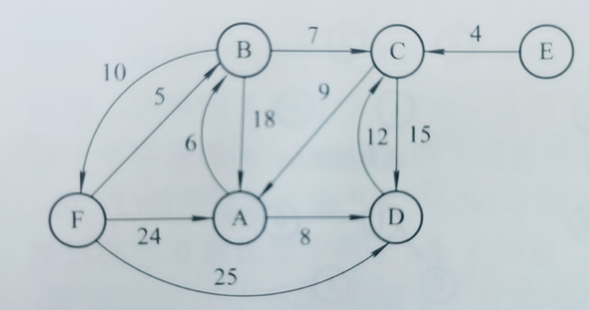
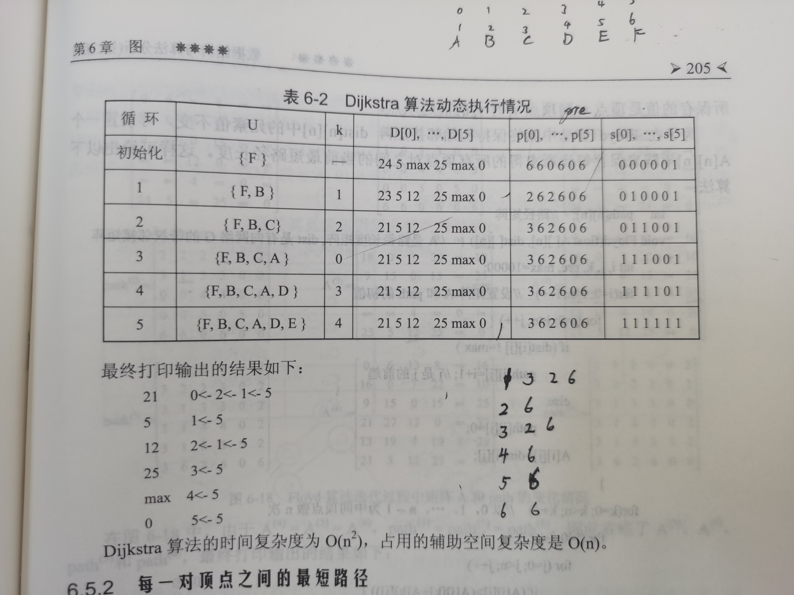

# **顺序表的特点是表中元素的逻辑顺序与其物理顺序相同**

# 快速排序的最差情况

# 满K叉树孩子的编号

满k叉树编号为n的结点的第k-1个孩子的编号为nk

# C语言中二维数组按行优先存储

**A~m*n~是m行n列，每行n个元素，每列m个元素**

# 字符串匹配KMP算法

if(p~i~==p~j~)next[j+1]=next[j]+1要理解

# 堆排序，对堆的调整

# 压缩矩阵

# n个结点的二叉树的形态数

**f(n) = f(n-1) \* f(0)+f(n-2) \* f(1)+...+f(0) \* f(n-1)**

而刚好这个数列正好是卡特兰数，上面式子也就是下面的式子

n个结点组成的二叉树有f(n)种形态

**四个结点的二叉树有8!/(4! \* 5!)=14种形态**

# dijkstra算法

