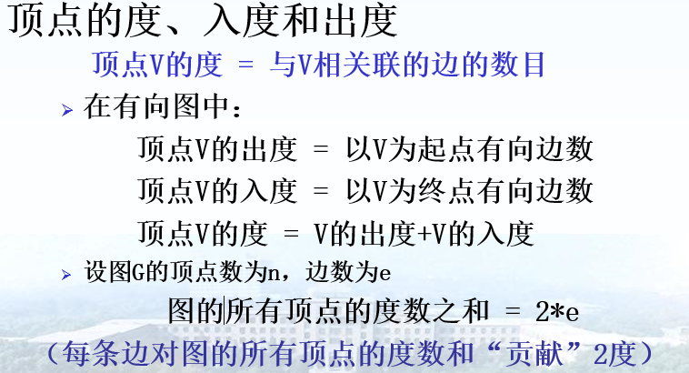

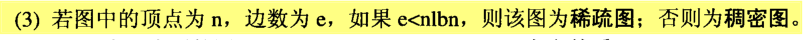

弧的起始顶点称为弧尾。终止顶点称为弧头。

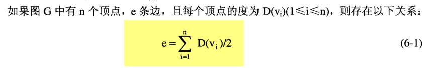

# 图的操作

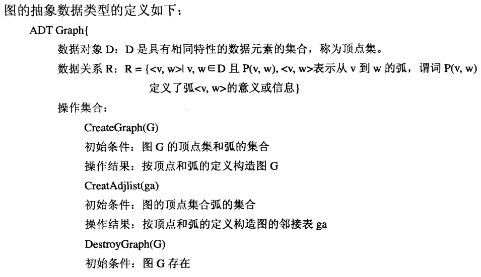

# 邻接矩阵

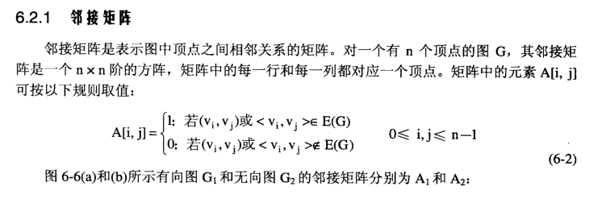

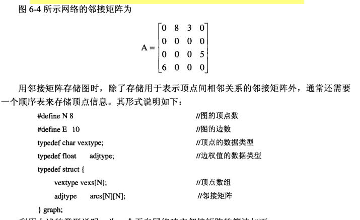

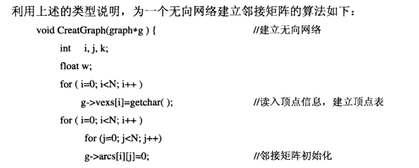

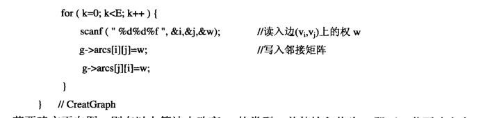

# 邻接表

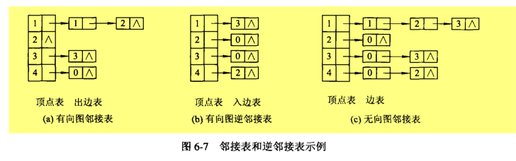

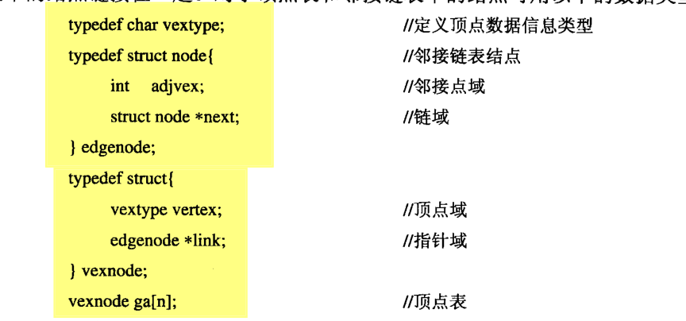

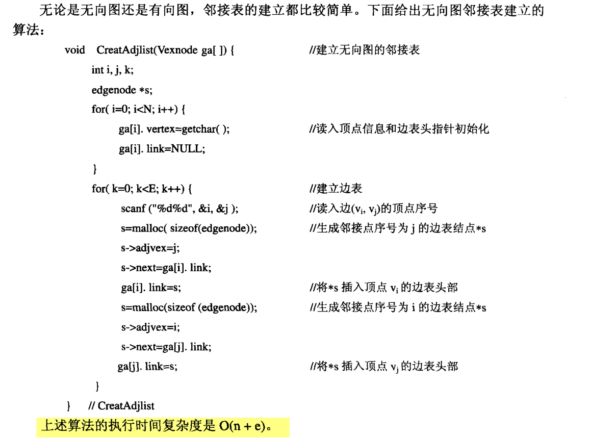

# 十字链表

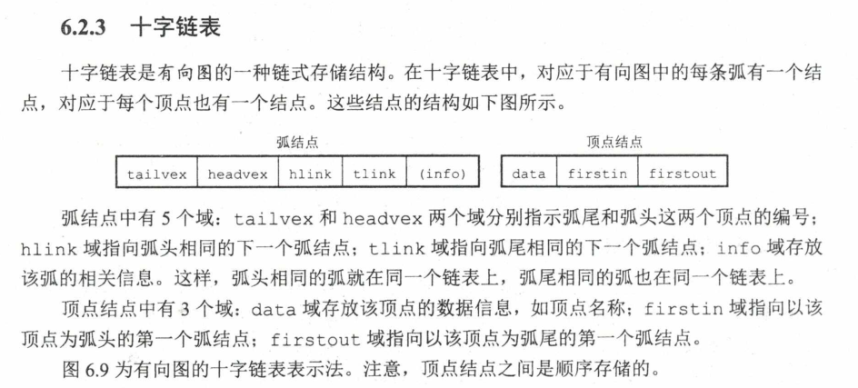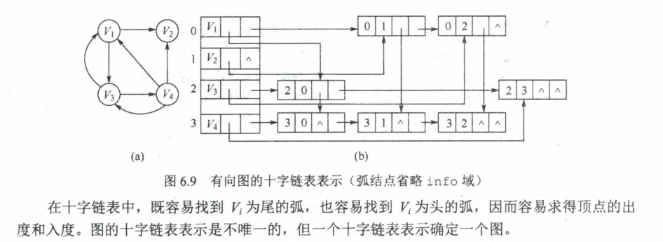

# 邻接多重表

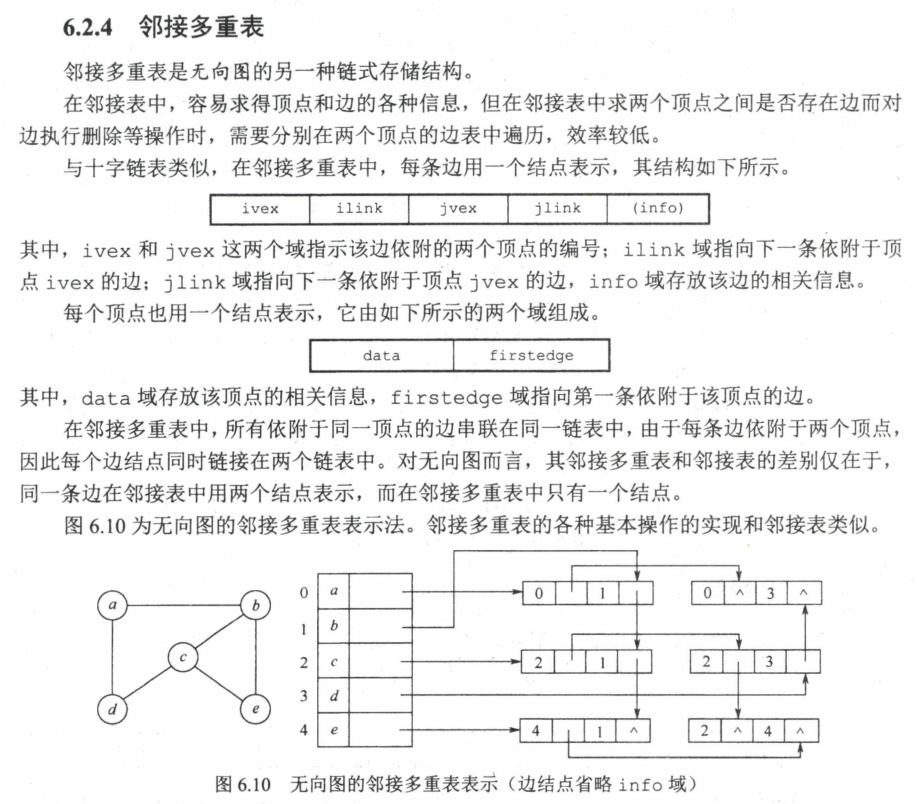

# 图的遍历

## **深度优先遍历**DFS

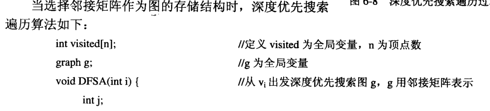
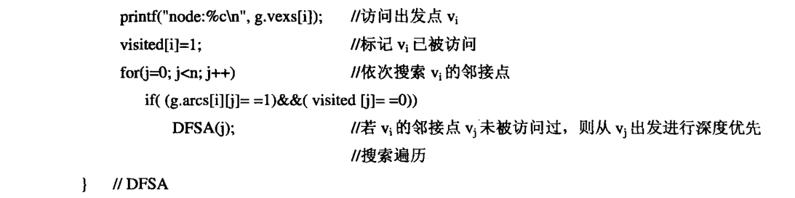
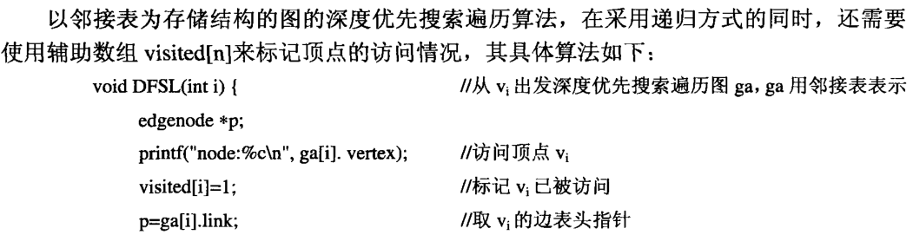
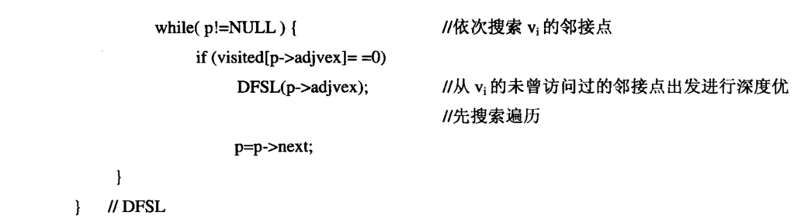

## **广度优先遍历**BSF

邻接矩阵

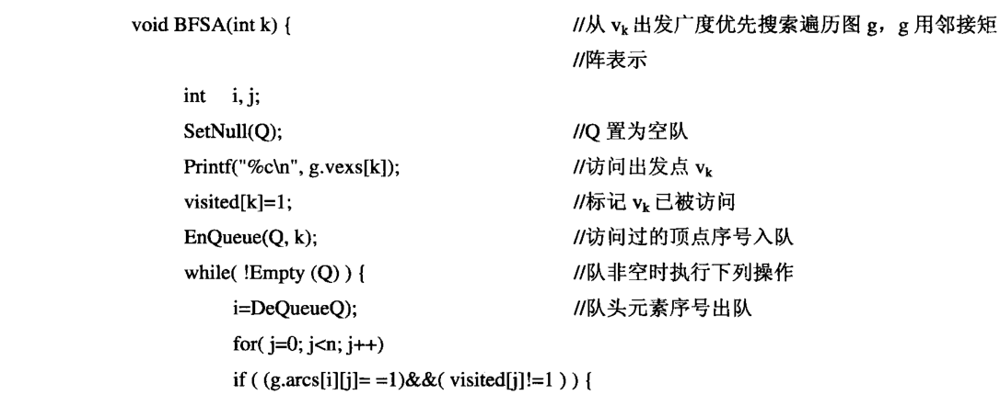

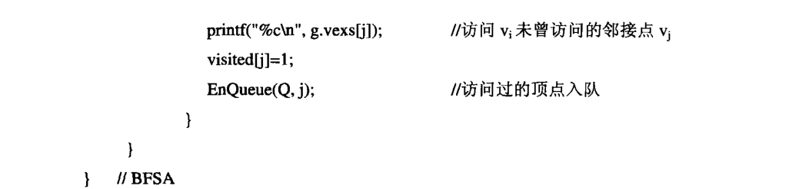
邻接表

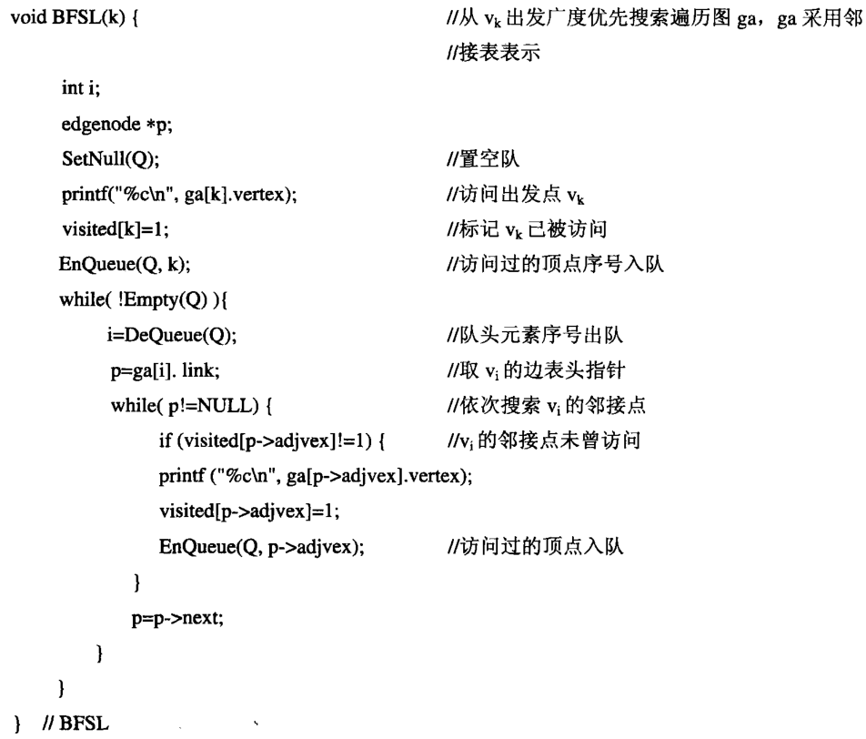

# 生成树和最小生成树

对于一个有n个顶点的连通图G，其生成树包含了n-1条边，从而生成树是G的一个极小连通分量。

连通图的生成树不是唯一的

## 最小生成树

### Prim算法

### Kruskal算法

