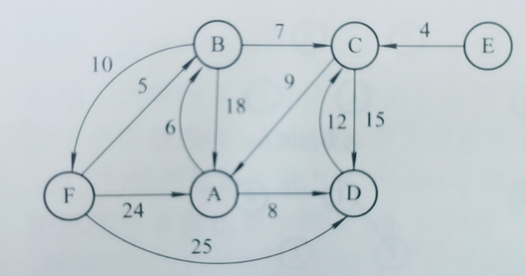
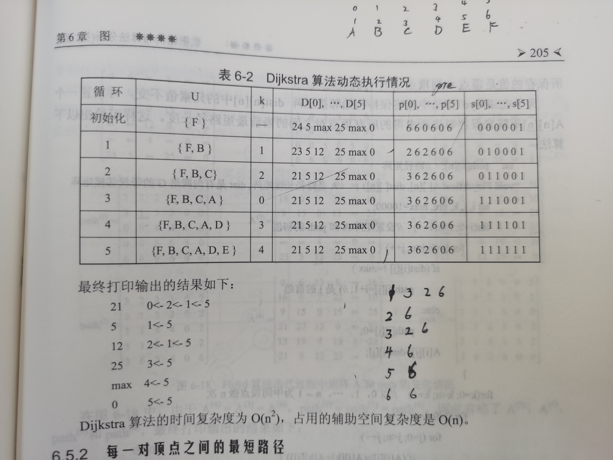
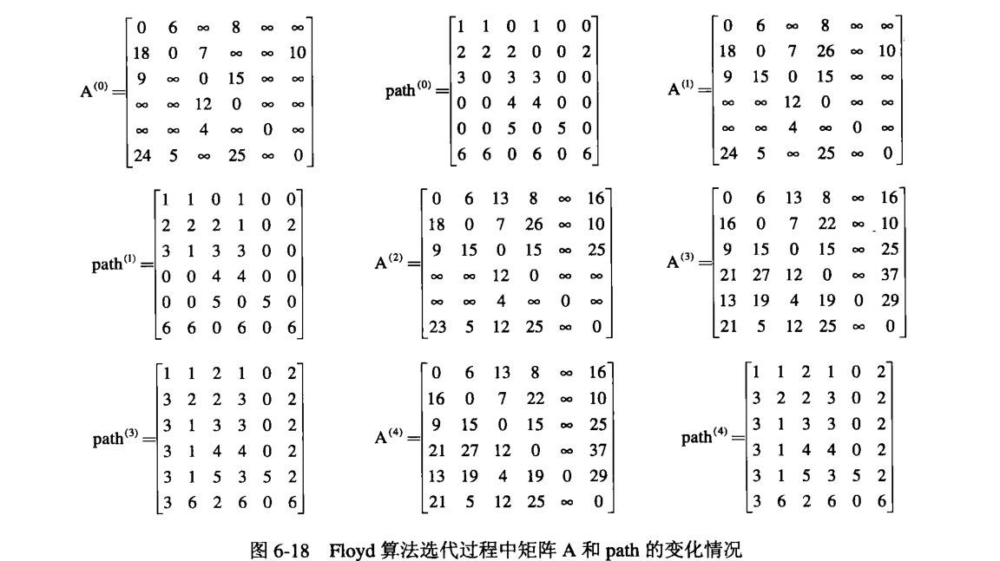

弧的起始顶点称为弧尾。终止顶点称为弧头。

# 图的操作

# 邻接矩阵

# 邻接表

# 十字链表

# 邻接多重表

# 图的遍历

## **深度优先遍历**DFS

## **广度优先遍历**BSF

邻接矩阵

邻接表

# 生成树和最小生成树

对于一个有n个顶点的连通图G，其生成树包含了n-1条边，从而生成树是G的一个极小连通分量。

连通图的生成树不是唯一的

## 最小生成树

### Prim算法

### Kruskal算法

# 最短路径

## dijkstra算法

- k为新加入集合的结点的下标
- D\[\]为路径长度
- p[]保存前驱结点
- s[]判断该节点是否已经加入集合

## Floyd算法

- 某轮增加中间节点G（下标为g），A矩阵
  1. 对应行，只看第g列不为无穷的行，即该行对应结点能到G，记 I 到 G 的距离为 D~ig~ ，为了方便计算写在每一行前。
  2. 对于列，只看第g行值不为无穷的列，即G能到达的结点，记 G 到 J 的距离为 D~gj~  ，为了方便计算写在每一列上面。
  3. 对第二步选出的列，每一列中只看第一步选出的行，即前两部交叉标记的位置，对于位置 A~ij~ 比较该位置的值与D~ig~+D~gj~的大小，若D~ig~+D~gj~更小则替换。
  4. 更改Path矩阵，注意，某轮增加中间节点（下标为g）， I 到 J 有更短路径时，Path\[i\]\[j\]值改为Path\[g\]\[j\]的值，即将要改的从I到 J 的前驱结点改为从 G 到 J 的前驱结点（即Path\[g\]\[j\]的值）。

