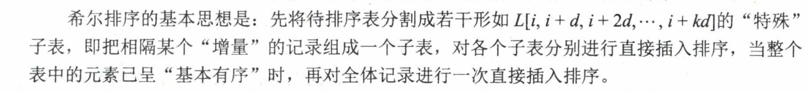
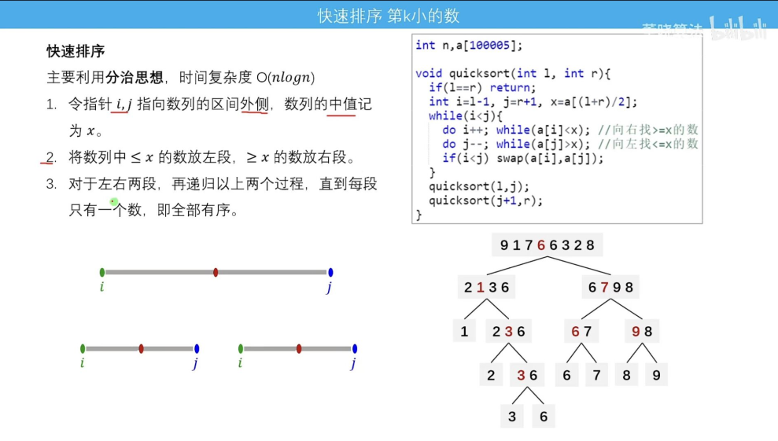
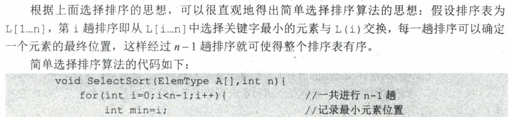

# 概览

# 插入排序

基本思想：每次将一个待排序的记录按其关键字大小插入前面已排好序的子序列，直到全部记录插入完成。

## 直接插入排序

## 折半插入排序

## 希尔排序

# 交换排序

## 冒泡排序

## 快速排序

### 一个最优雅的快速排序

# 选择排序

## 简单选择排序

## 树形选择排序

​	

## 堆排序

# 归并排序

# 基数排序

# 各种内部排序的比较

