# 顺序查找

## 无序表的顺序查找

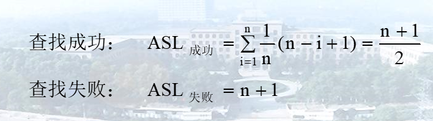

## 有序表的顺序查找

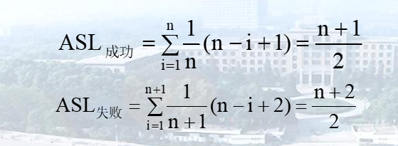

# 折半查找

**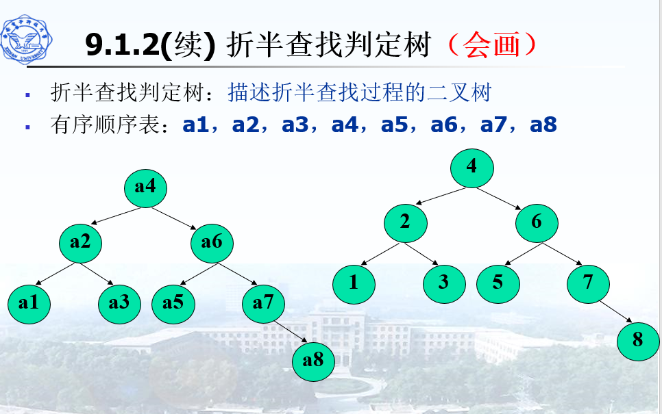**

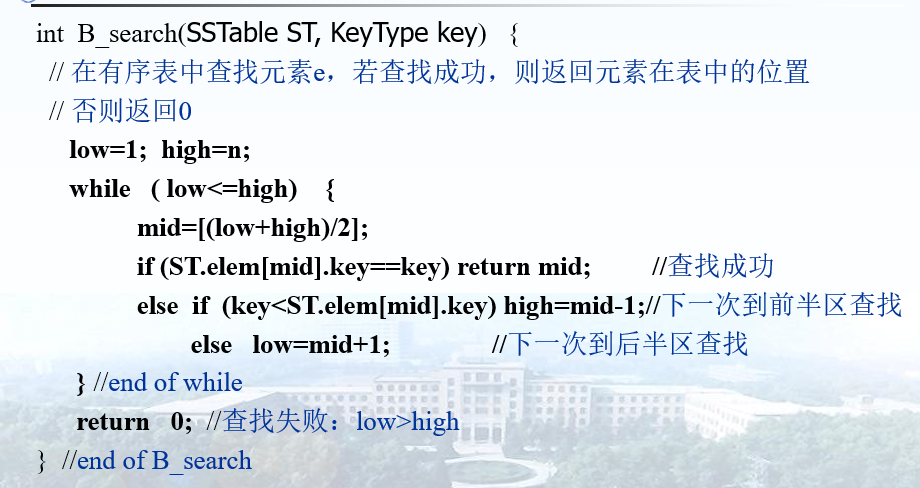

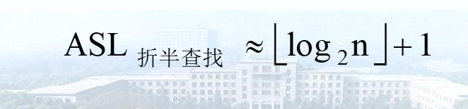

# 分块查找（索引顺序表查找）

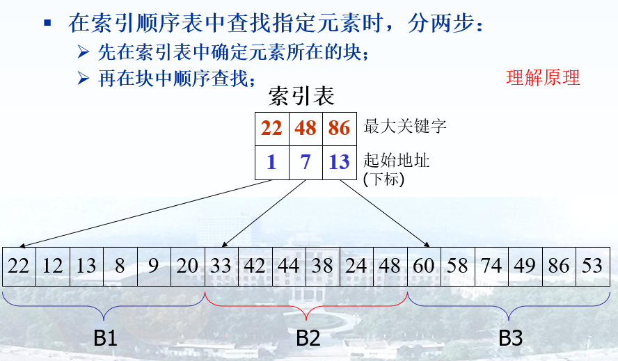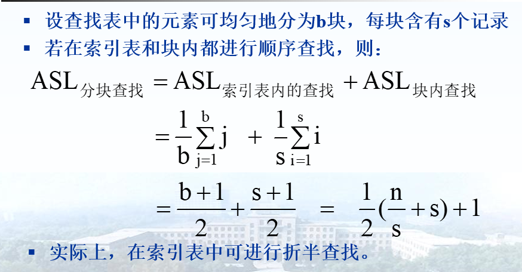

# 二叉排序树（BST）

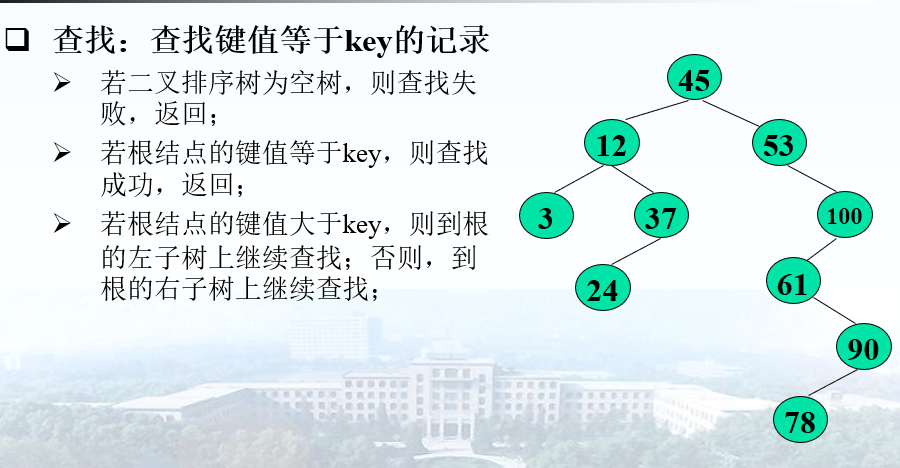

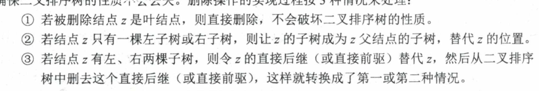

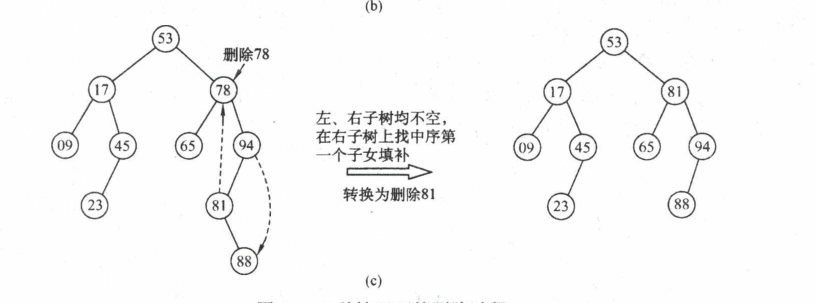

# 平衡树

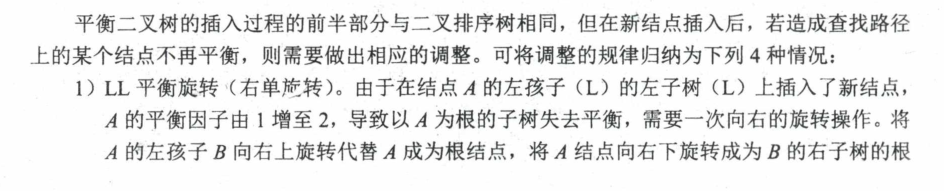

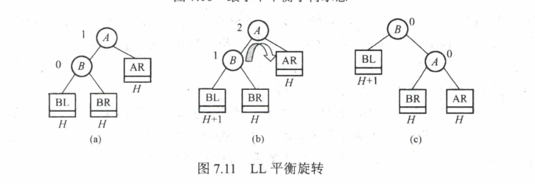

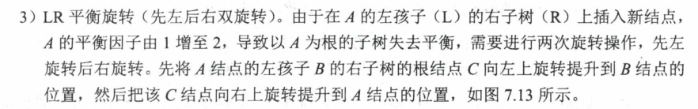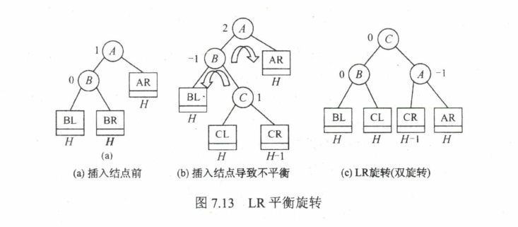

# B树

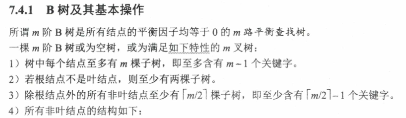

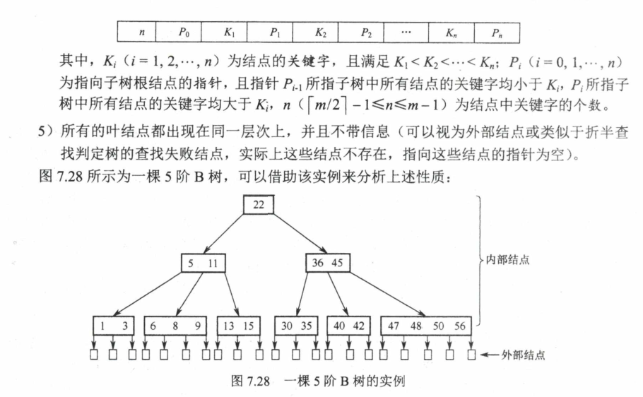

## 查找

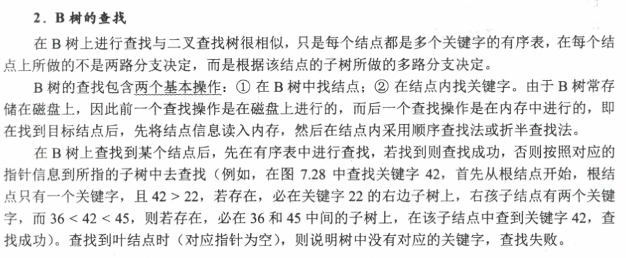

## 插入

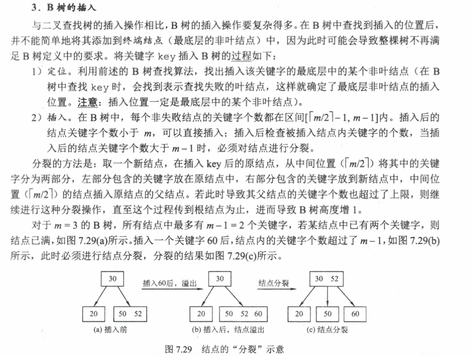

## 删除

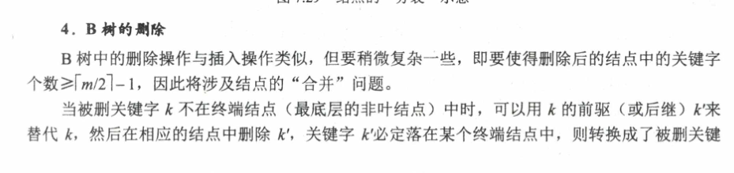
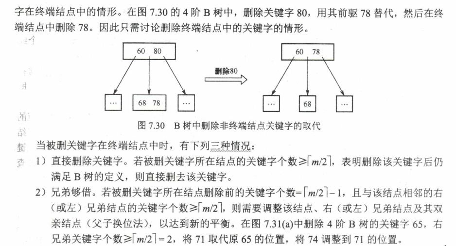
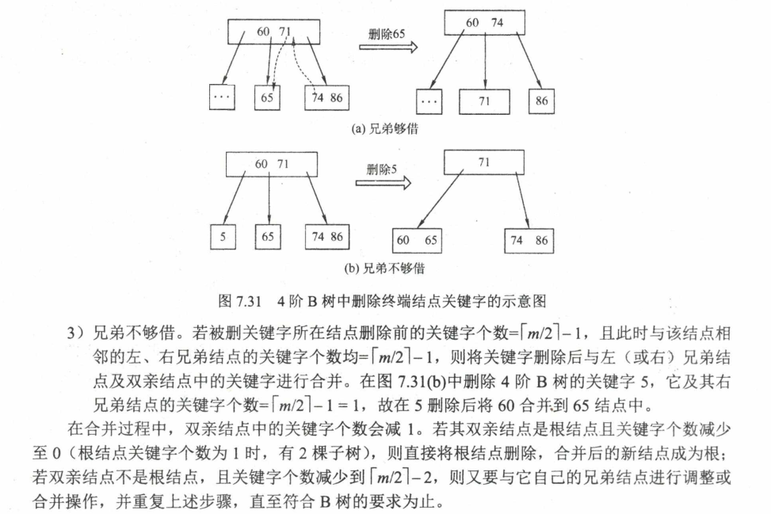

# B+树

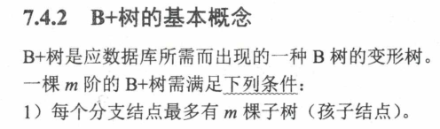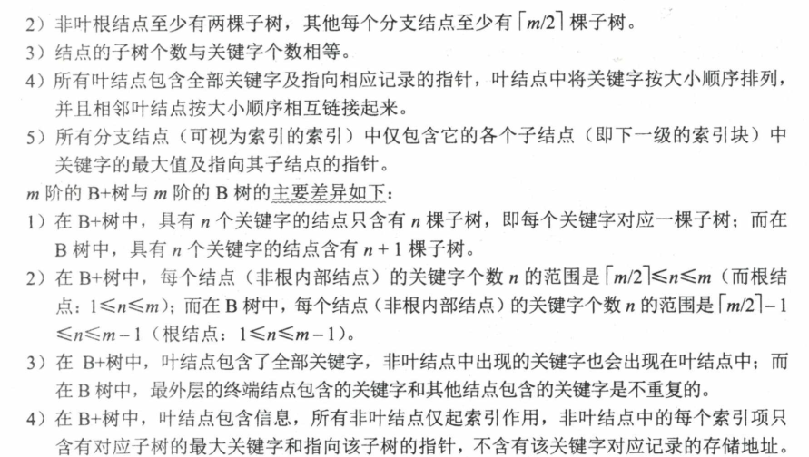

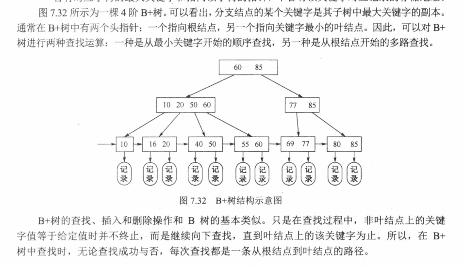

# 散列表

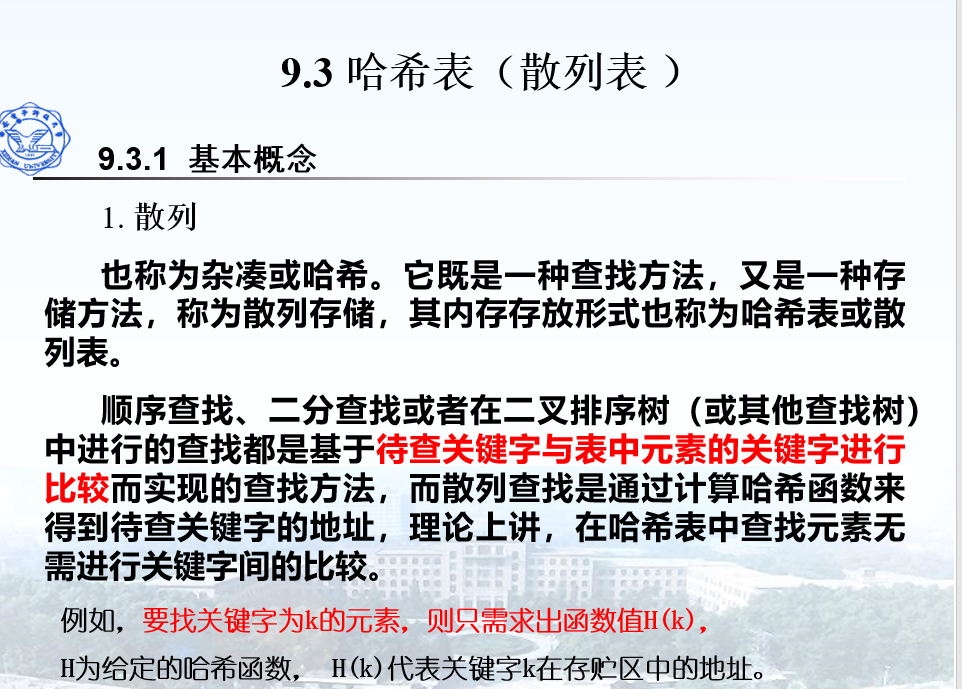

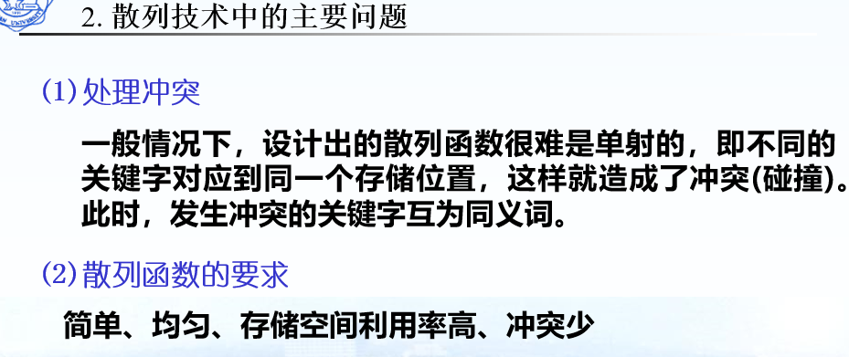

## 散列函数构造方法

1. 数字选择法
2. 平方取中法
3. 折叠法
4. 除留余数法
5. 基数转换法
6. 随机数法

## 解决冲突的方法

- 开放地址法
  - 线性探查法
  - 二次探查法
  - 随机探查法
- 拉链法

## 散列查找及性能分析

散列表的查找效率取决于三个因素：散列函数、处理冲突的方法、装填因子

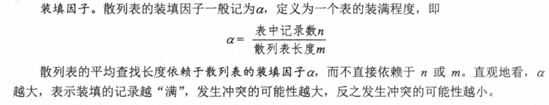

没有存的位置，在ASL失败也是一次比较。

拉链法，在空指针位置不算比较。
