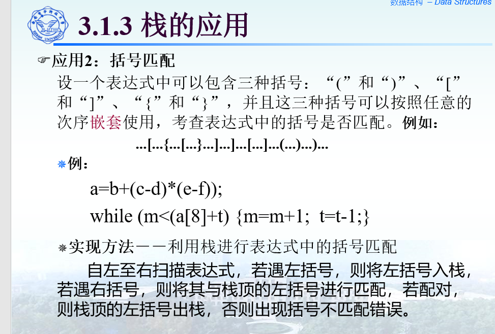

# 栈（Stack）

n个不同的元素进栈，出栈元素不同排列的个数为

# 栈的应用

# 栈与迭代

# 队列

基本运算

## **链队列－－队列采用链式存储结构**

## **顺序队列－－队列采用顺序存储结构**

# 循环队列

顺序存储方式循环队列，队列满判断的解决方法(两种方法都会产生一个空闲位置)：

1. 引入一个标志变量
2. 入队前测试尾指针在循环意义下加一后是否等于头指针，即 (sq->rear+1)%MAXSIZE == sq->front
3. 空闲位置一直是front所指
