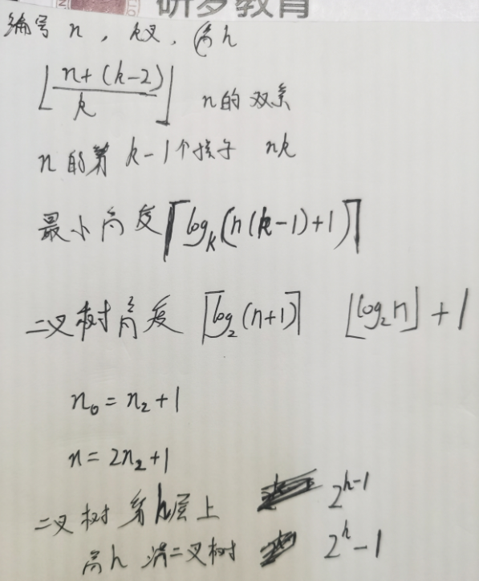

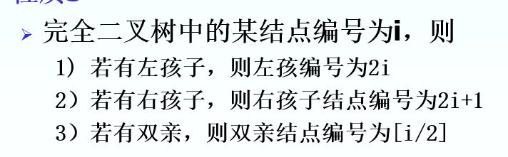

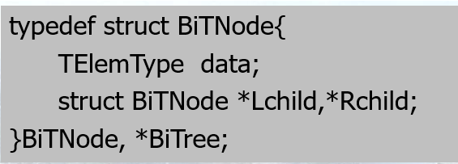

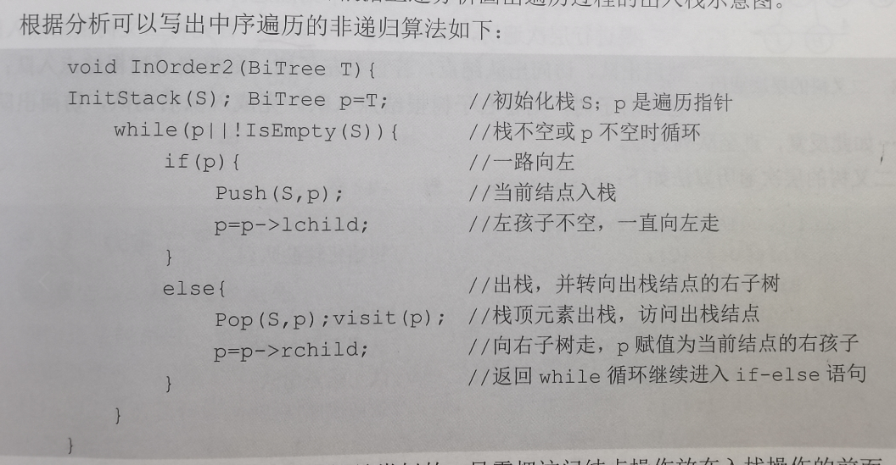

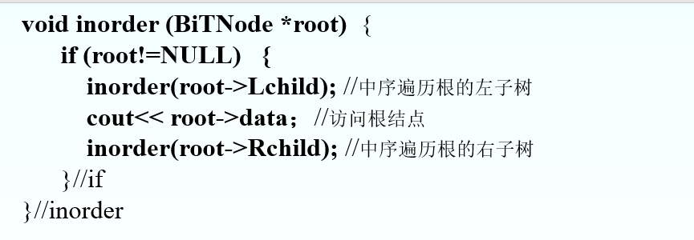

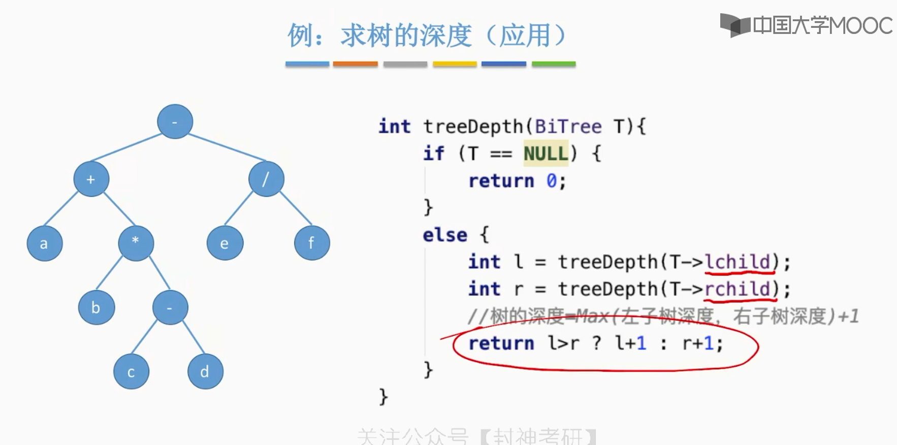

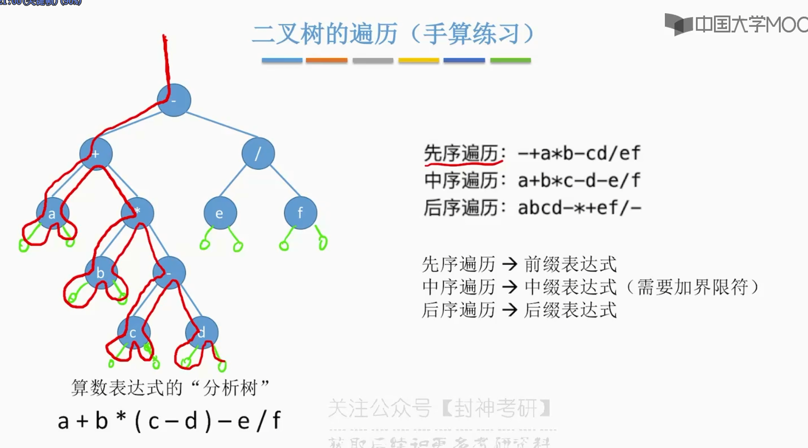
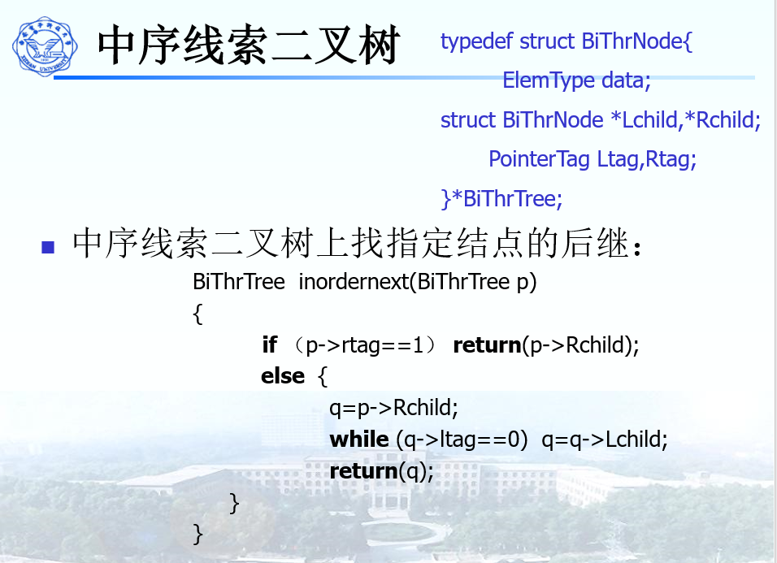

# 中序线索化

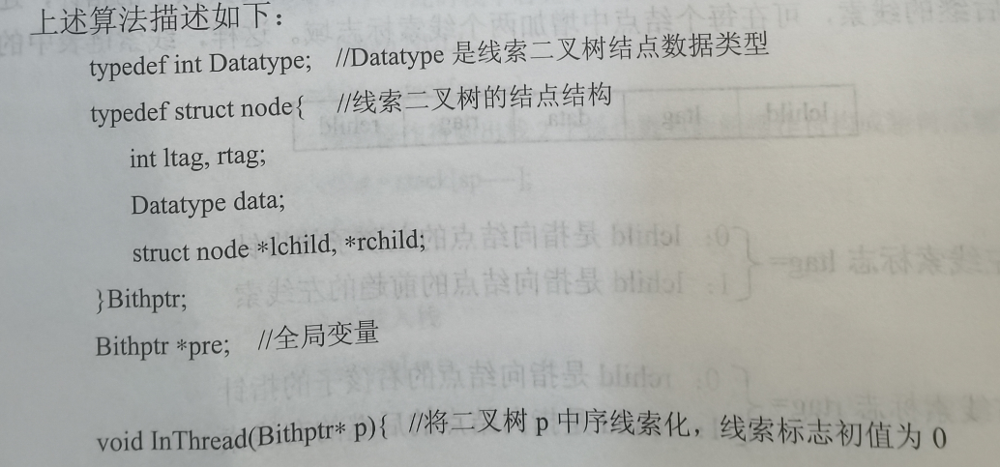
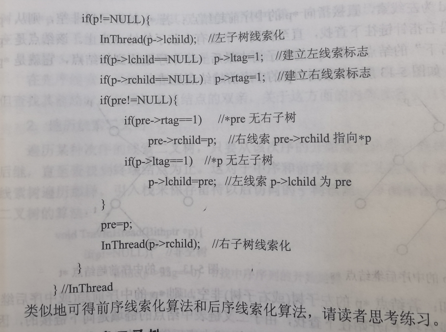

# 中序线索二叉树求后继

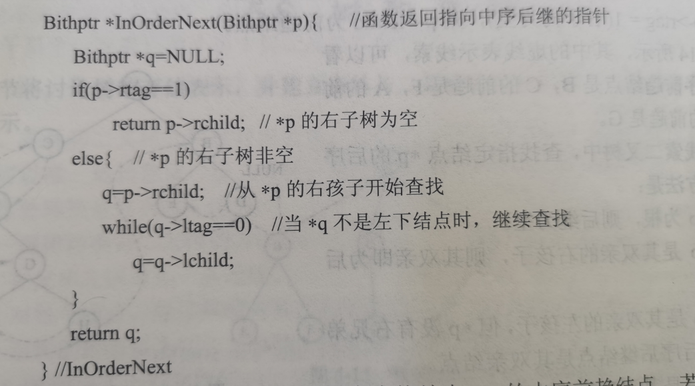

# 遍历线索二叉树

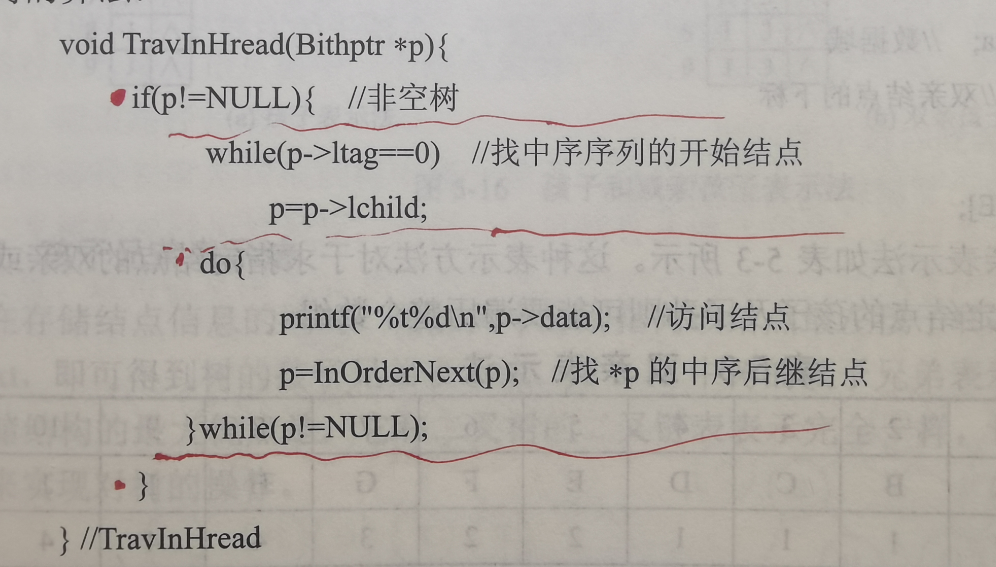

# 树的存储结构

双亲表示法

孩子表示法

双亲孩子表示法

孩子兄弟表示法

# 树、森林、二叉树之间的转化

将树转化为二叉树

1. 在兄弟结点之间加一条连线
2. 每个结点，除了保留与其左孩子的连线外，应除去与其他孩子之间的连线
3. 以树的根节点位为轴心，将整个树旋转45°

二叉树转化为树：

1. 若结点X是双亲Y的左孩子，则把X的右孩子、右孩子的右孩子......都与Y用连线相连
2. 去掉原有的双亲到右孩子的连线

将森林转化成二叉树：

1. 先将森林中的每一棵树转化为二叉树
2. 再将第一颗树的跟作为转换后二叉树的跟，第一棵树的左子树作为转换后的二叉树根的左子树，第二棵树作为转换后二叉树的右子树，第三课树作为转换后二叉树根的右子树的右子树，以此类推下去，就将一个森林转换为一颗二叉树。

# 哈夫曼树（最优二叉树）

带权路径长度最短的树

**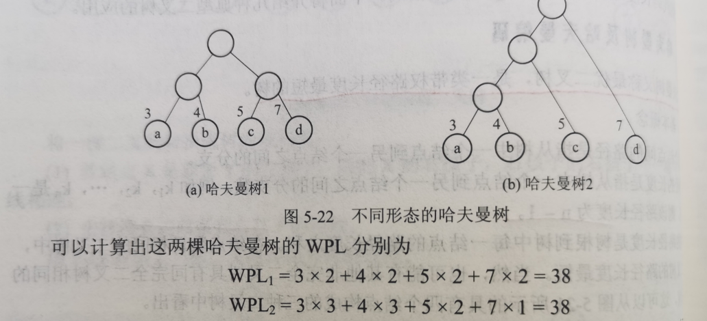**

哈夫曼编码

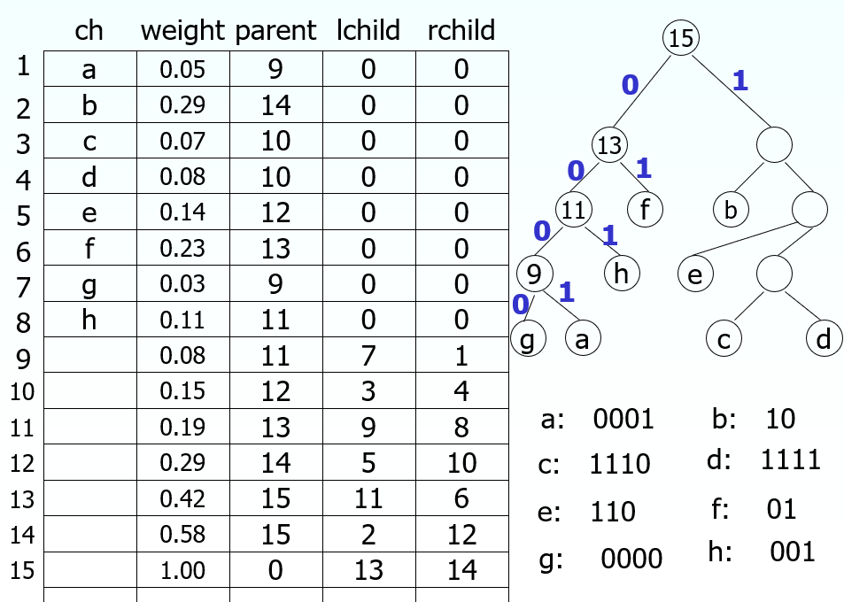

# 二叉排序树

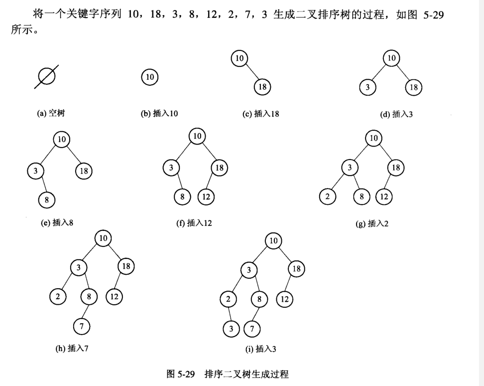

二叉树的删除：

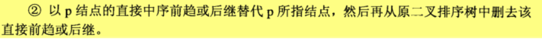

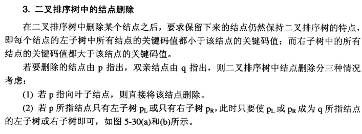

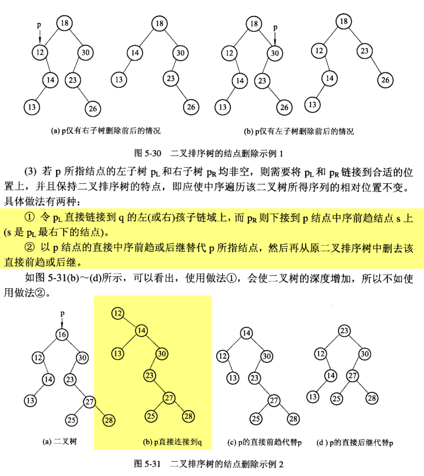

