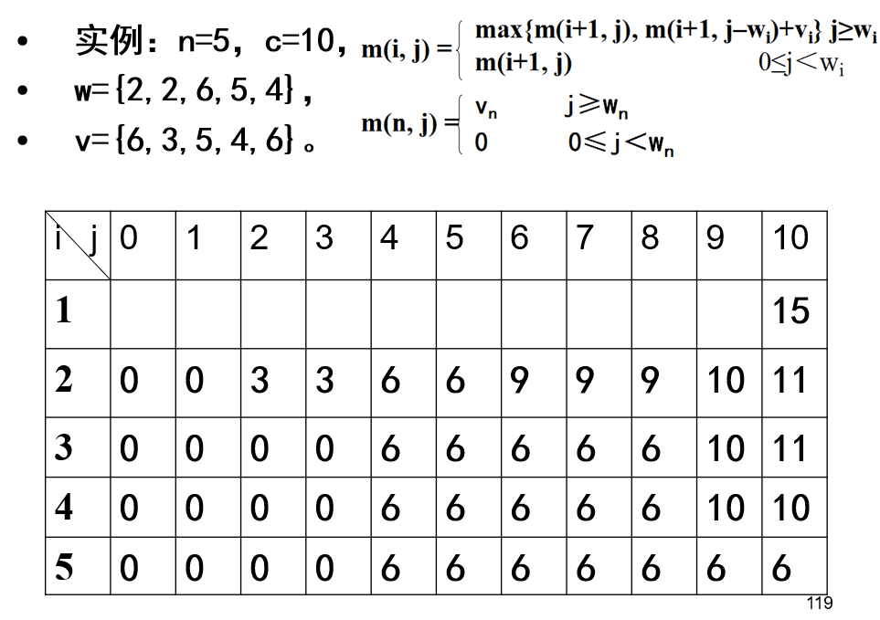

# 缩小规模算法

## 递归算法

## 分治算法

思想：将一个难以直接解决的大问题分解成多个规模较小的子问题。


递归典型案例：

- Hanoi塔问题
- 整数划分问题
- 全排列问题

分治策略的应用

- 

# 01背包的动态规划算法

knapsack算法



```c
template<class Type>
void Knapsack(Type v, int w,int c,int n,Type** m){//v为价值数组、w为重量数组，c为容量，n为物品个数，m[i][j]保存价值
    int jMax = min(w[n],c);
    for(int j=0;j<=jMax;j++) m[n][j]=0;
    for(int j=w[n];j<=c;j++) m[n][j]=v[n];//最后一行
    for(int i=n-1;i>1;i--){
        jMax=min(w[i]-1,c);
        for(int j=0;j<=jMax;j++) m[i][j]=m[i+1][j];//容积小于重量w[i]的与i+1行相同
        for(int j=w[i];j<=c;j++) m[i][j]=max(m[i+1][j],m[i+1][j-w[i]]+v[i]);//容积大于等于时，比较
    }
    m[1][c]=m[2][c];
    if(c>=w[1]) m[1][c]=max(m[1][c],m[2][c-w[1]]+v[1])
}
void TraceBack(Type v, int w,int c,int n,int x[]){
    for(int i=1;i<n;i++){
        if(m[i][c]==m[i+1][c]) x[i]=0;
        else{
            x[i]=1;
            c -= w[i];
        }
    }
    x[n]=(m[n][c])?1:0;
}
```

