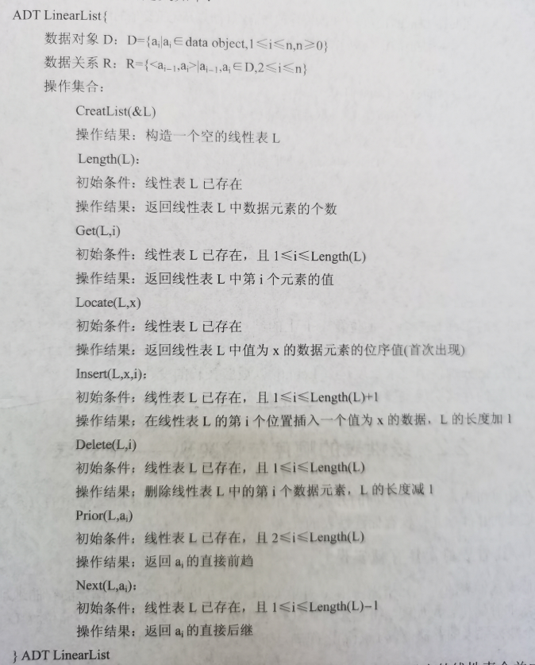
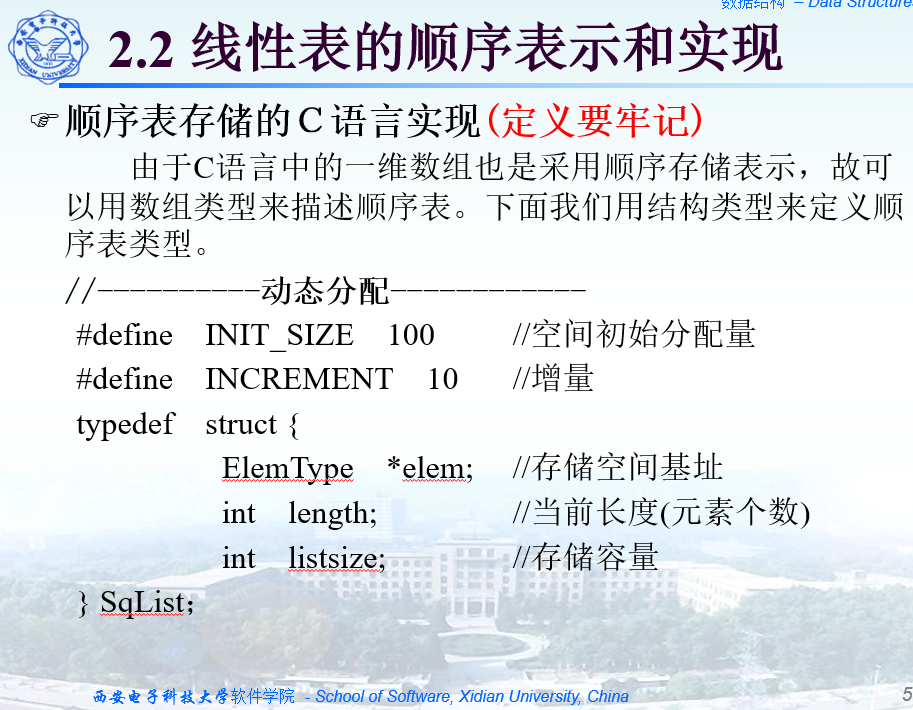
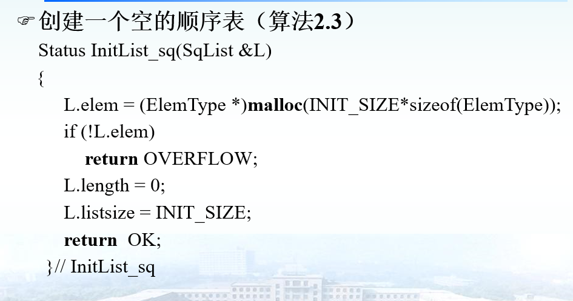

# 线性表

一个**线性表**是有n个数据元素的有限序列

线性表中元素之间的关系是线性关系

存在惟一的第一个元素；

存在惟一的最后一个元素；

除第一个元素之外，每个元素均只有一个直接前驱

除最后一个元素之外，每个元素均只有一个直接后继

一个线性表中元素的个数n(n≥0)定义为线性表的长度，n=0时称为**空表**。非空线性表中的每个元素都有一个确定的**位序**。

## 基本运算



# 线性表的顺序存储

指用一组地址连续的存储单元依次存储线性表的数据元素。这称为顺序表。

线性表的特点：

- 存储单元地址连续
- 逻辑上相邻的数据元素其物理位置也相邻
- 存储密度大（100%）
- 随机存取

```C
typedef int Datatype;
#define MAXSIZE 1024
typedef struct{
    Datatype data[MAXSIZE];
    int last;
}SequenList;
```

### 结构



### 创建



