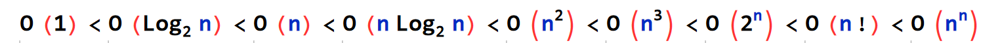

# 数据结构概述

数据结构的内容包括以下几个方面：

①**数据的逻辑结构，指数据元素之间的逻辑关系。**

②**数据的存储结构，指数据元素及其关系在计算机存储器中的存储方式，也称为数据的物理结构。**

③**数据运算，指施加在数据上的基本操作。**

基本概念

• 数据 ：指所有能输入到计算机中并被计算机程序加工处理的符号的总称。不仅包括数字、字符串，还包括图形、图像、声音、动画、视频等能通过编码而被加工的数据形式。

•数据元素：是数据的基本单位，数据集合中的元素。

• 数据项 ：是数据的不可分割的最小单位。一个数据元素可由若干个数据项组成。

• 数据对象 ：是性质相同的数据元素的集合，是数据的一个子集。

• 数据结构：是相互之间存在一种或多种特定关系的数据元素的集合。

## 逻辑结构

数据元素之间的关系

- 集合
- 线性结构
- 树结构
- 网状结构

存储结构（物理结构）：

数据结构在计算机中的映象。包括数据元素的表示和关系的表示两个方面。

- 顺序存储结构：数据元素存储在一段地址连续的内存区域，用存储单元地址之间的关系表示元素之间的逻辑关系。
- 链式存储结构：数据元素的存储空间可以不连续，需要额外的存储单元存储元素之间的逻辑关系。

数据的存储结构可以用以下四种基本的存储方法得到：

1. 顺序存储方法
2. 链接存储方法
3. 索引存储方法：建立索引表，其中每一项为索引项（关键字，地址）
4. 散列存储方法

## 算法

算法是由解决问题的方法和步骤，，是由若干条指令组成的有限序列

- 输入性
- 输出性
- 有穷性
- 确定性
- 可行性

要求：正确性、可读性、健壮性、高时间效率与低存储量需求

算法的**时间复杂度**与**问题规模**有关