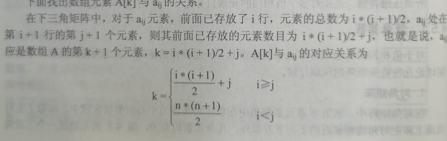
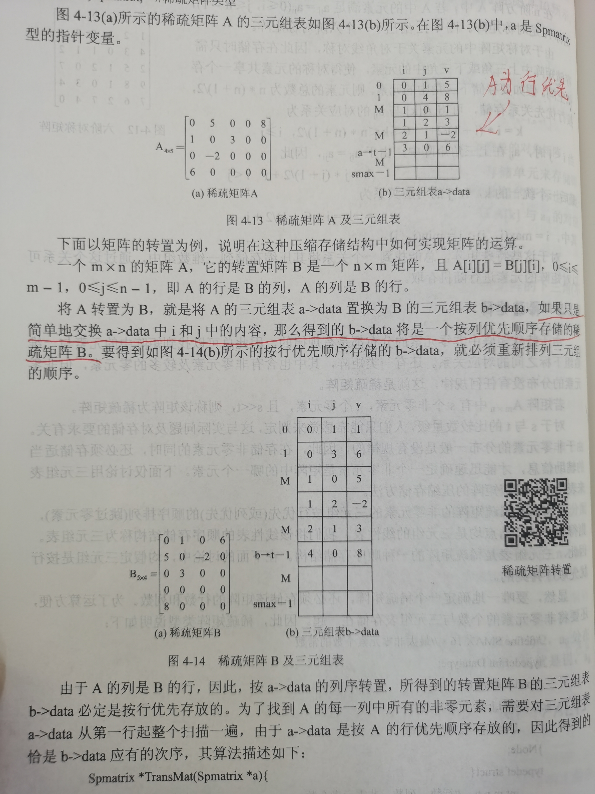
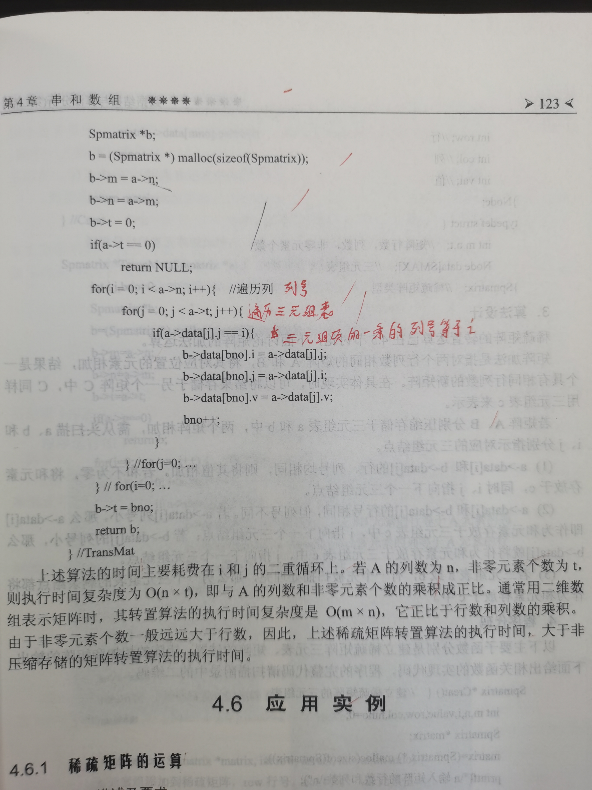

# 稀疏矩阵

## 三角矩阵



## 稀疏矩阵的三元组储存Spmatrix

```c
#define SMAX 16 //最大非零元素个数
typedef int Datatype;
typedef struct {
    int i,j; //行号列号
    Datatype v; //元素值
}Node;
typedef struct{
    int m,n,t; //行数，列数，非零元素个数
    Node data[SMAX]; //三元组表
}Spmatrix;
```

### 三元组行优先存储，矩阵转置




