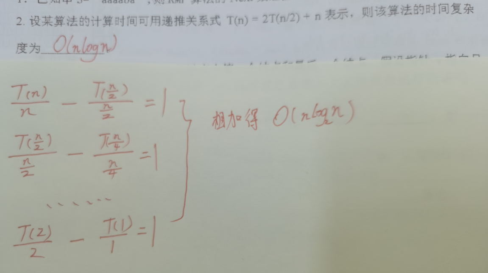
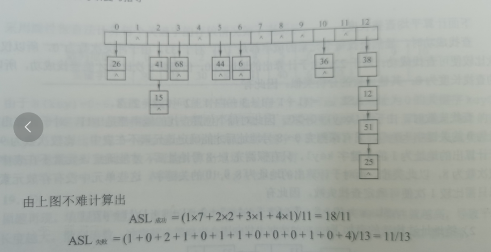
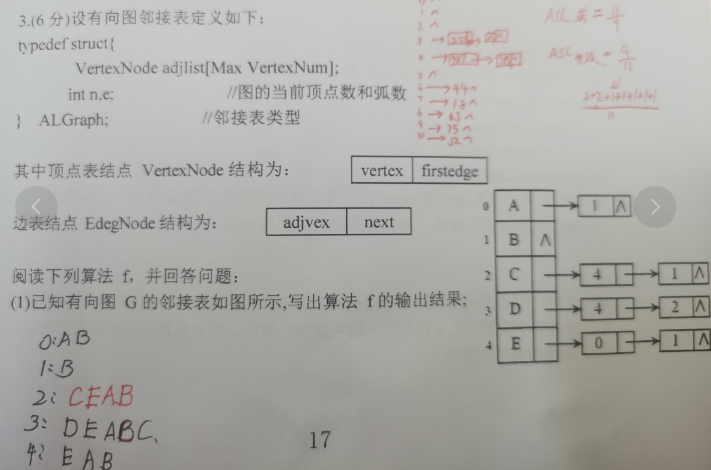
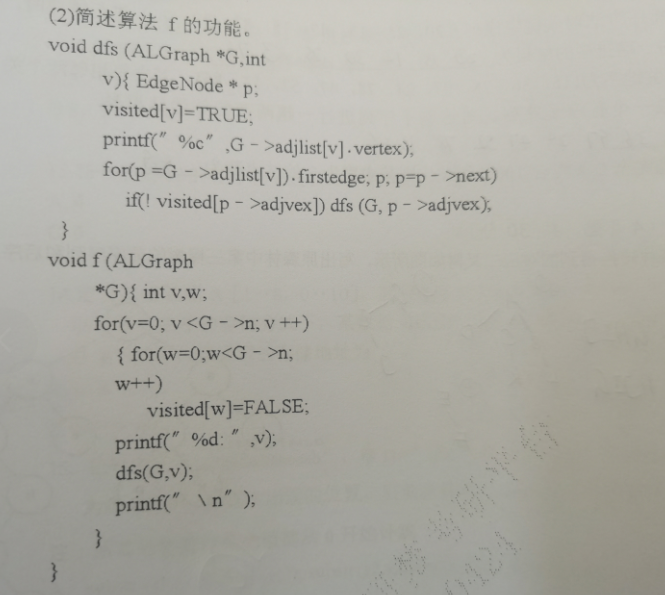
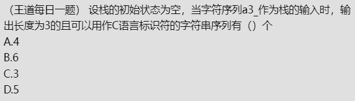
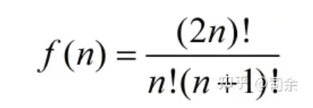

# 叶结点数

此题选D给定结点个数n，对于哈夫曼树，n= 2*n0-1，叶节点n0 = （n+1）/2
对于完全二叉树，可以根据公式进行推导，假设n0是度为0的结点总数（即叶子结点数），n1是度为1的结点总数，n2是度为2的结点总数，由二叉树的性质可 知：n0=n2+1，且n= n0+n1+n2（其中n为完全二叉树的结点总数），由上述公式把n2消去得：n= 2n0+n1-1，由于完全二叉树中度为1的结点数只有两种可能0或1，由此得到n0=（n+1）/2或n0=n/2
对于满二叉树，度为1的节点数为0，故n0=（n+1）/2

# 二叉树遍历

**前序遍历：根节点在前**

# 算法时间复杂度

# 森林转化二叉树、树转化二叉树

兄弟之间加一条线
对每个结点，只保留他与第一个孩子的连线，而与所有其他孩子的连线全部断掉
以树根为轴心，顺时针选择45度

# 散列查找拉链法

ASL~失败~的计算

# 邻接表有向图的深度遍历

f的功能输出有向图从任意一个顶点开始进行一次深度遍历所能得到的顶点序列

# 卡兰特数-----栈输出

（王道每日一题解析）解析：此题选C
利用卡特兰数h(n)=C(2n,n)/(n+1)，h（3）=5，减去3开头的两种，答案为3
本题还有第二种方法哦~

# 卡兰特数-----n个结点的二叉树的形态数

**f(n) = f(n-1) \* f(0)+f(n-2) \* f(1)+...+f(0) \* f(n-1)**

而刚好这个数列正好是卡特兰数，上面式子也就是下面的式子

n个结点组成的二叉树有f(n)种形态

**四个结点的二叉树有8!/(4! \* 5!)=14种形态**

# 栈堆

（王道每日一题）若用STACK[n]表示某堆栈采用顺序存储结构，则下列关于堆栈及堆栈操作的叙述中正确的是（   ）。
A．堆栈的大小为n；
B．堆栈为空时n=0;
C．最多只能进行n次进栈和出栈操作；
D．n各元素依次进栈后，它们的出栈顺序与进栈顺序相反
（王道每日一题解析）解析：此题选A,
 B选项，堆栈为空时n=-1，C 选项，应该是可以进行无限次进栈出栈，D选项， 每个元素进栈后又立马出栈，就可以保证元素依次进栈，且进栈顺序与出栈一致。
