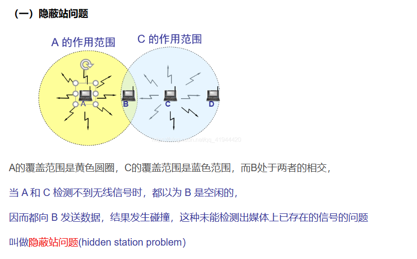
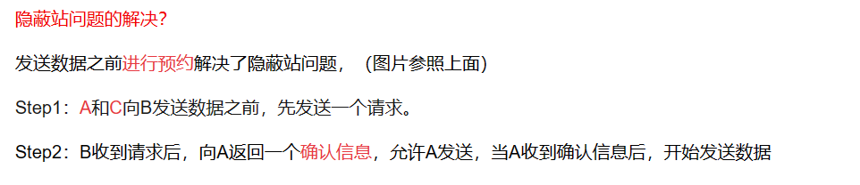
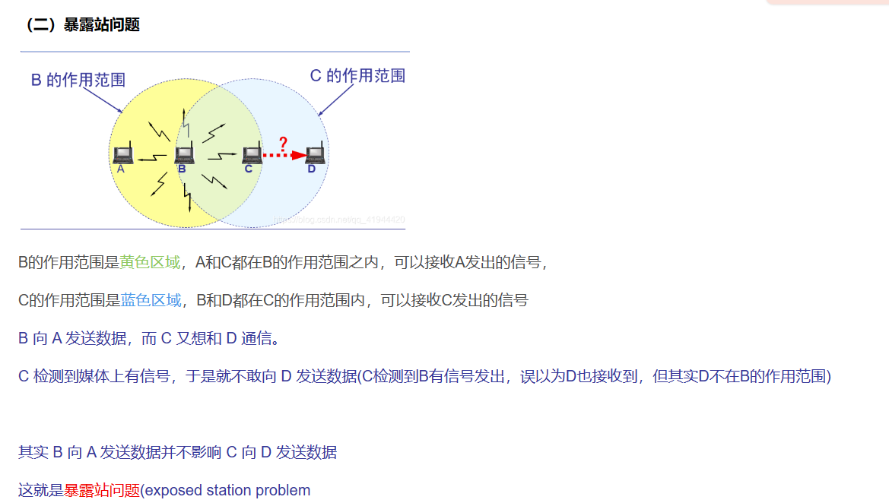
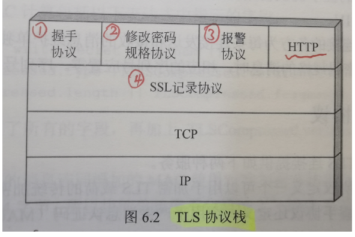

# 数据结构杂项

- 循环队列是一种顺序存储结构。 
- 散列查找法必须解决以下两个问题:散列函数设计和解决冲突方法

# 计网杂项

- 跳到跳时物理地址会改变，逻辑地址会保持不变。

- 网卡是完成物理层和数据链路层功能的

- 在ATM网络中数据交换的单位是**信元**。

- ATM(异步传输模式)

  - ATM和SONET的结合将允许世界上的网络之间高速互连
  - **信元网络**使用**信元**作为数据交换的基本单位。**信元定义为一个小的、固定大小的信息块。**
  - ATM使用**异步时分复用**处理来自不同通道的信元
  - ATM是信元交换网络。用户访问设备，称为端点(endpoint) ，通过用户到**网络接口(user-to-network interface , UNI)**连接到网络内部的交换机上，交换机通过网络到网络接口(network-to-network interface, NNI) 彼此连接。
  - 虚连接：两个端点之间的连接是通过传输路径(TP) 、虚路径(VP) 和虚电路(VC) 完成的。
  - ATM 网络中的基本数据单元称为信元。**一个信元只有53字节长度，其中 5个字节为头部，48个字节为有效载荷**(用户数据可能少于48个字节)。
  - ATM标准定义了三个层，从上到下依次为:应用适配层、ATM层和物理层(见图 18.16) 。

- 在地址219.25.23.56中的默认的网络掩码有多少位（）

  答案：24

- 网桥从其某一端口收到正确的数据帧后，在其地址转发表中查找该帧要达到的目的站，若查找不到，则会向除该端口以外的桥的所有端口转发次帧。

- 多模光纤的成本比单模更低

- 世界上第一个计算机网络是：ARPAnet（阿帕网）

- 计算机网络按逻辑功能可分为通信子网和资源子网两部分。

- 

# 密码学杂项

计算和估计出破译密码系统的计算量下限，利用已有的最好方法破译它所需要的代价超出了破译者的破译能力(如时间、空间、资金等资源)，那么该密码系统的安全性是**计算安全**。

# 无线局域网、隐蔽站、暴露站

# 四级寻址

1、物理地址
物理地址，也称为链路地址、MAC地址、LAN地址，它是局域网或广域网定义的节点地址。它包含在数据链路层所用的帧中，是最低级的地址。物理地址在网络(LAN或者WAN)中使用，这类地址的长度和格式是可变的。以太网使用6个字节(48位)物理地址，在网络接口卡(NIC)上标明。

2、逻辑地址(IP地址)
逻辑地址，与下面的物理网络无关，它唯一定义了连接到因特网的一台主机，32位。

3、端口地址
在TCP/IP分层体系结构中，赋于进程的标识符称为端口地址，它的长度是16位。

4、专用地址
有些面向用户的应用被设计为专用地址。例如，电子邮件的地址和统一资源定位符(URL)（如www.baidu.com）。这些地址由发送计算机转换成对应的端口地址和逻辑地址。

问：端口地址、逻辑地址、物理地址有什么不同？
答：物理地址是节点的本地地址，数据链路层使用它将数据从一个节点传递到同一网络中的另一个节点。逻辑地址在网络层定义发送方和接收方，用于跨多个网络传递消息。端口地址(服务点)标识了站点上的应用程序。

# OSI的七层简答

物理层：在物理媒体上为数据段设备透明的传输原始比特流。

数据链路层：相邻节点之间的数据帧的可靠传输，成帧、差错控制、流量控制、介质访问控制、链路控制等功能，点到点

网络层：异构网络互联，任意两台主机之间的数据传送，把网络层的协议数据单元（分组）从源端传到目的端，为分组交换网上的不同主机提供通信服务。路由和转发、拥塞控制。

传输层：端到端的数据通信，两台主机上两个进程之间的通信

会话层：建立、管理以及终止进程间的会话、实现数据同步

表示层：数据格式的转换、压缩、加密和解密

应用层：面向用户的接口

# 介质访问控制分为（4个）

信道划分、随机访问、轮询访问、多路访问

## 随机机制访问控制

ALOHA：纯、时隙

CSMA：非坚持、1-坚持、p-坚持

CSMA/CD

CSMA/CA

# 密码体制的分类

单钥、双钥

# 不应该发送ICMP报文的情况

1. ICMP 差错报告报文不再发送 ICMP 差错报告报文。
2. 对第一个分片的数据报片的所有后续数据报片都不发送ICMP 差错报告报文
3. 对具有组播地址的数据报都不发送ICMP 差错报告报文。
4. 对具有特殊地址(如127.0.0.0或0.0.0.0)的数据报不发送ICMP 差错报告报文。

# 分组密码Feisel

很多分组密码的结构从本质上说都是基于一个称为**Feistel网络**的结构。Feistel 提出利用**乘积密码**可获得简单的**代换密码**，**乘积密码指顺序地执行两个或多个基本密码系统，使得最后结果的密码强度高于每个基本密码系统产生的结果。**

**Feistel**还提出了实现**代换和置换**的方法。其思想实际上是**Shannon**提出的利用**乘积密码**实现**混淆和扩散**思想的具体应用。

# 代换和置换

- 代换：将明文字符替换成其他的字母、数字或符号

  如果明文和密文的分组长都为n比特，则明文的每一个分组都有2^n^个可能的取值。为使加密运算可逆，明文的每一个分组都应产生唯一的一个密文分组，这样的变换是可逆的，称明文分组到密文分组的可逆变换为代换。不同可逆变换的个数有2^n^！个

- 置换：明文的字母相同，但被打乱了

代换密码是将明文字母用不同的密文字母代替，生成的密文中可能有明文未包含的字母，而置换密码是仅仅打乱明文字母的位置和顺序

# 扩散和混淆

目的是抗击敌手对密码系统的统计分析。

**扩散，就是将明文的统计特性散布到密文中去**，实现方式是使得密文中每一位由明文中多位产生。

扩散的目的是使明文和密文之间的统计关系变得尽可能复杂，以使敌手无法得到密钥。

**混淆是使密文和密钥之间的统计关系变得尽可能复杂**，以使敌手无法得到密钥。因此即使敌手能得到密文的一些统计关系，由于密钥和密文之间统计关系复杂化，敌手无法得到密钥。使用复杂的代换算法可得预期的混淆效果，而简单的线性代换函数得到的混淆效果不够理想。

# 采样定理

采样频率f~采样~必须大于或等于最大频率f的两倍，才能保证采样后的数字信号完整保留原始模拟信号的信息。

# 消息认证码和哈希函数

**消息认证码**是指消息被一个**密钥**控制的公开函数作用后产生的、用作认证符的、固定长度的数值，也称为**密码校验和**。

**哈希函数**H是一公开函数，用于将任意长的消息M映射为较短、固定的一个值H(M)，作为认证符，称函数值H(M)为**哈希值**或**哈希码**或**消息摘要**。

哈希码是消息中所有比特的函数，因此提供了一种错误检测能力。

消息认证是一个过程，用于验证接收消息的**真实性和完整性**，同时还用于验证消息的**顺序性和时间性**。除此之外，在考虑网络安全时还需考虑业务的**不可否认性**。实现消息的不可否认性可通过**数字签字**，数字签字也是一种**认证技术**，也可用于**抗击主动攻击**。

# AES的轮函数由哪几个计算部件组成

Rijndael的轮函数由4个不同的计算部件组成，分别是字节代换、行移位、列混合、密钥加

# SSL协议

SSL协议不是单个协议，而是由两层协议组成，包括：SSL记录协议、SSL报警协议、SSL密码变更规范协议、SSL握手协议

# **计算鉴别数据时覆盖AH报文下述字段：**

1. **IP首部（隧道模式下时是外层IP首部）中传输过程中不需改变的字段值，如源和目的IP地址等。**
2. **AH中除鉴别数据以为的其他字段值，如SPI、序号等**
3. **AH报文中的净荷，如果是隧道模式，净荷是包括内层IP首部的整个IP分组。**

# 与电路交换相比,报文分组交换有何优点? 

答案： 报文分组交换有以下优点:

(1)由于通信子网中的通信控制处理机可以存储报文(或报文分组),因此多个报文(或报文分组)可以**共享通信信道,线路利用率高**。

(2)通信子网中通信控制处理机具有路选功能,可以**动态选择报文(或报文分组)通过通信子网的最佳路径,同时可以平滑通信量,提高系统效率。**

(3)报文(或报文分组)在通过通信子网中的每个通信控制处理机时,均要进行**差错检查与纠错处理**,因此可以减少传输错误**,提高系统可靠性。**

(4)通过通信控制处理机，**可以对不同通信速率的线路进行速率转换，也可以对不同的数据代码格式进行变换**。

# 请描述从数学困难问题出发，设计一个公钥密码算法的思路或方法。

答案：
研究公钥密码算法就是要找出合适的陷门单向函数。
陷门单向函数是指该函数是易于计算的，但求它的逆是不可行的，除非再已知某些附加信息。当附加信息给定后，求逆可在多项式时间完成。在公钥密码算法中，函数的计算过程相当于加密，陷门相当于私钥，利用陷门信息求逆的过程相当于解密。

# 栈

在进行入栈运算时应先判别栈是否_____;在进行出栈运算时应先判别栈是否______;当栈中元素为 n 个，作进栈运算时发生上溢，则说明该栈的最大容量为______。为增加内存空间的利用率和减少溢出的可能性，由两个栈共享一片连续的空间时，应将两栈的______分别设在内存空间的两端，这样只有当______时才产生溢出。 

答案：满，空，太小，栈尾，栈顶元素相同

# 公钥密码体制面临的攻击方式

穷搜索攻击

可能字攻击

# 对RSA的攻击

共模攻击

低指数攻击
