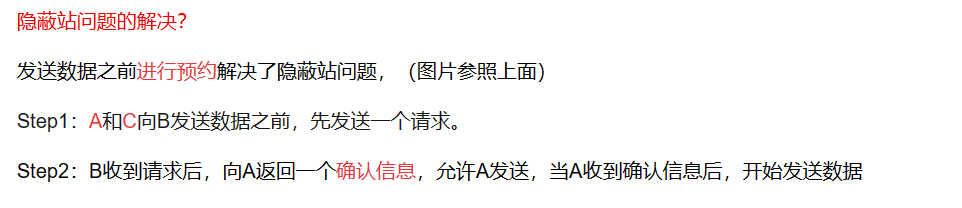
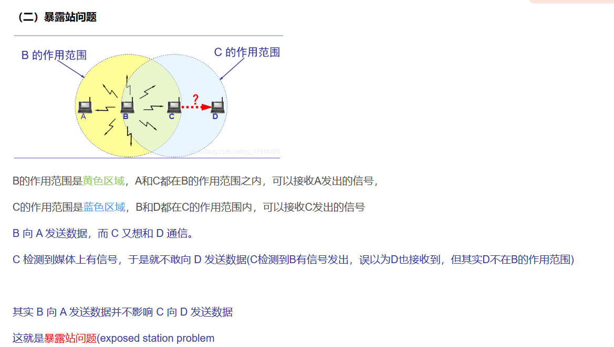

无线局域网、隐蔽站、暴露站

# 四级寻址

1、物理地址
物理地址，也称为链路地址、MAC地址、LAN地址，它是局域网或广域网定义的节点地址。它包含在数据链路层所用的帧中，是最低级的地址。物理地址在网络(LAN或者WAN)中使用，这类地址的长度和格式是可变的。以太网使用6个字节(48位)物理地址，在网络接口卡(NIC)上标明。

2、逻辑地址(IP地址)
逻辑地址，与下面的物理网络无关，它唯一定义了连接到因特网的一台主机，32位。

3、端口地址
在TCP/IP分层体系结构中，赋于进程的标识符称为端口地址，它的长度是16位。

4、专用地址
有些面向用户的应用被设计为专用地址。例如，电子邮件的地址和统一资源定位符(URL)（如www.baidu.com）。这些地址由发送计算机转换成对应的端口地址和逻辑地址。

问：端口地址、逻辑地址、物理地址有什么不同？
答：物理地址是节点的本地地址，数据链路层使用它将数据从一个节点传递到同一网络中的另一个节点。逻辑地址在网络层定义发送方和接收方，用于跨多个网络传递消息。端口地址(服务点)标识了站点上的应用程序。

# OSI的七层简答

物理层：实现比特流的传输

数据链路层：成帧、差错控制、流量控制、介质访问控制、链路控制等

网络层：异构网络互联、路由和转发、拥塞控制

传输层：端到端的数据通信

会话层：建立、管理以及终止进程间的会话、实现数据同步

表示层：数据格式的转换、压缩、加密和解密

应用层：面向用户的接口

# 数字数据编码为数字信号
