# 传输层提供的服务

## 传输层的功能

为运行在不同主机上的进程之间提供逻辑通信

可靠的服务

传输层的功能：

1. 提供应用进程之间的逻辑通信（即端到端通信）
2. 复用和分用。复用是指发送放不同应用进程都可使用同一个传输层协议传送数据。分用是指接收方的传输层在剥去报文的首部后能够把这些数据正确交付到目的应用进程。
3. 对收到的报文进行差错检测（首部和数据部分）。网络层只检查IP数据报首部。
4. 提供两种不同的传输协议，即面向连接的TCP和无连接的UDP。（在网络层要么只提供面向连接的服务，如虚电路；要么只提供无连接服务，如数据报，而不能在网络层同时存在这两种方式）

## 传输层的寻址与端口

### 端口的作用

端口能够让应用层的各种应用进程将数据通过端口向下交付到传输层，以及让传输层知道应当将其报文段的数据向上通过端口交付到应用层相应的进程。

端口是传输层服务访问点（TSAP），端口标识的是主机中的应用进程。

数据链路层的SAP是MAC地址，网络层的SAP是IP地址，传输层的SAP是端口。

传输层使用的是软件端口。软件端口是应用层的各种协议进程与传输实体进行层间交互的一种地址。

### 端口号

应用进程通过端口号进行标识。

端口号长度为**16bit（2字节）**，能够表示65536个不同的端口号。

端口号只具有本地意义，即端口号只标识本计算机应用层中的各进程，在因特网中不同计算机的相同端口号是没有联系的。

根据端口号范围可将端口号分为2类：

1. 服务器端使用的端口号
2. 客户端使用的端口号

服务器端的端口号又分为两类：

1. 熟知端口号：数值为0~1023，IANA(互联网地址指派机构)这些端口号指派给了TCP/IP最重要的一些应用程序。

   | 应用程序   | FTP  | TELNET | SMTP | DNS  | TFTP | HTTP | SNMP | HTTPS |
   | ---------- | ---- | ------ | ---- | ---- | ---- | ---- | ---- | ----- |
   | 熟知端口号 | 21   | 23     | 25   | 53   | 69   | 80   | 161  | 443   |

   

2. 登记端口号：数值为1024~49151.使用这类端口号必须在IANA登记，以防止重复。

客户端使用的端口号：数值为49152~65535。也称为：短暂端口号、临时端口号。仅在客户进程运行时才动态的选择。

### 套接字

在网络中通过IP地址来标识和区别不同主机，通过端口号来标识和区别一台主机中的不同应用进程，端口号拼接到IP地址即构成套接字Socket。

在网络中采用发送方和接收方的套接字来识别端点。
套接字，实际上是一个通信端点，即：套接字Socket=(IP地址：端口号)它唯一地标识网络中地一台主机和其上的一个应用(进程)。

## 无连接服务与面向连接服务

面向连接服务就是在通信双方通信之前，必须先建立连接，在通信过程中，整个连接的情况一直被实时监控和管理。通信结束后，应释放这个连接。

无连接服务是指两个实体之间的通信不需要先建立连接，需要通信时，直接将信息发到“网络”中，让该信息的传递在网络上尽力而为地往目的地送。

TCP/IP协议簇在IP层之上使用了两个传输协议：

1. 面向连接地传输控制协议（TCP），采用TCP时，传输层向上提供地是一条全双工的可靠逻辑信道。
2. 无连接的用户数据报协议（UDP），采用UDP时，传输层向上提供的是一条不可靠信道

TCP 提供面向连接的服务，在传送数据之前必须先建立连接，数据传送结束后要释放连接。

TCP 不提供广播或组播服务。

由于 TCP 提供面向连接的可靠传输服务，因此不可避免地增加了许多开销，如确认、流量控制、计时器及连接管理等。这不仅使协议数据单元的头部增大很多，还要占用许多的处理机资源。因此 TCP 主要适用于可靠性更重要的场合，如文件传输协议 (FTP)、超文本传输协议 (HTTP)、远程登录 (TELNET)等。

UDP 是一个无连接的非可靠传输层协议。它在 IP 之上仅提供两个附加服务:多路复用和对数据的错误检查。IP 知道怎样把分组投递给一台主机，但不知道怎样把它们投递给主机上的具体应用。

UDP 在传送数据之前不需要先建立连接，远程主机的传输层收到 UDP 报文后，不需要给出任何确认。由于UDP 比较简单，因此执行速度比较快、实时性好。使用UDP 的应用主要包括小文件传送协议(TFTP)、DNS、SNMP 和实时传输协议(RTP)。

注意:

1. IP 数据报和UDP 数据报的区别: IP 数据报在网络层要经过路由的存储转发，而UDP数据报在传输层的端到端的逻辑信道中传输，封装成 IP 数据报在网络层传输时，UDP 数据报的信息对路由是不可见的。
2. TCP 和网络层虚电路的区别: TCP 报文段在传输层抽象的逻辑信道中传输，对路由器不可见;虚电路所经过的交换结点都必须保存虚电路状态信息。在网络层若采用虚电路方式，则无法提供无连接服务;而传输层采用 TCP不影响网络层提供无连接服务

# UDP协议

## UDP概述

UDP尽在IP的数据报之上增加了两个最基本的服务：复用和分用、差错检测

UDP的优点：

1. UDP无需连接。不会引入建立连接的时延。如DNS运行在UDP之上
2. 无连接状态。TCP需要在端系统中维护连接状态。此连接状态包括接收和发送缓存，拥塞控制参数和序号与确认号的参数。而UDP不维护连接状态，也不跟踪这些参数。因此，某些专用应用服务器使用UDP时，一般都能支持更多的活动客户机。
3. 分组首部开销小。TCP有20B的首部开销，而UDP仅有8B的开销
4. 应用层能更好的控制要发送的数据和发送时间。UDP没有拥塞控制，因此在网络中的拥塞不会影戏主机的发送效率。某些实时应用要求以更稳定的速度发送，能容忍一些数据的丢失，但不允许有较大的延迟，而UDP正好能满足这些要求。
5. UDP支持一对一、一对多、多对一和多对多的交互通信

UDP常用于一次性传输较少数据的网络应用，如DNS、SNMP等

UDP也常用于多媒体应用（如IP电话、实时视频会议、流媒体等）

UDP不保证可靠交付。

UDP是面向报文的。发送方UDP对应用层交下来的报文，在添加首部后就向下交付给IP层，一次发送一个报文，既不合并也不拆分，而是保留这些报文的边界。接收方UDP对IP层交上来的UDP数据报，在去除首部后就原封不动地交付给上层应用进程，一次交付一个完整的报文。因此报文不可分割，是UDP的最小单位。因此应用程序必须选择合适大小的报文，若报文太长，UDP把它交给IP层后，可能会导致分片；若报文太短，UDP在把它交给IP层后，会使IP数据报的相对长度太大，二者会降低IP层的效率。

## UDP的首部格式

UDP数据报包含两部分：UDP首部和用户数据。

UDP**首部有8B**，由4个字段组成，每个字段的长度都是2B

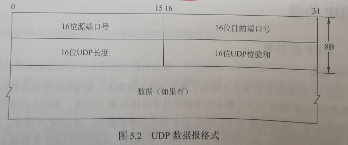

1. 源端口（2B）。源端口号。在需要对方回信时选用，不需要时可全用0。
2. 目的端口（2B）。目的端口号。这在重点交付报文时必须使用到。
3. **长度（2B）**。UDP数据报的长度（包括首部和数据），其最小值是8（仅有首部），**单位是B**。
4. 检验和（2B）。检测UDP数据报在传输中是否出错。有错就丢弃。该字段是可选的，当源主机不想计算校验和时，直接令该字段全为0。检查伪首部、首部和数据部分

当传输层从IP层收到UDP数据报时，就根据首部中的目的端口，把UDP数据报通过相应的端口交给应用进程

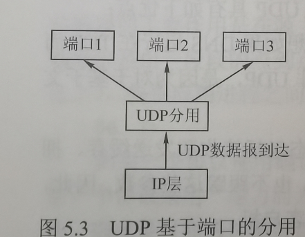

如果接收方UDP发现收到的报文中的目的端口不正确（即不存在对应于端口号的应用进程），那么就丢弃该报文，并由ICMP发送“端口不可达”差错报文给发送方。

## UDP校验

在计算校验和时，要在UDP数据报之前增加12B的伪首部并不是UDP的真正首部。

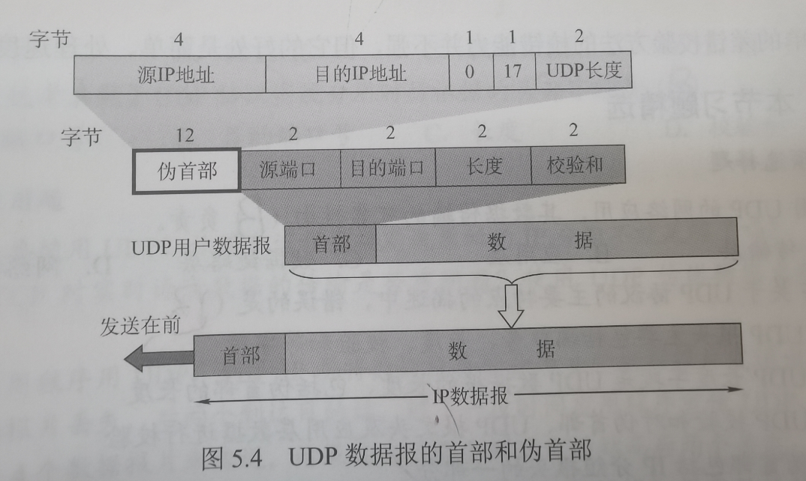
UDP校验和的计算方法和IP数据报首部校验和的计算方法相似。但不同的是IP数据报的首部校验和只建议IP数据报的首部，但UDP的校验和则检查首部和数据部分。

发送方首先把全零放入检验和字段并添加伪首部，然后把UDP数据报视为许多16位的字串接起来。若UDP数据报的数据部分不是偶数个字节，则要在数据部分末尾填入一个全零字节（但此字节不发送）。然后按二进制反码计算出这些16位字的和，将次和的二进制反码写入校验和字段并发送。

接收方把收到的UDP数据报加上伪首部（如果不为偶数个字节，那么还需要补上全零字节）后，按二进制反码求这些16位字的和。当无差错时其结果应为全1，否则就表明有差错出现，接收方就应该丢弃这个UDP数据报。

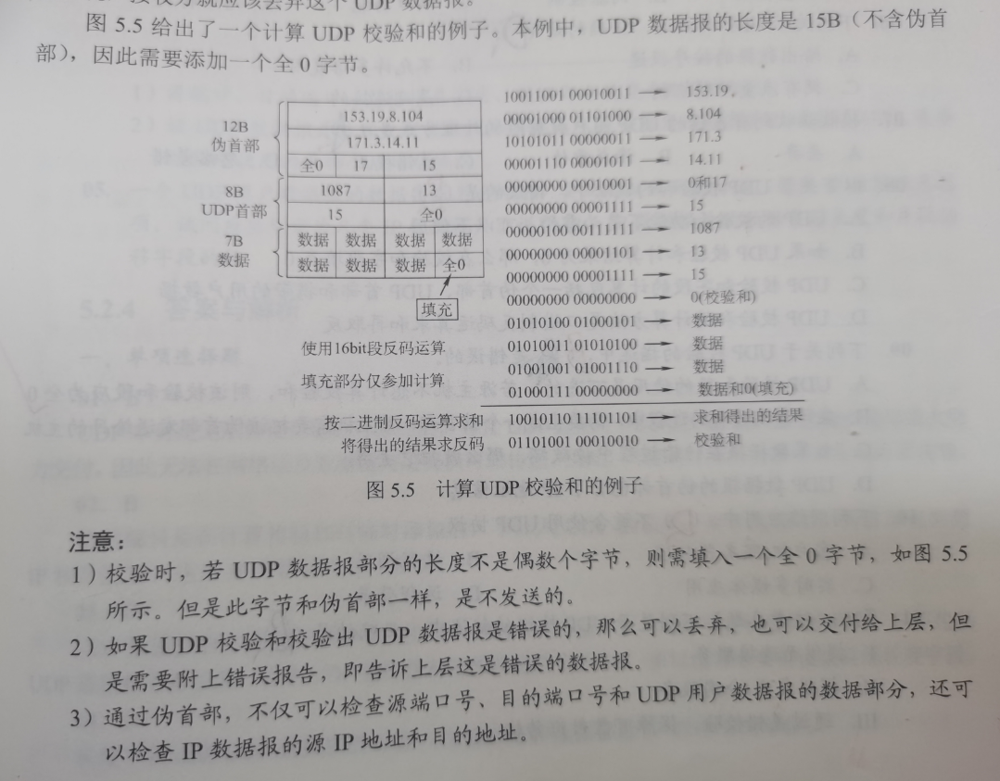

# TCP

## TCP协议的特点

TCP是在不可靠的IP层上实现的可靠的数据传输协议，它主要解决传输的可靠、有序、无丢失和不重复问题。

TCP是TCP/IP体系中非常复杂的一个协议，主要特点如下：

1. TCP是面向连接的传输层协议，TCP连接是一条逻辑连接。

2. 每一条TCP连接只能有两个端点，每一条TCP连接只能是点到点的（一对一）。

3. TCP提供可靠的交付的服务，保证传送的数据无差错、不丢失、不重复且有序。

4. TCP提供全双工通信，允许通信双方的应用进程在任何时候都能发送数据，为此TCP连接的两端都设有发送缓存和接收缓存，用来临时存放双向通信的数据。

   发送缓存用来暂时存放以下数据：①发送应用程序传送给发送方TCP准备发送的数据。②TCP已发送但尚未收到确认的数据。
   接收缓存用来暂时存放以下数据：①按序到达但尚未被应用程序读取的数据；②不按序到达的数据。

5. TCP是面向字节流的。虽然应用程序和TCP的交互是一次一个数据块（大小不等），但TCP把应用程序交下来的数据仅视为一连串的无结构的字节流。

TCP和UDP在发送报文时所采用的方式完全不同。UDP报文的长度由发送应用程序决定，而TCP报文的长度则根据接收方给出的窗口值和当前网络拥塞程度来决定。如果应用程序传送到TCP缓存的数据块太长，TCP就把它划分得短一些再传送；如果太短，TCP也可以等到积累足够多的字节后再构成报文段发送出去。

## TCP报文段

TCP传送的数据单元称为报文段。

TCP报文段既可以用来运载数据，也可以用来建立连接、释放连接、应答。

一个TCP报文段分为首部和数据两部分，整个TCP报文段作为IP数据报的数据部分封装在IP数据报中。

其首部前20B是固定的。TCP首部最短为20B。后面有4N字节是根据需要而增加的选项，长度是4B的整数倍。

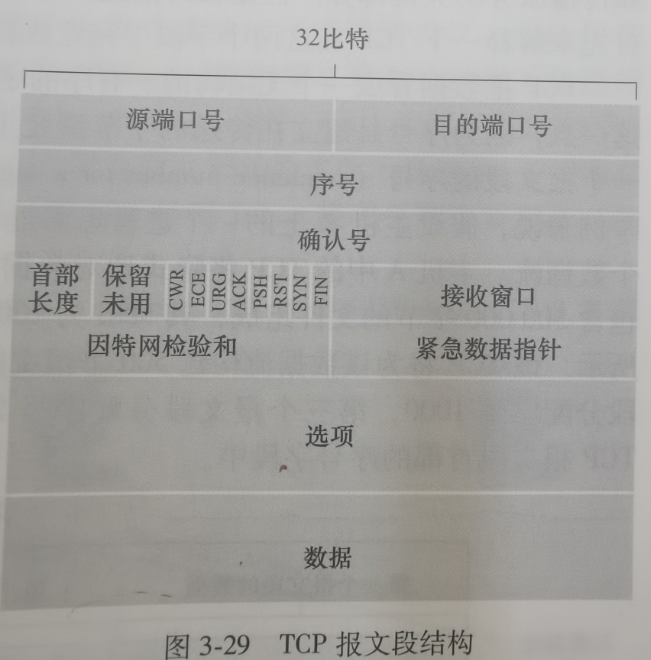

1. **源端口和目的端口**。各占2B。端口是传输层与应用层的服务接口，传输层的复用和分用功能都要通过端口实现。

2. **序号**。占4B，范围为0~2^32^-1，共2^32^个序号。TCP是面向字节流的（即TCP传送时是逐个字节传送的），所以TCP连接传送的字节流中的每个字节都按顺序编号。序号字段的值指的是本报文段所发送的数据的第一个字节的序号。

   例如，一报文段的序号字段值是301，而携带的数据共100B，表明本报文段的数据的最后一个字节的序号是400，因此下一个报文段的数据序号应从401开始。

3. **确认号**。占4B，是期望收到对方下一个报文段的第一个数据字节的序号。若确认号为N，则表明到序号N-1为止的所有数据都已正确收到。

   例如，B正确收到了A发送过来的一个报文段，其序号字段是501，而数据长度是200B(序号501~700)，这表明B正确收到了A发送的到序号700为止的数据。因此B期望收到的下一个数据编号是701，于是B在发送给A的确认报文段中把确认号置为701.

4. **数据偏移**（即 **首部长度**）。**占4位，以4B为单位**。TCP首部长度（通常选项字段为空，所以TCP首部的典型长度为20B）

5. **保留**。**占4位。**保留为今后使用，但目前应置为0。

6. **拥塞窗口缩减位CWR**：明确拥塞通告中使用

7. **明确拥塞通告回显位ECE**：

8. **紧急位 URG**。当URG=1 时，表明紧急指针字段有效。它告诉系统此报文段中有紧急数据，应尽快传送(相当于高优先级的数据)。但 URG 需要和首部中紧急指针字段配合使用，即数据从第一个字节到紧急指针所指字节就是紧急数据。

9. **确认位 ACK。仅当ACK=1时确认号字段才有效。**当 ACK=0时，确认号无效。**TCP 规定，在连接建立后所有传送的报文段都必须把 ACK 置 1。**

10. **推送位 PSH(Push)**。接收方 TCP 收到 PSH=1的报文段，就尽快地交付给接收应用进程，而不再等到整个缓存都填满了后再向上交付。

11. **复位位 RST(Reset)。**当 RST=1 时，表明 TCP 连接中出现严重差错(如主机崩溃或其他原因)，**必须释放连接，然后再重新建立运输连接。**

12. **同步位 SYN**。当SYN=1时表示这是一个连接请求或连接接受报文
    **当 SYN=1，ACK=0 时，表明这是一个连接请求报文，对方若同意建立连接，则应在响应报文中使用 SYN=1，ACK=1。**

13. **终止位 FIN (Finish)。用来释放一个连接。**当FIN=1时，表明此报文段的发送方的数据已发送完毕，并要求释放运输连接。

14. **窗口。占 2B**，范围为 0 ~ 2^16^-1。它指出现在**允许对方发送的数据量**，接收方的数据缓存空间是有限的，因此用窗口值作为接收方让发送方设置其发送窗口的依据。
    例如，设确认号是 701，窗口字段是 1000。这表明，从 701 号算起，发送此报文段的一方还有接收1000字节数据 (字节序号为 701~1700)的接收缓存空间。

15. **校验和。占 2B。**校验和字段检验的范围包括**首部和数据**两部分。在计算校验和时，和UDP一样，要在 TCP 报文段的前面加上 **12B 的伪首部**(只需将UDP 伪首部的协议字段的 17改成6，UDP长度字段改成TCP 长度，其他的和UDP 一样)。

16. **紧急指针。占 2B**。紧急指针**仅在 URG=1 时才有意义**，它指出在本报文段中紧急数据共有多少字节 (紧急数据在报文段数据的最前面)。

17. **选项。长度可变。**TCP 最初只规定了一种选项，即**最大报文段长度(Maximum Segment Size,MSS)**。MSS 是TCP 报文段中的数据字段的最大长度(注意仅仅是数据字段)。

18. **填充。这是为了使整个首部长度是 4B 的整数倍。**

## TCP连接管理

三个阶段：连接建立，数据传送，连接释放。

TCP连接的管理就是使运输连接的建立和释放都能正常进行。

解决三个问题：

1. 要使每一方能够确知对方的存在。
2. 要允许双方协商一些参数（如窗口最大值、是否使用窗口的扩大选项、时间戳选项及服务质量等）。
3. 能够对运输实体资源进行分配（如缓存大小、连接表中的项目等）

TCP 把连接作为最基本的抽象，每条 TCP 连接有两个端点，TCP 连接的端点不是主机，不是主机的IP 地址，不是应用进程，也不是传输层的协议端口。**TCP 连接的端口即为套接字(Socket)或插口，每条 TCP 连接唯一地被通信的两个端点(即两个套接字)确定**。

**套接字Socket=(IP地址：端口号)**它唯一地标识网络中地一台主机和其上的一个应用(进程)。

TCP 连接的建立采用**客户/服务器模式**。主动发起连接建立的应用进程称为客户(Client)，而被动等待连接建立的应用进程称为服务器 (Server)。

### TCP连接的建立

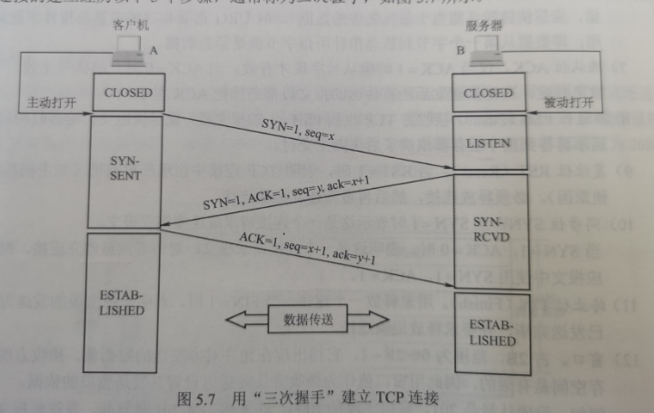

连接建立前，**服务器**进程处于 **LISTEN(收听)状态**，**等待客户的连接请求**。
第一步：客户机的 TCP 首先向服务器的 TCP 发送连接请求报文段。这个特殊报文段的首部中的**同步位 SYN 置 1**，同时选择一个**初始序号 seq=x**。**TCP 规定，SYN 报文段不能携带数据，但要消耗掉一个序号**。这时，TCP 客户进程进入 **SYN-SENT (同步已发送) 状态**。

第二步:服务器的 TCP 收到连接请求报文段后，如同意建立连接，则**向客户机发回确认，并为该TCP 连接分配缓存和变量**。在确认报文段中，**把SYN位和ACK位都置1，确认号是ack=x+1，同时也为自己选择一个初始序号 seq=y**。注意，**该确认报文段不能携带数据，但也要消耗掉一个序号。**这时，TCP 服务器进程进入 **SYN-RCVD (同步收到)状态**。

第三步:当客户机收到确认报文段后，还要**向服务器给出确认，并为该TCP 连接分配缓存和变量。确认报文段的ACK 位置 1，确认号 ack=y+1，序号 seq=x+1。该报文段可以携带数据若不携带数据则不消耗序号。**这时，TCP 客户进程进入 **ESTABLISHED (已建立连接)状态**。

成功进行以上三步后，就建立了 TCP 连接，接下来就可以传送应用层数据。TCP 提供的是全双工通信，因此通信双方的应用进程在任何时候都能发送数据。

另外，值得注意的是，服务器端的资源是在完成第二次握手时分配的，而客户端的资源是在完成第三次握手时分配的，这就使得服务器易于受到 **SYN 洪泛攻击**。

### TCP连接的释放

四次握手（挥手）

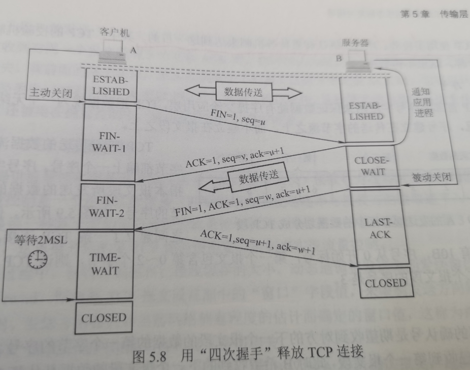

第一步：客户机打算关闭连接时，向其 TCP 发送**连接释放报文段**，并停止发送数据，主动关闭TCP 连接，该报文段的**终止位 FIN 置 1**，序号 seq=u，它等于前面已传送过的数据的最后一个字节的序号加 1，**FIN 报文段即使不携带数据，也消耗掉一个序号**。这时，TCP 客户进程进入 **FIN-WAIT-1(终止等待 1)状态**。TCP 是全双工的，即可以想象为一条 TCP 连接上有两条数据通路发送 FIN 的一端不能再发送数据，即关闭了其中一条数据通路，但对方还可以发送数据。

第二步：服务器收到连接释放报文段后即**发出确认，确认号 ack=u+1，序号 seq=v**，等于它前面已传送过的数据的最后一个字节的序号加 1。然后服务器进入 **CLOSE-WAIT (关闭等待)状态**。**此时，从客户机到服务器这个方向的连接就释放了，TCP 连接处于半关闭状态。**但服务器若发送数据，客户机仍要接收，即从服务器到客户机这个方向的连接并未关闭。

第三步：若服务器已经没有要向客户机发送的数据，就通知 TCP 释放连接，此时，其**发出 FIN=1的连接释放报文段**。设该报文段的序号为 w(在半关闭状态服务器可能又发送了一些数据)，还须**重复上次已发送的确认号 ack=u+1**。这时服务器进入**LAST-ACK(最后确认) 状态**。

第四步：客户机收到连接释放报文段后，必须发出确认。把确认报文段中的**确认位 ACK 置1，确认号 ack=w+1，序号 seq=u+1**。此时 TCP 连接还未释放，必须经过时间**等待计时器**设置的时间**2MSL(最长报文段寿命）**后，客户机才进入 **CLOSED(连接关闭)状态**

对上述 TCP连接建立和释放的总结如下:
1) 连接建立。分为3 步:
①SYN=1，seq=x。
②SYN=1，ACK=1,seq=y, ack=x+1。
③ACK=1,seq=x+1,ack=y+1。
1) 释放连接。分为4步:
①FIN=1，seq=u。
②ACK=1，seq=v,ack=u+1。
③FIN=1，ACK=1,seq=w, ack=u+1。
④ACK=1，seq=u+1,ack=w+1。

## TCP可靠传输

TCP的任务是在IP层不可靠的、尽力而为服务的基础上建立一种可靠数据传输服务。TCP提供的可靠数据传输服务保证接收方进程从缓冲区读出的字节流与发送方发出的字节流完全一样。TCP使用检验、序号、确认、重传等机制来达到这一目的。

### 序号

TCP首部的序号字段用来保证数据能有序提交给应用层，TCP把数据视为一个无结构但有序的字节流，序号建立在传送的字节流之上，而不建立在报文段之上。

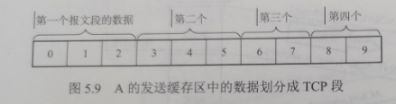

TCP连接传送的数据流中的每个字节都编上一个序号。序号字段的值是指本报文段所发送的数据的第一个字节的序号。

### 确认

TCP 首部的确认号是期望收到对方的下一个报文段的数据的第一个字节的序号。发送方缓存区会继续存储那些已发送但未收到确认的报文段，以便在需要时重传。

TCP 默认使用累积确认，即 TCP 只确认数据流中至第一个丢失字节为止的字节。

### 重传

有两种事件会导致 TCP 对报文段进行重传：**超时**和**冗余 ACK**

#### 超时

T**CP 每发送一个报文段，就对这个报文段设置一次计时器。**计时器设置的重传时间到期但还未收到确认时，就要重传这一报文段。

由于 TCP 的下层是一个互联网环境，IP 数据报所选择的路由变化很大，因而传输层的往返时延的方差也很大。为了计算超时计时器的重传时间，TCP 采用一种**自适应算法，它记录一个报文段发出的时间，以及收到相应确认的时间，这两个时间之差称为报文段的往返时间(Round-Trip Time，RTT)。**TCP 保留了 RTT 的一个**加权平均往返时间 RTTs**，它会随新测量 RTT 样本值的变化而变化。显然，**超时计时器设置的超时重传时间(Retransmission Time-Out，RTO)应略大于RTTs**，但也不能大太多，否则当报文段丢失时，TCP 不能很快重传，导致数据传输时延大。

#### 冗余ACK(余确认)

超时触发重传存在的一个问题是超时周期往往太长。所幸的是，发送方通常可在超时事件发生之前通过注意所谓的冗余 ACK 来较好地检测丢包情况。

冗余 ACK 就是再次确认某个报文段的ACK，而发送方先前已经收到过该报文段的确认。例如，发送方 A 发送了序号为 1、2、3、4、5
的 TCP 报文段，其中2 号报文段在链路中丢失，它无法到达接收方 B。因此3、4、5 号报文段对于B 来说就成了失序报文段。

**TCP 规定每当比期望序号大的失序报文段到达时,就发送一个冗余 ACK指明下一个期待字节的序号。**在本例中，3、4、5 号报文到达 B，但它们不是 B 所期望收到的下个报文，于是 B 就发送3个对1 号报文段的余 ACK，表示自己期望接收2 号报文段。

**TCP 规定当发送方收到对同一个报文段的 3 个冗余 ACK 时，就可以认为跟在这个被确认报文段之后的报文段已经丢失。**就前面的例子而言，当A 收到对于1号报文段的3 个元余ACK 时，它可以认为2号报文段已经丢失，这时发送方A 可以立即对 2 号报文执行重传，这种技术通常称为**快速重传**。

### TCP流量控制

TCP 提供流量控制服务来消除发送方(发送速率太快) 使接收方缓存区溢出的可能性，因此可以说流量控制是一个速度匹配服务(匹配发送方的发送速率与接收方的读取速率)。

**TCP 提供一种基于滑动窗口协议的流量控制机制**

在通信过程中，**接收方根据自已接收缓存的大小，动态地调整发送方的发送窗口大小**，这称为**接收窗口 rwnd**，即调整 TCP 报文段首部中的“窗口”字段值，来限制发送方向网络注入报文的速率。同时，发**送方根据其对当前网络拥塞程度的估计而确定的窗口值，这称为拥塞窗口 cwnd**，其大小与网络的带宽和时延密切相关。

在通信中，有效数据只从 A 发往 B，而B仅向A 发送确认报文，这时 B可以通过设置确认报文段首部的窗口字段来将 rwnd 通知给A。rwnd 即接收方允许连续接收的最大能力，单位是字节。发送方A 总是根据最新收到的 rwnd 值来限制自已发送窗口的大小，从而将未确认的数据量控制在 rwnd 大小之内，保证 A 不会使 B 的接收缓存溢出。当然，A 的发送窗口的实际大小取 rwnd 和 cwnd 中的最小值。图5.10 中的例说明了如何利用滑动窗口机制进行流量控制。
设A向B 发送数据，在连接建立时，B 告诉A:“我的接收窗口 rwnd=400”。接收方主机B 进行了三次流量控制，这三个报文段都设置了 ACK=1，只有在 ACK=1时确认号字段才有意义。第一次把窗口减小到rwnd=300，第二次又减到rwnd=100，最后减到rwnd=0，即不允许发送方再发送数据。这使得发送方暂停发送的状态将持续到 B 重新发出一个新的窗口值为止。

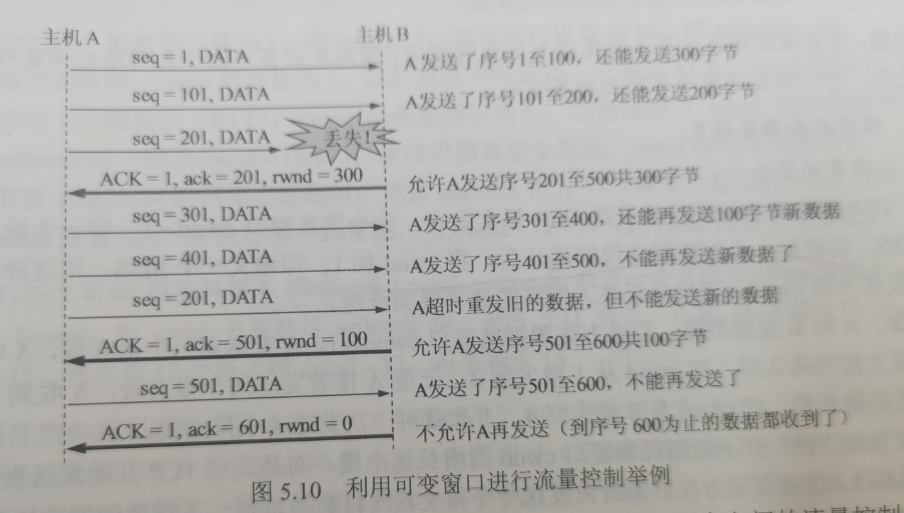

传输层和数据链路层的流量控制的区别是:传输层定义端到端用户之间的流量控制，数据链路层定义两个中间的相邻结点的流量控制。另外，数据链路层的滑动窗口协议的窗口大小不能动态变化，传输层的则可以动态变化。

### TCP拥塞控制

拥塞控制是指**防止过多的数据注入网络，保证网络中的路由器或链路不致过载**。出现拥塞时，端点并不了解拥塞发生的细节，对通信连接的端点来说，**拥塞往往表现为通信时延的增加**。

**拥塞控制与流量控制的区别:** 

1. **拥塞控制**是让网络能够承受现有的网络负荷，是一个**全局性的过程**，涉及所有的主机、所有的路由器，以及与降低网络传输性能有关的所有因素。
2. 相反，**流量控制**往往是指**点对点**的通信量的控制，是个端到端的问题(接收端控制发送端)，它所要做的是**抑制发送端发送数据的速率，以便使接收端来得及接收。**
3. 当然，拥塞控制和流量控制也有相似的地方，即它们**都通过控制发送方发送数据的速率来达到控制效果。**

例如，某个链路的传输速率为 10Gb/s，某大型机向一台 PC 以 1Gb/s 的速率传送文件，显然网络的带宽是足够大的，因而不存在拥塞问题，但如此高的发送速率将导致 PC 可能来不及接收因此必须进行流量控制。但若有 100 万台 PC 在此链路上以 1Mb/s 的速率传送文件，则现在的问题就变为网络的负载是否超过了现有网络所能承受的范围。

因特网建议标准定义了进行**拥塞控制的 4 种算法:慢开始、拥塞避免、快重传和快恢复。**

发送方在确定发送报文段的速率时，既要根据接收方的接收能力，又要从全局考虑不要使网络发生拥塞。因此，TCP 协议要求发送方维护以下两个窗口:
1. 接收窗口 rwnd，接收方根据目前接收缓存大小所许诺的最新窗口值，反映接收方的容量由接收方根据其放在 TCP 报文的首部的窗口字段通知发送方。

2) 拥塞窗口 cwnd，发送方根据自己估算的网络拥塞程度而设置的窗口值，反映网络的当前容量。只要网络未出现拥塞，拥塞窗口就再增大一些，以便把更多的分组发送出去。但只要网络出现拥塞，拥塞窗口就减小一些，以减少注入网络的分组数。

发送窗口的上限值应取接收窗口 rwnd 和拥塞窗口 cwnd 中较小的一个，即发送窗口的上限值=min[rwnd,cwnd]
接收窗口的大小可根据 TCP 报文首部的窗口字段通知发送方，而发送方如何维护拥塞窗口呢?这就是下面讲解的慢开始和拥塞避免算法。

#### 慢开始和拥塞避免

#####  慢开始算法

在TCP刚刚连接好并开始发送 TCP 报文段时，先令拥塞窗口 cwnd=1，即一个最大报文长度MSS。每收到一个对新报文段的确认后，将 cwnd 加1，即增大一个MSS。用这样的方法步增大发送方的 cwnd，可使分组注入网络的速率更加合理。

例如，A向B 发送数据，发送方先置拥塞窗口 cwnd=1，A 发送第一个报文段，A收到B对第一个报文段的确认后，把 cwnd 从1增大到 2:于是 A 接着发送两个报文段，A收到B对这两个报文段的确认后，把 cwnd 从2增大到 4，下次就可一次发送4个报文段。

慢开始的“慢”并不是指拥塞窗口 cwnd 的增长速率慢，而是指在 TCP 开始发送报文段时先设置 cwnd=1，使得发送方在开始时只发送一个报文段(目的是试探一下网络的拥塞情况)，然再逐渐增大cwnd，这对防止网络出现拥塞是个非常有力的措施。使用慢开始算法后，每经过
个传输轮次(即往返时延 RTT)，cwnd就会加倍，即 cwnd 的值随传输轮次指数规律增长。这样慢开始一直把 cwnd 增大到一个规定的慢开始门限 ssthresh(值)，然后改用拥塞避免算法。

##### 拥塞避免算法

拥塞避免算法的思路是让拥塞窗口 cwnd 缓增大，具体做法是:每经过一个往返时延 RTT 就把发送方的拥塞窗口 cwnd 加 1，而不是加倍,使拥塞窗口 wnd 按线性规律缓慢增长(即加法增大)。
这比慢开始算法的拥塞窗口增长速率要缓慢得多。
根据 cwnd 的大小执行不同的算法，可归纳如下:

- 当 cwnd<ssthresh 时，使用慢开始算法。
- 当cwnd>ssthresh 时，停止使用慢开始算法而改用拥塞避免算法。
- 当cwnd=ssthresh 时，既可使用慢开始算法，又可使用拥塞避免算法(通常做法)。

##### 网络拥塞的处理

无论在慢开始阶段还是在拥塞避免阶段，只要发送方判断网络出现拥塞(未按时收到确认)，就要把慢开始门限 ssthresh 设置为出现拥塞时的发送方的 cwnd 值的一半(但不能小于 2)。然后把拥塞窗口 cwnd 重新设置为 1，执行慢开始算法。这样做的目的是迅速减少主机发送到网络中的分组数，使得发生拥塞的路由器有足够时间把队列中积压的分组处理完。

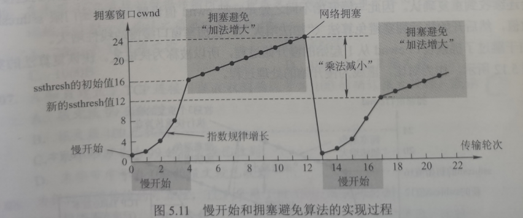

初始时，拥塞窗口置为1，即 cwnd=1，慢开始门限置为 16，即 ssthresh=16。

慢开始阶段，cwnd的初值为 1，以后发送方每收到一个确认ACK，cwnd值加1，也即经过每个传输轮次(RTT)，cwnd 呈指数规律增长。当拥塞窗口 cwnd 增长到慢开始门限ssthresh 时(即当cwnd=16 时)，就改用拥塞避免算法，cwnd 按线性规律增长。

假定cwnd=24时网络出现超时，更新ssthresh值为12(即变为超时时cwnd值的一半),cwnd 重置为1，并执行慢开始算法，当 cwnd=12 时，改为执行拥塞避免算法。

注意：在慢开始(指数级增长)阶段,若2cwnd>ssthresh,则下一个RTT后的cwnd等于ssthresh,而不等于 2cwnd，即 cwnd 不能跃过 ssthresh 值。如图 5.11 所示，在第 16 个轮次时 cwnd=8、ssthresh=12，则在第 17 个轮次时 cwnd=12，而不等于16。

在慢开始和拥塞避免算法中使用了“**乘法减小**”和“**加法增大**”方法。“乘法减小”是指不论是在慢开始阶段还是在拥塞避免阶段，只要出现超时(即很可能出现了网络拥塞)，就把慢开始门限值 ssthresh 设置为当前拥塞窗口的一半(并执行慢开始算法)。当网络频繁出现拥塞时，ssthresh 值就下降得很快，以大大减少注入网络的分组数。而“加法增大”是指执行拥塞避免算法后，在收到对所有报文段的确认后(即经过一个 RTT)，就把拥塞窗口 cwnd 增加一个 MSS大小，使拥塞窗口缓慢增大，以防止网络过早出现拥塞。

拥寨避免并不能完全避免拥塞。利用以上措施要完全避免网络拥塞是不可能的。拥塞避免是指在拥塞避免阶段把拥塞窗口控制为按线性规律增长，使网络比较不容易出现拥塞。

#### 快重传和快恢复

快重传和快恢复算法是对慢开始和拥塞避免算法的改进

##### 快重传

在上一节介绍的 TCP 可靠传输机制中，快重传技术使用了冗余 ACK 来检测丢包的发生。同样，冗余 ACK 也用于网络拥塞的检测(丢了包当然意味着网络可能出现了拥塞)。快重传并非取消重传计时器，而是在某些情况下可更早地重传丢失的报文段。当发送方连续收到三个重复的 ACK 报文时，直接重传对方尚未收到的报文段，而不必等待那个报文段设置的重传计时器超时。

#####  快恢复

快恢复算法的原理如下:当发送方连续收到三个冗余 ACK(即重复确认)时，执行“乘法减小”算法，把慢开始门限 ssthresh 设置为此时发送方 cwnd 的一半。这是为了预防网络发生拥塞。但发送方现在认为网络很可能没有发生 (严重)拥塞，否则就不会有几个报文段连续到达接收方，也不会连续收到重复确认。因此与慢开始不同之处是它把 cwnd 值设置为慢开始门限 ssthresh 改变后的数值，然后开始执行拥塞避免算法 (“加法增大”)，使拥塞窗口缓慢地线性增大。

由于**跳过了拥塞窗口 cwnd 从 1 起始的慢开始过程，所以被称为快恢复。**快恢复算法的实现过程如图 5.12 所示，作为对比，虚线为慢开始的处理过程

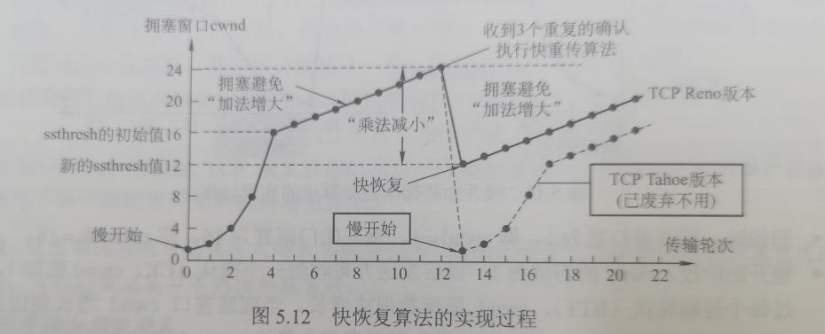

在流量控制中，发送方发送数据的量由接收方决定，而在拥塞控制中，则由发送方自己通过检测网络状况来决定。实际上，慢开始、拥塞避免、快重传和快恢复几种算法是同时应用在拥塞控制机制中。

四种算法使用的总结:在 TCP 连接建立和网络出现超时时，采用慢开始和拥塞避免算法；当发送方接收到冗余 ACK 时，采用快重传和快恢复算法。

接收方的缓存空间总是有限的。因此，发送方发送窗口的实际大小由流量控制和拥塞控制共同决定。当题目中同时出现接收窗口(rwnd)和拥塞窗口(cwnd)时，发送方实际的发送窗口大小是由rwnd和cwnd 中较小的那一个确定的。

对TCP提出的一种修改意见是所谓的选择确认(selective acknowledgment)[RFC2018],它允许TCP接收方有选择地确认失序报文段，而不是累积地确认最后一个正确接收的有序报文段。当将该机制与选择重传机制结合起来使用时(即跳过重传那些已被接收方选择性地确认过的报文段)，TCP看起来就很像我们通常的SR(选择重传)协议。因此，TCP的差错恢复机制也许最好被分类为GBN(回退N步)协议与SR(选择重传)协议的混合体。

TCP QUBIC

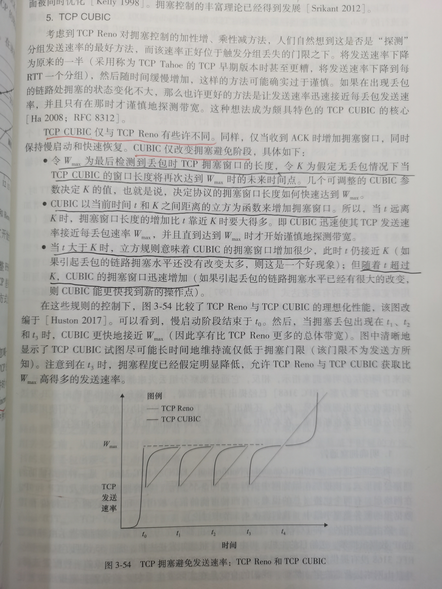

### 明确拥塞通告ECN

P180

明确拥塞通过涉及TCP和IP。在网络层，有两个比特被用于ECN，这两个比特位于IP数据报的服务类型中，服务类型字段中的两个TOS比特。在TCP首部中的ECE位(明确拥塞通过回显)和CWR位(拥塞窗口缩减)。

允许网络明确向TCP发送方和接收方发出拥塞信号。

### 基于时延的拥塞控制

P181

基于时延的方法，目的是在丢包出现之前主动检测拥塞。

cnwd/RTT~min~

### TCP分岔

p176

