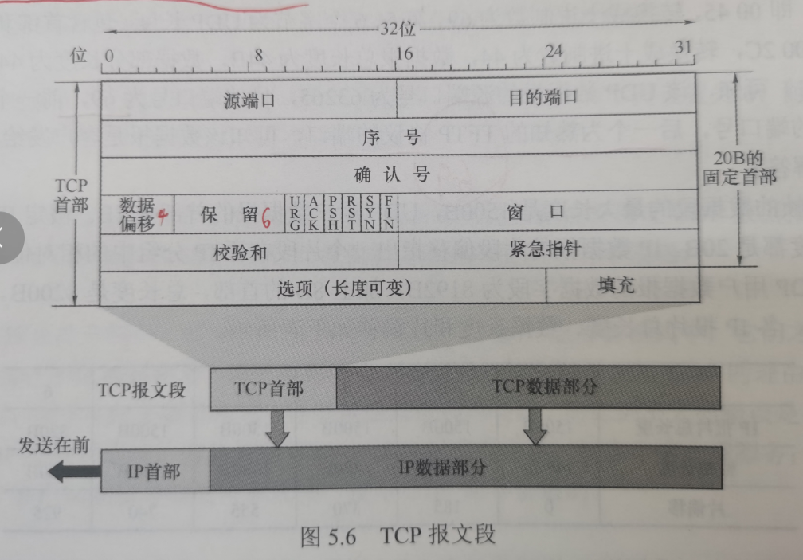

# 传输层提供的服务

## 传输层的功能

为运行在不同主机上的进程之间提供逻辑通信

可靠的服务

传输层的功能：

1. 提供应用进程之间的逻辑通信（即端到端通信）
2. 复用和分用。复用是指发送放不同应用进程都可使用同一个传输层协议传送数据。分用是指接收方的传输层在剥去报文的首部后能够把这些数据正确交付到目的应用进程。
3. 对收到的报文进行差错检测（首部和数据部分）。网络层只检查IP数据报首部。
4. 提供两种不同的传输协议，即面向连接的TCP和无连接的UDP。（在网络层要么只提供面向连接的服务，如虚电路；要么只提供无连接服务，如数据报，而不能在网络层同时存在这两种方式）

## 传输层的寻址与端口

### 端口的作用

端口能够让应用层的各种应用进程将数据通过端口向下交付到传输层，以及让传输层知道应当将其报文段的数据向上通过端口交付到应用层相应的进程。

端口是传输层服务访问点（TSAP），端口标识的是主机中的应用进程。

数据链路层的SAP是MAC地址，网络层的SAP是IP地址，传输层的SAP是端口。

传输层使用的是软件端口。软件端口是应用层的各种协议进程与传输实体进行层间交互的一种地址。

### 端口号

应用进程通过端口号进行标识。

端口号长度为**16bit（2字节）**，能够表示65536个不同的端口号。

端口号只具有本地意义，即端口号只标识本计算机应用层中的各进程，在因特网中不同计算机的相同端口号是没有联系的。

根据端口号范围可将端口号分为2类：

1. 服务器端使用的端口号
2. 客户端使用的端口号

服务器端的端口号又分为两类：

1. 熟知端口号：数值为0~1023，IANA(互联网地址指派机构)这些端口号指派给了TCP/IP最重要的一些应用程序。

   | 应用程序   | FTP  | TELNET | SMTP | DNS  | TFTP | HTTP | SNMP | HTTPS |
   | ---------- | ---- | ------ | ---- | ---- | ---- | ---- | ---- | ----- |
   | 熟知端口号 | 21   | 23     | 25   | 53   | 69   | 80   | 161  | 443   |

   

2. 登记端口号：数值为1024~49151.使用这类端口号必须在IANA登记，以防止重复。

客户端使用的端口号：数值为49152~65535。也称为：短暂端口号、临时端口号。仅在客户进程运行时才动态的选择。

### 套接字

在网络中通过IP地址来标识和区别不同主机，通过端口号来标识和区别一台主机中的不同应用进程，端口号拼接到IP地址即构成套接字Socket。

在网络中采用发送方和接收方的套接字来识别端点。
套接字，实际上是一个通信端点，即：套接字Socket=(IP地址：端口号)它唯一地标识网络中地一台主机和其上的一个应用(进程)。

## 无连接服务与面向连接服务

面向连接服务就是在通信双方通信之前，必须先建立连接，在通信过程中，整个连接的情况一直被实时监控和管理。通信结束后，应释放这个连接。

无连接服务是指两个实体之间的通信不需要先建立连接，需要通信时，直接将信息发到“网络”中，让该信息的传递在网络上尽力而为地往目的地送。

TCP/IP协议簇在IP层之上使用了两个传输协议：

1. 面向连接地传输控制协议（TCP），采用TCP时，传输层向上提供地是一条全双工的可靠逻辑信道。
2. 无连接的用户数据报协议（UDP），采用UDP时，传输层向上提供的是一条不可靠信道

TCP 提供面向连接的服务，在传送数据之前必须先建立连接，数据传送结束后要释放连接。

TCP 不提供广播或组播服务。

由于 TCP 提供面向连接的可靠传输服务，因此不可避免地增加了许多开销，如确认、流量控制、计时器及连接管理等。这不仅使协议数据单元的头部增大很多，还要占用许多的处理机资源。因此 TCP 主要适用于可靠性更重要的场合，如文件传输协议 (FTP)、超文本传输协议 (HTTP)、远程登录 (TELNET)等。

UDP 是一个无连接的非可靠传输层协议。它在 IP 之上仅提供两个附加服务:多路复用和对数据的错误检查。IP 知道怎样把分组投递给一台主机，但不知道怎样把它们投递给主机上的具体应用。

UDP 在传送数据之前不需要先建立连接，远程主机的传输层收到 UDP 报文后，不需要给出任何确认。由于UDP 比较简单，因此执行速度比较快、实时性好。使用UDP 的应用主要包括小文件传送协议(TFTP)、DNS、SNMP 和实时传输协议(RTP)。

注意:

1. IP 数据报和UDP 数据报的区别: IP 数据报在网络层要经过路由的存储转发，而UDP数据报在传输层的端到端的逻辑信道中传输，封装成 IP 数据报在网络层传输时，UDP 数据报的信息对路由是不可见的。
2. TCP 和网络层虚电路的区别: TCP 报文段在传输层抽象的逻辑信道中传输，对路由器不可见;虚电路所经过的交换结点都必须保存虚电路状态信息。在网络层若采用虚电路方式，则无法提供无连接服务;而传输层采用 TCP不影响网络层提供无连接服务

# UDP协议

## UDP概述

UDP尽在IP的数据报之上增加了两个最基本的服务：复用和分用、差错检测

UDP的优点：

1. UDP无需连接。不会引入建立连接的时延。如DNS运行在UDP之上
2. 无连接状态。TCP需要在端系统中维护连接状态。此连接状态包括接收和发送缓存，拥塞控制参数和序号与确认号的参数。而UDP不维护连接状态，也不跟踪这些参数。因此，某些专用应用服务器使用UDP时，一般都能支持更多的活动客户机。
3. 分组首部开销小。TCP有20B的首部开销，而UDP仅有8B的开销
4. 应用层能更好的控制要发送的数据和发送时间。UDP没有拥塞控制，因此在网络中的拥塞不会影戏主机的发送效率。某些实时应用要求以更稳定的速度发送，能容忍一些数据的丢失，但不允许有较大的延迟，而UDP正好能满足这些要求。
5. UDP支持一对一、一对多、多对一和多对多的交互通信

UDP常用于一次性传输较少数据的网络应用，如DNS、SNMP等

UDP也常用于多媒体应用（如IP电话、实时视频会议、流媒体等）

UDP不保证可靠交付。

UDP是面向报文的。发送方UDP对应用层交下来的报文，在添加首部后就向下交付给IP层，一次发送一个报文，既不合并也不拆分，而是保留这些报文的边界。接收方UDP对IP层交上来的UDP数据报，在去除首部后就原封不动地交付给上层应用进程，一次交付一个完整的报文。因此报文不可分割，是UDP的最小单位。因此应用程序必须选择合适大小的报文，若报文太长，UDP把它交给IP层后，可能会导致分片；若报文太短，UDP在把它交给IP层后，会使IP数据报的相对长度太大，二者会降低IP层的效率。

## UDP的首部格式

UDP数据报包含两部分：UDP首部和用户数据。

UDP首部有8B，由4个字段组成，每个字段的长度都是2B

1. 源端口（2B）。源端口号。在需要对方回信时选用，不需要时可全用0。
2. 目的端口（2B）。目的端口号。这在重点交付报文时必须使用到。
3. 长度（2B）。UDP数据报的长度（包括首部和数据），其最小值是8（仅有首部），单位是B。
4. 检验和（2B）。检测UDP数据报在传输中是否出错。有错就丢弃。该字段是可选的，当源主机不想计算校验和时，直接令该字段全为0。检查伪首部、首部和数据部分

当传输层从IP层收到UDP数据报时，就根据首部中的目的端口，把UDP数据报通过相应的端口交给应用进程

如果接收方UDP发现收到的报文中的目的端口不正确（即不存在对应于端口号的应用进程），那么就丢弃该报文，并由ICMP发送“端口不可达”差错报文给发送方。

## UDP校验

在计算校验和时，要在UDP数据报之前增加12B的伪首部并不是UDP的真正首部。

UDP校验和的计算方法和IP数据报首部校验和的计算方法相似。但不同的是IP数据报的首部校验和只建议IP数据报的首部，但UDP的校验和则检查首部和数据部分。

发送方首先把全零放入检验和字段并添加伪首部，然后把UDP数据报视为许多16位的字串接起来。若UDP数据报的数据部分不是偶数个字节，则要在数据部分末尾填入一个全零字节（但此字节不发送）。然后按二进制反码计算出这些16位字的和，将次和的二进制反码写入校验和字段并发送。

接收方把收到的UDP数据报加上伪首部（如果不为偶数个字节，那么还需要补上全零字节）后，按二进制反码求这些16位字的和。当无差错时其结果应为全1，否则就表明有差错出现，接收方就应该丢弃这个UDP数据报。

# TCP

## TCP协议的特点

TCP是在不可靠的IP层上实现的可靠的数据传输协议，它主要解决传输的可靠、有序、无丢失和不重复问题。

TCP是TCP/IP体系中非常复杂的一个协议，主要特点如下：

1. TCP是面向连接的传输层协议，TCP连接是一条逻辑连接。

2. 每一条TCP连接只能有两个端点，每一条TCP连接只能是点到点的（一对一）。

3. TCP提供可靠的交付的服务，保证传送的数据无差错、不丢失、不重复且有序。

4. TCP提供全双工通信，允许通信双方的应用进程在任何时候都能发送数据，为此TCP连接的两端都设有发送缓存和接收缓存，用来临时存放双向通信的数据。

   发送缓存用来暂时存放以下数据：①发送应用程序传送给发送方TCP准备发送的数据。②TCP已发送但尚未收到确认的数据。
   接收缓存用来暂时存放以下数据：①按序到达但尚未被应用程序读取的数据；②不按序到达的数据。

5. TCP是面向字节流的。虽然应用程序和TCP的交互是一次一个数据块（大小不等），但TCP把应用程序交下来的数据仅视为一连串的无结构的字节流。

TCP和UDP在发送报文时所采用的方式完全不同。UDP报文的长度由发送应用程序决定，而TCP报文的长度则根据接收方给出的窗口值和当前网络拥塞程度来决定。如果应用程序传送到TCP缓存的数据块太长，TCP就把它划分得短一些再传送；如果太短，TCP也可以等到积累足够多的字节后再构成报文段发送出去。

## TCP报文段

TCP传送的数据单元称为报文段。

TCP报文段既可以用来运载数据，也可以用来建立连接、释放连接、应答。

一个TCP报文段分为首部和数据两部分，整个TCP报文段作为IP数据报的数据部分封装在IP数据报中。

其首部前20B是固定的。TCP首部最短为20B。后面有4N字节是根据需要而增加的选项，长度是4B的整数倍。

1. **源端口和目的端口**。各占2B。端口是传输层与应用层的服务接口，传输层的复用和分用功能都要通过端口实现。

2. **序号**。占4B，范围为0~2^32^-1，共2^32^个序号。TCP是面向字节流的（即TCP传送时是逐个字节传送的），所以TCP连接传送的字节流中的每个字节都按顺序编号。序号字段的值指的是本报文段所发送的数据的第一个字节的序号。

   例如，一报文段的序号字段值是301，而携带的数据共100B，表明本报文段的数据的最后一个字节的序号是400，因此下一个报文段的数据序号应从401开始。

3. **确认号**。占4B，是期望收到对方下一个报文段的第一个数据字节的序号。若确认号为N，则表明到序号N-1为止的所有数据都已正确收到。

   例如，B正确收到了A发送过来的一个报文段，其序号字段是501，而数据长度是200B(序号501~700)，这表明B正确收到了A发送的到序号700为止的数据。因此B期望收到的下一个数据编号是701，于是B在发送给A的确认报文段中把确认号置为701.

4. **数据偏移**（即 **首部长度**）。