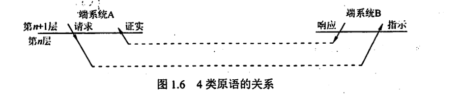
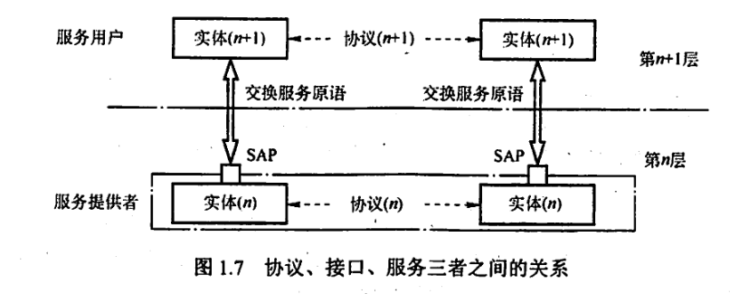
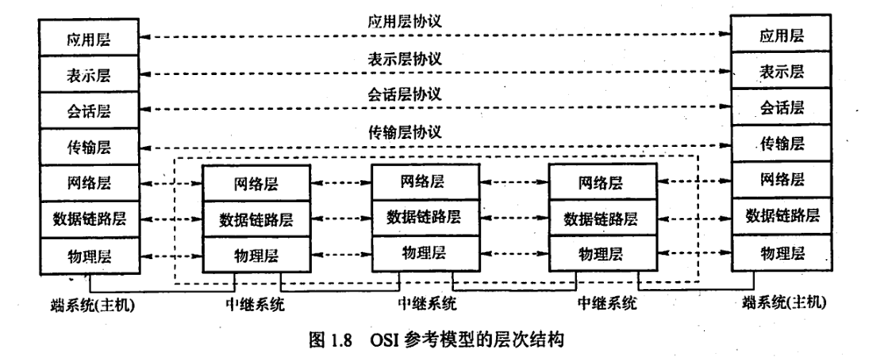
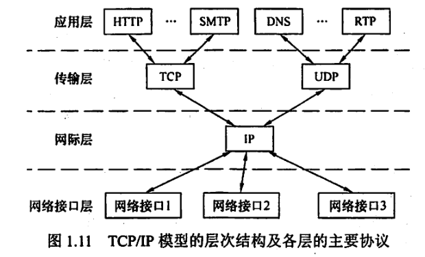
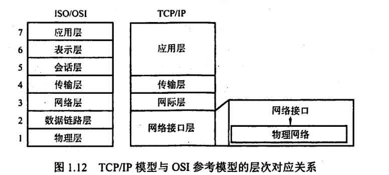
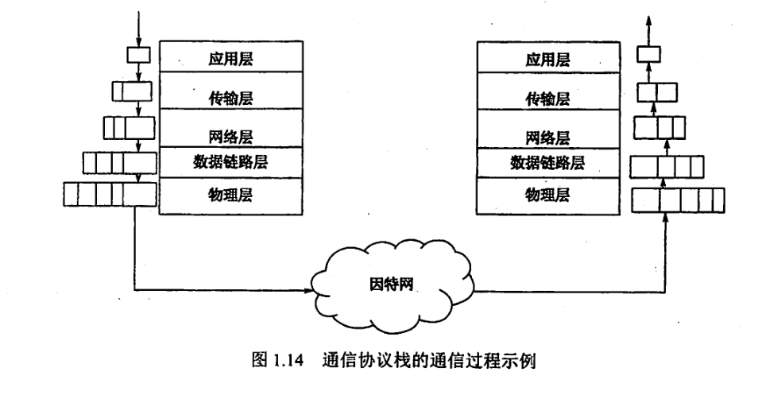

# 计算机网络概述

计算机网络是一个将分散的、具有独立功能的计算机系统，通过通信设备与线路连接起来，由功能完善的软件实现**资源共享**和**信息传递**的系统

**计算机网络三要素：语法、语义、时序**

通常internet泛指互联网，而**Internet**则特指因特网。

互联网：由多个计算机网络相互连接而成的网络，它是在功能和逻辑上组成的一个大型网络。

**因特网**：目前全球最大的一个电子计算机互联网，是由美国的**ARPA网**发展演变而来的；

## 计算机网络的组成

**从组成成份上**，一个完整的计算机网络主要由**硬件、软件、协议**三大部分构成

硬件主要由主机（也称端系统）、通信链路（如双绞线、光纤）、交换设备（如路由器、交换机等）和通信处理机（如网卡）等组成

软件主要包括各种实现资源共享的软件和方便用户使用的各种工具软件（如网络操作系统、邮件收发系统、FTP程序、聊天软件等）。软件部分多属于应用层。

协议是计算机网络的核心。

**从工作方式上**看，计算机网络分为**边缘部分**和**核心部分**。

边缘部分由所有连接到因特网上、供用户直接使用的组件组成，用来进行通信（如传输数据、音频或视频）和资源共享；

核心部分由大量的网络和连接这些网络的路由器组成，它为边缘部分提供连通性和交换服务。

**从功能组成上**看，计算机网络由**通信子网**和**资源子网**组成。

通信子网由各种传输介质、通信设备和相应的网络协议组成，它使网络具有数据传输、交换、控制和存储的能力，实现联网计算机之间的数据通信。

资源子网是实现资源共享的设备及其软件的集合，向网络用户提供共享其他计算机的硬件资源、软件资源和数据资源的服务。

## 计算机网络的功能

五大功能：

- 数据通信
- 资源共享：软件共享、数据共享、硬件共享
- 分布式处理
- 提高可靠性
- 负载均衡：将工作任务均衡地分配给计算机网络中的各台计算机。

## 计算机网络的分类

### 按范围分类

- 广域网（WAN）。广域网的任务是提供长距离通信，运送主机所发送的数据，其覆盖范围通常是直径为几十千米到几千千米的区域，因而有时也称远程网。广域网是因特网的核心部分。连接广域网的各节点交换机的链路一般都是高速链路，具有较大的通信容量。
- 城域网（MAN）。城域网的覆盖范围可以跨越几个街区甚至整个城市，覆盖区域的直径范围是5~50km。城域网大多采用以太网技术，因此有时也常并入局域网的范围讨论。
- 局域网（LAN）。局域网一般用微机或工作站通过高速线路相连，覆盖范围较小，通常是直径为几十米到几千米的区域。局域网在计算机配置的数量上没有太多的限制，少可以只有两台，多的可达几百台。传统上，局域网使用广播技术，而广域网使用交换技术。
- 个人区域为（PAN）。个人区域网是指在个人工作的地方将消费电子设备（如平板电脑、智能手机等）用无线技术连接起来的网络，也常称为无线个人区域网（WAPN）,覆盖区域的直径约为10m。

### 按传输技术分类

- 广播式网络
- 点对点网络

是否采用分组存储转发与路由选择机制是点对点式网络与广播式网络的重要区别，广域网基本都是点对点网络。

### 按拓扑结构分类

网络拓扑结构是指由网中结点（路由器、主机等）与通信线路（网线）之间的几何关系（如总线型、环形）表示的网络结构，主要指通信子网的拓扑结构。

按网络的拓扑结构，主要分为**总线形、星形、环形和网状网络**等，如图1.2所示。星形、总线形和环形网络多用于局域网，网状网络多用于广域网。

- 总线形网络。用单根传输线把计算机连接起来。总线形网络的优点是建网容易、增/减结点方便、节省线路。缺点是重负载时通信效率不高、总线任意一处对故障敏感。
- 星形网络。每个终端或计算机都以单独的线路与中央设备相连。中央设备早期是计算机，现在一般是交换机或路由器。星形网络便于集中控制和管理，因为端用户之间的通信必须经过中央设备。缺点是成本高、中央设备对故障敏感。
- 环形网络。所有计算机接口设备连接成一个环。环形网络最典型的例子是令牌环局域网。环可以是单环，也可以是双环，环中信号是单向传输的。
- 网状网络。一般情况下，每个结点至少有两条路径与其他结点相连，多用在广域网中。其有规则型和非规则型两种。其优点是可靠性高，缺点是控制复杂、线路成本高。
- 以上4种基本的网络拓扑结构可以互连为更复杂的网络。

### 按使用者分类

- 公用网(Public Network)。指电信公司出资建造的大型网络。“公用”的意思是指所有愿意按电信公司的规定交纳费用的人都可以使用这种网络，因此也称公众网。
- 专用网（Private.Network)。指某个部门为满足本单位特殊业务的需要而建造的网络。这种网络不向本单位以外的人提供服务。例如铁路、电力、军队等部门的专用网。

### 按交换技术分类

**交换技术**是指各台主机之间、各通信设备之间或主机与通信设备之间为交换信息所采用的数据格式和交换装置的方式。按交换技术可将网络分为如下几种。

- **电路交换网络**。在源结点和目的结点之间建立一条专用的通路用于传送数据，包括建立连接、传输数据和断开连接三个阶段。最典型的电路交换网是传统电话网络。该类网络的主要特点是整个报文的比特流连续地从源点直达终点，好像是在一条管道中传送。**优点**是数据直接传送、时延小。**缺点**是线路利用率低、不能充分利用线路容量、不便于进行差错控制。
- **报文交换网络**。用户数据加上源地址、目的地址、校验码等辅助信息，然后封装成报文。整个报文传送到相邻结点，全部存储后，再转发给下一个结点，重复这一过程直到到达目的结点。每个报文可以单独选择到达目的结点的路径。报文交换网络也称**存储-转发网络**，主要特点是整个报文先传送到相邻结点，全部存储后查找**转发表**，转发到下一个结点。**优点**是可以较为充分地利用线路容量，可以实现不同链路之间不同数据传输速率的转换，可以实现格式转换，可以实现一对多、多对一的访问，可以实现差错控制。**缺点**是增大了资源开销（如辅助信息导致处理时间和存储资源的开销)，增加了缓冲时延，需要额外的控制机制来保证多个报文的顺序不乱序，缓冲区难以管理（因为报文的大小不确定，接收方在接收到报文之前不能预知报文的大小）。

- **分组交换网络**。也称包交换网络。其原理是，**将数据分成较短的固定长度的数据块**，在每个数据块中加上目的地址、源地址等辅助信息组成分组（包)，以存储-转发方式传输。其主要特点是单个分组（它只是整个报文的一部分）传送到相邻结点，存储后查找转发表，转发到下一个结点。**除具备报文交换网络的优点外，分组交换网络还具有自身的优点**：缓冲易于管理；包的平均时延更小，网络占用的平均缓冲区更少；更易于标准化；更适合应用。**现在的主流网络基本上都可视为分组交换网络**。

### 按传输介质分类

传输介质可分为**有线**和**无线**两大类，因此网络可以分为**有线网络**和无线网络。

有线网络又分为双绞线网络、同轴电缆网络等。

无线网络又可分为蓝牙、微波、无线电等类型。

## 计算机网络的标准化工作

计算机网络的标准化对计算机网络的发展和推广起到了极为重要的作用。

因特网的所有标准都以**RFC**(Request For Comments)的形式在因特网上发布，但并非每个RFC都是因特网标准，RFC要上升为因特网的正式标准需经过以下4个阶段。

- **因特网草案**(Internet Draft)。这个阶段还不是RFC文档。
- **建议标准**(Proposed Standard)。从这个阶段开始就成为**RFC文档**。
- **草案标准**(Draft Standard)。（2011年取消）
- **因特网标准**(Internet Standard)。

此外，还有试验的RFC和提供信息的RFC。各种RFC之间的关系如图1.3所示。

在国际上，负责制定、实施相关网络标准的标准化组织众多，主要有如下几个：

- **国际标准化组织(ISO)**。其制定的主要网络标准或规范有OSI参考模型、HDLC等。
- **国际电信联盟(ITU)**。其前身为国际电话电报咨询委员会(CCITT),其下属机构TU-T制定了大量有关远程通信的标准。
- **国际电气电子工程师协会(IEEE)**。世界上最大的专业技术团体，由计算机和工程学专业人士组成。IEEE在通信领域最著名的研究成果是802标准。

## 计算机网络的性能指标

- **带宽(Bandwidth)**。本来表示通信线路允许通过的信号频带范围，单位是赫兹(Hz)。而在计算机网络中，带宽表示网络的通信线路所能传送数据的能力，是数字信道所能传送的“最高数据传输速率”的同义语，单位是比特/秒(bs)。
- **时延(Delay)。**指数据（一个报文或分组）从网络（或链路）的一端传送到另一端所需要的总时间，它由4部分构成：发送时延、传播时延、处理时延和排队时延。
  - **发送时延**。结点将分组的所有比特推向（传输）链路所需的时间，即从发送分组的第一个比特算起，到该分组的最后一个比特发送完毕所需的时间，因此也称传输时延。（计算公式为：发送时延=分组长度/信道宽度）
  - **传播时延**。电磁波在信道中传播一定的距离需要花费的时间，即一个比特从链路的一端传播到另一端所需的时间。（计算公式为：传播时延=信道长度/电磁波在信道上的传播速率）
  - **处理时延**。数据在交换结点为存储转发而进行的一些必要的处理所花费的时间。例如，分析分组的首部、从分组中提取数据部分、进行差错检验或查找适当的路由等。
  - **排队时延**。分组在进入路由器后要先在输入队列中排队等待处理。路由器确定转发端口后，还要在输出队列中排队等待转发，这就产生了排队时延。
  - 因此，数据在网络中经历的总时延就是以上4部分时延之和：**总时延=发送时延+传播时延+处理时延+排队时延**

- **时延带宽积**。指发送端发送的第一个比特即将到达终点时，发送端已经发出了多少个比特，因此又称以比特为单位的链路长度，即时延带宽积=传播时延×信道带宽。
- **往返时延(Round-Trip Time,RTT)**。指从发送端发出一个短分组，到发送端收到来自接收端的确认（接收端收到数据后立即发送确认），总共经历的时延。在互联网中，往返时延还包括各中间结点的处理时延、排队时延及转发数据时的发送时延。
- **吞吐量(Throughput)**。指单位时间内通过某个网络（或信道、接口）的数据量。吞吐量受网络带宽或网络额定速率的限制。
- **速率(Speed)**。网络中的速率是指连接到计算机网络上的主机在数字信道上传送数据的速率，也称数据传输速率、数据率或比特率，单位为b/s(比特/秒)（或bits,有时也写为bps)。数据率较高时，可用kb/s(k=103)、Mb/s(M=10)或Gb/s(G=10)表示。在计算机网络中，通常把最高数据传输速率称为**带宽**。
- **信道利用率**。指出某一信道有百分之多少的时间是有数据通过的，即信道利用率=有数据通过时间/（有+无）数据通过时间。

# 计算机网络体系结构与参考模型

## 计算机网络分层结构

把计算机网络的各层及其协议的集合称为网络的体系结构(Architecture)。

**计算机网络的体系结构**就是这个计算机网络及其所应完成的功能的精确定义，它是计算机网络中的**层次、各层的协议及层间接口的集合**。

体系结构是抽象的，而实现是具体的，是真正在运行的计算机硬件和软件。

计算机网络的体系结构通常都具有可分层的特性，它将复杂的大系统分成若干较容易实现的层次。分层的基本原则如下：

- 每层都实现一种相对独立的功能，降低大系统的复杂度。
- 各层之间界面自然清晰，易于理解，相互交流尽可能少。
- 各层功能的精确定义独立于具体的实现方法，可以采用最合适的技术来实现。
- 保持下层对上层的独立性，上层单向使用下层提供的服务。
- 整个分层结构应能促进标准化工作。

由于分层后各层之间相对独立，灵活性好，因而分层的体系结构易于更新（替换单个模块)，易于调试，易于交流，易于抽象，易于标准化。但层次越多，有些功能在不同层中难免重复出现，产生额外的开销，导致整体运行效率越低。层次越少，就会使每层的协议太复杂。因此，在分层时应考虑层次的清晰程度与运行效率间的折中、层次数量的折中。

依据一定的规则，将分层后的网络从低层到高层依次称为第1层、第2层…第n层，通常还为每层取一个特定的名称，如第1层的名称为物理层。在计算机网络的分层结构中，第n层中的活动元素通常称为第n层实体。具体来说，实体指任何可发送或接收信息的硬件或软件进程，通常是一个特定的软件模块。不同机器上的同一层称为**对等层**，同一层的实体称为**对等实体**。第”层实体实现的服务为第+1层所利用。在这种情况下，第n层称为服务提供者，第n+1层则服务于用户。

每一层还有自己传送的数据单位，其名称、大小、含义也各有不同。

**在计算机网络体系结构的各个层次中，每个报文都分为两部分：一是数据部分，即SDU；二是控制信息部分，即PCI，它们共同组成PDU。**

- **服务数据单元(SDU)**:为完成用户所要求的功能而应传送的数据。第n层的服务数据单元记为n-SDU。
- **协议控制信息(PCI)**:控制协议操作的信息。第n层的协议控制信息记为n-PCI。
- **协议数据单元(PDU)**:对等层次之间传送的数据单位称为该层的PDU。第n层的协议数据单元记为-PDU。在实际的网络中，每层的协议数据单元都有一个通俗的名称，如物理层的PDU称为比特，数据链路层的PDU称为桢，网络层的PDU称为分组，传输层的PDU称为报文段。

在各层间传输数据时，把从第n+1层收到的PDU作为第n层的SDU,加上第n层的PCI，就变成了第n层的PDU,交给第n-1层后作为SDU发送，接收方接收时做相反的处理，因此可知三者的关系为n-SDU+n-PCI=n-PDU=(n-1)-SDU,其变换过程如图1.5所示。

具体地，层次结构的含义包括以下几方面：

- 第n层的实体不仅要使用第n-1层的服务来实现自身定义的功能，还要向第n+1层提供本层的服务，该服务是第层及其下面各层提供的服务总和。
- 最低层只提供服务，是整个层次结构的基础：中间各层既是下一层的服务使用者，又是上一层的服务提供者：最高层面向用户提供服务。
- 上一层只能通过相邻层间的接口使用下一层的服务，而不能调用其他层的服务：下一层所提供服务的实现细节对上一层透明。
- 两台主机通信时，对等层在逻辑上有一条直接信道，表现为不经过下层就把信息传送到对方。

## 计算机网络协议、接口、服务的概念

### 协议

**协议，就是规则的集合。**在网络中要做到**有条不紊地交换数据**，就必须遵循一些事先约定好的规则。**这些规则明确规定了所交换的数据的格式及有关的同步问题。这些为进行网络中的数据交换而建立的规则、标准或约定称为网络协议(Network Protocol),它是控制两个（或多个)对等实体进行通信的规则的集合，是水平的。**不对等实体之间是没有协议的，比如用TCPP协议栈通信的两个结点，结点A的传输层和结点B的传输层之间存在协议，但结点A的传输层和结点B的网络层之间不存在协议。**网络协议也简称为协议**。
**协议由语法、语义和同步三部分组成。**

**语法**规定了传输数据的格式

**语义**规定了所要完成的功能，即需要发出何种控制信息、完成何种动作及做出何种应答

**同步**规定了执行各种操作的条件、时序关系等，即事件实现顺序的详细说明。

一个完整的协议通常应具有**线路管理（建立、释放连接)**、**差错控制**、**数据转换**等功能。

### 接口

**接口是同一结点内相邻两层间交换信息的连接点，是一个系统内部的规定。每层只能为紧邻的层次之间定义接口，不能跨层定义接口。**在典型的接口上，同一结点相邻两层的实体通过**服务访问点(Service Access Point,&SAP)**进行交互。服务是通过SAP提供给上层使用的，第n层的SAP就是第n+1层可以访问第n层服务的地方。每个SAP都有一个能够标识它的地址。SAP是一个抽象的概念，它实际上是一个逻辑接口（类似于邮政信箱），但和通常所说的两个设备之间的硬件接口是很不一样的。

### 服务

**服务是指下层为紧邻的上层提供的功能调用；它是垂直的。**对等实体在协议的控制下，使得本层能为上一层提供服务，但要实现本层协议还需要使用下一层所提供的服务。
上层使用下层所提供的服务时必须与下层交换一些命令，这些命令在OSI参考模型中称为服务原语。OS1参考模型将原语划分为4类：

- 请求(Request)。由服务用户发往服务提供者，请求完成某项工作。
- 指示（Indication)。由服务提供者发往服务用户，指示用户做某件事情。
- 响应(Response)。由服务用户发往服务提供者，作为对指示的响应。
- 证实(Confirmation)。由服务提供者发往服务用户，作为对请求的证实。

这4类原语用宇不同的功能，如建立连接、传输数据和断开连接等。有应答服务包括全部4类原语，而无应答服务则只有请求和指示两类原语。
4类原语的关系如图16所示。

首先，只有本层协议的实现才能保证向上一层提供服务。本层的服务用户只能看见服务而无法看见下面的协议，即下面的协议对上层的服务用户是透明的。

其次，协议是“水平的”，即协议是控制对等实体之间通信的规则。但服务是“垂直的”，即服务是由下层通过层间接口向上层提供的。

另外，并非在一层内完成的全部功能都称为服务，只有那些能够被高一层实体“看得见”的功能才称为服务。

#### 计算机网络提供的服务可按以下三种方式分类：

- 面向连接服务与无连接服务
  - 在面向连接服务中，通信双方必须先建立连接，分配相应的资源（如缓冲区），以保证通信能正常进行，传输结束后释放连接和所占用的资源。因此这种服务可以分为连接建立、数据传输和连接释放三个阶段。
  - 在无连接服务站，通信前双方不需要先建立连接，需要发送数据时可直接发送，把每个带有目的地址的包（报文分组）传送到线路上，由系统选定线路进行传输。这是一种不可靠服务（“尽最大努力交付”），并不保证通信的可靠性。
- 可靠服务和不可靠服务
  - 可靠服务是指网络具有纠错、检错、应答机制，能保证数据争取、可靠的传送到目的地
  - 不可靠服务是指网络只是尽量正确、可靠的传送，而不能保证数据正确、可靠的传送到目的地，是一种尽力而为的服务
  - 对于不可靠服务的网络，其网络的正确性、可靠性要由应用或用户来保障。例如，用户收到信息后要判断信息的正确性，如果不正确，那么用户要把出错信息报告给信息的发送者，以便发送者采取纠正措施。通过用户的这些措施，可以把不可靠的服务变成可靠的服务。
- 有应答服务和无应答服务
  - 有应答服务是指接收方在收到数据后向发送方给出相应的应答，该应答由传输系统内部自动实现，而不由用户实现。所发送的应答既可以是肯定回答，也可以是否定回答，通常在接收到的数据有错误时发送否定应答。例如文件传输服务就是一种有应答服务
  - 无应答服务是指接收方收到数据后不自动给出应答。若需要应答，则由高层实现。例如，对于WWW服务，客户端收到服务器发送的页面文件后不给出应答。

## ISO/OSI参考模型和TCP/IP参考模型

### OSI参考模型

国际标准化组织(ISO)提出的网络体系结构模型，称为开放系统互连参考模型(OSI/RM),通常简称为OSI参考模型。OS参考模型有**7层**，自下而上依次为**物理层、数据链路层、网络层、传输层、会话层、表示层、应用层**。

低三层统称为**通信子网**，它是为了联网而附加的通信设备，完成**数据的传输**功能；

高三层统称为**资源子网**，它相当于计算机系统，完成**数据的处理**等功能。传输层承上启下。

OSI参考模型的层次结构如图1.8所示。

#### 物理层

物理层的传输单位是**比特**，功能是**在物理媒体上为数据段设备透明的传输原始比特流。**

物理层主要定义数据终端设备（DTE）和数据通信设备（DCE）的物理连接方法，所以**物理层协议**也称为**物理层接口标准。**由于在通信技术的早期阶段，通信规则称为规程，因此物理层协议也称为物理层规程。

物理层接口标准很多，如EIA-232C、EIA/TIA RS-449、CCITT的X.21等。

通信链路与通信结点的连接需要一些**电路接口**，物理层规定了这些接口的一些参数，如**机械形状和尺寸、交换电路的数量和排列**等，例如，笔记本电脑上的网线接口，就是物理层规定的内容之一。

物理层也规定了通信链路上传输的信号的意义和电气特征。例如物理层规定信号A代表数字0，那么当结点要传输数字0时，就会发出信号A，当结点接收到信号A时，就知道自己接收到的实际上是数字0。

注意，传输信息所利用的一些物理媒体，如双绞线、光缆、无线信道等，并不在物理层协议之内而在物理层协议下面。因此，有人把物理媒体当作第0层。

#### 数据链路层

数据链路层的传输单位是**帧**，任务是**将网络层传来的P数据报组装成帧**。数据链路层的功能可以概括为**成帧、差错控制、流量控制和传输管理等**。

如在两个相邻结点之间传送数据时，由于两个结点性能的不同，可能结点A发送数据的速率会比结点B接收数据的速率快，如果不加控制，那么结点B就会丢弃很多来不及接收的正确数据，造成传输线路效率的下降。流量控制可以协调两个结点的速率，使结点A发送数
据的速率刚好是结点B可以接收的速率。

**广播式网络**在数据链路层还要处理新的问题，即如何**控制对共享信道的访问**。数据链路层的一个特殊子层--**介质访问子层**，就是专门处理这个问题。

#### 网络层

网络层的传输单位是**数据报**，它关心的是**通信子网的运行控制**，主要任务是**把网络层的协议数据单元（分组）从源端传到目的端，为分组交换网上的不同主机提供通信服务。**关键问题是**对分组进行路由选择，并实现流量控制、拥塞控制、差错控制和网际互连等功能**。

**流量控制**与数据链路层的流量控制含义一样，**都是协调发送方的发送速率和接收方的接收速率**。

**差错控制**是通信两结点之间约定的特定检错规则，如奇偶校验码，接收方根据这个规则检查接收到的分组是否出现差错，如果出现了差错，那么能纠错就纠错，不能纠错就丢弃，确保向上层提交的数据都是无误的。

**拥塞控制**，如果结点都处于来不及接收分组而要丢弃大量分组的情况，那么网络就处于拥塞状态，拥塞状态使得网络中的两个结点无法正常通信。网络层要采取一定的措施来缓解这种拥塞，这就是拥塞控制。

**因特网**是一个很大的**互联网**，它由大量**异构网络**通过**路由器**（Router)相互连接起来。因特网的主要网络层协议是**无连接的网际协议(Internet Protocol，IP)**和许多路由**选择协议**，因此因特网的网络层也称**网际层或IP层**。

网络层的协议有IP、IPX、ICMP、IGMP、ARP、RARP和OSPF等。

#### 传输层

传输层也称**运输层**，传输单位是**报文段(TCP)**或**用户数据报(UDP)**，传输层**负责主机中两个进程之间的通信**，功能是**为端到端连接提供可靠的传输服务，为端到端连接提供流量控制、差错控制、服务质量、数据传输管理等服务。**

**数据链路层提供的是点到点的通信，传输层提供的是端到端的通信**，两者不同。通俗地说，**点到点可以理解为主机到主机之间的通信，一个点是指一个硬件地址或IP地址，网络中参与通信的主机是通过硬件地址或IP地址标识的**；**端到端的通信是指运行在不同主机内的两个进程之间的通信，一个进程由一个端口来标识，所以称为端到端通信。**

使用传输层的服务，高层用户可以直接进行端到端的数据传输，从而忽略通信子网的存在。通过传输层的屏蔽，高层用户看不到子网的交替和变化。由于一台主机可同时运行多个进程，因此**传输层具有复用和分用的功能**。**复用**是指多个应用层进程可同时使用下面传输层的服务，**分用**是指传输层把收到的信息分别交付给上面应用层中相应的进程。

传输层协议由TCP、UDP

#### 会话层

会话层允许不同主机上的各个进程之间进行会话。会话层利用传输层提供的端到端的服务，向表示层提供它的增值服务。这种服务主要为表示层实体或用户进程**建立连接并在连接上有序地传输数据，这就是会话，也称建立同步(SYN)**。

会话层**负责管理主机间的会话进程，包括建立、管理及终止进程间的会话**。会话层可以**使用校验点使通信会话在通信失效时从校验点继续恢复通信，实现数据同步**。

#### 表示层

表示层**主要处理在两个通信系统中交换信息的表示方式**。不同机器采用的编码和表示方法不同，使用的数据结构也不同。为了使不同表示方法的数据和信息之间能互相交换，表示层**采用抽象的标准方法定义数据结构，并采用标准的编码形式**。**数据压缩、加密和解密也是表示层可提供的数据表示变换功能。**

#### 应用层

应用层是OSI参考模型的最高层，**是用户与网络的界面**。应用层**为特定类型的网络应用提供访问OSI参考模型环境的手段**。因为用户的实际应用多种多样，这就要求应用层采用不同的应用协议来解决不同类型的应用要求，因此应用层是最复杂的一层，使用的协议也最多。典型的协议有用于**文件传送的FTP、用于电子邮件的SMTP、用于万维网的HTTP**等。

### TCP/IP模型

ARPA在研究**ARPAnet**时提出了TCP/IP模型，模型从低到高依次为**网络接口层（对应OSI参考模型中的物理层和数据链路层)、网际层、传输层和应用层（对应OSI参考模型中的会话层、表示层和应用层)**。TCP/IP由于得到广泛应用而成为事实上的国际标准。TCP/IP模型的层次结构及各层的主要协议如图1.11所示。

**网络接口层**的功能类似于OSI参考模型的**物理层和数据链路层**。它表示与物理网络的接口，但实际上TCP/IP本身并未真正描述这一部分，只是指出主机必须使用某种协议与网络连接，以便在其上传递IP分组。具体的物理网络既可以是各种类型的局域网，如以太网、令牌环网、令牌总线网等，也可以是诸如电话网、SDH、X.25、帧中继和ATM等公共数据网络。网络接口层的作用是**从主机或结点接收IP分组，并把它们发送到指定的物理网络上。**

**网际层（主机-主机)**是TCP/IP体系结构的关键部分。它**和OSI参考模型的网络层在功能上非常相似**。网**际层将分组发往任何网络，并为之独立地选择合适的路由，但它不保证各个分组有序地到达，各个分组的有序交付由高层负责。**网际层定义了标准的分组格式和协议，即IP。

**传输层（应用-应用或进程-进程)**的功能同样和OSI参考模型中的传输层类似，即**使得发送端和目的端主机上的对等实体进行会话**。传输层主要使用以下两种协议：

- **传输控制协议(Transmission Control Protocol,TCP)**。它是**面向连接的**，数据传输的单位是**报文段**，能够**提供可靠的交付**。
- **用户数据报协议(User Datagram Protocol,UDP)**。它是**无连接的**，数据传输的单位是**用户数据报**，**不保证提供可靠的交付，只能提供“尽最大努力交付”**。

**应用层（用户-用户）**包含所有的高层协议，如虚拟终端协议(Telnet)、文件传输协议(FTP)、域名解析服务(DNS)、电子邮件协议(SMTP)和超文本传输协议(HTTP)。

## TCP/IP樸型与OSI参考模型的比较

TCP/IP模型与OSI参考模型有许多相似之处。

- 首先，二者都采取分层的体系结构，将庞大且复杂的问题分为若干较容易处理的、范围较小的问题，而且分层的功能也大体相似。
- 其次，二者都是基于独立的协议栈的概念。
- 最后，二者都可以解决异构网络的互连，实现世界上不同厂家生产的计算机之间的通信。

两个模型除具有这些基本的相似之处外，也有很多差别。

- 第一，OSI参考模型的最大贡献就是精确地定义了三个主要概念：**服务、协议和接口**，这与现代的面向对象程序设计思想非常吻合。而TCP/IP模型在这三个概念上却没有明确区分，不符合软件工程的思想。
- 第二，OSI参考模型产生在协议发明之前，没有偏向于任何特定的协议，通用性良好。但设计者在协议方面没有太多经验，不知道把哪些功能放到哪一层更好。TCP/IP模型正好相反，首先出现的是协议，模型实际上是对已有协议的描述，因此不会出现协议不能匹配模型的情况，但该模型不适合于任何其他非TCP/IP的协议栈。
- 第三，TCP/IP模型在设计之初就考虑到了多种异构网的互连问题，并将网际协议(IP)作为一个单独的重要层次。OSI参考模型最初只考虑到用一种标准的公用数据网将各种不同的系统互连。OSI参考模型认识到IP的重要性后，只好在网络层中划分出一个子层来完成类似于TCP/IP模型中的IP的功能。
- 第四，**OSI参考模型在网络层支持无连接和面向连接的通信，但在传输层仅有面向连接的通信。而TCP/IP模型认为可靠性是端到端的问题，因此它在网际层仅有一种无连接的通信模式，但传输层支持无连接和面向连接两种模式。**

## 数据传输过程

最后简单介绍使用通信协议栈进行通信的结点的数据传输过程。**每个协议栈的最顶端都是一个面向用户的接口，下面各层是为通信服务的协议。用户传输一个数据报时，通常给出用户能够理解的自然语言，然后通过应用层，将自然语言会转化为用于通信的通信数据。通信数据到达传输层，作为传输层的数据部分（传输层SDU)，加上传输层的控制信息（传输层PCI)，组成传输层的PDU，然后交到网络层，传输层的PDU下放到网络层后，就成为网络层的SDU，然后加上网络层的PCI，又组成了网络层的PDU，下放到数据链路层，就这样层层下放，层层包裹，最后形成的数据报通过通信线路传输，到达接收方结点协议栈，接收方再逆向地逐层把“包裹”拆开，然后把收到的数据提交给用户**，如图1.14所示。

