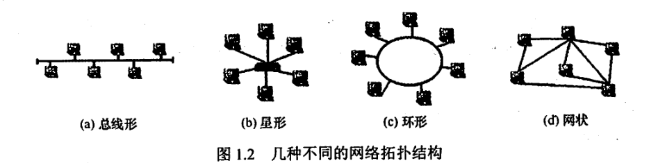
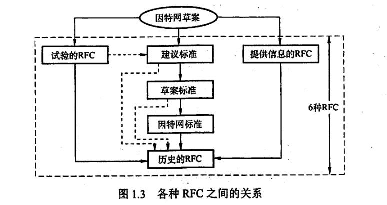
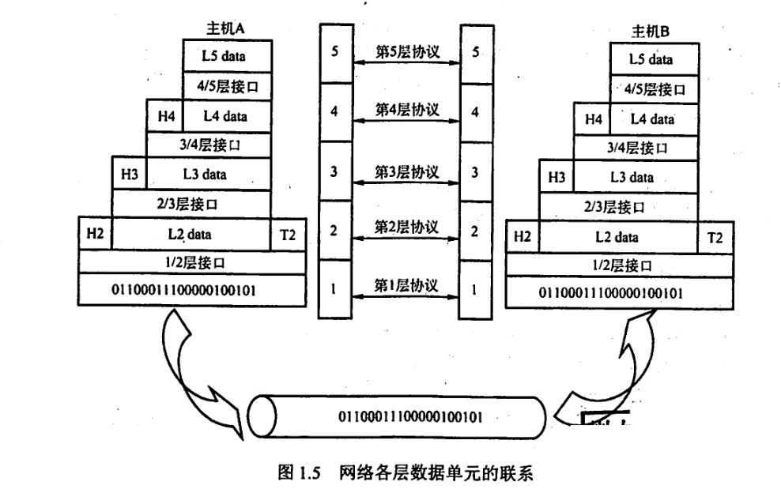

# 计算机网络概述

计算机网络是一个将分散的、具有独立功能的计算机系统，通过通信设备与线路连接起来，由功能完善的软件实现**资源共享**和**信息传递**的系统

计算机网络三要素：语法、语义、时序

## 计算机网络的组成

**从组成成份上**，一个完整的计算机网络主要由**硬件、软件、协议**三大部分构成

硬件主要由主机（也称端系统）、通信链路（如双绞线、光纤）、交换设备（如路由器、交换机等）和通信处理机（如网卡）等组成

软件主要包括各种实现资源共享的软件和方便用户使用的各种工具软件（如网络操作系统、邮件收发系统、FTP程序、聊天软件等）。软件部分多属于应用层。

协议是计算机网络的核心。

**从工作方式上**看，计算机网络分为**边缘部分**和**核心部分**。

边缘部分由所有连接到因特网上、供用户直接使用的组件组成，用来进行通信（如传输数据、音频或视频）和资源共享；

核心部分由大量的网络和连接这些网络的路由器组成，它为边缘部分提供连通性和交换服务。

**从功能组成上**看，计算机网络由**通信子网**和**资源子网**组成。

通信子网由各种传输介质、通信设备和相应的网络协议组成，它使网络具有数据传输、交换、控制和存储的能力，实现联网计算机之间的数据通信。

资源子网是实现资源共享的设备及其软件的集合，向网络用户提供共享其他计算机的硬件资源、软件资源和数据资源的服务。

## 计算机网络的功能

五大功能：

- 数据通信
- 资源共享：软件共享、数据共享、硬件共享
- 分布式处理
- 提高可靠性
- 负载均衡：将工作任务均衡地分配给计算机网络中的各台计算机。

## 计算机网络的分类

### 按范围分类

- 广域网（WAN）。广域网的任务是提供长距离通信，运送主机所发送的数据，其覆盖范围通常是直径为几十千米到几千千米的区域，因而有时也称远程网。广域网是因特网的核心部分。连接广域网的各节点交换机的链路一般都是高速链路，具有较大的通信容量。
- 城域网（MAN）。城域网的覆盖范围可以跨越几个街区甚至整个城市，覆盖区域的直径范围是5~50km。城域网大多采用以太网技术，因此有时也常并入局域网的范围讨论。
- 局域网（LAN）。局域网一般用微机或工作站通过高速线路相连，覆盖范围较小，通常是直径为几十米到几千米的区域。局域网在计算机配置的数量上没有太多的限制，少可以只有两台，多的可达几百台。传统上，局域网使用广播技术，而广域网使用交换技术。
- 个人区域为（PAN）。个人区域网是指在个人工作的地方将消费电子设备（如平板电脑、智能手机等）用无线技术连接起来的网络，也常称为无线个人区域网（WAPN）,覆盖区域的直径约为10m。

### 按传输技术分类

- 广播式网络
- 点对点网络

是否采用分组存储转发与路由选择机制是点对点式网络与广播式网络的重要区别，广域网基本都是点对点网络。

### 按拓扑结构分类

网络拓扑结构是指由网中结点（路由器、主机等）与通信线路（网线）之间的几何关系（如总线型、环形）表示的网络结构，主要指通信子网的拓扑结构。

按网络的拓扑结构，主要分为**总线形、星形、环形和网状网络**等，如图1.2所示。星形、总线形和环形网络多用于局域网，网状网络多用于广域网。

- 总线形网络。用单根传输线把计算机连接起来。总线形网络的优点是建网容易、增/减结点方便、节省线路。缺点是重负载时通信效率不高、总线任意一处对故障敏感。
- 星形网络。每个终端或计算机都以单独的线路与中央设备相连。中央设备早期是计算机，现在一般是交换机或路由器。星形网络便于集中控制和管理，因为端用户之间的通信必须经过中央设备。缺点是成本高、中央设备对故障敏感。
- 环形网络。所有计算机接口设备连接成一个环。环形网络最典型的例子是令牌环局域网。环可以是单环，也可以是双环，环中信号是单向传输的。
- 网状网络。一般情况下，每个结点至少有两条路径与其他结点相连，多用在广域网中。其有规则型和非规则型两种。其优点是可靠性高，缺点是控制复杂、线路成本高。
- 以上4种基本的网络拓扑结构可以互连为更复杂的网络。

### 按使用者分类

- 公用网(Public Network)。指电信公司出资建造的大型网络。“公用”的意思是指所有愿意按电信公司的规定交纳费用的人都可以使用这种网络，因此也称公众网。
- 专用网（Private.Network)。指某个部门为满足本单位特殊业务的需要而建造的网络。这种网络不向本单位以外的人提供服务。例如铁路、电力、军队等部门的专用网。

### 按交换技术分类

**交换技术**是指各台主机之间、各通信设备之间或主机与通信设备之间为交换信息所采用的数据格式和交换装置的方式。按交换技术可将网络分为如下几种。

- **电路交换网络**。在源结点和目的结点之间建立一条专用的通路用于传送数据，包括建立连接、传输数据和断开连接三个阶段。最典型的电路交换网是传统电话网络。该类网络的主要特点是整个报文的比特流连续地从源点直达终点，好像是在一条管道中传送。**优点**是数据直接传送、时延小。**缺点**是线路利用率低、不能充分利用线路容量、不便于进行差错控制。
- **报文交换网络**。用户数据加上源地址、目的地址、校验码等辅助信息，然后封装成报文。整个报文传送到相邻结点，全部存储后，再转发给下一个结点，重复这一过程直到到达目的结点。每个报文可以单独选择到达目的结点的路径。报文交换网络也称**存储-转发网络**，主要特点是整个报文先传送到相邻结点，全部存储后查找**转发表**，转发到下一个结点。**优点**是可以较为充分地利用线路容量，可以实现不同链路之间不同数据传输速率的转换，可以实现格式转换，可以实现一对多、多对一的访问，可以实现差错控制。**缺点**是增大了资源开销（如辅助信息导致处理时间和存储资源的开销)，增加了缓冲时延，需要额外的控制机制来保证多个报文的顺序不乱序，缓冲区难以管理（因为报文的大小不确定，接收方在接收到报文之前不能预知报文的大小）。

- **分组交换网络**。也称包交换网络。其原理是，**将数据分成较短的固定长度的数据块**，在每个数据块中加上目的地址、源地址等辅助信息组成分组（包)，以存储-转发方式传输。其主要特点是单个分组（它只是整个报文的一部分）传送到相邻结点，存储后查找转发表，转发到下一个结点。**除具备报文交换网络的优点外，分组交换网络还具有自身的优点**：缓冲易于管理；包的平均时延更小，网络占用的平均缓冲区更少；更易于标准化；更适合应用。**现在的主流网络基本上都可视为分组交换网络**。

### 按传输介质分类

传输介质可分为**有线**和**无线**两大类，因此网络可以分为**有线网络**和无线网络。

有线网络又分为双绞线网络、同轴电缆网络等。

无线网络又可分为蓝牙、微波、无线电等类型。

## 计算机网络的标准化工作

计算机网络的标准化对计算机网络的发展和推广起到了极为重要的作用。

因特网的所有标准都以**RFC**(Request For Comments)的形式在因特网上发布，但并非每个RFC都是因特网标准，RFC要上升为因特网的正式标准需经过以下4个阶段。

- **因特网草案**(Internet Draft)。这个阶段还不是RFC文档。
- **建议标准**(Proposed Standard)。从这个阶段开始就成为**RFC文档**。
- **草案标准**(Draft Standard)。（2011年取消）
- **因特网标准**(Internet Standard)。

此外，还有试验的RFC和提供信息的RFC。各种RFC之间的关系如图1.3所示。

在国际上，负责制定、实施相关网络标准的标准化组织众多，主要有如下几个：

- **国际标准化组织(ISO)**。其制定的主要网络标准或规范有OSI参考模型、HDLC等。
- **国际电信联盟(ITU)**。其前身为国际电话电报咨询委员会(CCITT),其下属机构TU-T制定了大量有关远程通信的标准。
- **国际电气电子工程师协会(IEEE)**。世界上最大的专业技术团体，由计算机和工程学专业人士组成。IEEE在通信领域最著名的研究成果是802标准。

## 计算机网络的性能指标

- **带宽(Bandwidth)**。本来表示通信线路允许通过的信号频带范围，单位是赫兹(Hz)。而在计算机网络中，带宽表示网络的通信线路所能传送数据的能力，是数字信道所能传送的“最高数据传输速率”的同义语，单位是比特/秒(bs)。
- **时延(Delay)。**指数据（一个报文或分组）从网络（或链路）的一端传送到另一端所需要的总时间，它由4部分构成：发送时延、传播时延、处理时延和排队时延。
  - **发送时延**。结点将分组的所有比特推向（传输）链路所需的时间，即从发送分组的第一个比特算起，到该分组的最后一个比特发送完毕所需的时间，因此也称传输时延。（计算公式为：发送时延=分组长度/信道宽度）
  - **传播时延**。电磁波在信道中传播一定的距离需要花费的时间，即一个比特从链路的一端传播到另一端所需的时间。（计算公式为：传播时延=信道长度/电磁波在信道上的传播速率）
  - **处理时延**。数据在交换结点为存储转发而进行的一些必要的处理所花费的时间。例如，分析分组的首部、从分组中提取数据部分、进行差错检验或查找适当的路由等。
  - **排队时延**。分组在进入路由器后要先在输入队列中排队等待处理。路由器确定转发端口后，还要在输出队列中排队等待转发，这就产生了排队时延。
  - 因此，数据在网络中经历的总时延就是以上4部分时延之和：**总时延=发送时延+传播时延+处理时延+排队时延**

- **时延带宽积**。指发送端发送的第一个比特即将到达终点时，发送端已经发出了多少个比特，因此又称以比特为单位的链路长度，即时延带宽积=传播时延×信道带宽。
- **往返时延(Round-Trip Time,RTT)**。指从发送端发出一个短分组，到发送端收到来自接收端的确认（接收端收到数据后立即发送确认），总共经历的时延。在互联网中，往返时延还包括各中间结点的处理时延、排队时延及转发数据时的发送时延。
- **吞吐量(Throughput)**。指单位时间内通过某个网络（或信道、接口）的数据量。吞吐量受网络带宽或网络额定速率的限制。
- **速率(Speed)**。网络中的速率是指连接到计算机网络上的主机在数字信道上传送数据的速率，也称数据传输速率、数据率或比特率，单位为b/s(比特/秒)（或bits,有时也写为bps)。数据率较高时，可用kb/s(k=103)、Mb/s(M=10)或Gb/s(G=10)表示。在计算机网络中，通常把最高数据传输速率称为**带宽**。
- **信道利用率**。指出某一信道有百分之多少的时间是有数据通过的，即信道利用率=有数据通过时间/（有+无）数据通过时间。

# 计算机网络体系结构与参考模型

## 计算机网络分层结构

把计算机网络的各层及其协议的集合称为网络的体系结构(Architecture)。

**计算机网络的体系结构**就是这个计算机网络及其所应完成的功能的精确定义，它是计算机网络中的**层次、各层的协议及层间接口的集合**。

体系结构是抽象的，而实现是具体的，是真正在运行的计算机硬件和软件。

计算机网络的体系结构通常都具有可分层的特性，它将复杂的大系统分成若干较容易实现的层次。分层的基本原则如下：

- 每层都实现一种相对独立的功能，降低大系统的复杂度。
- 各层之间界面自然清晰，易于理解，相互交流尽可能少。
- 各层功能的精确定义独立于具体的实现方法，可以采用最合适的技术来实现。
- 保持下层对上层的独立性，上层单向使用下层提供的服务。
- 整个分层结构应能促进标准化工作。

由于分层后各层之间相对独立，灵活性好，因而分层的体系结构易于更新（替换单个模块)，易于调试，易于交流，易于抽象，易于标准化。但层次越多，有些功能在不同层中难免重复出现，产生额外的开销，导致整体运行效率越低。层次越少，就会使每层的协议太复杂。因此，在分层时应考虑层次的清晰程度与运行效率间的折中、层次数量的折中。

依据一定的规则，将分层后的网络从低层到高层依次称为第1层、第2层…第n层，通常还为每层取一个特定的名称，如第1层的名称为物理层。在计算机网络的分层结构中，第n层中的活动元素通常称为第n层实体。具体来说，实体指任何可发送或接收信息的硬件或软件进程，通常是一个特定的软件模块。不同机器上的同一层称为**对等层**，同一层的实体称为**对等实体**。第”层实体实现的服务为第+1层所利用。在这种情况下，第n层称为服务提供者，第n+1层则服务于用户。

每一层还有自己传送的数据单位，其名称、大小、含义也各有不同。

**在计算机网络体系结构的各个层次中，每个报文都分为两部分：一是数据部分，即SDU；二是控制信息部分，即PCI，它们共同组成PDU。**

- **服务数据单元(SDU)**:为完成用户所要求的功能而应传送的数据。第n层的服务数据单元记为n-SDU。
- **协议控制信息(PCI)**:控制协议操作的信息。第n层的协议控制信息记为n-PCI。
- **协议数据单元(PDU)**:对等层次之间传送的数据单位称为该层的PDU。第n层的协议数据单元记为-PDU。在实际的网络中，每层的协议数据单元都有一个通俗的名称，如物理层的PDU称为比特，数据链路层的PDU称为桢，网络层的PDU称为分组，传输层的PDU称为报文段。

在各层间传输数据时，把从第n+1层收到的PDU作为第n层的SDU,加上第n层的PCI，就变成了第n层的PDU,交给第n-1层后作为SDU发送，接收方接收时做相反的处理，因此可知三者的关系为n-SDU+n-PCI=n-PDU=(n-1)-SDU,其变换过程如图1.5所示。

具体地，层次结构的含义包括以下几方面：

- 第n层的实体不仅要使用第n-1层的服务来实现自身定义的功能，还要向第n+1层提供本层的服务，该服务是第层及其下面各层提供的服务总和。
- 最低层只提供服务，是整个层次结构的基础：中间各层既是下一层的服务使用者，又是上一层的服务提供者：最高层面向用户提供服务。
- 上一层只能通过相邻层间的接口使用下一层的服务，而不能调用其他层的服务：下一层所提供服务的实现细节对上一层透明。
- 两台主机通信时，对等层在逻辑上有一条直接信道，表现为不经过下层就把信息传送到对方。