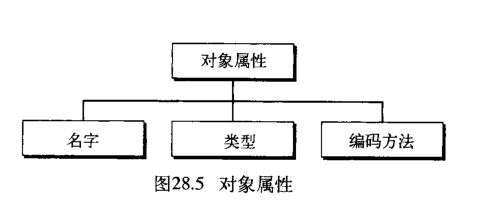
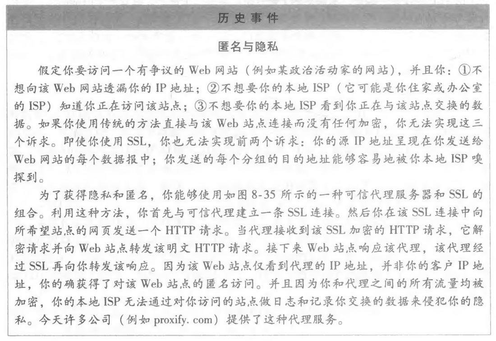
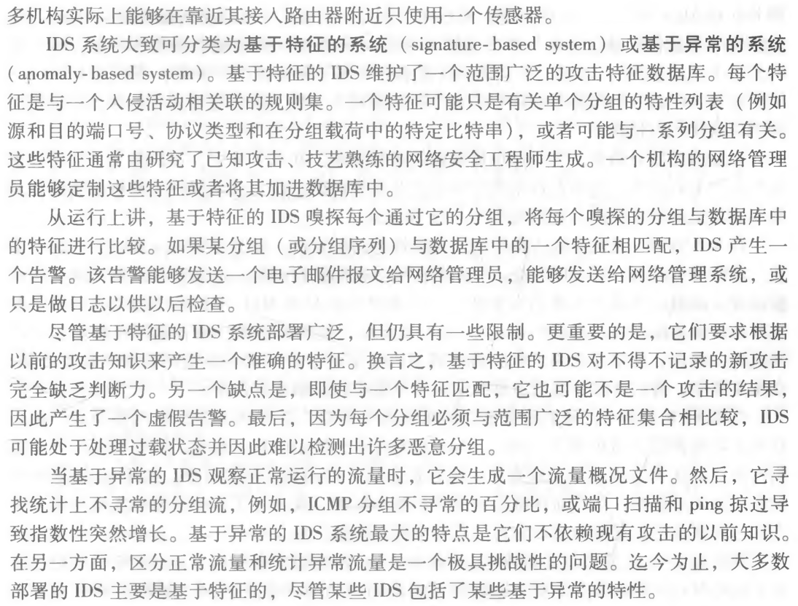

# 网络应用模型

## 客户/服务器模型

客户是服务请求方，服务器是服务提供方

WEB、文件传输协议（FTP）、远程登录和电子邮件

客户机是面向用户的，服务器是面向任务的。

## P2P模型

任一计算机称为**对等方**，直接相互通信。

优点：

1. 减轻了服务器的计算压力，消除了对某个服务器的完全依赖，可以将任务分配到各个节点上，因此大大提高了系统效率和资源利用率。（例如，播放流媒体时对服务器的压力过大，而通过P2P模型，可以利用大量的客户机来提供服务。）
2. 多个客户机之间可以直接共享文档。
3. 可扩展性好。传统服务器有响应和带宽限制，因此只能接受一定数量的请求。
4. 网络健壮性强，单个结点的失效不会影响其他部分的结点。

缺点：在获取服务的同时，还要给其他结点提供服务，因此会占用较多的内存，影响整机速度。例如，经常进行P2P下载还会对硬盘造成较大的损伤。据某互联网调研机构统计，当前P2P程序已占互联网50%~90%的流量，使网络变得非常拥塞，因此各大ISP通常都对P2P应用持反对态度。

# 域名系统DNS

**域名系统DNS，是因特网使用的命名系统，用来把便于人们记忆的具有特定含义的主机名转换为便于机器处理的IP地址。**

DNS系统采用**客户/服务器模型**，其协议运行在**UDP**之上，使用**53号端口**。

DNS分为3部分：**层次域名空间、域名服务器、解析器**

## 层次域名空间

因特网采用**层次树状结构**的命名方法。

任何连接到因特网的主机或路由器，都有一个唯一的层次结构名称，即域名。

域是名字空间中一个可被管理的划分。域还可以划分子域，而子域还可以继续划分为子域的子域，这样就形成了顶级域、二级域、三级域等。

关于域名中的标号有以下几点需要注意：

1. 标号中的英文不区分大小写。
2. 标号中除连字符（-）外不能使用其他标点符号
3. 每个标号不超过63个字符，多标号组成的完整域名最长不超过255个字符
4. 级别最低的域名写在最左边，级别最高的顶级域名写在最右边。

顶级域名分为三大类：

1. 国家(地区)顶级域名 (nTLD)。国家和某些地区的域名，如“.cn”表示中国，“.us”表示美国，“.uk”表示英国。
2. 通用顶级域名(gTLD)。常见的有“.com”(公司)“.net”(网络服务机构)、“.org”(非营利性组织)和“.gov”(国家或政府部门) 等。
3. 基础结构域名。这种顶级域名只有一个，即 arpa，用于反向域名解析，因此又称反向域名。

国家(地区)顶级域名下注册的二级域名均由该国家 (地区)自行确定。

图 6.4 展示了域名空间的树状结构。

在域名管理系统中，每个域分别由不同的组织进行管理。每个组织都可以将它的域再分成一定数量的子域，并将这些子域委托给其他组织去管理。例如，管理cn域的中国将edn.cn子域授权给中国教育和科研计算机网（CERNET）来管理。

## 域名服务器

因特网的域名系统被设计成一个联机分布式数据库系统，并采用客户/服务器模型。

域名到IP地址的解析是由运行在域名服务器上的程序完成的，一个服务器所负责管辖的（或有权限的）范围称为区（不以域为单位），各各单位根据具体情况来划分自己管辖范围的区，但在一个区中的所有结点必须是能够连通的，**每个区设置相应的权限域名服务器，用来保存该区中的所有主机的域名到 IP 地址的映射**。每个域名服务器不但能够进行一些域名到P 地址的解析，而且还必须具有连向其他域名服务器的信息。当自己不能进行域名到IP地址的转换时，能够知道到什么地方去找其他域名服务器。

DNS 使用了大量的域名服务器，它们以**层次方式**组织。**没有一台域名服务器具有因特网上所有主机的映射**，相反，该映射分布在所有的 DNS 上。采用**分布式**设计的 DNS，是一个在因特网上实现分布式数据库的精彩范例。

主要有 4 种类型的域名服务器：

1. **根域名服务器**：根域名服务器是最高层次的域名服务器，所有的根域名服务器都知道所有的顶级域名服务器的IP 地址。根域名服务器也是最重要的域名服务器，不管是哪个本地域名服务器，若要对因特网上任何一个域名进行解析，**只要自己无法解析，就首先要求助于根域名服务器**。因特网上有 13个根域名服务器，尽管我们将这 13 个根域名服务器中的每个都视为单个服务器，但每个“服务
   器”实际上是冗余服务器的集群，以提供安全性和可靠性。需要注意的是，**根域名服务器用来管辖顶级域(如com)，通常它并不直接把待查询的域名直接转换成 IP 地址，而是告诉本地域名服务器下一步应当找哪个顶级域名服务器进行查询。**
2. **顶级域名服务器**：这些域名服务器负责管理在**该顶级域名服务器注册的所有二级域名**。收到DNS 查询请求时就给出相应的回答 (可能是最后的结果，也可能是下一步应当查找的域名服务器的IP 地址)
3. **授权域名服务器 (权限域名服务器)**：**每台主机都必须在授权域名服务器处登记**。为了更加可靠地工作，一台主机最好至少有两个
   授权域名服务器。实际上，**许多域名服务器都同时充当本地域名服务器和授权域名服务器。授权域名服务器总能将其管辖的主机名转换为该主机的 IP 地址。**
4. **本地域名服务器：**本地域名服务器对域名系统非常重要。每个因特网服务提供者 (ISP)，或一所大学，甚至所大学中的各个系，都可以拥有一个本地域名服务器。当一台主机发出 DNS 查询请求时，这个查询请求报文就发送给该主机的本地域名服务器。事实上，我们在 Windows 系统中配置“本地连接”时，就需要填写 DNS 地址，这个地址就是本地 DNS(域名服务器)的地址

## 域名解析过程

域名解析是指把域名映射称为IP地址（正向解析）或 把IP地址映射成域名（反向解析）

域名解析方式有两种方式：**迭代查询** 和 **递归与迭代相结合的查询**。

**递归查询**的过程如上图a所示，本地域名服务器只需向根域名服务器查询一次，后面的几次查询都是递归地在其他几个域名服务器之间进行的，本地域名服务器从根域名服务器得到了所需地IP地址，最后在步骤8中，本地域名服务器把查询结果告诉发起查询地主机。**由于该方法给根域名服务器造成地负载过大，所以实际中几乎不使用。**

常用递归与迭代相结合的查询方式：

1. 主机向本地域名服务器的查询采用的是递归查询

   如果本地主机所询问的本地域名服务器不知道被查询域名的IP地址，那么本地域名服务器就是以DNS客户的身份，向根域名服务器继续发出查询请求报文（即替该主机继续查询），而不是让该主机自己进行下一步的查询。

2. 本地域名服务器向根域名服务器的查询采用迭代查询。

   当根域名服务器收到本地域名服务器发出的迭代查询请求报文时，要么给出所要查询的 IP地址，要么告诉本地域名服务器:“你下一步应当向哪个顶级域名服务器进行查询”。然后让本地域名服务器向这个顶级域名服务器进行后续的查询，如图 6.6(b)所示。同样，顶级域名服务器收到查询报文后，要么给出所要查询的 IP 地址，要么告诉本地域名服务器下一步应向哪个权限域名服务器查询。最后，知道所要解析的域名的 IP 地址后，把这个结果返回给发起查询的主机。

为了提高 DNS 的查询效率，并减少因特网上的 DNS 查询报文数量，在域名服务器中广泛地使用了高速缓存。**当一个 DNS 服务器接收到 DNS 查询结果时，它能将该 DNS 信息缓存在高速缓存中。**这样，当另一个相同的域名查询到达该 DNS 服务器时，该服务器就能够直接提供所要求的 IP 地址，而不需要再去向其他 DNS 服务器询问。**因为主机名和IP 地址之间的映射不是永久的，所以 DNS 服务器将在一段时间后丢弃高速缓存中的信息。**

# 文件传输协议（FTP）

文件传输协议（FTP）是因特网上使用最广泛的文件传输协议。FTP提供交互式的访问，允许客户指明文件的类型与格式，并允许文件具有存取权限。它屏蔽了个计算机系统的细节，因而适合于在异构网络中的任意计算机之间传送文件。

FTP提供以下功能：

1. 提供不同种类主机系统之间的文件传输能力。
2. 以用户权限管理的方式提供用户对远程FTP服务器上的文件管理能力。
3. 以匿名FTP的方式提供公用文件共享的能力。

FTP采用客户/服务器的工作方式，它使用TCP可靠的传输服务。一个FTP服务器进程可同时为多个客户进程提供服务。FTP的服务器进程由两大部分组成：一个主进程，负责接收新的请求；另外有若干从属进程，负责处理单个请求。其工作步骤如下：

1. 打开熟知端口21（控制端口），使客户进程能够连接上
2. 等待客户进程发连接请求
3. 启动从属进程来处理客户进程发来的请求。主进程与从属进程并发执行，从属进程对客户进程的请求处理完毕后即终止
4. 回到等待状态，继续接收其他客户进程请求。

FTP服务器必须在整个会话期间保留用户的状态信息。特别是服务器必须把指定的用户账户与控制连接联系起来，服务器必须追踪用户在远程目录树上的当前位置。

## 控制连接与数据连接

FTP在工作时使用两个并行的TCP连接：一个是控制连接（服务器端口号21），一个是数据连接（服务器端口号20）.使用两个不同的端口号可以使协议更容易实现。

### 控制连接

服务器监听 21 号端口，等待客户连接，建立在这个端口上的连接称为控制连接，控制连接用来传输控制信息(如连接请求、传送请求)，并且**控制信息都以 7 位 ASCII 格式传送**。FTP客户发出的传送请求，通过控制连接发送给服务器端的控制进程，但控制连接并不用来传送文件在传输文件时还可以使用控制连接(如客户在传输中途发一个中止传输的命令)，因此**控制连接在整个会话期间一直保持打开状态**。

### 数据连接

服务器端的控制进程在接收到 FTP 客户发来的文件传输请求后，就**创建“数据传送进程”和“数据连接”**。**数据连接**用来连接客户端和服务器端的**数据传送进程**，数据传送进程实际完成文件的传送，在传送完毕后关闭“数据传送连接”并结束运行。

数据连接有**两种传输模式**:**主动模式 PORT** 和**被动模式 PASV**。
PORT 模式的工作原理:客户端连接到服务器的 21 端口，登录成功后要读取数据时，客户端随机开放一个端口，并发送命令告知服务器，服务器收到 PORT 命令和端口号后，通过 20 端口和客户端开放的端口连接，发送数据。
PASV 模式的不同点是，客户端要读取数据时，发送 PASV 命令到服务器，服务器在本地随机开放一个端口，并告知客户端，客户端再连接到服务器开放的端口进行数据传输。
可见，是用PORT模式还是PASV模式，选择权在客户端。简单概括为，主动模式传送数据是“服务器连接到“客户端”的端口;被动模式传送数据是“客户端”连接到“服务器”的端口。

因为 FTP 使用了一个**分离的控制连接**，所以也称 FTP 的**控制信息是带外(Out-of-band)传送的**。**使用FTP 时，若要修改服务器上的文件，则需要先将此文件传送到本地主机，然后再将修改后的文件副本传送到原服务器，来回传送耗费很多时间。**

**网络文件系统(NFS)**采用另一种思路，它允许进程打开一个远程文件，并能在该文件的某个特定位置开始读写数据。这样，**NFS可使用户复制一个大文件中的一个很小的片段，而不需要复制整个大文件。**

# 电子邮件

电子邮件是一种异步通信方式，通信时不需要双方同时在场。电子邮件把邮件发送到收件人使用的邮件服务器，并放在其中的收件人邮件箱中，收件人可以随时上网到自己使用的邮件服务器进行读取。

三个组成构建：用户代理，邮件服务器，电子邮件使用的协议，如SMTP、POP3（或IMAP）等。

**用户代理(UA)**: 用户与电子邮件系统的接口。用户代理向用户提供一个很友好的接口来发送和接收邮件，用户代理至少应当具有撰写、显示和邮件处理的功能。通常情况下，用户代理就是个运行在 PC 上的程序(电子邮件客户端软件)，常见的有 Outlook 和 Foxmail 等。

**邮件服务器**:它的功能是发送和接收邮件，同时还要向发信人报告邮件传送的情况(已交付被拒绝、丢失等)。**邮件服务器采用客户/服务器方式工作，但它必须能够同时充当客户和服务器**，例如，当邮件服务器A向邮件服务器 B 发送邮件时，A 就作为SMTP 客户，而B是 SMTP 服务器反之，当B向A 发送邮件时，B 就是 SMTP 客户，而A就是SMTP 服务器。

**邮件发送协议和读取协议**：邮件发送协议用于用户代理向邮件服务器发送邮件或在邮件服务器之间发送邮件，如SMTP:邮件读取协议用于用户代理从邮件服务器读取邮件，如POP3。注意，SMTP用的是“推”(Push)的通信方式，即用户代理向邮件服务器发送邮件及在邮件服务器之间发送邮件时，SMTP客户将邮件“推”送到SMTP 服务器。而POP3 用的是“拉”(Pull)的通信方式，即用户读取邮件时，用户代理向邮件服务器发出请求，“拉”取用户邮箱中的邮件。

1. 发信人调用用户代理来撰写和编辑要发送的邮件。用户代理用 SMTP 把邮件传送给发送端邮件服务器。
2.  发送端邮件服务器将邮件放入邮件缓存队列中，等待发送。
3. 运行在发送端邮件服务器的 SMTP 客户进程，发现邮件缓存中有待发送的邮件，就向运行在接收端邮件服务器的 SMTP 服务器进程发起建立TCP 连接。
4. TCP 连接建立后，SMTP 客户进程开始向远程 SMTP 服务器进程发送邮件。当所有待发送邮件发完后，SMTP 就关闭所建立的 TCP 连接。
5. 运行在接收端邮件服务器中的 SMTP 服务器进程收到邮件后，将邮件放入收信人的用户邮箱，等待收信人在方便时进行读取。
6. 收信人打算收信时，调用用户代理，使用 POP3 (或IMAP)协议将自己的邮件从接收端邮件服务器的用户邮箱中取回 (如果邮箱中有来信的话)。

## 电子邮件格式与MIME

### 电子邮件格式

一个电子邮件分为**信封**和**内容**两大部分，邮件内容又分为**首部**和**主体**两部分。RFC 822 规定了邮件的首部格式，而邮件的主体部分则让用户自由撰写。用户写好首部后，邮件系统自动地将信封所需的信息提取出来并写在信封上，用户不需要亲自填写信封上的信息。

邮件内容的首部包含一些首部行，**每个首部行由一个关键字后跟冒号再后跟值组成**。有些关键字是必需的，有些则是可选的。**最重要的关键字是 To 和 Subject。**

**To 是必需的关键字，后面填入一个或多个收件人的电子邮件地址。**

**电子邮件地址的规定格式为:收件人邮箱名@邮箱所在主机的域名**，如 abc@cskaovan.com，其中收信人邮箱名即用户名abc在 cskaoyan.com 这个邮件服务器上必须是唯一的。这也就保证了abc@cskaoyan.com这个邮件地址在整个因特网上是唯一的。

**Subject 是可选关键字，是邮件的主题**，反映了邮件的主要内容当然，还有一个必填的关键字是 From，但它通常由邮件系统自动填入。

**首部与主体之间用个空行进行分割。**典型的邮件内容如下:

### 多用途网际邮件扩充(MIME)

由于 **SMTP 只能传送一定长度的ASCII码邮件**，许多其他非英语国家的文字(如中文、俄文,甚至带重音符号的法文或德文) 就无法传送，且无用户法传送可执行文件及其他二进制对象，因此提出了**多用途网络邮件扩充(Multipurpose Internet MailExtensions，MIME)**。

MIME 并未改动 SMTP 或取代它。MIME 的意图是继续使用目前的格式，但增加了邮件主体的结构，并定义了传送非 ASCI码的编码规则。也就是说，MIME 邮件可在现有的电子邮件程序和协议下传送。MIME 与 SMTP 的关系如图 6.10 所示。

MIME 主要包括以下三部分内容:

1. 5个新的邮件首部字段，包括 MIME 版本、内容描述、内容标识、传送编码和内容类型
2. 定义了许多邮件内容的格式，对多媒体电子邮件的表示方法进行了标准化。
3. 定义了传送编码，可对任何内容格式进行转换，而不会被邮件系统改变

### SMTP和POP3

#### SMTP

**简单邮件传输协议 (Simple Mail Transfer Protocol，SMTP)**是一种提供可靠且有效的电子邮件传输的协议，它控制两个相互通信的 SMTP 进程交换信息。由于 SMTP 使用客户/服务器方式因此负责发送邮件的SMTP进程就是 SMTP客户,而负责接收邮件的SMTP进程就是SMTP 服务器。**SMTP 用的是 TCP 连接，端口号为 25**。SMTP 通信有以下三个阶段。

##### (1) 连接建立

发件人的邮件发送到发送方邮件服务器的邮件缓存中后，SMTP 客户就每隔一定时间对邮件缓存扫描一次。如发现有邮件，就使用SMTP 的熟知端口号(25)与接收方邮件服务器的 SMTP服务器建立 TCP连接。连接建立后，接收方 SMTP 服务器发出220 Service ready (服务就绪)。然后SMTP 客户向 SMTP 服务器发送HELO 命令，附上发送方的主机名。

SMTP 不使用中间的邮件服务器。TCP 连接总是在发送方和接收方这两个邮件服务器之间直接建立，而不管它们相隔多远，不管在传送过程中要经过多少个路由器。当接收方邮件服务器因故障暂时不能建立连接时，发送方的邮件服务器只能等待一段时间后再次尝试连接。

##### (2)邮件传送

连接建立后，就可开始传送邮件。邮件的传送从 MAIL 命令开始，MAIL 命令后面有发件人的地址。如 MAIL FROM: hoopdog@hust.edu.cn。若 SMTP 服务器已准备好接收邮件，则回答250 OK。接着SMTP客户端发送一个或多个RCPT(收件人recipient 的缩写)命令，格式为RCPT TO:<收件人地址>。每发送一个RCPT 命令，都应有相应的信息从SMTP 服务器返回，如 250 OK或550 No such user here (无此用户)。

RCPT 命令的作用是，先弄清接收方系统是否已做好接收邮件的准备，然后才发送邮件，以便不至于发送了很长的邮件后才知道地址错误，进而避免浪费通信资源。

获得 OK 的回答后，客户端就使用 DATA 命令，表示要开始传输邮件的内容。正常情况下,SMTP 服务器回复的信息是 354 Start mail input; end with \<CRLF\>.\<CRLF\>。\<CRLF\>表示回车换行。此时 SMTP 客户端就可开始传送邮件内容，并用\<CRLF\>.\<CRLF\>表示邮件内容的结束。

##### (3) 连接释放

邮件发送完毕后，SMTP 客户应发送 QUIT 命令。SMTP 服务器返回的信息是 221(服务关闭)，表示 SMTP 同意释放 TCP 连接。邮件传送的全部过程就此结束

#### POP3 和 IMAP

邮局协议_(Post Ofce Protocol，POP) 是一个非常简单但功能有限的邮件读取协议，现在使用的是它的第3 个版本POP3。POP3 采用的是“拉”(Pull) 的通信方式，当用户读取邮件时，用户代理向邮件服务器发出请求，“拉”取用户邮箱中的邮件。

**POP 也使用客户/服务器的工作方式，在传输层使用 TCP，端口号为 110。**接收方的用户代理上必须运行 POP 客户程序，而接收方的邮件服务器上则运行 POP 服务器程序。POP 有两种工作方式:“**下载并保留**”和“**下载并删除**”。
**在“下载并保留”方式下，用户从邮件服务器上读取邮件后，邮件依然会保存在邮件服务器上，用户可再次从服务器上读取该邮件；**
**而使用“下载并删除”方式时，邮件一旦被读取，就被从邮件服务器上删除，用户不能再次从服务器上读取。**

另一个邮件读取协议是**因特网报文存取协议 (IMAP)**，它比POP 复杂得多，**IMAP 为用户提供了创建文件夹、在不同文件夹之间移动邮件及在远程文件夹中查询邮件等联机命令，为此IMAP服务器维护了会话用户的状态信息**。
IMAP 的另一特性是允**许用户代理只获取报文的某些部分**，例如可以只读取一个报文的首部，或多部分 MIME 报文的一部分。这非常适用于低带宽的情况,用户可能并不想取回邮箱中的所有邮件，尤其是包含很多音频或视频的大邮件。

此外，随着万维网的流行，目前出现了很多基于万维网的电子邮件，如 Hotmail、Gmail等这种电子邮件的特点是，用户浏览器与 Hotmail 或 Gmail 的邮件服务器之间的邮件发送或接收使用的是 **HTTP**，而仅在不同邮件服务器之间传送邮件时才使用 SMTP。

# 万维网WWW

## WWW的概念与组成结构

**万维网(World Wide Web，www) 是一个分布式、联机式的信息存储空间**，在这个空间中.样有用的事物称为一样“资源”，并由一个全域**“统一资源定位符”(URL)**标识。这些资源通过**超文本传输协议(HTTP)** 传送给使用者，而后者通过单击链接来获取资源。

万维网使用链接的方法能非常方便地从因特网上的一个站点访问另一个站点(即“链接到另一个站点”)，从而主动地按需获取丰富的信息。**超文本标记语言 (HyperText Markup Language,HTML)**使得万维网页面的设计者可以很方便地用一个超链接从本页面的某处链接到因特网上的任何一个万维网页面，并能够在自己的计算机屏幕上显示这些页面

万维网的内核部分是由三个标准构成的:

1. **统一资源定位符(URL)。负责标识万维网上的各种文档，并使每个文档在整个万维网的范围内具有唯一的标识符 URL。**
2. **超文本传输协议 (HTTP)。一个应用层协议，它使用 TCP 连接进行可靠的传输，HTTP是万维网客户程序和服务器程序之间交互所必须严格遵守的协议。**
3. **超文本标记语言 (HTML)。一种文档结构的标记语言，它使用一些约定的标记对页面上的各种信息 (包括文字、声音、图像、视频等)、格式进行描述。**

URL 是对可以从因特网上得到的资源的位置和访问方法的一种简洁表示。URL 相当于一个文件名在网络范围的扩展。URL 的一般形式是:
<协议>://<主机>:<端口>/<路径>。

<协议>指用什么协议来获取万维网文档，常见的协议有 http、ftp 等;
<主机>是存放资源的主机在因特网中的域名或IP 地址;
<端口>和<路径>有时可省略。在 URL 中不区分大小写。

万维网以**客户/服务器**方式工作。**浏览器**是在用户主机上的万维网客户程序，而万维网文档所驻留的主机则运行服务器程序，这台主机称为万维网服务器。客户程序向服务器程序发出请求,服务器程序向客户程序送回客户所要的万维网文档。工作流程如下:

1. Web 用户使用浏览器(指定 URL)与Web 服器建立连接，并发送浏览请求
2. Web 服务器把URL 转换为文件路径，并返回信息给 Web 浏览器。

3) 通信完成，关闭连接。

万维网是无数个网络站点和网页的集合，它们在一起构成了因特网最主要的部分(因特网也包括电子邮件、Usenet 和新闻组)。

## 超文本传输协议（HTTP）

**HTTP 定义了浏览器(万维网客户进程) 怎样向万维网服务器请求万维网文档，以及服务器怎样把文档传送给浏览器。**

从层次的角度看，HTTP 是**面向事务的(Transaction-oriented) 应用层协议**，它规定了在浏览器和服务器之间的请求和响应的格式与规则，是万维网上能够可靠地交换文件 (包括文本、声音、图像等各种多媒体文件) 的重要基础。

### HTTP的操作过程

从协议执行过程来说，浏览器要访问 WWW 服务器时，首先要完成对 WWW 服务器的域名解析。一旦获得了服务器的IP 地址，浏览器就通过 TCP 向服务器发送连接建立请求。

万维网的大致工作过程如图6.11 所示。每个万维网站点都有一个服务器进程，它不断地监听TCP的端口 80(默认)，当监听到连接请求后便与浏览器建立 TCP 连接。然后，浏览器就向服务器发送请求获取某个 Web 页面的 HTTP 请求。服务器收到请求后，将构建所请求 Web 页的必需信息，并通过 HTTP 响应返回给浏览器。浏览器再将信息进行解释，然后将 Web 页显示给用户。最后，TCP 连接释放。

在浏览器和服务器之间的请求与响应的交互，必须遵循规定的格式和规则，这些格式和规则就是HTTP。因此HTTP 有两类报文:**请求报文** (从Web 客户端向 Web 服务器发送服务请求)和**响应报文** (从 Web 服务器对 Web 客户端请求的回答)。
用户单击鼠标后所发生的事件按顺序如下 (以访问清华大学的网站为例):

1. 浏览器分析链接指向页面的URL (http://www.tsinghua.edu.cn /chn/index.htm)。
2. 浏览器向 DNS 请求解析 wwwtsinghua.edu.cn 的IP 地址。
3. 域名系统DNS 解析出清华大学服务器的IP 地址。
4. 浏览器与该服务器建立 TCP 连接(默认端口号为 80)。
5. 浏览器发出 HTTP 请求:GET/chn/index.htm。
6. 服务器通过HTTP 响应把文件 indexhtm 发送给浏览器
7. 释放 TCP 连接。
8. 浏览器解释文件index.htm，并将 Web 页显示给用户

### HTTP的特点

HTTP 使用TCP 作为传输层协议，保证了数据的可靠传输。HTTP 不必考虑数据在传输过程中被丢弃后又怎样被重传。但是，HTTP 本身是无连接的(务必注意)。也就是说，虽然 HTTP 使用了 TCP 连接，但通信的双方在交换 HTTP 报文之前不需要先建立HTTP 连接。

**HTTP 是无状态的**。也就是说，同一个客户第二次访问同一个服务器上的页面时，服务器的响应与第一次被访问时的相同。因为服务器并不记得曾经访问过的这个客户，也不记得为该客户曾经服务过多少次。

HTTP 的无状态特性简化了服务器的设计，使服务器更容易支持大量并发的 HTTP 请求。在实际应用中，通常使用 **Cookie 加数据库**的方式来跟踪用户的活动(如记录用户最近浏览的商品等)。

**Cookie 的工作原理**: 当用户浏览某个使用 Cookie 的网站时，该网站服务器就为用户产生一个唯一的识别码，如“123456”,接着在给用户的响应报文中添加一个 Set-cookie 的首部行“Set cookie: 123456”。用户收到响应后，就在它管理的特定 Cookie 文件中添加这个服务器的主机名和 Cookie 识别码，当用户继续浏览这个网站时，会取出这个网站的识别码，并放入请求报文的Cookie 首部行“Cookie: 123456”。服务器根据请求报文中的 Cookie 识别码就能从数据库中查询到该用户的活动记录，进而执行一些个性化的工作，如根据用户的历史浏览记录向其推荐新产品等。

**HTTP 既可以使用非持久连接，也可以使用持久连接 (HTTP/1.1 支持)。**

对于**非持久连接，每个网页元素对象(如JPEG 图形、Flash 等)的传输都需要单独建立一个TCP 连接**，如图 6.12 所示(第三次握手的报文段中捎带了客户对万维网文档的请求)。请求一个万维网文档所需的时间是该文档的传输时间(与文档大小成正比)加上两倍往返时间 RTT(一个
RTT 用于 TCP 连接，另一个 RTT 用于请求和接收文档)。每个对象引用都导致 2XRTT 的开销，此外**每次建立新的 TCP 连接都要分配缓存和变量，使万维网服务器的负担很重。**

所谓**持久连接**，是指万维网服务器在**发送响应后仍然保持这条连接**，使同一个客户(浏览器和该服务器可以继续在这条连接上传送后续的 HTTP 请求和响应报文，如图 6.13 所示

持久连接又分为**非流水线**和**流水线**两种方式。对于非流水线方式，客户在收到前一个响应后才能发出下一个请求，服务器发送完一个对象后，其 TCP 连接就处于空闲状态，浪费了服务器资源。**HTTP/1.1 的默认方式是使用流水线的持久连接**，**这种情况下，客户每遇到一个对象引用就立即发出一个请求，因而客户可以逐个地连续发出对各个引用对象的请求。**如果所有的请求和响应都是连续发送的，那么所有引用的对象共计经历 1个 RTT 延迟，而不是像非流水线方式那样，每个引用都必须有 1个 RTT 延迟。这种方式减少了 TCP 连接中的空闲时间，提高了效率。

### HTTP 的报文结构

HTTP 是**面向文本**的(Text-Oriented)，因此报文中的**每个字段都是一些ASCII码串**，并且每个字段的长度都是不确定的。有两类HTTP 报文:

1. 请求报文:从客户向服务器发送的请求报文
2. 响应报文:从服务器到客户的回答

HTTP 请求报文和响应报文都由**三个部分组成**。从图 6.14 可以看出，这两种报文格式的区别就是开始行不同。

**开始行**:用于区分是请求报文还是响应报文。在请求报文中的开始行称为**请求行**，而在响应报文中的开始行称为**状态行**。开始行的三个字段之间都**以空格分隔**，最后的**“CR”和“LF”分别代表“回车”和“换行”**。请求报文的“**请求行**”有三个内容:**方法、请求资源的 URL 及HTTP 的**
**版本。**其中，“方法”是对所请求对象进行的操作这些方法实际上也就是一些命令。表 6.1 给出了HTTP 请求报文中常用的几个方法。

**首部行**:用来说明浏览器、服务器或报文主体的一些信息。首部可以有几行,但也可以不使用。在每个首部行中都有首部字段名和它的值，每一行在结束的地方都要有“回车”和“换行”。整个首部行结束时，还有一空行将首部行和后面的实体主体分开。

**实体主体**:在请求报文中一般不用这个字段，而在响应报文中也可能没有这个字段。

### http/2

自顶向下P74

http/3 及 QUIC

# 网络管理系统

网络管理(network management) 定义为**监视、检测、配置和故障发现及修理**的网络组件，以满足组织机构所规定的一组要求。

## 网络管理系统

划分5大类:配置管理、故障管理、性能管理、安全管理和计费管理。

### 配置管理

任何时候，配置管理(configuration management) 系统必须知道每个实体的状态及其与其他实体的关系。

配置管理可划分成两个子系统:**重新配置**和**文档资料**。

#### 重新配置

重新配置，是指调整网络组件与特性，在大型网络可能每天都会发生。

重新配置有 3种类型:**硬件重新配置、软件重新配置和用户账号重新配置。**

### 故障管理

一个有效的故障管理系统有两个子系统:**再生的故障管理**和**主动故障管理**。

再生的故障管理系统负责故障的检测、隔离、纠正和记录。它处理对故障的短期解决办法。第一步是检测故障准确的位置。第二步是隔离故障。第三步是纠正故障。故障纠正后，必须被记录在文档中。这个记录必须表明故障的准确位置，可能引起的原因或修复故障的措施、成本和每步化费的时间。

主动的故障管理是防止故障发生。

### 性能管理

#### 能力

性能管理系统必须监视的一个要素是网络的能力。每个网络的能力都是有限的，性能管理系统必须确保使用不能超过这个能力。例如，如果一个局域网设计为 100个站点的平均数据速率是 2Mbps ，则连接到这个网络 200个站点就不能正确地运行，数据速率将会下降甚至还可能发生拥塞。

#### 通信量

通信量按两种方怯测量:**内部的**和**外部的**。

内部通信量是用网络内部传送分组(或字节)的个数来度量

外部通信量是用网络与外部交换分组(或字节)的个数来度量。

系统在负载重的峰值期间，如果出现过多的通信量，拥塞就会发生。

#### 吞吐量

我们可测量单独一台设备(如路由器)或部分网络的吞吐量。性能管理监视吞吐量确保它不降低于不可接受的水平。

#### 晌应时间

通常将从用户请求服务到服务被准许的时间称为晌应时间。其他一些因素如能力和通信量会影响响应时间。性能管理监视平均响应时间和峰值时刻响应时间。
响应时间的增加是一个非常严重的情况，它表示网络正朝着超过它的能力方向工作。

### 安全管理

安全管理(Security management) 是根据预定的负责策略监视对网络的访问。

### 计费管理

计费管理(Accounting management) 是通过费用控制用户访问网络的资源。根据计费管理，个人用户、部门、公司，甚至工程等都需要对从网络上得到服务的付费。付费不必现金支付，为预算目的它可以记入部门或公司的账单上。今天，组织机构使用计费系统有下列
原因:

1. 它防止用户独占有限的网络资源 
2. 它防止用户无效地使用系统 
3. 网络管理员可以按需对网络使用作出短期和长期的计划。

## 简单网络管理协议(SNMP)

简单网络管理协议(SNMP) 是使用 TCP/IP协议族对互联网上的设备进行管理的一个框架，它提供一组基本的操作来监控和维护互联网。

### 概念

SNMP使用管理器和代理的概念。这就是说，管理器，通常是一台主机，控制和监视一组代理，代理通常是路由器(如图 28.2所示)。

SNMP是**应用级协议**，它用少数几个管理器控制一组代理。该协议设计在应用级，因此它能监控不同厂商制造的设备，而这些设备可
安装在不同的物理网络上。换言之， SNMP使管理任务与被管理设备的物理特性和联网技术没有关系。它可以用于由不同厂商制造
的路由器相互连接在一起的不同局域网和广域网组成的异构互联网中。

#### 管理器和代理

称为管理器(manager)的管理站是运行SNMP客户程序的主机。
称为代理(agent)的被管理站是运行SNMP服务器程序的路由器(或主机)。
管理是通过管理站与代理之间的简单交互来实现的。

代理在数据库中保存性能信息，管理器使用该数据库中的值。例如，路由器可将接收到的和转发的分组数存储成适当的变量。管理器可读取和比较这两个变量，以便确定路由器是否拥塞。

在代理上运行的服务器程序可检查环境，如果发现有异常现象可发送一个称为陷阱(trap) 的告警报文给管理器。

换言之，SNMP管理是基于3个基本思想:
1.管理器检查代理的方法是发出请求得到能反映代理行为的信息，
2 . 管理器可用重新设置在代理数据库中的某些值来强迫代理完成一个任务，
3 . 代理管理过程的方法是向管理器发送异常情况的告警。

### 管理组件

为了完成管理任务，SNMP还使用另外两个协议:**管理信息结构(Structure of Management , SMI)** 和**管理信息库(Management Information Base , MIB) 。**

#### SNMP的作用

SNMP定义从管理器到代理和从代理到管理器发送分组的格式。还解释产生的结果井创建统计表(时常借助其他的管理软件)。交换的分组包括对象(变量)名及它们的状态(值)。SNMP负责读取和改变这些值。

#### SMI的作用

要使用 SNMP ，我们需要有一些规则，需要命名对象的规则。
SMI 定义对象命名、数据类型(包括长度和定义域)以及编码方法和取值的一般规则。
SMI不定义实体应管理多少个对象或被管理对象的命名，或对象与值之间的关联。

#### MIB的作用

MIB 创建一个被管理的实体中所有对象命名和类型，以及它们之间相互关系。

#### 关联

我们比较网络管理任务与编写程序的任务。

1. 两个任务都需要规则。在网络管理中，它由 SMI 处理。
2. 两个任务都需要变量卢明。在网络管理中，它由 MIB 处理。
3. 两个任务都需要用语句来执行动作。在网络管理中，它由 SNMP处理。

MIB 负责查找保存接收到的 UDP用户数据报个数的对象。在另一个嵌入协议的帮助下，SMI负责给对象名编码。SNMP负责创建一个称为 GetRequest的报文，并封装已编码的报文。实际上，事情比概述复杂得多，但是，我们必须对每个协议有更详细的叙述。

### 管理信息结构（SMI）

管理信息结构第二版(SMIv2) 是网络管理中的一个组件。

它的功能是:

1. 给对象命名 

2. 定义可在对象中存储的数据类型
3. 给出如何对在网络上传输的数据进行编码的方法。

SMI是 SNMP的一个指南。它强调了处理对象的三个属性:**名字、数据类型和编码方法**

#### 名字

**名字**：SMI要求每一个被管理对象(如一个路由器、一个路由器中的变量、一个值)具有一个唯一的名字。为了在全局给对象命名，
SMI使用**对象标识符**(object identifier) ，它是基于树结构的分层次标识符(如图 28.6所示)。

树结构从一个未命名的根开始。每一个对象可用一个点分隔开的整数序列来定义，树结构也可用一个点分隔开名字的文本序列来定义。整数-点的表示法是 SNMP使用的一种方法，人们使用名字-点表示法。例如，下面是同一对象的两种不同的表示法:

#### 类型

**类型**：对象的第二个属性是在这个对象中存储的数据类型。为了定义数据类型，SMI使用抽象语法表示法 1(Abstract Syntax Notation1
ASN. l)的一些基本定义，但还增加了几个新的定义。换言之，SMI既是ASN.1的一个子集，又是ASN.1 的一个超集。

SMI使用两大类数据类型:简单的和结构化的。
**简单数据类型**(simple data type)是原子数据类型。
这些类型中一些是直接取自 ASN.1 ，另一些是 SMI增加的。表 28.1 给出了最重要的一些类型。前 5 个取自 ASN.1 ，后 7个是 SMI定义的。

**结构化类型**：**将简单的和结构化的数据类型结合起来，就可构成新的结构化数据类型**。
SMI定义了两种结构化数据类型(structured data type): sequence和 sequence of。
• **Sequence** 。 一个 sequence数据类型是一些简单数据类型的组合，不必都是相同类型。它与C编程语言中使用的 struct或record的概念相似 。
• **Sequence of**。一个sequence of数据类型是所有相同类型的简单数据类型的组合，或所有相同类型的 sequence数据类型的组合。它与C编程语言中使用的 array的概念相似。

#### **编码方法**：

SMI使用另一个标准，即**基本编码规则(Basic Encoding Rule , BER)** ，对数据进行编码井将编码后的数据在网络上传输。
BER规定每一块数据都要被编码成三元组的格式:**标签 、长度和值**

**标签**是一个字节的字段，它定义了数据类型。它由 3个子字段组成:**类(2位)、格式(1位)和编号(5位)**。类子字段定义数据的作用域。共定义4类:通用类(00) 、应用类(01) 、特定上下文类( 10) 和专用类( 11 )。

格式子字段指出数据是简单的(0) 还是结构化的( 1 )。编号子字段将简单的或结构化的数据进一步划分成一些子组。

**长度字段**是一个或多个字节。如果是一个字节，则最高位必定是0 ，其余7位定义数据长度。如果大于一个字节，则第一个字节的最高位必定是 1 ，其他7位则定义在定义这个长度时所需的字节个数。图 28.10说明了长度字段的意义。

**值字段**按照在BER中定义的规则将数据的值进行编码。

### 管理信息数据库(MIB)

管理信息数据库版本 2(MIB2) 是网络管理中的第二个组件。**每个代理都有它自己的MIB2 ，这是管理器能够管理的所有对象的集合**。

在MIB 中的对象分成 10个不同的组:system 、interface 、address、translation 、ip 、icmp 、tcp 、udp 、egp 、transmission和 snmp 。这些组都在对象标识符树中的mib-2对象的下面(如图 28.15所示)。每一个组定义一些变量和(或)表。

#### 访问 MIB 变量

我们用 udp组作为例子，说明如何访问不同的变量。在 udp组中有4个简单变量和一个记录(表)序列，图 28.16给出这些变量和表。
我们将说明如何访问每一个实体。简单变量。要访问任何简单变量，我们用组的 id(1. 3 . 6.2. 1. 7) 后面跟着该变量的 id ，下面表示如何访问每一个变量。

表。。。。。见课本

### 字典排序

对象标识符(包括实例标识符)是按字典的顺序排列的。表顺序是按照列-行规则

字典排序
(lexicographic ordering) 能使一个管理器在定义了第一个变量后，可一个一个接着地访问一组变量

### SNMP

SNMP在因特网的网络管理中使用 SMI和MIB。SNMP是一个应用程序，它允许:

1. 管理器读取代理定义的一个对象的值。
2.  管理器将一个值存储在代理定义的一个对象中 。
3. 代理将关于异常情况的告警报文发送给管理器。

#### PDU

SNMP 版本 3 定义了 **8 种报文(或PUD): GetRequest 、GetNextRequest 、GetBulkRequest 、SetRequest 、Response 、Trap 、InformRequest 和 Report**

#####  GetRequest (请求读取)

GetRequestPDU报文是由管理器(客户机)发送给代理(服务器) ，用来读取一个变量或一组变量。

##### GetNextRequest (读取下一个请求)

GetNextRequest (读取下一个请求)PDU报文是由管理器发送给代理，用来读取一个变量的值。所要读取的值是PDU中定义的Object Id后面对象的值，它主要是用来读取一个表中的项目的值。如果管理器不知道该项目的索引，它就不能读这个值。但是，它可以使用GetNextRequest井定义表的 Object Id。因为第一个项目的0均 Object Id是紧跟在表的0均 Object Id后面，因此第一个项目的值立即返回了。管理器可使用这个Object Id来得到下一个项目的值，等等。

##### GetBulkRequest (读取大量请求)

GetBulkRequest (读取大量请求) PDU报文是由管理器发送给代理，用来读取大量数据。它可用来取代多个 GetRequest和 GetNextRequest PDU 。

##### SetRequest (设置请求)

SetRequest (设置请求) PDU报文是由管理器发送给代理，用来设置(存储)一个变量的值。

##### Response (响应)

Response (响应） PDU报文是由代理发送给管理器以响应GetResponse和GetNextRequest ,它包含管理器所请求的变量的值。

##### Trap (陷阱)

Trap (陷阱)PDU报文是由代理发送给管理器，用来报告一个事件。例如，如果代理重新启动，它通知管理器并报告重新启动的时间。

##### InformRequest (读取信息)

InformRequest (读取信息) PDU报文是由一个管理器发送给另一个远程管理器，用来获得远程管理器所控制的代理的某些变量的值。

##### Report (报告)

Report (报告) PDU用来报告管理器之间错误类型。

##### PDU

各字段列出如下:
**PDU类型(PDUtype)** 。这个字段定义PDU类型。
**请求标识(Request ID)** 。这个字段是序列号，由管理器在 Request PDU中使用，而代理在响应中重复它，它用来使响应和请求相匹配。
**错误状态(Error status)** 。这是只用于Response PDU 中的一个整数，它给出代理报告的错误类型。在 Request PDU 中它的值是0 ，表28.3列出了可能出现的错误类型。

### 报文

SNMPv3 中的报文是由四个元素组成:**版本、头部、安全参数和数据(包含已编码的PDU)** ，如图 28.22所示。

因为不同报文中的这些元素的长度是不同的，所以 SNMP使用 BER标准对每个元素进行编码。记住 BER使用标签和长度来定义一个值。版本定义当前版本(3) 。

**头部包含报文标识符、报文最大长度(回答的最大长度)、报文标记(OCTET STRING)数据类型的一个 8位组，其中每一位定义安全类型，如保密、鉴别或其他信息)以及报文安全性模型(定义安全协议)。**

**报文安全参数用于创建报文摘要。**

**数据包括PDU** 。如果数据是加密的，则存在有关加密引擎的信息(执行加密的管理器程序)和加密前后关系(加密类型)后跟被加密的 PDU 。如果数据没有加密，则数据就是PDU 。

### UDP端口

**SNMP在两个熟知端口 161 和 162上使用 UDP的服务，熟知端口 161 由服务器(代理)使用，而熟知162端口由客户(管理器)使用。**

**代理(服务器)在端口 161 发出一个被动打开。**然后它就等待从管理器(客户)来的连接。**管理器(客户)使用临时端口发出一个主动打开。客户向服务器发送请求报文，使用临时端口作为源端口而熟知端口 161 作为目的端口。**服务器向客户发送响应报文，使熟知端口 161 作为源端口而临时端口作为目的端口。
**管理器(客户)在端口 162发送一个被动打开，然后它就等待从代理(服务器)来连接。代理(服务器)只要有一个Trap报文要发送，就使用临时端口发出一个主动打开。这个连接是单向的，从服务器到客户。**

# 常见应用层协议小结

# 防火墙和入侵检测系统

## 防火墙

**防火墙是在网络之间执行安全控制策略的系统，它包括硬件和软件；设置防火墙的目的是保护内部网络资源不被外部非授权用户使用，防止内部受到外部非法用户的攻击。**

### 传统分组过滤器

### 状态分组过滤器

### 内部应用网关

## 入侵检测系统

