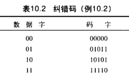

# 数据链路层

## 数据链路层功能

1. 为网络层提供服务：无确认无连接、有确认无连接、有确认有连接（建立、传输、释放）	
2. 链路管理：连接的建立、维持、释放，主要用于面向连接
3. 帧定界、帧同步、透明传输；**HDLC**就是一种面向比特的网络节点之间同步传输数据的**数据链路层**协议，标识位F(01111110)标识帧的开始和结束
4. 流量控制（OSI体系结构中）：限制发送方的数据流量，使其发生速率不超过接收方的接收能力(数据链路层点到点，传输层端到端)
5. 差错控制：位错、帧错(丢失、重复、失序等)；循环冗余校验(CRC)、自动重传请求(ARQ)；定时器、编号机制，保证每一帧最终都能仅有一次正确地交付给目的节点。

## 组帧

### 字符计数法

### 字符填充的首尾定界符法

控制字符SHO开始，控制字符EOT结束，转义字符ESC(以实现数据的透明传输)

### 零比特填充的首尾标志法

01111110来标志一帧的开始和结束，遇到五个连续的1时插入一个0 (以实现数据的透明传输)

### 违规编码法

物理层进行比特编码时常采用
例如曼彻斯特编码的1为“高低”，0为“低高”，对于“高高”、“低低”是违规的，可以用来这些违规编码序列来定界帧的起始和终止
实现了透明传输、只适用于采样冗余编码的特殊编码环境

## 差错控制

### 检错编码

冗余编码技术

#### 奇偶校验码

奇校验码：在附加一个校验元后，码长为n的码字中“1”的个数为奇数

#### 循环冗余校验码（CRC)

帧检验序列(FCS)
多项式G(X)，最高位和最低为必须为1，阶为r
计算步骤：低位附加r个0后模2除得到的余数即为冗余码r位
检验步骤：除后无余数则

### 纠错编码

#### 海明码

从右开始数第1、2、4、8、……、2^i^位为检错码
S1负责二进制中最低第一位为1位子的检验，S2负责二进制中最低第二位为1位子的检验（模2加）

**汉明距离**

两个(相同长度)字的汉明距离是对应位不同的数量。我们以d (x , y) 表示两个字x和 y之间的汉明距离。

**最小汉明距离**(minimum Hamming distance) 是所有可能对中的最小仅明距离。

**如果我们的编码能检测出最多s个差错，那么两个有效编码间的最小汉明距离必须是s+1 ,这样接收到的码字才不会与有效码字匹配。换言之，如果所有有效码宇间的最小距离是s+1 ，那么接收到的码字不会被错误地认为是另 一个正确的码字。距离小于(s+ 1) 码字接收方不会认为是有效码字 。 差错可以被检测到。**

**为了保证检测出所有情况下最多 s个差错，块编码中最小汉明距离一定是s+1 。**

**为了保证纠正所有情况下最多 t个差错，块钱码中的最小汉明距离是2t+1 。**

 d~min~=3 。这个编码能检测到最多 2个差错

最小汉明距离是2。这个编码方案保证检测到单个差错 。

## 流量控制和可靠传输机制

### 流量控制、可靠传输、滑动窗口机制

#### 停止-等待

#### 滑动窗口

发送端收到一个确认帧，窗口就向前滑动一个帧的位置
接收端收到数据帧后，将窗口前移一个位置
数据链路层的滑动窗口大小在传输过程中是固定的

#### 可靠传输

确认、超时重传
捎带确认
自动重传请求ARQ：停止-等待ARQ、后退N帧ARQ、选择性重传ARQ
后两种为连续ARQ协议
停等：信道利用率低，确认帧ACK
后退N帧ARQ：累计确认、若采用n比特对帧编号则发送窗口尺寸不能大于2^n^-1，否则造成接收方无法辨别新旧帧
选择性重传ARQ：窗口大小Wr=Wt=2^n-1^、否定帧NAK
								信道利用率：(L/C)/T，L比特数据，传输速率C，发送周期T
								信道吞吐率：信道利用率*发送方发送速率

## 介质访问控制（MAC）

方法：静态划分信道（信道划分介质访问控制）、动态（随机访问介质访问控制、轮询访问介质访问控制）

### 信道划分介质访问控制

分时、分频、分码

频分多路复用（FDM）

时分多路复用（TDM） ，可用于数字传输，而FDM不行

统计时分多路复用（STDM）动态分配时隙

波分多路复用（WDM）光的频分多路复用

码分多路复用（CDM） 码分多址（CDMA）各站点的码片序列相互正交，用A站点的码内积结果为1-》1，-1》0

### 随机访问介质访问控制

不采用集中控制、占用信道全部速率，会产生碰撞、重传帧

常用协议：ALOHA协议、CSMA协议、CSMA/CD协议、CSMA/CA协议等、

争用型协议：胜利者通过争用获得信道

实际上是一种将广播信道转化为点到点信道的行为

#### ALOHA协议

1、纯ALOHA协议

直接发，一段时间每收到确认就认为冲突了，等待一段时间后重新发，直至成功，吞吐率低

网络负载为G，则其吞吐量S=Ge^-2G^，G=0.5时，S约等于0.184，这时可能达到极大值

2、时隙ALOHA协议

划分时隙，只能时隙开始时才能发送一个帧。

时隙长度使得每个帧正好在一个时隙内发送完毕，每个帧到达后一般要在缓存中等待等待一段小于时隙的时间。

碰撞后重传的策略与纯ALOHA相同。

吞吐量S=Ge^-G^，比纯ALOHA大了一倍

#### CSMA协议

发送前监听一下共用信道，发现信道空闲后再发送

1、1-坚持CSMA

一个结点要发送数据时，首先监听信道

如果信道空闲，立即发送

如果忙，那么等待，同时继续监听直到信道空闲

如果发生冲突，那么随机等待一段时间后，再重新开始监听信道

传播延迟对其影响很大

2、非坚持CSMA

发送时，首先监听

如果空闲，立即发送

如果忙，放弃监听，等待一个随机的时间后再重复该过程

增加了数据在网络中的平均延迟

3、p-坚持CSMA

用于时分信道

发送时，首先监听

忙则持续监听直到空闲

空闲则以概率p发送，以概率1-p推迟到下一个时隙

下一个时隙同样，过程持续到发送成功或检测到忙，若是忙，则等待下一个时隙重新开始监听

是前两者的折中

#### CSMA/CD

适用于总线形网络、或半双工网络环境。（由于全双工采用两条信道，分别用来发送和接收，不可能产生冲突，故全双工不需要该协议）

CSMA/CD已成功应用于使用有线连接的局域网

**碰撞检测（CD）**

先听后发、边听边发、冲突停发、随机重发

采用CSMA/CD协议的以太网只能进行半双工通信

**单程传播时延t**，则把以太网端到端往返时间**2t**称为**争用期**，只有在争用期才会发送冲突

最小帧长=总线传播时延\*数据传输速率\*2

以太网规定取51.2us为争用期长度，对于10Mb/s的以太网，争用期可发送64B，因此**以太网规定最短帧长64B**，小于64B的帧都是由于冲突而异常终止的无效帧，应立即丢弃。若数据小于64B,则需要在MAC子层中于数据字段的后面加入一个整数字节的填充字段。

CSMA/CD还能从冲突中恢复
**截断二进制指数退避算法：**
确定基本退避时间：2t(即争用期)
参数k，重传次数，k不超过10，**k=min[重传次数，10]**
从离散的整数集合[0,1,……,2^k^-1]中随机去一个数r，重传所需的退避时间就是r倍的基本退避时间即r*2t
当重传达到**16次**仍不成功时，说明网络太挤，认为此帧永远无法正确发出，抛弃此帧，并向高层报告出错
在争用期检测到碰撞时立即停止发送，执行指数退避算法

#### CSMA/CA

无线局域网环境下：
①接收信号强度往往小于发送且无线介质上信号强度动态变化范围很大，若实现碰撞检测，则硬件上的花费很大；
②无线通信中中，并非所有的站点都能够听到对方，即存在"隐蔽站"问题。

802.11标准定义了广泛应用于无线局域网的CSMA/CA协议，相对CSMA/CD将碰撞检测改为了**碰撞避免（CA）**

802.11使用链路层确认/重传(ARQ)方案

为了尽量避免碰撞，802.11规定，所有的站点完成发送后，必须在等待一段很短的时间（继续监听）才能发送下一帧，这段时间称为**帧间间隔（IFS）**，帧间间隔的长短取决于该站要发送的帧的类型：
①SIFS(短IFS)：最短的IFS,用来分隔属于一次对话的各帧，使用SIFS的帧类型有ACK帧、CTS帧、分片后的数据帧、以及所有回答AP轮询的帧等
②PIFS(点协调IFS)：中等长度的IFS，在PCF操作中使用
③DIFS(分布式协调IFS)：最长的IFS，用于异步帧竞争访问的时延

CSMA/CA的退避算法和CSMA/CD 的稍有不同(见教材)。信道从忙态变为空闲态时，任何一个站要发送数据帧，不仅都要等待一个时间间隔，而且要进入争用窗口，计算随机退避时间以便再次试图接入信道，因此降低了碰撞发生的概率。

当且仅当检测到信道空闲且这个数据帧是要发送的第一个数据帧时，才不使用退避算法。其他所有情况都必须使用退避算法，具体为:
在发送第一个帧前检测到信道忙
每次重传
每次成功发送后要发送下一帧。

CSMA/CA算法的归纳如下:
1)若站点最初有数据要发送(而不是发送不成功再进行重传)，且**检测到信道空闲，在等待时间DIFS后，就发送整个数据**。
2)否则，站点执行CSMA/CA 退避算法，选取一个**随机回退值**。一旦检测到信道忙，**退避计时器**就保持不变。只要信道空闲，退避计时器就进行倒计时。
3)当退避计时器减到0时(这时信道只可能是空闲的)，站点就**发送整个帧并等待确认**。
4)发送站若收到确认，就知道已发送的帧被目的站正确接收。这时如果要发送第二帧，就要从步骤 2)开始，执行 CSMA/CA 退避算法，随机选定一段退避时间。
若发送站在规定时间(由重传计时器控制) 内没有收到**确认帧 ACK**，就必须**重传**该帧，再次使用 CSMA/CA 协议争用该信道，直到收到确认，或经过若干次重传失败后放弃发送。

**隐蔽站问题**：站A和B都在 AP 的覆盖范围内，但A和B 相距较远，彼此都听不见对方，当A和B 检测到信道空闲时，都向 AP 发送数据，导致碰撞的发生。
为了避免该问题，802.11 允许发送站对信道进行预约。
**源站**要发送数据帧之前先**广播**一个很短的**请求发送 RTS (Request To Send) 控制**，它包括源地址、目的地址和这次通信(含相应的确认帧) 所持续的时间，该能被其范围内包括 AP 在内的所有站点听到。
若信道空闲，则**AP广播**一个**允许发送 CTS (Clear To Send) 控制**，它包括这次通信所需的持续时间(从RTS 帧复制),该帧也能被其范围内包括 A 和 B 在内的所有站点听到。B 和其他站听到 CTS 后在 CTS 中指明的时间内将**抑制发送**。**CTS 有两个目的:①给源站明确的发送可;②指示其他站点在预约期内不要发送**

#### CSMA/CD与 CSMA/CA 区别:

1、CSMA/CD 可以检测冲突，但无法避免;CSMA/CA 发送数据的同时不能检测信道上有无冲突，本结点处没有冲突并不意味着在接收结点处就没有冲突，只能尽量避免。
2、传输介质不同。CSMA/CD 用于总线形以太网，CSMA/CA 用于无线局域网 802.1la/b/g/n 等
3、检测方式不同。CSMA/CD 通过电缆中的电压变化来检测:而 CSMA/CA 采用能量检测载波检测和能量载波混合检测三种检测信道空闲的方式。
总结:
**CSMA/CA 协议的基本思想是在发送数据时先广播告知其他结点，让其他结点在某时间内不要发送数据，以免出现碰撞。**
**CSMA/CD 协议的基本思想是发送前监听，边发送边监听旦出现碰撞马上停止发送。**

### 轮询访问：令牌传递协议

令牌（Token）沿着环形总线在各节点计算机之间一次传递。
令牌是一个特殊的MAC控制帧
令牌传递到有数据要发送的站点时，该站点修改令牌中的一个标志位并附加需要传输的数据，将令牌变为一个数据帧发出，数据帧沿环路传输。
接收站点一边转发一边查看帧的目的地址，若目的地址时自己那么接收站复制该数据。
数据帧沿着换路传输，直到到达源点。通过检验返回的帧来检测是否出错
传送完，重新产生一个令牌，并传递给下一个站点，以交出信道控制权。
令牌环网不会发送碰撞

物理拓扑不必是环，令牌在设备间的传递通路逻辑上必须是个环。

非常适合负载很高的广播信道

## 局域网（LAN）

### 基本概念和体系结构

是指在一个较小的地理范围内，将各种计算机、外部设备、数据库系统等通过双绞线、同轴电缆等连接介质相互连接起来，组成资源和信息共享的计算机互连网络。

特点：

1. 为一个单位所有，且地理范围和站点数目有限
2. 所有站点共享较高的总带宽（即较高的数据传输速率）
3. 较低的时延和较低的误码率
4. 各站点为平等关系而非主从关系
5. 能进行**广播和组播**

由三个要素决定：拓扑结构、传输介质、介质访问控制方式（最重要）

可以使用双绞线、铜缆、光纤等多种传输介质，双绞线为主流

拓扑结构：星型结构、环形结构、总线型结构、星型和总线型结合的复合结构

介质访问控制方式：CSMA/CD、令牌总线和令牌环。前两者主要用于总线型局域网，令牌环主要用于环形局域网

三种特殊局域网拓扑实现：
以太网：逻辑拓扑是总线形结构，物理拓扑是星型或拓展星型结构
令牌环：逻辑拓扑是环形结构，物理拓扑是星型结构
FDDI：逻辑拓扑是环形结构，物理拓扑是双环结构

IEEE 802标准定义的局域网，参考模型只对于OSI模型的数据链路层和物理层，并将数据链路层拆分为两个子层：**逻辑链路控制层（LLC）子层**和**媒体接入控制（MAC）子层**

媒体接入控制（MAC）子层：与接入传输体有关的内容都放在 MAC 子层，它向上层屏蔽对物理层访问的各种差异，提供对物理层的统一访接口，主要功能包括: **组帧和拆卸帧、比特传输、差错检测、透明传输**

逻辑链路控制层（LLC）子层：LLC 子层与传输媒体无关，它向网络层提供无确认无连接、面向连接、带确认无连接、高速传送 4 种不同的连接服务类型

LLC子层作用已经不大，现在许多网卡仅装有MAC协议

### 以太网与IEEE 802.3

IEEE 802.3 标准是一种基带总线形的局域网标准，它描述**物理层和数据链路层的 MAC 子层**的实现方法

以太网逻辑上采用总线形拓扑结构，以太网中的所有计算机共享同一条总线，**信息以广播方式发送**

为了保证数据通信的方便性和可靠性，以太网简化了通信流程并**使用了 CSMA/CD 方式对总线进行访问控制**

通常将 802.3 局域网简称为以太网

以太网采用两项措施以简化通信：
①采用**无连接**的工作方式，不对发送的数据编号(无编号)，也不要求接收方发送确认(无确认)，即以太网**尽最大努力交付数据，提供的是不可靠服务**，对于差错的纠正则由高层完成
②发送的数据都使用**曼彻斯特编码**的信号，每个码元的中间出现一次电压转换，接收端利用这种电压转换方便地把位同步信号提取出来。

#### 介质与网卡

以太网常用介质有四种：粗缆、细缆、双绞线和光纤

星型网中心为集线器

网络接口板（又叫网络适配器、网络接口卡NIC），**网卡**上装有**处理器和存储器**，是工作在**数据链路层**的网络组件

网卡和局域网的通信是通过电缆或双绞线以串行方式进行的，而网卡和计算机的通信则是通过计算机主板上的 I/ 总线以并行方式进行的。

网卡的重要功能就是进行**数据的串并转换**。**网卡不仅能实现与局域网传输介质之间的物理连接和电信号匹配，还涉及帧的发送与接收、帧的封装与拆封、介质访问控制、数据的编码与解码及数据缓存功能等。**

全世界的每块网卡在出厂时都有一个唯一的代码，称为**介质访问控制(MAC)地址**，这个地用于控制主机在网络上的数据通信。
数据链路层设备(网桥、交换机等)都使用各个网卡的 MAC地址。
另外，网卡控制着主机对介质的访问，因此**网卡也工作在物理层**，因为它只关注比特，而不关注任何地址信息和高层协议信息。

#### 以太网的MAC帧

**MAC地址长6字节（48位）**：如02-60-8c-e4-b1-21
高24位为厂商代码，低24为厂商自行分配的网卡序列号
由于**总线上使用的是广播信道**，网卡从网络上收到一个MAC帧，首先用**硬件检查MAC帧中的MAC地址**。如果是发往本站的帧就收下，否则丢弃。
**以太网MAC帧格式有两种标准：DIX Ethernet V2标准（即以太网V2标准，最常用）和IEEE 802.3标准**

**以太网V2标准的帧格式**：

**前导码（8B）**：使接收端和发送端时钟同步。其中**前7B是前同步码**，用于快速实现MAC帧的比特同步；**最后1B是帧开始定界符**，表示后面的信息就是MAC帧，**MAC帧不需要帧结束符**（注意区分不是尾部）因为以太网在传输帧时，各帧之间必须有一定的间隙。因此，接收端只要找到帧开始定界符，其后面连续到达的比特流就都属于同一个MAC帧

**地址 6B**：通常使用**6B(48位)**地址（MAC地址），先是**目的地址**，后面是**源地址**

**类型：2B**，指出数据域中携带的数据应该交给哪个协议实体处理

**数据：46~1500字节**，包含高层的协议消息。最长1500字节时规定。
**由于CSMA/CD算法限制，以太网帧必须满足最小长度限制要求64字节，数据较少时必须加以填充（0~46字节）**
**MAC帧的首部和尾部一起的长度为18B**。

**校验码（FCS）**：**4字节，校验范围从目的地址段到数据段的末尾**，算法采用**32位循环冗余码(CRC)**，不但需要检验MAC帧的数据部分，还要检验目的地址、源地址和类型字段，但不比较前导码。

**802.3帧格式的不同之处**：**长度域**代替DIX Ethernet V2标准MAC帧格式中的类型域，指出数据域的长度。长度段最大值是1500，因此从1501到65535的值可用于类型段标识符。

#### 高速以太网

速率达到或超过100Mb/s

100BASE-T以太网，双绞线上传送100Mb/s基带信号的星型拓扑结构以太网，CSMA/CD协议（半双工时），全双工和半双工，802.3标准的MAC帧格式，保持最短帧不变，但将一个网段的最大电缆长度减小到100米，帧间隔从原来的9.6us变为0.96us。

吉比特以太网，千兆以太网，1Gb/s,全双工和半双工，802.3标准的MAC帧格式，CSMA/CD协议（半双工时），与10BASE-T和100BASE-T技术向后兼容。

10吉比特以太网，与10Mb/s、100Mb\s，1Gb\s以太网的帧格式相同。保留802.3标准规定的最小最大帧长，只使用光纤作为传输媒体，只工作在全双工

### IEEE 802.11无线局域网

#### 无线局域网的组成

无线局域网分为两大类：有固定基础设施的无线局域网、无固定基础设施的移动自组织网络。

1、有固定基础设施的无线局域网
有固定基础设施，无线局域网的**802.11系列协议**，包括802.11a/b/g/n等，
使用星型拓扑，其中心成为**接入点AP**，在MAC层使用**CSMA/CA协议**。
**使用802.11协议的局域网又称Wi-Fi**
802.11标准规定无线局域网的最小构件是**基本服务集BSS**，一个基本服务集包括一个接入点和若干移动站，各站在本BSS内之间通信，或与本BSS外部站的通信，都必须通过本BSS的AP。此处提到的AP就是基本服务集中的基站。
安装AP时必须**为该AP分配**一个**不超过32字节**的**服务集标识符SSID**和一个信道。SSID是指使用该AP的无线局域网的名字。
一个基本服务集覆盖的地理范围称为一个**基本服务区(BSA)**，无线局域网的基本服务区的范围直径一般**不超过100m**。
一个基本服务集可以是孤立的，也可以通过AP连接到一个**分配系统DS**，然后再连接到另一个基本服务集，就构成了一个**扩展的服务集（ESS）**,ESS还可以通过一种称为Portal(门户)的设备为无线用户提供有线连接的以太网的接入，门户的作用相当于一个网桥。

2、无固定基础设施移动自组织网络
自组网络（Ad Hoc 网络）
没有上述AP，各节点之间地位平等，中间结点都为转发结点，因此都具有路由器的功能
自组网络通常是这样构成的:一些可移动设备发现在它们附近还有其他的可移动设备，并且要求和其他移动设备进行通信。**自组网络中的每个移动站都要参与网络中其他移动站的路由的发现和维护**，同时由移动站构成的网络拓扑可能随时间变化得很快，因此在固定网络中行之有效的一些路由选择协议对移动自组网络已不适用，需引起特别的关注。
自组网络和移动 IP 并不相同。移动 IP 技术使漫游的主机可以用多种方法连接到因特网，其核心网络功能仍然是基于固定网络中一直使用的各种路由选择协议。而自组网络是把移动性扩展到无线领域中的自治系统，**具有自己特定的路由选择协议，并且可以不和因特网相连**。

#### 802.11局域网的MAC帧

三种类型：**数据帧、控制帧、管理帧。**
帧组成：
1、**MAC首部，共30字节**
2、**帧主体**，帧的数据部分，不超过2312字节。
3、**帧检验序列FCS是尾部，共4字节**
首部中最重要的是四个地址字段（都是MAC地址），地址4用于自组网络，前三个地址的内容取决于帧控制字段的“去往AP"和“来自AP"这两个字段的数值。

AP和路由器间传输，AP的802.3帧与802.11帧的转换

### VLAN的基本概念与基本原理

一个以太网是一个广播域。以太网中出现大量广播帧，特别是经常使用的ARP和DHCP协议；一个单位的不同部门共享一个局域网对信息保密和安全不利。

虚拟局域网VLAN，可以把一个较大的局域网分割成一些较小的与地理位置无关的逻辑上的VLAN，而**每一个VLAN是一个较小的广播域**。

802.3ac标准定义了支持VLAN的以太网帧格式的扩展。
插入一个**4字节的标识符（在源地址字段和类型字段之间），称为VLAN标签**，用来指明发送帧的计算机属于哪个虚拟网络。插入VLAN标签的帧称为802.1Q帧。

由于VLAN帧的首部增加了4字节，因此以太网的最大帧长从原来的1518字节变为1522字节。
VLAN标签的前两个字节置为**0x8100**，表示这是一个802.1Q帧。
在VLAN标签的后两个字节中，前4位没用，后12位是该**VLAN的标识符VID**
**交换机，插入VID后，802.1Q帧的FCS必须重新计算**

虚拟局域网只是局域网给用户提供的**一种服务**，并不是一种新型局域网

处于不同VLAN，即不同网络中，需要通过上层的路由器来解决，也可以在交换机中嵌入专用的芯片来进行转发，这样就在交换机中实现的第三层的转发功能。
二层交换机工作原理：当一个数据包到达二层交换机时，该交换机会查找目标 MAC 地址，并将其与内部的 MAC 地址表进行匹配，如果找到匹配项，则从相应的端口向外转发数据包。如果未找到匹配项，则会将数据包广播给所有连接的端口。

## 广域网

通常指覆盖范围很广（远超一个城市的范围）的长距离网络；是因特网的核心部分，其任务是长距离运送主机所发送的数据。

局域网可以通过广域网与另一个相隔较远的局域网通信。

广域网由一些**结点交换机**及连接这些交换机的链路组成。结点交换机的功能是**将分组存储并转发**，结点之间都是点到点连接，但为了提高网络可靠性，通常一个结点交换机往往与多个结点交换机相连。

结点交换机，注意不是路由器，工作原理类似，都是用来转发分组，但结点交换机在单个网络中转发分组，路由器在多个网络构成的互联网中转发分组

**广域网使用的协议主要在网络层**

广域网中的一个重要问题是**路由选择**和**分组转发**。
**路由选择协议**负责搜索分组从某个结点到目的结点的最佳传输路由，以便构造路由表，然后从路由表再构造出转发分组的转发表。
**分组是通过转发表进行转发的。**
常见的两种**广域网数据链路层协议是 PPP 协议和 HDLC 协议**。

### PPP协议

**点对点协议(PPP)**是使用串行线路通信的面向字节的协议。
设计的目的主要是**用来通过拨号或专线方式建立点对点连接发送数据，使其称为各种主机、网桥和路由器之间简单连接的一种共同解决方案。**

三个组成部分：

1. **链路控制协议（LCP）**：一种扩展链路控制协议，用于**建立、配置、测试和管理数据链路。**
2. **网络控制协议（NCP）**：PPP协议允许同时采用多种网络层协议，**每个不同的网络层协议要用一个相应的NCP来配置**
3. 一个将IP数据报封装到串行链路的方法。IP数据报在PPP帧中就是其信息部分，这个信息部分的长度受最大传送单元（MTU）的限制。

PPP帧格式
前三个字段和最后两个字段和HDLC帧是一样的。
**标志字段(F)**仍为**7E（01111110)，前后各占1字节**，若他在信息部分出现，就必须做字节填充，使用的控制专业字符是7D(01111101)。
但在PPP帧中**地址字段(A)占1字节**，规定为0xFF，**控制字段(C)占1字节**，规定为0x03,两者的内容始终固定不变。
**PPP是面向字节的**，因而所有PPP帧的长度都是整数个字节。
第四个字段是**协议段**，2字节，在HDLC中没有协议段
第五段**信息段的长度是可变的，大于或等于0且小于或等于1500B**.
第六段是**帧检验序列(FCS)，占2字节**，循环冗余检验(CRC)，检验区间包括**地址字段、控制字段、协议字段、信息字段**

当线路处于**静止状态**时，不存在物理层连接。当线路**检测到载波信号时，建立物理连接**，线路变为**建立状态**。此时，**LCP 开始选项商定**，商定成功后就进入**身份验证**状态。身份验证通过后，进入**网络层协议状态**。这时，**采用NCP 配置网络层**，**配置成功后，进入打开状态，然后就可进行数据传输**。**当数据传输完成后线路转为终止状态。载波停止后则回到静止状态**

PPP 链路建立、使用、撤销所经历的状态图。

PPP协议的特点：
1)PPP **提供差错检测**但不提供纠错功能，只保证无差错接收 (通过硬件进行 CRC 校验)。它是**不可靠的传输协议**，因此也不使用序号和确认机制。
2)它仅支持点对点的链路通信，不支持多点线路。
3)PPP **只支持全双工**链路。
4)**PPP的两端可以运行不同的网络层协议**，但仍然可使用同一个 PPP 进行通信。
5)**PPP 是面向字节的**，当信息字段出现和标志字段一致的比特组合时，PPP 有两种不同的处理方法:**若PPP 用在异步线路(默认)，则采用字符填充法:若 PPP 用在 SONET/SDH等同步线路，则协议规定采用硬件来完成比特填充(和HDLC的做法一样)**。

### HDLC协议

**高级数据链路控制（HDLC）协议**是**面向比特**的数据链路层协议

**报文可透明传输，比特填充5个连续的1立即在后面填入一个0，0比特插入法**

**全双工**

**CRC检验，对信息帧进行顺序编号**

**传输控制功能和处理功能分离，具有较大灵活性。**

HDLC帧格式：**标志F(01111110)，地址1B，控制1B，信息(可变)和FCS(2B)等字段**构成

PPP 和 HDLC 的格式很相似。但两者有以下几点不同:
1) **PPP 协议**是面向**字节**的，**HDLC 协议**是面向**比特**的。
2) PPP 帧比HDLC 多一个2字节的**协议字段**。当协议字段值为 **0x0021 时，表示信息字段是IP 数据报**。
3) PPP 协议不使用序号和确认机制，只保证无差错接收(CRC 检验)，而端到端差错检测由高层协议负责。**HDLC 协议的信息帧使用了编号和确认机制，能够提供可靠传输。**

## 数据链路层设备

### 网桥

**两个或多个以太网通过网桥连接**后，就成为一个覆盖范围更大的以太网，而原来的每个以太网就称为一个网段。

**网桥**工作在**链路层的 MAC 子层，可以使以太网各网段成为隔离开的碰撞域(又称冲突域)**。如果把网桥换成工作在物理层的转发器，那么没有这种过滤通信量的功能。由于各网段相对独立，因此**一个网段的故障不会影响到另一个网段的运行**。
网桥必须具有**路径选择的功能**，接收到帧后，要决定正确的路径，将该帧转送到相应的目的局域网站点。

### 局域网交换机

也叫**以太网交换机**

实际上就是一个多端口的网桥，工作在**数据链路层**
通常工作在**全双工方式**。
能经济地将网络分成小的冲突域。

以太网交互机的原理：它检测从以太端口来的数据帧的源和目的地的MAC(介质访问层)地址，然后与系统内部的动态查找表进行比较，若数据帧的源MAC地址不在查找表中，则将该地址加入查找表，并将数据帧发送个相应的目的端口。

以太网交换机可以方便的实现虚拟局域网VLAN，**VLAN不仅可以隔离冲突域，还可以隔离广播域**。

对于传统10Mb/s的共享式以太网，若共有N个用户，则每个用户占用的平均带宽只有总带宽(10Mb/s)的1/N。在使用以太网交换机（默认工作在全双工）来连接这些主机，虽然在每个端口到主机的带宽还是10Mb/s，但由于一个用户在通信时独占而不是和其他用户共享传输媒体的带宽，因此用于N个端口的交换机的总容量为：N*10Mb/s，这是**交换机最大的优点**

以太网交换机的特点：

1. 以太网交换机的**每个端口都直接与单台主机相连**(网桥的端口往往连接到一个网段)，并且一般都工作在**全双工**方式。
2. 以太网交换机能同时连通多对端口，使每对相互通信的主机都能像独占通信媒体那样，**无碰撞地传输数据**。
3. 以太网交换机是一种即插即用设备，其内部的帧的**转发表**是通过**自学习算法**自动地逐渐建立起来的。
4. 太网交换机由于使用专用的交换结构芯片，**交换速率较高**
5. **以太网交换机独占传输媒体的带宽**

两种交换模式：

1. **直通式交换机**，只检查帧的目的地址，使得帧在接收后几乎能马上被传出去，**无法支持不同速率的端口的交换**
2. **存储转发式交换机**，先将接收到的帧缓存到高速缓存中，并检查数据是否正确，确认无误后通过查找表转换成输出端口将该帧发送出去。如果发现帧有错，那么就将丢弃。**优点：可靠性高，并能支持不同速率端口间的转换；缺点：延迟较大**。

**交换机的自学习功能：**

1. **过滤**：决定一个帧是应该转发到某个端口还是应该将其丢弃。
2. **转发**：决定一个帧应该被移动到哪个端口
3. 交换机的过滤和转发借助**交换表**完成，交换表的一个表项至少包含：①一个MAC地址；②连通该MAC地址的交换机端口。
4. A向B发送一帧，从端口1进入交换机，先查找交换表，若找不到MAC地址为B的表项。然后，交换机将该帧的源地址A和端口1写入交换表，并向除端口1外的所有端口广播这个帧。有表项时，则从对应端口转发。

**交换机和网桥的不同之处**。
尽管交换机也称多端口网桥，但两者仍有许多不同之处。主要包括以下三点:

1. 网桥的端口一般连接局域网，而交换机的端口一般直接与局域网的主机相连
2. 交换机允许多对计算机同时通信，而网桥仅允许每个网段上的计算机同时通信
3. 网桥采用存储转发进行转发，而以太网交换机还可以采用直通方式进行转发，且以太网交换机采用了专用的交换结构芯片，转发速度比网桥快。

## 广域网 SONET/SDH

广域网 SONET，用做承载来自其他WAN数据的传输网络

光纤的高带宽适用于今天的高数据速率技术(比如视频会议)和低速率下同时承载大量的数据。基于这个原因，光纤和要求高数据速率或者高带宽传输的技术共同发展。继而有了标准化的需要。因此，美国组织(ANSI)和欧洲组织(ITU-T) 定义了相应的标准，虽然两种标准是独立的，但是基本功能相似并且最终是兼容的。
ANSI标准成为**同步光纤网络(Synchronou Optical Network , SONET)** , ITU-T标准成为**同步数字体系(Synchronous digital Hierarchy , SDH) 。**
SONET 由 ANSI 定义。
SDH 由 ITU-T 定义。
**SONET/SDH是使用同步TDM多路复用的同步网络。系统中的所有时钟都锁定于主时钟。**

### 体系结构

#### 信号

**SONET**定义了称为**同步传输信号**(synchronous transport signal , **STS**) 的**电子信号等级体系**。每个 STS等级(STS-1 到 STS-192) 支持特定的数据速率(以每秒兆位规定) 。
相应的光信号称为**光载波**
**SDH**也规定了一个相似的系统，称为**同步传输模块(**synchronous transport module , **STM**)。
STM用于与现存欧洲体系(比如E线路)和STS等级兼容。最后，最低的 STM等级STM-1 定义为 155.520Mbps ，正好等同于 STS-3 。

其次，STS-3的速率正好是STS-1 速率的三倍，STS-9的速率正好是STS-18速率的一半。这些关系意味着 18个 STS-1 通道能复用成一个STS-18通道，六个 STS-3通道能复用成一个STS-18通道，依此类推。

#### SONET设备

SONET传输依靠三个基础设备**:STS 多路复用器(STS MUX)/分离器(STS DEMUX)、再生器(R)、分插复用器(ADM)和终端(T)。**

**STS 多路复用器/分离器**标记 SONET链路的开始点和结束点。提供电子支路网络和光网络之间的接口。
**STS 多路复用器**(STS multiplexer) **复用来自多个电子源的信号，井产生相应的 OC信号。**
**STS分离器**(STS demultiplexer) **将光OC信号分解成相应的电子信号。**

**再生器**扩展了链路的长度。再生器(regenerator )是个**中继器** ，它把接收到的光信号(OC-n) 解调成相应的电信号(STS-n) ， 再生成电信号，最后把电信号调制成相应的OC-n1信号。SONET再生器用新的信息替换一些现有的开销信息(头部信息)。

**分插复用器(add/drop multiplexer , ADM) ，分插复用器允许信号的插入和抽取**。可以把来自多个源的 STS加到给定路径中或是从某条路径中除去并重定向所需的信号，而无需多路分解整个信号。分插复用器使用诸如地址和指针(会在后面描述)的头部信息来确定单个流，而不是依靠时间和位置。

在上图所示的简单配置中，多个进入的电子信号输入一个 STS 多路复用器中，这些信号在多路复用器里组合成一个单一光信号。光信号传输给再生器，在这里重新生成不带有传输过程中加入的噪声的信号。从多个源再生的信号输入到一个分插复用器。分插复用器重新组织这些信号，如果需要，用数据帧中的信息将它们直接发送出去。这些再次多路复用的信号发送给另一个再生器，然后再发送给接收 STS分离器，在这里以接收链路可以接受的格式返回。

**终端(terminal )**是使用 SONET网络服务的设备。例如，在因特网中，终端可以是一个路由器，该路由器需要将发送分组给SONET网络另一端的另一个路由器上。

#### 连接

**段(section)** 是连接两个相邻设备(多路复用器到多路复用器、多路复用器到再生器、或再生器到再生器)的光链路。

**线路(line)** 是两个多路复用器之间(STS 多路复用器到分插复用器、两个分插复用器、或两个STS 多路复用器)的网络部分。

**路径(path)** 是两个 STS 多路复用器之间的端到端网络部分。在两个 STS 多路复用器直接互连的简单 SONET中，段、线路和路径相同。

### SONET 层

**SONET标准包括四个功能层:光子层、段层、线路层和路径层。它们对应于物理层和数据链路层。**

#### 路径层

路径层(path layer) 负责将信号从它的光信源到光信宿的移动。在光信源，信号从电形式转换成光形式，再与其他信号复用在一起，封装成帧。在光信宿，接收到的帧被多路分解，然后将单个光信号转换回它们的电形式。在这一层增加了路径层开销。
STS多路复用器提供路径层功能。

#### 线路层

线路层(line layer) 负责信号在物理线路中的移动。这一层给帧增加线路层开销。
STS 多路复用器和分插复用器提供线路层功能。

#### 段层

段层(section layer) 负责信号在物理段中的移动。它处理成帧、串扰和差错控制。在这一层给帧增加段层开销。

#### 光子层

光子层(photonic layer) 对应于OSI模型中的物理层。它包括光纤通道、接收器敏感度、多路复用功能等等的物理规范说明。
SONET使用 NRZ进行编码，光存在为 1 ，不存在为0 。

#### 设备-层之间的关系

STS 多路复用器是四层设备。分插复用器是三层设备。再生器是两层设备。

### SONET帧

**每个同步传输信号 STS-n 由 8000个帧组成。每个帧是个90*n列9行的两维矩阵。**例如，STS-1 帧有 90列、9行(810字节)，STS-3有 270列、9行(2430字节)。

#### 帧、字节和位传输

**每个 STS-n信号以每秒 8000个帧的固定速率传输**。这是数字化语音的速率。对于每个帧，从左向右、从上到下传输字节。对于每个字节，从高位向低位(从左向右)传输位。

如果我们对语音信号进行采样，每个样本 8位( 1 个字节) ，我们可以说SONET帧中的每个字节可以携带来自数字化语音通道的信息。换言之，**STS-1 信号能同时携带774个语音通道(810减去用于开销所需的字节)**。
**SONET帧中的每一个字节能承载一个数字化语音通道。**

#### STS-1 帧格式

该帧的前三列用于段和线路开销。前三列的上面三行用于段开销(section overhead ,SOH) 。下面六行用于线路开销(l ine overhead , LOH) 。该帧的其他字节成为同步有效载荷封装(SPE) 。它包括用户数据和用户数据级别所需的路径开销(path overhead , POH) 

##### 段开销

**段开销**，每个段开销由 9个八位字节组成。这些八位字节的标签 、 功能和组织如图 17.7所示。

**对齐字节**(A1 和 A2) 。字节Al 和A2用于实现成帧和同步，称为对齐字节。这些字节向接收器告警有一个帧即将到边 ， 井给接收器一个预先确定的用于同步的位模式。这两个字节的位模式的十六进制为 OxF628 。这些字节充当标记。

**奇偶校验字节**(B1 )。字节 B1用于**位交织奇偶(BIP-8) 校验**。它的值由前一个帧所有字节计算而得。换言之，这个字节的第 i位是前一个STS-n帧的所有第i位计算而得的奇偶位。这个字节的值只放在 STS-n帧中的第一个 STS-1中。换言之，虽然一个 STS-n帧有n个B1字节(正如我们会在后面看到的) ，但是只有第一个字节有这个值，其余用0填充。

**标识字节**(C1)。字节C1携带了 STS-1 帧的标识。当多个 STS-1 帧复用生成更高速率STS帧(STS-3 、STS-9 、STS - 12等)的时候需要这个字节。这个字节中的信息允许在分解时能轻易辨认出各个信号。例如，在一个 STS-3信号中，对应第一个 STS-1的 Cl 字节的值是 1 ，第二个是 2 ，第三个是3 。

**管理字节**( D1、D2 、和 D3)。D1 、D2和 D3 字节一起形成一条称为数据通信通道的192kbps的通道(3 x 8000 x 8) 。这个通道用于操作、管理 、 和维护(OA&M) 信令。

**线路序列字节**(E 1)。字节目是线路序列字节。在连续帧中的El 字节形成了一条64kbps通道(每秒的 8000个帧乘以每个帧的 8位)。这个通道用于再生器之间、或终端和再生器之间的通信。

**用户字节**(F 1)。在连续帧中的 Fl 字节形成了一条 64kbps的通道，保留用于在段层的用户需求。
为每个SONET设备(再生器和多路复用器)重新计算段开销。

##### 线路开销

线路开销由 18个字节组成。这些字节的标签、功能和安排如图 17.8所示。

## 电路网络:帧中继和ATM

三种交换技术：电路交换、分组交换和报文交换。

分组交换可以使用两种方法:虚电路方法和数据报方法。