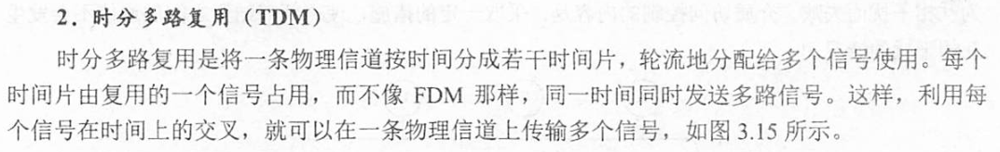
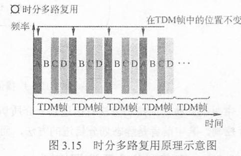
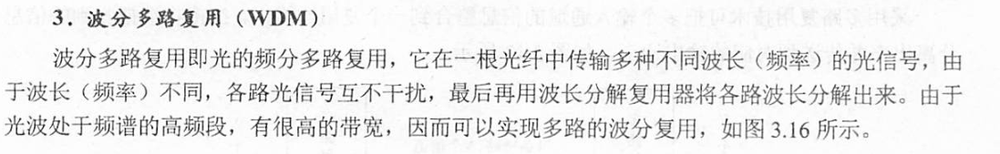
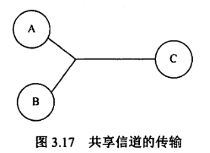
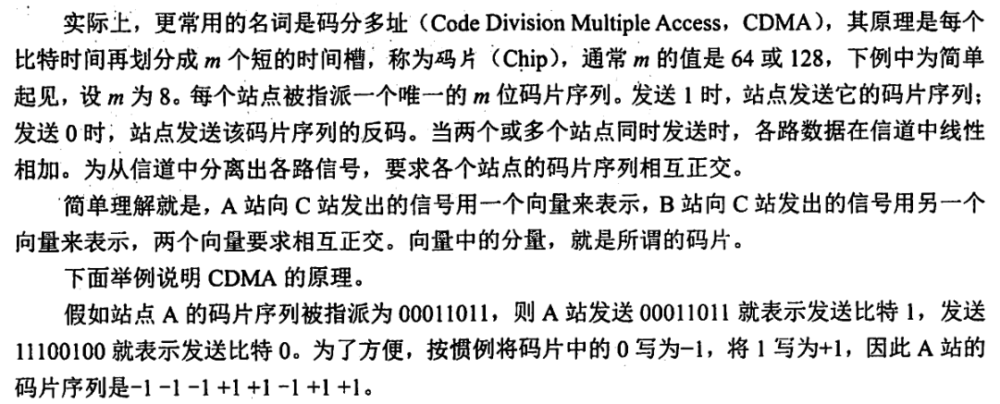
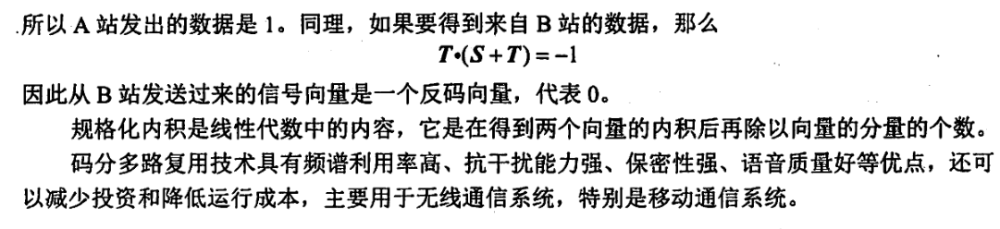
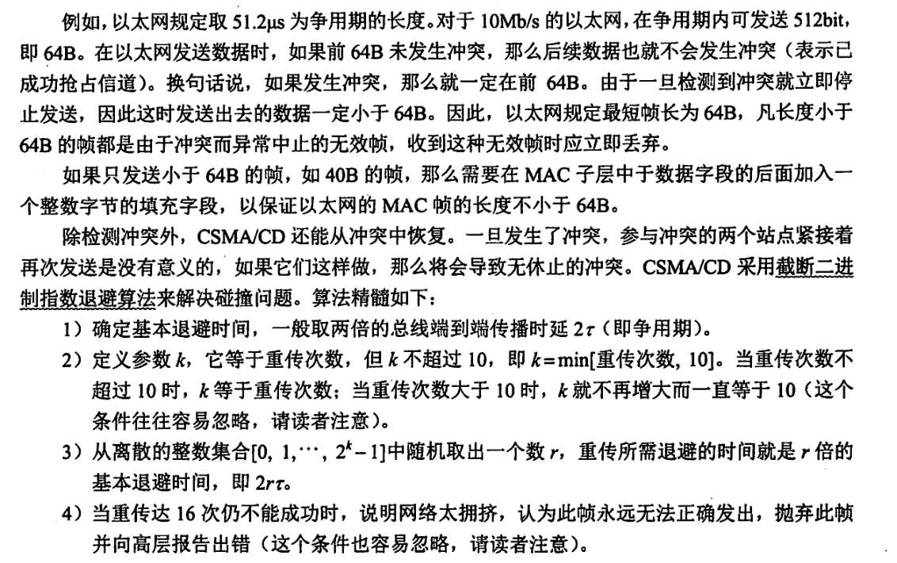
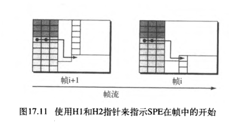

# 数据链路层功能

数据链路层在物理层提供服务的基础上向网络层提供服务，其主要作用是加强物理层传输原始比特流的功能，将物理层提供的可能出错的物理连接改造为逻辑上无差错的数据链路，使之对网络层表现为一条无差错的链路。

数据链路控制包括：成帧、流量控制、差错控制

## 1、为网络层提供服务：

- **无确认的无连接服务**。源机器发送数据帧时不需先建立链路连接，目的机器收到数据帧时不需发回确认。对丢失的帧，数据链路层不负责重发而交给上层处理。适用于实时通信或误码率较低的通信信道，如以太网。
- **有确认的无连接服务**。源机器发送数据帧时不需先建立链路连接，但目的机器收到数据帧时必须发回确认。源机器在所规定的时间内未收到确定信号时，就重传丢失的帧，以提高传输的可靠性。该服务适用于误码率较高的通信信道，如无线通信。
- **有确认的面向连接服务**。帧传输过程分为三个阶段：**建立数据链路、传输帧、释放数据链路**。目的机器对收到的每一帧都要给出确认，源机器收到确认后才能发送下一帧，因而该服务的**可靠性最高**。该服务适用于通信要求（可靠性、实时性）较高的场合。

注意：有连接就一定要有确认，即不存在无确认的面向连接的服务。

## 2、链路管理：

**连接的建立**、**维持**、**释放**

数据链路层连接的建立、维持和释放过程称为链路管理，它主要用于**面向连接的服务**。

**链路两端的结点要进行通信，必须首先确认对方已处于就绪状态，并交换一些必要的信息以对帧序号初始化，然后才能建立连接，在传输过程中则要能维持连接，而在传输完毕后要释放该连接。**在多个站点共享同一物理信道的情况下（如在局域网中）。如何在要求通信的站点间分配和管理信道也属于数据链路层管理的范畴。

## 3、帧定界、帧同步、透明传输；

两台主机之间传输信息时，必须将网络层的分组封装**成帧**，以帧的格式进行传送。将一段数据的前后分别**添加首部和尾部**，就构成了帧。因此，帧长等于数据部分的长度加上首部和尾部的长度。首部和尾部中含有很多控制信息，它们的**一个重要作用是确定帧的界限**，即**帧定界**。

**帧同步**指的是**接收方应能从接收到的二进制比特流中区分出帧的起始与终止**。

**HDLC协议**（高级数据链路控制协议），是一种面向比特的网络节点之间同步传输数据的**数据链路层**协议，**用标识位F(01111110)来标识帧的开始和结束**。**通信过程中，检测到帧标识位F即认为是帧的始，然后一旦检测到帧标识位F即表示帧的结束**。HDLC标准帧格式如图3.1所示。为了提高帧的传输效率，应当使帧的数据部分的长度尽可能地大于首部和尾部的长度，但每种数据链路层协议都规定了帧的数据部分的长度上限——**最大传送单元(MTU)**。

如果在数据中恰好出现与帧定界符相同的比特组合（会误认为“传输结束”而丢弃后面的数据)，那么就要采取有效的措施解决这个问题，即**透明传输**。更确切地说，**透明传输就是不管所传数据是什么样的比特组合，都应当能在链路上传送。**

## 4、流量控制（OSI体系结构中）：

限制发送方的数据流量，使其发生速率不超过接收方的接收能力(数据链路层点到点，传输层端到端)

由于收发双方各自的工作速率和缓存空间的差异，可能出现发送方的发送能力大于接收方的接收能力的现象，如若此时不适当限制发送方的发送速率（即链路上的信息流量），前面来不及接收的帧将会被后面不断发送来的帧“淹没”，造成帧的丢失而出错。因此，**流量控制实际上就是限制发送方的数据流量，使其发送速率不超过接收方的接收能力。**

这个过程需要通过某种反馈机制使发送方能够知道接收方是否能跟上自己，即需要有一些规则使得发送方知道在什么情况下可以接着发送下一帧，而在什么情况下必须暂停发送，以等待收到某种反馈信息后继续发送。

流量控制（见图32)并不是数据链路层特有的功能，许多高层协议中也提供此功能，只不过控制的对象不同而已。**对于数据链路层来说，控制的是相邻两结点之间数据链路上的流量，而对于传输层来说，控制的则是从源端到目的端之间的流量。**

## 5、差错控制：

位错、帧错(丢失、重复、失序等)；循环冗余校验(CRC)、自动重传请求(ARQ)；定时器、编号机制，保证每一帧最终都能仅有一次正确地交付给目的节点。

由于信道噪声等各种原因，帧在传输过程中可能会出现错误。**用以使发送方确定接收方是否正确收到由其发送的数据的方法称为差错控制。**通常，这些错误可分为**位错**和**帧错**。

- **位错，指帧中某些位出现了差错。**通常采用**循环冗余校验(CRC)**方式发现**位错**，通过**自动重传请求(ARQ)**方式来**重传出错的帧**。具体做法是：让发送方将要发送的数据帧附加一定的CRC冗余检错码一并发送，接收方则根据检错码对数据帧进行错误检测，若发现错误则丢弃，发送方超时重传该数据帧。这种差错控制方法称为**ARQ法**。ARQ法只需返回很少的控制信息就可有效地确认所发数据帧是否被正确接收。
- **帧错，指帧的丢失、重复或失序等错误。**在数据链路层引入**定时器**和**编号机制**，**能保证每一帧最终都能有且仅有一次正确地交付给目的结点。**

# 组帧

**数据链路层之所以要把比特组合成帧为单位传输，是为了在出错时只重发出错的帧，而不必重发全部数据，从而提高效率。为了使接收方能正确地接收并检查所传输的帧，发送方必须依据一定的规则把网络层递交的分组封装成帧（称为组帧）。**

组帧主要解决**帧定界**、**帧同步**、**透明传输**等问题。

通常有以下4种方法实现组帧。

## 1、字符计数法

如图33所示，字符计数法是指**在帧头部使用一个计数字段来标明帧内字符数**。目的结点的数据链路层收到字节计数值时，就知道后面跟随的字节数，从而可以确定帧结束的位置（计数字段提供的字节数包含自身所占用的一个字节)。

这种方法最大的问题在于如果计数字段出错，即失去了帧边界划分的依据，那么接收方就无法判断所传输帧的结束位和下一帧的开始位，收发双方将失去同步，从而造成灾难性后果。

## 2、字符填充的首尾定界符法

控制字符SHO开始，控制字符EOT结束，转义字符ESC(以实现数据的透明传输)

字符填充法使**用特定字符来定界一帧的开始与结束**，在图3.4的例子中，**控制字符SOH**放在帧的**最前面，表示帧的首部开始**，**控制字符E0T**表示**帧的结束**。为了使信息位中出现的特殊字符不被误判为帧的首尾定界符，可在特殊字符前面填充一个**转义字符(ESC)**来加以区分（注意，转义字符是ASCII码中的控制字符，是一个字符，而非“E”“S”“C”三个字符的组合)，以实现数据的透明传输。接收方收到转义字符后，就知道其后面紧跟的是数据信息，而不是控制信息。

## 3、零比特填充的首尾标志法

**01111110来标志一帧的开始和结束，遇到五个连续的1时插入一个0 (以实现数据的透明传输)**

## 4、违规编码法

物理层进行比特编码时常采用
例如曼彻斯特编码的1为“高低”，0为“低高”，对于“高高”、“低低”是违规的，可以用来这些违规编码序列来定界帧的起始和终止
实现了透明传输、只适用于采样冗余编码的特殊编码环境

# 差错控制

实际通信链路都不是理想的，比特在传输过程中可能会产生差错，1可能会变成0，0也可能会变成1，这就是**比特差错**。比特差错是传输差错中的一种，本节仅讨论比特差错。

**通常利用编码技术进行差错控制**，主要有两类：**自动重传请求ARQ**和**前向纠错FEC**。

- **在ARQ方式中，接收端检测到差错时，就设法通知发送端重发，直到接收到正确的码字为止。**
- **在FEC方式中，接收端不但能发现差错，而且能确定比特串的错误位置，从而加以纠正。**

因此，差错控制又可分为**检错编码**和**纠错编码**。

检错纠错的核心为冗余。

## 检错编码

编码包括：块编码、卷积编码

检错编码都采用**冗余编码技术**，其核心思想是在有效数据（信息位)被发送前，先按某种关系附加一定的冗余位，构成一个符合某一规则的码字后再发送。当要发送的有效数据变化时，相应的冗余位也随之变化，使得码字遵从不变的规则。接收端根据收到的码字是否仍符合原规则来判断是否出错。常见的检错编码有**奇偶校验码**和**循环冗余码**。

### 奇偶校验码

奇校验码：在附加一个校验元后，码长为n的码字中“1”的个数为奇数

奇偶校验码是**奇校验码**和**偶校验码**的统称，是一种最基本的检错码。它由**n-1位信息元**和**1位校验元**组成。

如果是奇校验码，那么在附加一个校验元后，码长为的码字中“1”的个数为奇数：

如果是偶校验码，那么在附加一个校验元以后，码长为的码字中“1”的个数为偶数。

它只能检测奇数位的出错情况，但并不知道哪些位错了，也不能发现偶数位的出错情况。

### 循环冗余校验码（CRC)

帧检验序列(FCS)
多项式G(X)，最高位和最低为必须为1，阶为r
计算步骤：低位附加r个0后模2除得到的余数即为冗余码r位
检验步骤：除后无余数则

**CRC检验码的位数等于生成多项式G(x)的最高次数。**

循环冗余码(Cyclic Redundancy Code,CRC)又称**多项式码**，任何一个由二进制数位串组成的代码都可与一个只含有0和1两个系数的多项式建立一一对应关系。**一个k位帧可以视为从X^k-1^到X^0^的k次多项式的系数序列，这个多项式的阶数为k-1,高位是X^k-1^项的系数，下一位是X^k-2^的系数，以此类推**。例如1110011有7位，表示成多项式是X^6^+X^5^+X^4^+X+1，而多项式X^5^+X^4^+X^2^+X对应的位串是110110，其运算过程如图3.6所示。

给定一个m bit的帧或报文，发送器生成一个r bit的序列，称为**帧检验序列(FCS)**。这样所形成的帧将由m+r比特组成。**发送方和接收方事先商定一个多项式G(x)（最高位和最低位必须为1)**，使这个带检验码的帧刚好能被预先确定的多项式G(x)整除。**接收方用相同的多项式去除收到的帧，如果无余数，那么认为无差错。**

**假设一个帧有m位，其对应的多项式为M(x),则计算冗余码的步骤如下：**

1. **加0。假设G(x)的阶为r，（即生成多项式G(x)的最高次数），在帧的低位端加上r个0。**
2. **模2除。利用模2除法，用Gx)对应的数据串去除1)中计算出的数据串，得到的余数即为冗余码（共r位，前面的0不可省略）。**

多项式以2为模运算。按照模2运算规则，加法不进位，减法不借位，它刚好是异或操作乘除法类似于二进制的运算，只是在做加减法时按模2规则进行。

通过循环冗余码（CRC)的检错技术，数据链路层做到了对帧的无差错接收。也就是说，凡是接收端数据链路层接受的帧，我们都认为这些帧在传输过程中没有产生差错：而接收端丢弃的帧虽然也收到了，但最终因为有差错而被丢弃，即未被接受。

注意：循环冗余码(CRC)是具有纠错功能的，只是数据链路层仅使用了它的检错功能，检测到帧出错则直接丢弃，是为了方便协议的实现，因此本节将CRC放在检错编码中介绍。

## 纠错编码

在数据通信的过程中，解决差错问题的一种方法是在每个要发送的数据块上附加足够的冗余信息，使接收方能够推导出发送方实际送出的应该是什么样的比特串。最常见的纠错编码是**海明码**，其实现**原理**是**在有效信息位中加入几个校验位形成海明码，并把海明码的每个二进制位分配到几个奇偶校验组中**。**当某一位出错后，就会引起有关的几个校验位的值发生变化，这不但可以发现错位，而且能指出错位的位置，为自动纠错提供依据。**

### 海明码

从右开始数第1、2、4、8、……、2^i^位为检错码
S1负责二进制中最低第一位为1位子的检验，S2负责二进制中最低第二位为1位子的检验（模2加）

确定一位纠错能力海明码的位数：n+k≤2^k^-1

**汉明距离**

两个(相同长度)字的汉明距离是对应位不同的数量。我们以d (x , y) 表示两个字x和 y之间的汉明距离。

**最小汉明距离**(minimum Hamming distance) 是所有可能对中的最小仅明距离。

**如果我们的编码能检测出最多s个差错，那么两个有效编码间的最小汉明距离必须是s+1 ,这样接收到的码字才不会与有效码字匹配。换言之，如果所有有效码宇间的最小距离是s+1 ，那么接收到的码字不会被错误地认为是另 一个正确的码字。距离小于(s+ 1) 码字接收方不会认为是有效码字 。 差错可以被检测到。**

**为了保证检测出所有情况下最多 s个差错，块编码中最小汉明距离一定是s+1 。**

**为了保证纠正所有情况下最多 t个差错，块编码中的最小汉明距离是2t+1 。**

 d~min~=3 。这个编码能检测到最多 2个差错

最小汉明距离是2。这个编码方案保证检测到单个差错 。

# 流量控制和可靠传输机制

## 流量控制、可靠传输、滑动窗口机制

**流量控制涉及对链路上的帧的发送速率的控制，以使接收方有足够的缓冲空间来接收每个帧。**例如，在面向帧的自动重传请求系统中，当待确认帧的数量增加时，有可能超出缓冲存储空间而造成过载。流量控制的基本方法是由接收方控制发送方发送数据的速率，常见的方式有两种：
**停止-等待协议和滑动窗口协议。**

### 1、停止-等待流量控制基本原理

发送方每发送一帧，都要等待接收方的应答信号，之后才能发送下一帧；接收方每接收一帧，都要反馈一个应答信号，表示可接收下一帧，如果接收方不反馈应答信号，那么发送方必须一直等待。每次只允许发送一帧，然后就陷入等待接收方确认信息的过程中，因而传输效率很低。

### 2、滑动窗口流量控制基本原理

发送端收到一个确认帧，窗口就向前滑动一个帧的位置
接收端收到数据帧后，将窗口前移一个位置
数据链路层的滑动窗口大小在传输过程中是固定的

**在任意时刻，发送方都维持一组连续的允许发送的帧的序号，称为发送窗口**；**同时接收方也维持一组连续的允许接收帧的序号，称为接收窗口**。

**发送窗口用来对发送方进行流量控制，而发送窗口的大小W代表在还未收到对方确认信息的情况下发送方最多还可以发送多少个数据帧。**

同理，在**接收端设置接收窗口是为了控制可以接收哪些数据帧和不可以接收哪些帧。**

**在接收方，只有收到的数据帧的序号落入接收窗口内时，才允许将该数据帧收下。若接收到的数据帧落在接收窗口之外，则一律将其丢弃。**

图3.7给出了发送窗口的工作原理，图3.8给出了接收窗口的工作原理

**发送端每收到一个确认帧，发送窗口就向前滑动一个帧的位置，当发送窗口内没有可以发送的帧（即窗口内的帧全部是己发送但未收到确认的帧)时，发送方就会停止发送，直到收到接收方发送的确认帧使窗口移动，窗口内有可以发送的帧后，才开始继续发送。接收端收到数据帧后，将窗口向前移一个位置，并发回确认帧，若收到的数据帧落在接收窗口之外，则一律丢弃。**

滑动窗口有以下重要特性：

1. **只有接收窗口向前滑动（同时接收方发送了确认帧）时，发送窗口才有可能（只有发送方收到确认帧后才一定)向前滑动。**
2. **从滑动窗口的概念看，停止-等待协议、后退N帧协议和选择重传协议只在发送窗口大小与接收窗口大小上有所差别：**
   - **停止-等待协议：发送窗口大小=1，接收窗口大小=1。**
   - **后退N帧协议：发送窗口大小>1，接收窗口大小=1。**
   - **选择重传协议：发送窗口大小>1，接收窗口大小>1。**
3. **接收窗口的大小为1时，可保证帧的有序接收。**
4. **数据链路层的滑动窗口协议中，窗口的大小在传输过程中是固定的（注意与第5章传输层的滑动窗口协议的区别)。**

### 可靠传输

确认、超时重传
捎带确认
**自动重传请求ARQ**：停止-等待ARQ、后退N帧ARQ、选择性重传ARQ
后两种为连续ARQ协议
停等：信道利用率低，确认帧ACK
后退N帧ARQ：累计确认、若采用n比特对帧编号则发送窗口尺寸不能大于2^n^-1，否则造成接收方无法辨别新旧帧
选择性重传ARQ：窗口大小Wr=Wt=2^n-1^、否定帧NAK
								信道利用率：(L/C)/T，L比特数据，传输速率C，发送周期T
								信道吞吐率：信道利用率*发送方发送速率

数据链路层的可靠传输通常使用**确认**和**超时重传**两种机制来完成。

**确认**是一种无数据的控制帧，这种控制帧使得接收方可以让发送方知道哪些内容被正确接收。有些情况下为了提高传输效率，将确认捎带在一个回复帧中，称为梢带确认。

**超时重传**是指发送方在发送某个数据帧后就开启一个计时器，在一定时间内如果没有得到发送的数据帧的确认帧，那么就重新发送该数据帧，直到发送成功为止。

**自动重传请求(Automatic Repeat request，ARQ)通过接收方请求发送方重传出错的数据帧来恢复出错的帧**，是通信中用于处理信道所带来差错的方法之一。

传统自动重传请求分为三种，即**停止-等待ARQ**、**后退N帧ARQ**和**选择性重传ARQ**。

**后退N帧ARQ 、选择性重传ARQ是滑动窗口技术与请求重发技术的结合**，由于窗口尺寸开到足够大时，帧在线路上可以连续地流动，因此又称其为**连续ARQ协议**。注意，在数据链路层中流量控制机制和可靠传输机制是交织在一起的。

## 单帧滑动窗口与停止等待协议

在停止——等待协议中，源站发送单个帧后必须等待确认，在目的站的回答到达源站之前，源站不能发送其他的数据帧。从滑动窗口机制的角度看，**停止~等待协议相当于发送窗口和接收窗口大小均为1的滑动窗口协议**。

在停止一等待协议中，除**数据帧丢失**外，还可能出现以下两种差错。

- 到达目的站的**帧可能已遭破坏**，接收站利用前面讨论的差错检测技术检出后，**简单地将该帧丢弃**。为了对付这种可能发生的情况，源站装备了**计时器**。**在一个帧发送后，源站等待确认，若在计时器计满时仍未收到确认，就再次发送相同的帧。**如此重复，**直到该数据帧无错误地到达为止。**
- 另一种可能的差错是**数据帧正确而确认帧被破坏**，此时接收方已收到正确的数据帧，但发送方收不到确认帧，因此发送方会重传已被接收的数据帧，接收方收到同样的数据帧时会丢弃该帧，并重传一个该帧对应的确认帧。**发送的帧交替地用0和1来标识，确认帧分别用ACK0和ACK1来表示，收到的确认帧有误时，重传已发送的帧。**对于停止等待协议，由于每发送一个数据帧就停止并等待，因此用1bit来编号就已足够。在停止-等待协议中，若连续出现相同发送序号的数据帧，表明发送端进行了超时重传。**连续出现相同序号的确认帧时，表明接收端收到了重复帧。**

此外，为了**超时重发**和**判定重复帧**的需要，发送方和接收方都须设置一个**帧缓冲区**。**发送端在发送完数据帧时，必须在其发送缓存中保留此数据帧的副本**，这样才能在出差错时进行重传。**只有在收到对方发来的确认帧ACK时，方可清除此副本**。  

由图3.9可知，停止-等待协议通信信道的**利用率很低**。为了克服这一缺点，就产生了另外两种协议，即后退N帧协议和选择重传协议。

## 多帧滑动窗口与后退N帧协议（GBN）

在后退N帧式ARQ中，发送方无须在收到上一个帧的ACK后才能开始发送下一帧，而是可以**连续发送帧**。

**当接收方检测出失序的信息帧后，要求发送方重发最后一个正确接收的信息帧之后的所有未被确认的帧**；**或者当发送方发送了N个帧后，若发现该N个帧的前一个帧在计时器超时后仍未返回其确认信息，则该帧被判为出错或丢失，此时发送方就不得不重传该出错帧及随后的N个帧。**换句话说，**接收方只允许按顺序接收帧**。

**后退N帧协议的接收窗口为1，可以保证按序接收数据帧。若采用n比特对帧编号，则其发送窗口的尺寸W应满足1 < W ≤ 2^n^-1。若发送窗口的尺寸大于2^n^-1，则会造成接收方无法分辨新帧和旧帧**。

后退N帧协议一方面因连续发送数据帧而提高了信道的利用率，另一方面在**重传时又必须把原来已传送正确的数据帧进行重传**（仅因这些数据帧的前面有一个数据帧出了错)，这种做法又使传送效率降低。由此可见，若信道的传输质量很差导致误码率较大时，后退N帧协议不一定优于停止-等待协议。

## 多帧滑动窗口与选择重传协议（SR）

为进一步提高信道的利用率，可设法只重传出现差错的数据帧或计时器超时的数据帧，但此时必须加大接收窗口，以便先收下发送序号不连续但仍处在接收窗口中的那些数据帧。等到所缺序号的数据帧收到后再一并送交主机。这就是**选择重传ARQ协议**。

选择重传协议中，每个发送缓冲区对应一个计时器，当计时器超时时，缓冲区的帧就会重传，如图311所示。另外，该协议使用了比上述其他协议更有效的差错处理策略，即一旦接收方怀疑帧出错，就会发一个**否定帧NAK**给发送方，**要求发送方对NAK中指定的帧进行重传。**

**选择重传协议的接收窗口尺寸W和发送窗口尺寸W都大于1，一次可以发送或接收多个帧。**

在选择重传协议中，**接收窗口和发送窗口的大小通常是相同的**（选择重传协议是对单帧进行确认，所以发送窗口大于接收窗口会导致溢出，发送窗口小于接收窗口没有意义)，**且最大值都为序号范围的一半，若采用n比特对帧编号，则需要满足W~Tmax~=W~Rmax~=2^n-1^**。**因为如果不满足该条件，即窗口大小大于序号范围一半，当一个或多个确认帧丢失时，发送方就会超时重传之前的数据帧，但接收方无法分辨是新的数据帧还是重传的数据帧。**

选择重传协议可以避免重复传送那些本已正确到达接收端的数据帧，但在接收端要设置具有相当容量的缓冲区来暂存那些未按序正确收到的帧。接收端不能接收窗口下界以下或窗口上界以上的序号的帧，因此所需缓冲区的数目等于窗口的大小，而不是序号数目。

**信道的效率**，也称**信道利用率**。可从不同的角度来定义信道的效率，这里给出一种从时间角度的定义：**信道效率是对发送方而言的，是指发送方在一个发送周期的时间内，有效地发送数据所需要的时间占整个发送周期的比率。**

发送方用于发送有效数据的时间为L/C，信道的利用率为(L/C)/T。

信道吞吐率=信道利用率*发送方的发送速率

# 介质访问控制（MAC）

方法：静态划分信道（信道划分介质访问控制）、动态（随机访问介质访问控制、轮询访问介质访问控制）

**介质访问控制**所要完成的主要**任务**是，**为使用介质的每个结点隔离来自同一信道上其他结点所传送的信号，以协调活动结点的传输**。用来决定广播信道中信道分配的协议属于数据链路层的一个子层，称为**介质访问控制(MAC)子层**。

图3.12是广播信道的通信方式，结点A、B、C、D、E共享广播信道，假设A要与C发生通信，B要与D发生通信，由于它们共用一条信道，如果不加控制，那么两对结点间的通信可能会因为互相干扰而失败。介质访问控制的内容是，采取一定的措施，使得两对结点之间的通信不会发生互相干扰的情况。

常见的介质访问控制方法有**信道划分介质访问控制**、**随机访问介质访问控制和轮询访问介质访问控制**。其中前者是

静态划分信道的方法：**信道划分介质访问控制**

动态分配信道的方法：**随机访问介质访问控制**、**轮询访问介质访问控制**

## 信道划分介质访问控制

分时、分频、分码

频分多路复用（FDM）

时分多路复用（TDM） ，可用于数字传输，而FDM不行

统计时分多路复用（STDM）动态分配时隙

波分多路复用（WDM）光的频分多路复用

码分多路复用（CDM） 码分多址（CDMA）各站点的码片序列相互正交，用A站点的码内积结果为1-》1，-1》0

信道划分介质访问控制将使用介质的每个设备与来自同一通信信道上的其他设备的通信隔离开来，把时域和频域资源合理地分配给网络上的设备。

多路复用技术，当传输介质的带宽超过传输单个信号所需的带宽时，人们就通过在一条介质上同时携带多个传输信号的方法来提高传输系统的利用率，这就是所谓的多路复用，也是实现信道划分介质访问控制的途径。多路复用技术把多个信号组合在一条物理信道上进行传输，使多个计算机或终端设备共享信道资源，提高了信道的利用率。

采用多路复用技术可把多个输入通道的信息整合到一个复用通道中，在接收端把收到的信息分离出来并传送到对应的输出通道，如图3.13所示。

信道划分的实质就是通过**分时、分频、分码**等方法把原来的一条广播信道，逻辑上分为几条用于两个结点之间通信的互不干扰的子信道，实际上就是把广播信道转变为点对点信道。

信道划分介质访问控制分为以下4种：

### 1、频分多路复用（FDM）

### 2、时分多路复用（TDM）与 统计时分多路复用（STDM）

### 3、波分多路复用（WDM) 

### 4、码分多路复用（CDM）

## 随机访问介质访问控制

**不采用集中控制、占用信道全部速率，会产生碰撞、重传帧**

**常用协议：ALOHA协议、CSMA协议、CSMA/CD协议、CSMA/CA协议等、**

**争用型协议：胜利者通过争用获得信道**

**实际上是一种将广播信道转化为点到点信道的行为**

在随机访问协议中，不采用集中控制方式解决发送信息的次序问题，所有用户能根据自己的意愿随机地发送信息，占用信道全部速率。在总线形网络中，当有两个或多个用户同时发送信息时，就会产生**帧的冲突**（碰撞，即前面所说的相互于扰），**导致所有冲突用户的发送均以失败告终**。**为了解决随机接入发生的碰撞，每个用户需要按照一定的规则反复地重传它的帧，直到该帧无碰撞地通过。这些规则就是随机访问介质访问控制协议**。常用的协议有**ALOHA协议、CSMA协议、CSMA/CD协议和CSMA/CA协议等，它们的核心思想都是：胜利者通过争用获得信道，从而获得信息的发送权。**因此，随机访问介质访问控制协议又称**争用型协议**。

如果介质访问控制采用信道划分机制，那么结点之间的通信要么共享空间，要么共享时间，要么两者都共享；而如果采用随机访问控制机制，那么各结点之间的通信就可**既不共享时间，也不共享空间**。所以**随机介质访问控制实质上是一种将广播信道转化为点到点信道的行为**，如图3.18所示。

### ALOHA协议

#### 1、纯ALOHA协议

**直接发，一段时间每收到确认就认为冲突了，等待一段时间后重新发，直至成功，吞吐率低**

**网络负载为G，则其吞吐量S=Ge^-2G^，G=0.5时，S约等于0.184，这时可能达到极大值**

纯ALOHA协议的基本思想是，**当网络中的任何一个站点需要发送数据时，可以不进行任何检测就发送数据。如果在一段时间内未收到确认，那么该站点就认为传输过程中发生了冲突。发送站点需要等待一段时间后再发送数据，直至发送成功。**图3.19所示的模型不仅可代表总线形网络的情况，而且可以代表无线信道的情况。

#### 2、时隙ALOHA协议

**划分时隙，只能时隙开始时才能发送一个帧。**

**时隙长度使得每个帧正好在一个时隙内发送完毕，每个帧到达后一般要在缓存中等待等待一段小于时隙的时间。**

**碰撞后重传的策略与纯ALOHA相同。**

**吞吐量S=Ge^-G^，比纯ALOHA大了一倍**

**时隙ALOHA协议，把所有各站在时间上同步起**来，并将时间划分为一段段等长的时隙(Slot)，规定只能在每个时隙开始时才能发送一个帧。从而避免了用户发送数据的随意性，减少了数据产生冲突的可能性，提高了信道的利用率。

**时隙ALOHA系统的效率虽然是纯ALOHA系统的两倍，但每个站点都是随心所欲地发送数据的，即使其他站点正在发送也照发不误，因此发送碰撞的概率很大。**

### CSMA协议

**发送前监听一下共用信道，发现信道空闲后再发送**

时隙ALOHA系统的效率虽然是纯ALOHA系统的两倍，但每个站点都是随心所欲地发送数据的，即使其他站点正在发送也照发不误，因此发送碰撞的概率很大。

若每个站点在**发送前都先监听一下共用信道，发现信道空闲后再发送**，则就会大大降低冲突的可能，从而提高信道的利用率，**载波监听多路访问(CSMA)协议**依据的正是这一思想。

**CSMA协议是在ALOHA协议基础上提出的一种改进协议，它与ALOHA协议的主要区别是多了一个载波监听装置。**

根据监听方式和监听到信道忙后的处理方式不同，CSMA协议分为三种。

#### 1、  1-坚持CSMA

**一个结点要发送数据时，首先监听信道**

**如果信道空闲，立即发送**

**如果忙，那么等待，同时继续监听直到信道空闲**

**如果发生冲突，那么随机等待一段时间后，再重新开始监听信道**

**传播延迟对其影响很大**

1-坚持CSMA的**基本思想**是：**一个结点要发送数据时，首先监听信道；如果信道空闲，那么立即发送数据：如果信道忙，那么等待，同时继续监听直至信道空闲；如果发生冲突，那么随机等待一段时间后，再重新开始监听信道。**

“**1-坚持”的含义**是：**监听到信道忙后，继续坚持监听信道：监听到信道空闲后，发送帧的概率为1，即立刻发送数据**。

**传播延迟对1-坚持CSMA协议的性能影响较大**。结点A开始发送数据时，结点B也正好有数据要发送，但这时结点A发出数据的信号还未到达结点B,结点B监听到信道空闲，于是立即发送数据，结果必然导致冲突。即使不考虑延迟，1-坚持CSMA协议也可能产生冲突。例如，结点A正在发送数据时，结点B和C也准备发送数据，监听到信道忙，于是坚持监听，结果当结点A发送完毕，结点B和C就会立即发送数据，同样导致冲突。

#### 2、  非坚持CSMA

**发送时，首先监听**

**如果空闲，立即发送**

**如果忙，放弃监听，等待一个随机的时间后再重复该过程**

**增加了数据在网络中的平均延迟**

非坚持CSMA(Non-persistent CSMA)的**基本思想**是：**一个结点要发送数据时，首先监听信道：如果信道空闲，那么立即发送数据；如果信道忙，那么放弃监听，等待一个随机的时间后再重复上述过程。**

**非坚持CSMA协议在监听到信道忙后就放弃监听，因此降低了多个结点等待信道空闲后同时发送数据导致冲突的概率，但也会增加数据在网络中的平均延迟**。可见，信道利用率的提高是以增加数据在网络中的延迟时间为代价的。

#### 3、  p-坚持CSMA

**用于时分信道**

**发送时，首先监听**

**忙则持续监听直到空闲**

**空闲则以概率p发送，以概率1-p推迟到下一个时隙**

**下一个时隙同样，过程持续到发送成功或检测到忙，若是忙，则等待下一个时隙重新开始监听**

**是前两者的折中**

p-坚持CSMA(p-persistent CSMA)**用于时分信道**，其基本思想是：**一个结点要发送数据时，首先监听信道；如果信道忙，就持续监听，直至信道空闲；如果信道空闲，那么以概率p发送数据，以概率1-p推迟到下一个时隙；如果在下一个时隙信道仍然空闲，那么仍以概率p发送数据，以概率1-p推迟到下一个时隙；这个过程一直持续到数据发送成功或因其他结点发送数据而检测到信道忙为止，若是后者，则等待下一个时隙再重新开始监听。**

**p-坚持CSMA在检测到信道空闲后，以概率p发送数据，以概率1-p推迟到下一个时隙，其目的是降低1-坚持CSMA协议中多个结点检测到信道空闲后同时发送数据的冲突概率；采用坚持“监听”的目的是，试图克服非坚持CSMA协议中由于随机等待而造成的延迟时间较长的缺点。因此，p-坚持CSMA协议是非坚持CSMA协议和1-坚持CSMA协议的折中方案。**

#### 三种不同类型的CSMA协议比较

### **CSMA/CD**

**载波监听多路访问/碰撞检测(CSMA/CD)协议是CSMA协议的改进方案，适用于总线形网络或半双工网络环境。**

对于**全双工的网络**，由于全双工采用两条信道，分别用来发送和接收，在任何时候，收发双方都可以发送或接收数据，不可能产生冲突，因此**不需要CSMA/CD协议**。

**载波监听**是指**每个站点在发送前和发送中都必须不停地检测信道，在发送前检测信道是为了获得发送权，在发送中检测信道是为了及时发现发送的数据是否发生了碰撞。**

**站点要发送数据前先监听信道，只有信道空闲才能发送，碰撞检测(Collision Detection，CD)就是边发送边监听，如果监听到了碰撞，则立即停止数据发送，等待一段随机时间后，重新开始尝试发送数据。**

CSMA/CD的工作流程可简单概括为**“先听后发，边听边发，冲突停发，随机重发”**。

#### 总结

适用于总线形网络、或半双工网络环境。（由于全双工采用两条信道，分别用来发送和接收，不可能产生冲突，故全双工不需要该协议）

CSMA/CD已成功应用于使用有线连接的局域网

载波监听：每个站点在发送前和发送中都必须不停检测信道，在发送前检测信道是为了获得发送权，在发送中检测信道是为了及时发现发送的数据是否发生了碰撞。

站点要发送数据前先监听信道，只有信道空闲才能发送。

碰撞检测：边发送边监听，如果监听到了碰撞，则立即停止数据发送，等待一段随机时间后，重新开始尝试发送数据。

**碰撞检测（CD）**

先听后发、边听边发、冲突停发、随机重发

**采用CSMA/CD协议的以太网只能进行半双工通信**

**单程传播时延t**，则把以太网端到端往返时间**2t**称为**争用期**，只有在争用期才会发送冲突

最小帧长=总线传播时延\*数据传输速率\*2

以太网规定取51.2us为争用期长度，对于10Mb/s的以太网，争用期可发送64B，因此**以太网规定最短帧长64B**，小于64B的帧都是由于冲突而异常终止的无效帧，应立即丢弃。若数据小于64B,则需要在MAC子层中于数据字段的后面加入一个整数字节的填充字段。

CSMA/CD还能从冲突中恢复
**截断二进制指数退避算法：**
确定基本退避时间：2t(即争用期)
参数k，k不超过10，**k=min[重传次数，10]**
从离散的整数集合[0,1,……,2^k^-1]中随机去一个数r，重传所需的退避时间就是r倍的基本退避时间即r*2t
当重传达到**16次**仍不成功时，说明网络太挤，认为此帧永远无法正确发出，抛弃此帧，并向高层报告出错
在争用期检测到碰撞时立即停止发送，执行指数退避算法

### CSMA/CA

CSMA/CD协议已成功应用于使用有线连接的局域网，但在无线局域网环境下，却不能简单地搬用CSMA/CD协议，特别是碰撞检测部分。主要有两个原因：

1. 接收信号的强度往往会远小于发送信号的强度，且在无线介质上信号强度的动态变化范围很大，因此若要实现碰撞检测，则硬件上的花费就会过大。
2. 在无线通信中，并非所有的站点都能够听见对方，即存在“隐蔽站”问题。

为此，**802.11标准定义了广泛应用于无线局域网的CSMA/CA协议，它对CSMA/CD协议进行了修改，把碰撞检测改为碰撞避免(Collision Avoidance，CA)**。**“碰撞避免”并不是指协议可以完全避免碰撞，而是指协议的设计要尽量降低碰撞发生的概率。**

**由于802.11无线局域网不使用碰撞检测，一旦站点开始发送一个帧，就会完全地发送该帧，但碰撞存在时仍然发送整个数据帧(尤其是长数据帧)会严重降低网络的效率，因此要采用碰撞避免技术降低碰撞的可能性。**

由于无线信道的通信质量远不如有线信道，**802.11使用链路层确认/重传(ARQ)方案，即站点每通过无线局域网发送完一帧，就要在收到对方的确认帧后才能继续发送下一帧。**

、

#### **总结**

无线局域网环境下：
①接收信号强度往往小于发送且无线介质上信号强度动态变化范围很大，若实现碰撞检测，则硬件上的花费很大；
②无线通信中中，并非所有的站点都能够听到对方，即存在"隐蔽站"问题。

在无线局域网环境下，存在隐蔽站和暴露站的问题，因此采用CSMA/CA算法， 此算法采用能量检测、载波检测、能量载波混合检测三种检测信道空闲的方式。

802.11标准定义了广泛应用于无线局域网的CSMA/CA协议，相对CSMA/CD将碰撞检测改为了**碰撞避免（CA）**

802.11使用链路层确认/重传(ARQ)方案

为了尽量避免碰撞，802.11规定，所有的站点完成发送后，必须在等待一段很短的时间（继续监听）才能发送下一帧，这段时间称为**帧间间隔（IFS）**，帧间间隔的长短取决于该站要发送的帧的类型：
①SIFS(短IFS)：最短的IFS,用来分隔属于一次对话的各帧，使用SIFS的帧类型有ACK帧、CTS帧、分片后的数据帧、以及所有回答AP轮询的帧等
②PIFS(点协调IFS)：中等长度的IFS，在PCF操作中使用
③DIFS(分布式协调IFS)：最长的IFS，用于异步帧竞争访问的时延

CSMA/CA的退避算法和CSMA/CD 的稍有不同(见教材)。信道从忙态变为空闲态时，任何一个站要发送数据帧，不仅都要等待一个时间间隔，而且要进入争用窗口，计算随机退避时间以便再次试图接入信道，因此降低了碰撞发生的概率。

当且仅当检测到信道空闲且这个数据帧是要发送的第一个数据帧时，才不使用退避算法。其他所有情况都必须使用退避算法，具体为:
在发送第一个帧前检测到信道忙
每次重传
每次成功发送后要发送下一帧。

CSMA/CA算法的归纳如下:
1)若站点最初有数据要发送(而不是发送不成功再进行重传)，且**检测到信道空闲，在等待时间DIFS后，就发送整个数据**。
2)否则，站点执行CSMA/CA 退避算法，选取一个**随机回退值**。一旦检测到信道忙，**退避计时器**就保持不变。只要信道空闲，退避计时器就进行倒计时。
3)当退避计时器减到0时(这时信道只可能是空闲的)，站点就**发送整个帧并等待确认**。
4)发送站若收到确认，就知道已发送的帧被目的站正确接收。这时如果要发送第二帧，就要从步骤 2)开始，执行 CSMA/CA 退避算法，随机选定一段退避时间。
若发送站在规定时间(由重传计时器控制) 内没有收到**确认帧 ACK**，就必须**重传**该帧，再次使用 CSMA/CA 协议争用该信道，直到收到确认，或经过若干次重传失败后放弃发送。

**隐蔽站问题**：站A和B都在 AP 的覆盖范围内，但A和B 相距较远，彼此都听不见对方，当A和B 检测到信道空闲时，都向 AP 发送数据，导致碰撞的发生。
为了避免该问题，802.11 允许发送站对信道进行预约。
**源站**要发送数据帧之前先**广播**一个很短的**请求发送 RTS (Request To Send) 控制**，它包括源地址、目的地址和这次通信(含相应的确认帧) 所持续的时间，该能被其范围内包括 AP 在内的所有站点听到。
若信道空闲，则**AP广播**一个**允许发送 CTS (Clear To Send) 控制**，它包括这次通信所需的持续时间(从RTS 帧复制),该帧也能被其范围内包括 A 和 B 在内的所有站点听到。B 和其他站听到 CTS 后在 CTS 中指明的时间内将**抑制发送**。**CTS 有两个目的:①给源站明确的发送可;②指示其他站点在预约期内不要发送**

### CSMA/CD与 CSMA/CA 区别:

1、CSMA/CD 可以检测冲突，但无法避免;CSMA/CA 发送数据的同时不能检测信道上有无冲突，本结点处没有冲突并不意味着在接收结点处就没有冲突，只能尽量避免。
2、传输介质不同。CSMA/CD 用于总线形以太网，CSMA/CA 用于无线局域网 802.1la/b/g/n 等
3、检测方式不同。CSMA/CD 通过电缆中的电压变化来检测:而 CSMA/CA 采用能量检测载波检测和能量载波混合检测三种检测信道空闲的方式。
总结:
**CSMA/CA 协议的基本思想是在发送数据时先广播告知其他结点，让其他结点在某时间内不要发送数据，以免出现碰撞。**
**CSMA/CD 协议的基本思想是发送前监听，边发送边监听旦出现碰撞马上停止发送。**

## 轮询访问介质访问控制

### 总结

**令牌传递协议**

令牌（Token）沿着环形总线在各节点计算机之间一次传递。
令牌是一个特殊的MAC控制帧
令牌传递到有数据要发送的站点时，该站点修改令牌中的一个标志位并附加需要传输的数据，将令牌变为一个数据帧发出，数据帧沿环路传输。
接收站点一边转发一边查看帧的目的地址，若目的地址时自己那么接收站复制该数据。
数据帧沿着换路传输，直到到达源点。通过检验返回的帧来检测是否出错
传送完，重新产生一个令牌，并传递给下一个站点，以交出信道控制权。
令牌环网不会发送碰撞

物理拓扑不必是环，令牌在设备间的传递通路逻辑上必须是个环。

非常适合负载很高的广播信道

## 多路访问

# 局域网（LAN）

## 基本概念和体系结构

是指在一个较小的地理范围内，将各种计算机、外部设备、数据库系统等通过双绞线、同轴电缆等连接介质相互连接起来，组成资源和信息共享的计算机互连网络。

特点：

1. 为一个单位所有，且地理范围和站点数目有限
2. 所有站点共享较高的总带宽（即较高的数据传输速率）
3. 较低的时延和较低的误码率
4. 各站点为平等关系而非主从关系
5. 能进行**广播和组播**

由三个要素决定：拓扑结构、传输介质、介质访问控制方式（最重要）

可以使用双绞线、铜缆、光纤等多种传输介质，双绞线为主流

**拓扑结构**：星型结构、环形结构、总线型结构、星型和总线型结合的复合结构

介质访问控制方式：CSMA/CD、令牌总线和令牌环。前两者主要用于总线型局域网，令牌环主要用于环形局域网

三种特殊局域网拓扑实现：
以太网：逻辑拓扑是总线形结构，物理拓扑是星型或拓展星型结构
令牌环：逻辑拓扑是环形结构，物理拓扑是星型结构
FDDI：逻辑拓扑是环形结构，物理拓扑是双环结构

IEEE 802标准定义的局域网，参考模型只对于OSI模型的数据链路层和物理层，并将数据链路层拆分为两个子层：**逻辑链路控制层（LLC）子层**和**媒体接入控制（MAC）子层**

媒体接入控制（MAC）子层：与接入传输体有关的内容都放在 MAC 子层，它向上层屏蔽对物理层访问的各种差异，提供对物理层的统一访接口，主要功能包括: **组帧和拆卸帧、比特传输、差错检测、透明传输**

逻辑链路控制层（LLC）子层：LLC 子层与传输媒体无关，它向网络层提供无确认无连接、面向连接、带确认无连接、高速传送 4 种不同的连接服务类型

LLC子层作用已经不大，现在许多网卡仅装有MAC协议

## 以太网与IEEE 802.3

IEEE 802.3 标准是一种基带总线形的局域网标准，它描述**物理层和数据链路层的 MAC 子层**的实现方法

以太网逻辑上采用总线形拓扑结构，以太网中的所有计算机共享同一条总线，**信息以广播方式发送**

为了保证数据通信的方便性和可靠性，以太网简化了通信流程并**使用了 CSMA/CD 方式对总线进行访问控制**

通常将 802.3 局域网简称为以太网

以太网采用两项措施以简化通信：
①采用**无连接**的工作方式，不对发送的数据编号(无编号)，也不要求接收方发送确认(无确认)，即以太网**尽最大努力交付数据，提供的是不可靠服务**，对于差错的纠正则由高层完成
②发送的数据都使用**曼彻斯特编码**的信号，每个码元的中间出现一次电压转换，接收端利用这种电压转换方便地把位同步信号提取出来。

### 介质与网卡

以太网常用介质有四种：粗缆、细缆、双绞线和光纤

星型网中心为集线器

网络接口板（又叫网络适配器、网络接口卡NIC），**网卡**上装有**处理器和存储器**，是工作在**数据链路层**的网络组件

网卡和局域网的通信是通过电缆或双绞线以串行方式进行的，而网卡和计算机的通信则是通过计算机主板上的 I/ 总线以并行方式进行的。

网卡的重要功能就是进行**数据的串并转换**。**网卡不仅能实现与局域网传输介质之间的物理连接和电信号匹配，还涉及帧的发送与接收、帧的封装与拆封、介质访问控制、数据的编码与解码及数据缓存功能等。**

全世界的每块网卡在出厂时都有一个唯一的代码，称为**介质访问控制(MAC)地址**，这个地用于控制主机在网络上的数据通信。
数据链路层设备(网桥、交换机等)都使用各个网卡的 MAC地址。
另外，网卡控制着主机对介质的访问，因此**网卡也工作在物理层**，因为它只关注比特，而不关注任何地址信息和高层协议信息。

### 以太网的MAC帧

**MAC地址长6字节（48位）**：如02-60-8c-e4-b1-21
高24位为厂商代码，低24为厂商自行分配的网卡序列号
由于**总线上使用的是广播信道**，网卡从网络上收到一个MAC帧，首先用**硬件检查MAC帧中的MAC地址**。如果是发往本站的帧就收下，否则丢弃。
**以太网MAC帧格式有两种标准：DIX Ethernet V2标准（即以太网V2标准，最常用）和IEEE 802.3标准**

**以太网V2标准的帧格式**：

**前导码（8B）**：使接收端和发送端时钟同步。其中**前7B是前同步码**，用于快速实现MAC帧的比特同步；**最后1B是帧开始定界符**，表示后面的信息就是MAC帧，**MAC帧不需要帧结束符**（注意区分不是尾部）因为以太网在传输帧时，各帧之间必须有一定的间隙。因此，接收端只要找到帧开始定界符，其后面连续到达的比特流就都属于同一个MAC帧

**地址 6B**：通常使用**6B(48位)**地址（MAC地址），先是**目的地址**，后面是**源地址**

**类型：2B**，指出数据域中携带的数据应该交给哪个协议实体处理

**数据：46~1500字节**，包含高层的协议消息。最长1500字节时规定。
**由于CSMA/CD算法限制，以太网帧必须满足最小长度限制要求64字节，数据较少时必须加以填充（0~46字节）**
**MAC帧的首部和尾部一起的长度为18B**。

**校验码（FCS）**：**4字节，校验范围从目的地址段到数据段的末尾**，算法采用**32位循环冗余码(CRC)**，不但需要检验MAC帧的数据部分，还要检验目的地址、源地址和类型字段，但不比较前导码。

**802.3帧格式的不同之处**：**长度域**代替DIX Ethernet V2标准MAC帧格式中的类型域，指出数据域的长度。长度段最大值是1500，因此从1501到65535的值可用于类型段标识符。

### 高速以太网

速率达到或超过100Mb/s

100BASE-T以太网，双绞线上传送100Mb/s基带信号的星型拓扑结构以太网，CSMA/CD协议（半双工时），全双工和半双工，802.3标准的MAC帧格式，保持最短帧不变，但将一个网段的最大电缆长度减小到100米，帧间隔从原来的9.6us变为0.96us。

吉比特以太网，千兆以太网，1Gb/s,全双工和半双工，802.3标准的MAC帧格式，CSMA/CD协议（半双工时），与10BASE-T和100BASE-T技术向后兼容。

10吉比特以太网，与10Mb/s、100Mb\s，1Gb\s以太网的帧格式相同。保留802.3标准规定的最小最大帧长，只使用光纤作为传输媒体，只工作在全双工

## IEEE 802.11无线局域网

### 无线局域网的组成

无线局域网分为两大类：有固定基础设施的无线局域网、无固定基础设施的移动自组织网络。

1、有固定基础设施的无线局域网
有固定基础设施，无线局域网的**802.11系列协议**，包括802.11a/b/g/n等，
使用星型拓扑，其中心成为**接入点AP**，在MAC层使用**CSMA/CA协议**。
**使用802.11协议的局域网又称Wi-Fi**
802.11标准规定无线局域网的最小构件是**基本服务集BSS**，一个基本服务集包括一个接入点和若干移动站，各站在本BSS内之间通信，或与本BSS外部站的通信，都必须通过本BSS的AP。此处提到的AP就是基本服务集中的基站。
安装AP时必须**为该AP分配**一个**不超过32字节**的**服务集标识符SSID**和一个信道。SSID是指使用该AP的无线局域网的名字。
一个基本服务集覆盖的地理范围称为一个**基本服务区(BSA)**，无线局域网的基本服务区的范围直径一般**不超过100m**。
一个基本服务集可以是孤立的，也可以通过AP连接到一个**分配系统DS**，然后再连接到另一个基本服务集，就构成了一个**扩展的服务集（ESS）**,ESS还可以通过一种称为Portal(门户)的设备为无线用户提供有线连接的以太网的接入，门户的作用相当于一个网桥。

2、无固定基础设施移动自组织网络
自组网络（Ad Hoc 网络）
没有上述AP，各节点之间地位平等，中间结点都为转发结点，因此都具有路由器的功能
自组网络通常是这样构成的:一些可移动设备发现在它们附近还有其他的可移动设备，并且要求和其他移动设备进行通信。**自组网络中的每个移动站都要参与网络中其他移动站的路由的发现和维护**，同时由移动站构成的网络拓扑可能随时间变化得很快，因此在固定网络中行之有效的一些路由选择协议对移动自组网络已不适用，需引起特别的关注。
自组网络和移动 IP 并不相同。移动 IP 技术使漫游的主机可以用多种方法连接到因特网，其核心网络功能仍然是基于固定网络中一直使用的各种路由选择协议。而自组网络是把移动性扩展到无线领域中的自治系统，**具有自己特定的路由选择协议，并且可以不和因特网相连**。

### 802.11局域网的MAC帧

三种类型：**数据帧、控制帧、管理帧。**
帧组成：
1、**MAC首部，共30字节**
2、**帧主体**，帧的数据部分，不超过2312字节。
3、**帧检验序列FCS是尾部，共4字节**
首部中最重要的是四个地址字段（都是MAC地址），地址4用于自组网络，前三个地址的内容取决于帧控制字段的“去往AP"和“来自AP"这两个字段的数值。

AP和路由器间传输，AP的802.3帧与802.11帧的转换

## VLAN的基本概念与基本原理

一个以太网是一个广播域。以太网中出现大量广播帧，特别是经常使用的ARP和DHCP协议；一个单位的不同部门共享一个局域网对信息保密和安全不利。

虚拟局域网VLAN，可以把一个较大的局域网分割成一些较小的与地理位置无关的逻辑上的VLAN，而**每一个VLAN是一个较小的广播域**。

802.3ac标准定义了支持VLAN的以太网帧格式的扩展。
插入一个**4字节的标识符（在源地址字段和类型字段之间），称为VLAN标签**，用来指明发送帧的计算机属于哪个虚拟网络。插入VLAN标签的帧称为802.1Q帧。

由于VLAN帧的首部增加了4字节，因此以太网的最大帧长从原来的1518字节变为1522字节。
VLAN标签的前两个字节置为**0x8100**，表示这是一个802.1Q帧。
在VLAN标签的后两个字节中，前4位没用，后12位是该**VLAN的标识符VID**
**交换机，插入VID后，802.1Q帧的FCS必须重新计算**

虚拟局域网只是局域网给用户提供的**一种服务**，并不是一种新型局域网

处于不同VLAN，即不同网络中，需要通过上层的路由器来解决，也可以在交换机中嵌入专用的芯片来进行转发，这样就在交换机中实现的第三层的转发功能。
二层交换机工作原理：当一个数据包到达二层交换机时，该交换机会查找目标 MAC 地址，并将其与内部的 MAC 地址表进行匹配，如果找到匹配项，则从相应的端口向外转发数据包。如果未找到匹配项，则会将数据包广播给所有连接的端口。

# 广域网

通常指覆盖范围很广（远超一个城市的范围）的长距离网络；是因特网的核心部分，其任务是长距离运送主机所发送的数据。

局域网可以通过广域网与另一个相隔较远的局域网通信。

广域网由一些**结点交换机**及连接这些交换机的链路组成。结点交换机的功能是**将分组存储并转发**，结点之间都是点到点连接，但为了提高网络可靠性，通常一个结点交换机往往与多个结点交换机相连。

结点交换机，注意不是路由器，工作原理类似，都是用来转发分组，但结点交换机在单个网络中转发分组，路由器在多个网络构成的互联网中转发分组

**局域网**使用的协议主要在数据链路层（还有少量在物理层)。

**广域网使用的协议主要在网络层**

广域网中的一个重要问题是**路由选择**和**分组转发**。
**路由选择协议**负责搜索分组从某个结点到目的结点的最佳传输路由，以便构造路由表，然后从路由表再构造出转发分组的转发表。
**分组是通过转发表进行转发的。**
常见的两种**广域网数据链路层协议是 PPP 协议和 HDLC 协议**。

## PPP协议

**点对点协议(PPP)**是使用串行线路通信的面向字节的协议。
设计的目的主要是**用来通过拨号或专线方式建立点对点连接发送数据，使其称为各种主机、网桥和路由器之间简单连接的一种共同解决方案。**

三个组成部分：

1. **链路控制协议（LCP）**：一种扩展链路控制协议，用于**建立、配置、测试和管理数据链路。**
2. **网络控制协议（NCP）**：PPP协议允许同时采用多种网络层协议，**每个不同的网络层协议要用一个相应的NCP来配置**
3. 一个将IP数据报封装到串行链路的方法。IP数据报在PPP帧中就是其信息部分，这个信息部分的长度受最大传送单元（MTU）的限制。

PPP帧格式
前三个字段和最后两个字段和HDLC帧是一样的。
**标志字段(F)**仍为**7E（01111110)，前后各占1字节**，若他在信息部分出现，就必须做字节填充，使用的控制专业字符是7D(01111101)。
但在PPP帧中**地址字段(A)占1字节**，规定为0xFF，**控制字段(C)占1字节**，规定为0x03,两者的内容始终固定不变。
**PPP是面向字节的**，因而所有PPP帧的长度都是整数个字节。
第四个字段是**协议段**，2字节，在HDLC中没有协议段
第五段**信息段的长度是可变的，大于或等于0且小于或等于1500B**.
第六段是**帧检验序列(FCS)，占2字节**，循环冗余检验(CRC)，检验区间包括**地址字段、控制字段、协议字段、信息字段**

当线路处于**静止状态**时，不存在物理层连接。当线路**检测到载波信号时，建立物理连接**，线路变为**建立状态**。此时，**LCP 开始选项商定**，商定成功后就进入**身份验证**状态。身份验证通过后，进入**网络层协议状态**。这时，**采用NCP 配置网络层**，**配置成功后，进入打开状态，然后就可进行数据传输**。**当数据传输完成后线路转为终止状态。载波停止后则回到静止状态**

PPP 链路建立、使用、撤销所经历的状态图。

PPP协议的特点：
1)PPP **提供差错检测**但不提供纠错功能，只保证无差错接收 (通过硬件进行 CRC 校验)。它是**不可靠的传输协议**，因此也不使用序号和确认机制。
2)它仅支持点对点的链路通信，不支持多点线路。
3)PPP **只支持全双工**链路。
4)**PPP的两端可以运行不同的网络层协议**，但仍然可使用同一个 PPP 进行通信。
5)**PPP 是面向字节的**，当信息字段出现和标志字段一致的比特组合时，PPP 有两种不同的处理方法:**若PPP 用在异步线路(默认)，则采用字符填充法:若 PPP 用在 SONET/SDH等同步线路，则协议规定采用硬件来完成比特填充(和HDLC的做法一样)**。

PPP有两种鉴别协议**:口令鉴别协议（PAP）**和**查询握手鉴别协议（CHAP）**。

PAP口令鉴别协议(Password Authentication Protocol ,PAP) 是一个两步骤的简单鉴别过程。

1. 需要访问系统的用户发送一个鉴别身份(通常是用户名)和一个口令。

2. 系统检测身份和口令的合法性，并选择接收连接或拒绝连接。

CHAP查询握手鉴别协议(Challenge Handshake Authentication Protocol , CHAP) 是一个三步握手鉴别协议，比 PAP更具安全性。在这种方式下，口令是保密的，无需上线发送。
1. 系统发送给用户一个包含查询值(通常是一些字节)的查询分组。

2. 用户应用一项预定义功能，根据查询值和用户自身的口令产生一个结果。用户将结果放入一个响应分组发送给系统。
3. 系统同样操作。它应用同样的功能，使用户的口令(系统已知的)和查询值产生一个结果。如果这个结果与响应分组中发送的结果相同，访问被允许；否则，访问被拒绝。CHAP比 PAP安全得多，特别是当系统不断地更换查询值时。甚至当入侵者得知查询值和结果时，口令始终是保密的。图 11.37显示了分组及其如何被使用。

## HDLC协议

**高级数据链路控制（HDLC）协议**是**面向比特**的数据链路层协议。

**报文可透明传输，比特填充5个连续的1立即在后面填入一个0，0比特插入法**

**全双工**

**CRC检验，对信息帧进行顺序编号**

**传输控制功能和处理功能分离，具有较大灵活性。**

HDLC帧格式：**标志F(01111110)，地址1B，控制1B，信息(可变)和FCS(2B)等字段**构成

**PPP 和 HDLC 的格式很相似。但两者有以下几点不同:**

1) **PPP 协议**是面向**字节**的，**HDLC 协议**是面向**比特**的。
2) PPP 帧比HDLC 多一个2字节的**协议字段**。当协议字段值为 **0x0021 时，表示信息字段是IP 数据报**。
3) PPP 协议不使用序号和确认机制，只保证无差错接收(CRC 检验)，而端到端差错检测由高层协议负责。**HDLC 协议的信息帧使用了编号和确认机制，能够提供可靠传输。**

# 数据链路层设备

## 网桥

**两个或多个以太网通过网桥连接**后，就成为一个覆盖范围更大的以太网，而原来的每个以太网就称为一个网段。

**网桥**工作在**链路层的 MAC 子层，可以使以太网各网段成为隔离开的碰撞域(又称冲突域)**。如果把网桥换成工作在物理层的转发器，那么没有这种过滤通信量的功能。由于各网段相对独立，因此**一个网段的故障不会影响到另一个网段的运行**。
网桥必须具有**路径选择的功能**，接收到帧后，要决定正确的路径，将该帧转送到相应的目的局域网站点。

## 局域网交换机

也叫**以太网交换机**

实际上就是一个多端口的网桥，工作在**数据链路层**
通常工作在**全双工方式**。
能经济地将网络分成小的冲突域。

以太网交互机的原理：它检测从以太端口来的数据帧的源和目的地的MAC(介质访问层)地址，然后与系统内部的动态查找表进行比较，若数据帧的源MAC地址不在查找表中，则将该地址加入查找表，并将数据帧发送个相应的目的端口。

以太网交换机可以方便的实现虚拟局域网VLAN，**VLAN不仅可以隔离冲突域，还可以隔离广播域**。

对于传统10Mb/s的共享式以太网，若共有N个用户，则每个用户占用的平均带宽只有总带宽(10Mb/s)的1/N。在使用以太网交换机（默认工作在全双工）来连接这些主机，虽然在每个端口到主机的带宽还是10Mb/s，但由于一个用户在通信时独占而不是和其他用户共享传输媒体的带宽，因此用于N个端口的交换机的总容量为：N*10Mb/s，这是**交换机最大的优点**

以太网交换机的特点：

1. 以太网交换机的**每个端口都直接与单台主机相连**(网桥的端口往往连接到一个网段)，并且一般都工作在**全双工**方式。
2. 以太网交换机能同时连通多对端口，使每对相互通信的主机都能像独占通信媒体那样，**无碰撞地传输数据**。
3. 以太网交换机是一种即插即用设备，其内部的帧的**转发表**是通过**自学习算法**自动地逐渐建立起来的。
4. 太网交换机由于使用专用的交换结构芯片，**交换速率较高**
5. **以太网交换机独占传输媒体的带宽**

两种交换模式：

1. **直通式交换机**，只检查帧的目的地址，使得帧在接收后几乎能马上被传出去，**无法支持不同速率的端口的交换**
2. **存储转发式交换机**，先将接收到的帧缓存到高速缓存中，并检查数据是否正确，确认无误后通过查找表转换成输出端口将该帧发送出去。如果发现帧有错，那么就将丢弃。**优点：可靠性高，并能支持不同速率端口间的转换；缺点：延迟较大**。

**交换机的自学习功能：**

1. **过滤**：决定一个帧是应该转发到某个端口还是应该将其丢弃。
2. **转发**：决定一个帧应该被移动到哪个端口
3. 交换机的过滤和转发借助**交换表**完成，交换表的一个表项至少包含：①一个MAC地址；②连通该MAC地址的交换机端口。
4. A向B发送一帧，从端口1进入交换机，先查找交换表，若找不到MAC地址为B的表项。然后，交换机将该帧的源地址A和端口1写入交换表，并向除端口1外的所有端口广播这个帧。有表项时，则从对应端口转发。

**交换机和网桥的不同之处**。
尽管交换机也称多端口网桥，但两者仍有许多不同之处。主要包括以下三点:

1. 网桥的端口一般连接局域网，而交换机的端口一般直接与局域网的主机相连
2. 交换机允许多对计算机同时通信，而网桥仅允许每个网段上的计算机同时通信
3. 网桥采用存储转发进行转发，而以太网交换机还可以采用直通方式进行转发，且以太网交换机采用了专用的交换结构芯片，转发速度比网桥快。

# 广域网 SONET/SDH

广域网 SONET，用做承载来自其他WAN数据的传输网络

光纤的高带宽适用于今天的高数据速率技术(比如视频会议)和低速率下同时承载大量的数据。基于这个原因，光纤和要求高数据速率或者高带宽传输的技术共同发展。继而有了标准化的需要。因此，美国组织(ANSI)和欧洲组织(ITU-T) 定义了相应的标准，虽然两种标准是独立的，但是基本功能相似并且最终是兼容的。
ANSI标准成为**同步光纤网络(Synchronou Optical Network , SONET)** , ITU-T标准成为**同步数字体系(Synchronous digital Hierarchy , SDH) 。**
SONET 由 ANSI 定义。
SDH 由 ITU-T 定义。
**SONET/SDH是使用同步TDM多路复用的同步网络。系统中的所有时钟都锁定于主时钟。**

## 体系结构

### 信号

**SONET**定义了称为**同步传输信号**(synchronous transport signal , **STS**) 的**电子信号等级体系**。每个 STS等级(STS-1 到 STS-192) 支持特定的数据速率(以每秒兆位规定) 。
相应的光信号称为**光载波**
**SDH**也规定了一个相似的系统，称为**同步传输模块(**synchronous transport module , **STM**)。
STM用于与现存欧洲体系(比如E线路)和STS等级兼容。最后，最低的 STM等级STM-1 定义为 155.520Mbps ，正好等同于 STS-3 。

其次，STS-3的速率正好是STS-1 速率的三倍，STS-9的速率正好是STS-18速率的一半。这些关系意味着 18个 STS-1 通道能复用成一个STS-18通道，六个 STS-3通道能复用成一个STS-18通道，依此类推。

### SONET设备

SONET传输依靠三个基础设备**:STS 多路复用器(STS MUX)/分离器(STS DEMUX)、再生器(R)、分插复用器(ADM)和终端(T)。**

**STS 多路复用器/分离器**标记 SONET链路的开始点和结束点。提供电子支路网络和光网络之间的接口。
**STS 多路复用器**(STS multiplexer) **复用来自多个电子源的信号，井产生相应的 OC信号。**
**STS分离器**(STS demultiplexer) **将光OC信号分解成相应的电子信号。**

**再生器**扩展了链路的长度。再生器(regenerator )是个**中继器** ，它把接收到的光信号(OC-n) 解调成相应的电信号(STS-n) ， 再生成电信号，最后把电信号调制成相应的OC-n1信号。SONET再生器用新的信息替换一些现有的开销信息(头部信息)。

**分插复用器(add/drop multiplexer , ADM) ，分插复用器允许信号的插入和抽取**。可以把来自多个源的 STS加到给定路径中或是从某条路径中除去并重定向所需的信号，而无需多路分解整个信号。分插复用器使用诸如地址和指针(会在后面描述)的头部信息来确定单个流，而不是依靠时间和位置。

在上图所示的简单配置中，多个进入的电子信号输入一个 STS 多路复用器中，这些信号在多路复用器里组合成一个单一光信号。光信号传输给再生器，在这里重新生成不带有传输过程中加入的噪声的信号。从多个源再生的信号输入到一个分插复用器。分插复用器重新组织这些信号，如果需要，用数据帧中的信息将它们直接发送出去。这些再次多路复用的信号发送给另一个再生器，然后再发送给接收 STS分离器，在这里以接收链路可以接受的格式返回。

**终端(terminal )**是使用 SONET网络服务的设备。例如，在因特网中，终端可以是一个路由器，该路由器需要将发送分组给SONET网络另一端的另一个路由器上。

### 连接

**段(section)** 是连接两个相邻设备(多路复用器到多路复用器、多路复用器到再生器、或再生器到再生器)的光链路。

**线路(line)** 是两个多路复用器之间(STS 多路复用器到分插复用器、两个分插复用器、或两个STS 多路复用器)的网络部分。

**路径(path)** 是两个 STS 多路复用器之间的端到端网络部分。在两个 STS 多路复用器直接互连的简单 SONET中，段、线路和路径相同。

## SONET 层

**SONET标准包括四个功能层:光子层、段层、线路层和路径层。它们对应于物理层和数据链路层。**

### 路径层

路径层(path layer) 负责将信号从它的光信源到光信宿的移动。在光信源，信号从电形式转换成光形式，再与其他信号复用在一起，封装成帧。在光信宿，接收到的帧被多路分解，然后将单个光信号转换回它们的电形式。在这一层增加了路径层开销。
STS多路复用器提供路径层功能。

### 线路层

线路层(line layer) 负责信号在物理线路中的移动。这一层给帧增加线路层开销。
STS 多路复用器和分插复用器提供线路层功能。

### 段层

段层(section layer) 负责信号在物理段中的移动。它处理成帧、串扰和差错控制。在这一层给帧增加段层开销。

### 光子层

光子层(photonic layer) 对应于OSI模型中的物理层。它包括光纤通道、接收器敏感度、多路复用功能等等的物理规范说明。
SONET使用 NRZ进行编码，光存在为 1 ，不存在为0 。

### 设备-层之间的关系

STS 多路复用器是四层设备。分插复用器是三层设备。再生器是两层设备。

## SONET帧

**每个同步传输信号 STS-n 由 8000个帧组成。每个帧是个90*n列9行的两维矩阵。**例如，STS-1 帧有 90列、9行(810字节)，STS-3有 270列、9行(2430字节)。

### 帧、字节和位传输

**每个 STS-n信号以每秒 8000个帧的固定速率传输**。这是数字化语音的速率。对于每个帧，从左向右、从上到下传输字节。对于每个字节，从高位向低位(从左向右)传输位。

如果我们对语音信号进行采样，每个样本 8位( 1 个字节) ，我们可以说SONET帧中的每个字节可以携带来自数字化语音通道的信息。换言之，**STS-1 信号能同时携带774个语音通道(810减去用于开销所需的字节)**。
**SONET帧中的每一个字节能承载一个数字化语音通道。**

### STS-1 帧格式

该帧的前三列用于段和线路开销。前三列的上面三行用于段开销(section overhead ,SOH) 。下面六行用于线路开销(l ine overhead , LOH) 。该帧的其他字节成为同步有效载荷封装(SPE) 。它包括用户数据和用户数据级别所需的路径开销(path overhead , POH) 

#### 段开销

**段开销**，每个段开销由 9个八位字节组成。这些八位字节的标签 、 功能和组织如图 17.7所示。

**对齐字节**(A1 和 A2) 。字节Al 和A2用于实现成帧和同步，称为对齐字节。这些字节向接收器告警有一个帧即将到边 ， 井给接收器一个预先确定的用于同步的位模式。这两个字节的位模式的十六进制为 OxF628 。这些字节充当标记。

**奇偶校验字节**(B1 )。字节 B1用于**位交织奇偶(BIP-8) 校验**。它的值由前一个帧所有字节计算而得。换言之，这个字节的第 i位是前一个STS-n帧的所有第i位计算而得的奇偶位。这个字节的值只放在 STS-n帧中的第一个 STS-1中。换言之，虽然一个 STS-n帧有n个B1字节(正如我们会在后面看到的) ，但是只有第一个字节有这个值，其余用0填充。

**标识字节**(C1)。字节C1携带了 STS-1 帧的标识。当多个 STS-1 帧复用生成更高速率STS帧(STS-3 、STS-9 、STS - 12等)的时候需要这个字节。这个字节中的信息允许在分解时能轻易辨认出各个信号。例如，在一个 STS-3信号中，对应第一个 STS-1的 Cl 字节的值是 1 ，第二个是 2 ，第三个是3 。

**管理字节**( D1、D2 、和 D3)。D1 、D2和 D3 字节一起形成一条称为数据通信通道的192kbps的通道(3 x 8000 x 8) 。这个通道用于操作、管理 、 和维护(OA&M) 信令。

**线路序列字节**(E 1)。字节目是线路序列字节。在连续帧中的El 字节形成了一条64kbps通道(每秒的 8000个帧乘以每个帧的 8位)。这个通道用于再生器之间、或终端和再生器之间的通信。

**用户字节**(F 1)。在连续帧中的 Fl 字节形成了一条 64kbps的通道，保留用于在段层的用户需求。
为每个SONET设备(再生器和多路复用器)重新计算段开销。

#### 线路开销

线路开销由 18个字节组成。这些字节的标签、功能和安排如图 17.8所示。

**线路奇偶字节(B2)** 。字节 B2用于位交织奇偶校验。它用于线路上(两个多路复用器间)帧的差错检测。在一个STS-n帧中，为前一个
STS-1 帧中的所有字节计算B2 ，井插入到那个帧的 B2宇节中。换言之，在一个 STS-3 帧中，有三个 B2字节，每个都是为一个 STS-1
帧计算的。这个字节与段开销中的 Bl 字节相对应。

**数据通信通道字节**(04到 012) 。连续帧中的线路开销D字节(D4到 D12) 形成了一条576kbps的通道，该通道提供与 D1-D3字节(OA&M) 一样的服务，但是在线路级别而不是在段级别(两个多路复用器之间)。

**线路序列字节**(E2) 。连续帧中的E2字节形成了一条64kbps的通道，该通道提供与 E1线路序列字节一样的功能，只是应在线路级别。

**指针字节(H1 、H2和 H3)** 。字节H1、H2和H3是指针。前两个字节用于说明帧中 SPE的偏移量，第三个字节用于证明。我们会在后面说明这三个字节的用法。

**自动保护交换字节**(K1 和 K2) 。连续帧中的Kl 和K2字节形成了一条 128kbps的通道，用于在线路终止设备中的问题自动检测。我们会在本章后面讨论**自动保护交换(APS)** 。

**成长字节(Z1 和 Z2)** 。ZI 和Z2字节保留用于将来的使用。

#### 同步有效载荷封装（包含 路径开销）

**同步有效载荷封装( synchronous payload envelope , SPE)** 包含用户数据和与用户数据相关的开销(**路径开销**)。并不需要将一个 SPE恰好放入一个 STS-1 帧中，我们很快会看到它可以分成两个帧。这意味着路径开销(SPE的最左列)不需要与段开销或线路开销对齐。必须先把路径开销加到用户数据中生成 SPE ，然后将 SPE插入到一个或两个帧中。**路径开销由 9个字节组成**。这些字节的标签、功能和安排如
图 17.9所示。

·**路径奇偶字节(B3)** 。字节B3用于位交织奇偶校验，像Bl 和B2一样，但是对 SPE位进行计算。它实际上是对流中前一个SPE进行计算。
·**路径信号标签字节(C2)** 。字节C2是路径标识字节。它用于确认 SPE中所携带数据在更高级(诸如 IP或ATM) 所使用的不同协议。
·**路径用户通道字节(F2)** 。连续帧中的F2字节，像Fl 字节一样，形成一条64kbps的通道，它保留用于用户需求，但在路径级别。
·**路径状态字节(G 1)**。字节Gl 由接收方发送给发送方来告知它的状态。当通信是多路复用时，它在保留通道上发送。我们会在本章后面看它用于线性或环网络。
·**多帧指示(H4)** 。字节H4是多帧指示。它说明无法放入单个帧的有效载荷。例如，虚拟辅助指示可以组合起来形成一个帧，它比 SPE帧更大、需要分成几个帧。会在下一节讨论虚拟辅助指示。
·**路径跟踪字节(J1 )**。连续帧中的 11 字节形成一条用于跟踪路径的 64kbps的通道。11 字节发送一个连续的64字节字符串来验证连接。字符串的选择留给应用程序。接收方会将每个模式与前一个比较来保证路径层上的通信没有错误。
·**成长字节(Z3 、Z4和Z5)** 。字节Z3 、Z4和Z5保留用于将来的使用。

**路径开销只为搞到端(在 STS 多路复用器之间)计算。**

#### 开销总结

### 封装

 SPE需要封装在 STS-1帧中。封装会产生两个问题，但 SONET可以使用指针(H1 到 H3) 很好地处理它们。

#### 偏移

SONET允许一个SPE扩展到两个帧， SPE的一部分在第一个帧中，另一部分在第二个帧中。
当要封装的一个 SPE与经过的同步帧在时间上不对齐时可能会发生这种情况。图 17.10显示了这种情况。
图中还显示了路径开销，它与任一个帧中的段/线路开销对齐。问题是SONET多路复用器如何知道在帧中哪里是 SPE的开始?哪里是结束?解决方能是使用指针 H1 和 H2来定义SPE的开始，因为每个 SPE有固定个字节数所以结束可以确定。SONET允许 SPE相对于 STS1 帧的偏移。

为了找到帧中每个 SPE的开始，我们需要线路开销中的两个指针H1 和H2， 注意这些指针位于线路开销，因为封装发生在多路复用器中。图 17 . 11 显示这两个字节如何指向 SPE的开始 。注意我们需要2个字节来定义在帧中一个字节的位置，一个帧有 810个字节，因此不能用 1 个字节来定义 。

## STS多路复用

在 SONET中，较低速率的帧会**同步地时分多路复用**到一个更高速率的帧中。例如，三个STS-1 信号(通道)可以组合成一个 STS-3信号(通道) ，四个 STS-3信号可以多路复用成一个STS-12信号，等等，如图 17 . 12所示。多路复用是同步TDM ，网络中的所有时钟都锁定一个主时钟来实现同步。在 SONET 中，网络中的所有时钟都锁定一个主时钟。

多路复用也可以发生在更高的数据速率。例如，四个 STS-3信号可以多路复用成一个 STS-12信号。但是，STS-3信号需要先分离成 12个 STS-l 信号，然后这十二个信号再多路复用成一个 STS-12信号。这个额外工作的原因会在我们讨论字节交织后明了。

### 字节交替

在 SONET 中**同步TDM 多路复用**通过**字节交替**(byte interleaving) 实现
例如，当 三个STS-l 信号多路复用成一个 STS-3信号时，STS-3信号中每组 3个字节与来自每个STS-1信号的 1个字节相关。图 17.13显示了交替。

STS-l 帧的字节保持它的行位置，但是它移到不同的列 。 原因是所有信号帧都有相同的行数(9) ，而列数改变了 。STS -n信号帧中的列数是 STS-l 帧中列数的 n倍 。因此， STS-n帧的一行能够适应 STS1 帧的 n行 。

如图 17.14所示，字节交替还**保留了相应的段开销和线路开销** 。 来自三个 STS-1 帧的段开销交织在一起生成 STS-1帧的段开销。线路开销同理。但是，每个通道保留用来控制那个通道的相应字节。换言之，段和线路为每个多路复用通道保留它们自己的控制字节。这个有趣的
特性允许分插复用器的使用，这己简单讨论过。如图所示，有三个A1字节，每个A1字节属于三个被复用信号的每一个。同样有三个A2字节，三个A3字节。

这里的多路复用比第6章描述过的统计TDM容易，因为分离器除去第一个A1 并把它分给第一个 STS-1 、 除去第二个 A1并把它分给第二个 STS-1 、除去第三个 A1 并把它分给第三个STS-1，与字节的函数无关。换言之，**分离器仅仅处理字节的位置**，而不是它们的函数。
我们已经讲过的段开销和线路开销并不适用于路径开销。这是因为路径开销是 SPE的一部分，SPE可能已经分到两个 STS-1帧了。但是，字节交替与 SPE的数据部分相同。
字节交替过程使得可以更高的数据速率多路复用，但也更加复杂。我们如何把四个 STS-3信号多路复用成一个 STS-12信号呢?这可以通过两步做到:首先，必须先分解STS-3信号生成12个 STS-1 信号。然后这 12个 STS-1信号多路复用成一个STS-12信号。

### 重组信号

在 SONET的正常工作模式中 ， STS-n 信号由 n个多路复用的 STS-1信号组成。有时，我们有比 STS-1数据速率高的信号。这种情况下，SONET允许生成一个STS-n信号，它不被看做是n个STS-l 信号，它是不可以分解成n个 STS-l 信号的一个 STS-n信号(通道)。为了说明如何分解这个信号，后缀 c (用于说明重组)加到信号名后面。例如，STS-3c是不能分解成三个 STS-l 信号的信号。但是，我们需要知道一个 STS-3c信号中的整个有效载荷是一个 SPE ，这意味着我们**只有一列路径开销(9字节)**。这种情况使用的数据占用 260列，如图17.15所示。

#### **携带ATM信元的重组信号**

**ATM网络是信元网络**，在ATM 网络中**每个信元有固定长度 53个字节**。一个 STS-3c信号的 SPE可以是ATM信元的承载者。
**一个 STS-3c信号的 SPE能携带9 x 260=2 340个字节，这大约于44个ATM信元(53个字节)。**

**一个STS-3c信号可以携带 44个ATM信元作为它的 SPE** 。

### 分插复用器

将多个 STS-1信号多路复用成一个 STS-n信号，是在 STS 多路复用器中完成(在路径层)。STS-n信号分离成 STS-l 信号，是在 STS分离器中完成。
但是，在两者之间，SONET使用**分插复用器**，**它可以用一个信号替换另一个信号**。我们需要知道这不是传统意义上的分离/复用。
分插复用器工作在**线路层**。分插复用器不生成段、线路或路径开销。它几乎作为交换机，它除去一个 STS-l 信号，加上另一个STS-l 信号。分插复用器的输入和输出的信号类型相同(比如两个 STS-3或两个STS-12) 。分插复用器(ADM) 只除去相应的字节，然后用新的字节替换
它们(包括段开销和线路开销中的字节)。图 17.16显示ADM的工作机制。

## SONET 网络

使用 SONET设备，我们可以建立一个 SONET网络，它可以用做承载来自诸如ATM(第 18章)或 IP(第20章)负载的高速骨干网。我们可以大把SONET分为三类:线状、环状和网状网络，如图 17.17所示。

### 线状网络

线状SONET网络可以是点到点的，也可以是多点的。

##### 点到点网络

**点到点网络**通常由一个 STS 多路复用器、一个 STS分离器、0个或更多再生器、无分插复用器组成，如图 17.18所示。信号流可以是单向的也可以是双向的，虽然图 17.18为了简单只显示了单向。

##### 多点网络

**多点网络**使用 **分插复用器(ADM)**允许多个终端间的通信。 ADM除去属于连到它的终端的信号，井加上来自另一个终端的信号。每个终端可以发送数据给一个或多个下游终端。图 17.19显示了一个单向方案，在这个方案中每个终端可以只发送数据给下游终端，但多点网络也可以是双向的。
在图 17.19 中，Tl 同时发送数据给T2和T3. 但是T2只能发送数据给T3 。该图显示了一个简单的配置，在正常情况下我们可以有多个ADM以及更多的终端。

##### 自动保护交换

**为了建立对线状网络中故障的保护**，SONET定义了**自动保护交换**(automatic protection switching , **APS**) 。
**线状网络中的APS定义在线路层**，这意味着保护是在两个ADM或一对 STS多路复用器/分离器之间。这个主意提供了**冗余性**。在发生故障的情况下可以使用一条冗余线路(光纤)。**主线路称为工作线路，冗余线路称为保护线路。**
在线状通道中通常有三种保护方案:一加一 、一到一和一到多。图 17 . 20显示这三种方案。

###### 一加一APS

在这个方案中，通常有两条线路:一条工作线路和一条保护线路。两条线路总是活跃的。发送方多路复用器在**两条线路上都发送相同的数据** ； 接收方多路复用器监控线路井选择质量更好的那条线路。如果其中一条线路发生故障了，它丢失了信号，当然在接收方会选择另一条线路。虽然这种方案中会立即恢复故障，但是因为**需要两倍带宽**，所以这个方案的效率不高。注意一加一交换在**路径层**实现。

###### 一到一APS

在这个方案中，看起来像一加一方案，也有一条工作线路和一条保护线路。但是，数据通常只在工作线路上发送直到它发生故障。这时，接收方使**用反向线路通知发送方使用保护线路**。很明显，故障恢复比一加一方案慢，但是这个方案效率更高，因为**保护线路只有在工作线路发生故障时才会用来传输数据**。注意一到一交换在**线路层**实现。

###### 一到多 APS

这个方案与一到一方案相似，不同的是对于许多条工作线路，它**只有一条保护线路**。当其中一条工作线路发生故障时，**保护线路就会接管控制直到发生故障的线路被修复**。它没有一到一方案安全，因为如果多于一条工作线路同时发生故障，保护线路只能替换其中一条。注意一到多 APS在**线路层**实现。

### 环状网络

ADM使得 SONET环状网络成为可能。
**SONET环可以用于单向或双向配置。**在每种情况下，我们可以**增加一个额外环使得网络能自我修复线路故障。**

##### 单向路径交换环

**单向路径交换环(unidirectional path switching ring , UPSR)** 是**有两个环的单网络**:一个环用做工作环而另一个用做保护环。这个主意与我们在线状网络中讨论过的一加一APS类似。**相同的信号从两个环都经过，一个顺时针而另一个逆时针。它称为 UPSR** ，是因为**监控在路径层实现**。一个节点在路径层接收到电信号的两个复本，比较它们，井选择质量更好的一个。如果两个ADM之间的环发生故障，另一个环仍然能保证数据流的继续。UPSR像一加一方案一样有快速的故障恢复，但是因为需要两个环来完成工作所以效率不高。一半的带宽被浪费掉了 。

虽然我们在图中选择了一个发送方和三个接收方，但是有许多种其他配置。发送方使用两路连接来同时发送数据给两个环；接收方使用选择交换机来选择信号质量更好的环。我们使用一个 STS 多路复用器和三个 STS分离器来强调工作在路径层的节点。

##### 双向线路交换环

SONET环状网络的另一个方案是**双向线路交换环(bidirectional line switching ring , BLSR)** 。这种情况下，**通信是双向的**，这意味着我们**需要两个环来作为工作线路**。我们还**需要两个环作为保护线路**。这意味着**BLSR使用四个环**。但是工作机制与一到一APS方案类似。如果两个节点间一个方向的工作环发生故障，接收方节点可以使用反向环通知故障方向的上游节点使用保护环。网络能恢复许多种不同的故障，我们不在这讨论了。注意**BLSR 中故障恢复是在线路层而不是在路径层**。**ADM发现故障并通知邻近节点使用保护环**。

##### 环的组合

今天SONET网络使用互连环的组合来提供广大区域的服务。例如，SONET网络可以有一个区域环、多个本地环和许多站点环来为广大区域提供服务。这些坏可以是UPSR 、BLSR 、或者两者的组合。图 17.23显示了这样一个广域环网络的概念。

### 网状网络

环网络的一个问题是缺乏扩展性。当环中的流量上升时，我们不仅需要升级线路也需要升级ADM。这种情况下，有多个交换机的网状网络有可能提供更好的性能。
**网状网络**中的交换机称为**交叉连接**。交叉连接像我们看到的其他交换机一样，有输入端口和输出端口。在输入端口，交换机接到一个OC-n信号，把它转换成一个STS-n信号，把它分解成相应的 STS-1 信号，并把每个STS-l 信号发送给正确的输出端口。输出端口接收到来自不同输入端口的 STS-1信号，把它们多路复用成一个 STS-n信号，并生成一个OC-n信号传输。图 17.24显示了一个网状SONET网络以及交换机的结构。

## 虚拟支路

SONET设计用来承载宽带载荷。现在的数字体系的数据速率(DS-l 到 DS-3)比 STS-l 低。
为了使 SONET向后兼容现在的体系，它的帧设计包括了**虚拟支路(virtual tributaries , VT)**系统(见图 17.25) 。虚拟支路是能插入到 STS的部分载荷，井与其他部分载荷组合装入一个帧。**对于来自同一个源的数据，我们把SPE分割开来并称每一部分为VT** ，而不是使用 STS-l 帧的所有86个有效载荷列。

当两个或更多支路被插入到单个 STS-1 帧中时，它们逐列交织。SONET提供了确定每个VT并把它们分开而无需分解整个流的机制。

# 电路网络:帧中继和ATM

**三种交换技术：电路交换、报文交换和分组交换。**

**分组交换可以使用两种方法:虚电路方法和数据报方法。**

两种常用的WAN技术使用虚电路交换。

1. **帧中继**是一种相对高速协议，它能提供一些在诸如DSL、有线TV和T线路等的其他WAN技术中没有的服务。 
2. **ATM**作为一种高速协议，当它部署诸如 SONET的物理层承载时，可以成为通信高速公路。

## 帧中继

**帧中继(Frame Relay) 是一种虚电路广域网**，帧中继（FrameRelay）是一种用于连接计算机系统的面向分组的通信方法。它主要用在公共或专用网上的局域网互联以及广域网连接。大多数公共电信局都提供帧中继服务，把它作为建立高性能的虚拟广域连接的一种途径。

**在帧中继之前**，一些组织使用一种称为 **X.25**的**虚电路交换网**，它在**网络层**中进行交换。

X.25的缺陷：

1. X.25具有 64Kbps 的低数据速率
2. X.25在数据链路层和网络层都提供了广泛的流量和差错控制。在这两个层中的流量和差错控制产生了大量的额外开销，并降低了传输率。对于在节点之间、源和目的地址之间传输的数据链路层的帧和网络层的分组，X.25都需要确认。
3. X.25最初设计用于个人应用，而不是因特网。X.25有自己的网络层。这意味着用户数据将被封装成X.25的网络层的分组。然而，因特网有自己的网络层，这就意味着，如果想要使用 X.25 ，因特网必须将自己的称为数据报的网络层分组交付给X.25封装成X.25 的分组。这是**双重的额外开销**。

一些组织开始从公共服务提供商那里租用 T-1 或T-3 线路组建自己的私有广域网。这种方法也有一些缺陷。

1. 如果一个组织有n个部门分布在一个地区，就需要n(n一 1)/2条T-1 或T-3 线路。尽管可能使用这些线路只有 10%的时间，但组织也必须为所有线路付费。这可能非常昂贵。
2. T-1和T-3线路提供的服务假定用户在所有时间都有固定的数据速率。例如，T-1 线路是为那些以固定的 1.544Mbps使用线路的用户而设计的。这种类型的服务井**不适合**现在的需要发送**突发性数据(bursty data)** 的许多用户。例如，一个用户可能想要以 6Mbps的速度发送数据2秒，7秒不发送，以 3 .44Mbps发送数据 1 秒，总共在 10秒内发送 15 .44M 比特。尽管平均速度仍然是 1.544Mbps ，但T-1 线路不能接受这种类型的需求，因为它是为固定速率的数据而不是为突发性数据而设计的。突发性数据需要**按需分配带宽**
   (bandwidth on demand) 。用户在不同的时间里可能需要不同的带宽分配。

帧中继是广域网，它有以下特征:

1. 帧中继以较高的速率( 1. 544Mbps以及最近的44.376Mbps) 工作。这就是说，它可以容易地代替网状的T-l或T-3线路。、
2. 帧中继只工作在物理层和数据链路层。这就是说，它可容易地用作主干网，为已经有一个网络层协议的协议提供服务，例如因特网
3. 帧中继允许突发性数据。
4. 帧中继允许的帧大小为9000字节，这适合于所有的局域网帧。
5. 帧中继比其他传统的广域网花费少。
6. 帧中继仅在数据链路层有错误检测，没有流量或错误控制。当一个帧被破坏时，它甚至没有一个重发策略，该帧只是简单地被丢弃。使用这种方式设计帧中继为更可靠的介质和在更高层上有流量和差错控制的协议提供更快的传输能力。

### 结构

帧中继提供**永久虚电路**和**交换虚电路**。

图 18.1展示了一个连接到因特网的帧中继网络的例子。使用路由器来连接局域网和因特网中的广域网。在圈中，帧中继广域网作为全球因特网的一个链路。

#### 虚电路

**帧中继是一种虚电路网络。**

帧中继的虚电路是用称为**数据链路连接标识符(data link connection identifier, DLCI)** 的一个数字来定义的。

在虚电路网络中，有两类编址:**全局的**和**本地的(虚电路标识符)**。
**全局编址**：源端或目的端需要有一个全局地址，该地址是一个广域网范围内或者国际范围内(如果这个广域网是一个国际网络的一个部分)唯一地址。然而，虚电路网络中的全局地址仅用于建立虚电路标识符，如下所述。
**虚电路标识符**：实际用于数据传输的标识符称为**虚电路标识符(virtual circuit identifier , VCI)**。与全局地址不同，一个VCI是一个仅在交换机范围内的小数字，由两个交换机之间的帧来使用。当一帧到达一个交换机时，它有一个VCI ，当它离开时，它有另一个VCI 。图 8.11 说明了数据帧中的 VCI从一个交换机到另一个交换机时是如何变化的。注意:既然每个交换机都可以使用自己唯一的 VCI 集，因此，
VCI 不必是一个大的数字。

帧中继中的VCI称为 DLCI 。

#### 永久虚电脑和交换虚拟电路

源和目的地址可能选择拥有一条**永久虚电路(permanent virtual circuit, PVC)** 。这种情况下，连接建立就简单了。相应的表条目由管理员为所有的交换机建立(当然是远程地建立井且是电子化地建立)。**为源地址分配一个出的VCI ，为目的地址分配一个入的VCI** 。

PVC连接有两个缺点。首先，**花费大**，因为即使没有使用，连接的两方也需要为这个连接一直付费。其次，只在一个源地址和一个目的地址之间建立连接。如果源地址需要和多个目的地址连接，那么每个连接都需要一个PVC 。替代的方法是**交换虚电路(switched virtual circuit , SVC) 。SVC建立一个临时的、短的连接，该连接只存在于源地址和目的地址的数据传输过程中**。像第8章讨论的一样，**SVC需要一个连接建立阶段和连接终止阶段。**

#### 交换机

帧中继网络中的每个交换机都有一个用来路由帧的表。这个表将一个输入端口(DLCI组合)与一个输出端口(DLCI组合)相匹配，如我们在一般虚电路网络中描述的一样。区别仅是VCI被DLCI代替。

### 帧中继层

**帧中继只有物理层和数据链路层。**

**物理层**：帧中继中的物理层没有定义一个具体的协议。相反，它允许实现者使用可用的任何协议。帧中继支持任何可以被ANSI所识别的协议。

**数据链路层**
在数据链路层，帧中继使用一个简单协议，它**不支持流量控制和差错控制**。它只有一个**差错检测机制**。图 18.3给出了帧中继的帧的格式。地址字段定义了 DLCI和一些用于控制拥塞的位。

各个字段的描述如下:

- 地址(DLCI) 字段(2字节)。第一个字节的前6位构成DLCI的第一部分。DLCI的第二部分使用第二个字节的前4位。这些位是**标准所定义的 10位数据链路连接标识符的一部分**。DLCI的功能前面已经讨论过。在本节的最后，我们将讨论扩展地址。
- 命令/响应(C/R) 。允许上层识别帧是命令还是响应。帧中继协议不用这一位。
- 扩展地址(EA). 扩展地址(EA) 位表明当前字节是否是地址的最后一个字节。EA为0表示后面还跟着另外一个地址字节。EA为 1 则意味着当前字节是地址的最后一个字节。
- 前向里式拥事通知(FECN) 。前向显式拥事通知(forward explicit congestion notification , FECN) 位可以由所经过路径中的任何一个交换机来设置，用来**表示在帧传输方向上出现了拥塞**。它通知目的站点发生了拥塞。用这种方式，目的站点知道可能将出现延迟或丢失分组。我们将在第24章讨论拥塞控制时讨论这一位的用法。
- 后向显式拥事通知(BECN). 后向里式拥事通知(backward explicit congestion notification , BECN) 位用于**表示在帧传输相反的方向上出现了拥塞**。它通知发送方发生了拥塞。用这种方式，发送方知道它应该放慢发送速度以防止丢失分组。我们将在第24章讨论拥塞控制时讨论这一位的用法。
- 可丢弃选择位(DE) 。可丢弃选择位(discard eligibility , DE) 指明帧的优先级。在紧急情况下，交换机可能需要丢弃一些帧来缓和瓶颈井防止网络由于过载而崩渝。当设置DE为 1 时，这个位通知网络当发生拥塞时就丢弃该帧。该位可以由帧的发送方(用户)设置，也可以由网络中任何一个交换机设置。

帧中继不提供流量和差错控制，这些必须由上层协议提供。

### 扩展地址

为了增加DLCI的范围，帧中继地址从原先的2字节扩展到 3字节或4字节。图 18.4显示了不同的地址。注意，EA字段定义了字节数，在地址的最后一字节 EA为 1 ，在其他字节 EA为0 。注意，在3字节或4字节格式中，最后一位之前的位都设为0 。

### FRAD

为了处理从其他协议到达的帧，帧中继使用一种称为**帧中继组装器/分解器**(Frame Relay assembler/disassembler, **FRAD**)的设备。
FRAD对来自其他协议的帧进行组装和分解，使它们成为帧中继的帧。一个 FRAD可以作为独立的设备或交换机的一部分来实现。

### VOFR

帧中继网络提供一个称为**帧中继语音**(Voice Over Frame Relay , **VOFR**) 的选项，它通过网络发送语音。语音用 PCM数字化，然后压缩，其结果在网上作为数据帧发送。这个特性允许长距离廉价发送语音。然而请注意，语音的质量没有在电路交换网(如电话网)上好。另外，有时上面提到的可变延时也会破坏实时语音。

### LMI

帧中继最初是为 PVC连接而设计的，所以没有提供控制与管理接口。**本地管理信息(Local management information , LMI)是为了提供更多的管理特性才在最近加到帧中继协议中的一个协议。**
LMI能特别提供 ：

1. 一个保活机制以检测是否有数据在传输。
2. 一个多播机制，允许一个本地终端系统向多个远程终端系统发送帧。
3. 一个允许一个终端系统检测一个交换机状态(例如，查看交换机是否拥塞)的机制。

### 拥塞控制和服务质量

帧中继一个很好的特性是提供了拥事控制(congestion control) 和服务质量

## ATM(异步传输模式)

**异步传输模式(Asynchronous Transfer Mode , ATM) 是由 ATM论坛设计的信元中继(cell relay) 协议**，井被ITU-T采纳。 ATM和SONET的结合将允许世界上的网络之间高速互连。实际上，ATM可以被设想为信息超高速公路上的"高速公路"。

数据链路层的数据通信：

1. 帧网络
2. 混合网络通信
3. 信元网络
4. 异步TDM

**信元网络**
一个信元是一个固定大小的小数据单元。在信元网络(cell network)中，使用信元(cell )作为数据交换的基本单位，所有的数据都装载入相的信元中，这些信元可以按照完全可预测和统一的方式进行传输。当不同大小和格式的帧从分支网络到达信元网络时，它们被分割成相同大小的多个小数据单元，并装载入信元中。这些信元和其他信元多路复用井路由通过整个信元网络。由于每个信元大小相同并且都很小，因此避免了由于多路复用不同大小的帧所带来的问题。

**信元网络**使用**信元**作为数据交换的基本单位。**信元定义为一个小的、固定大小的信息块。**

这种情形的第二个优点是链路的高速率和小信元相结合，这意味着如果不考虑交织，从每条链路的信元将以近似连续流的方式到达各自的目的地(就像一部电影在大脑中看上去是连续的画面，而实际上是由一系列静止的图像所组成的)。在这种方法中，信元网络可以在双方完全没有意识到分段或复用的情况下，处理如电话呼叫等实时传输。

**异步TDM**
ATM使用**异步时分复用**处理来自不同通道的信元一一这就是为什么称为异步传输模式的理由。它使用固定大小的时隙(一个信元的大小).
**ATM复用器**使用来自任何输入通道的一个信元填充一个时隙，如果通道没有发送的信元，则时隙为空。

### 结构

TM是信元交换网络。用户访问设备，称为端点(endpoint) ，通过用户到**网络接口(user-to-network interface , UNI)**连接到网络内部的交换机上，交换机通过网络到网络接口(network-to-network interface, NNI) 彼此连接。图 18.9显示了一个ATM网络的例子。

#### 虚连接

两个端点之间的连接是通过**传输路径(TP) 、虚路径(VP) 和虚电路(VC)** 完成的。

**传输路径**(transmission path , TP) 是一个端点与一个交换机或者两个交换机之间的**物理连接**(电线、电缆、卫星等)。可将两个交换机看做两个城市，传输路径是直接连接两个城市的所有高速公路的集合。

**一个传输路径划分成几个虚路径**。**一个虚路径(virtual path , VP) 提供两个交换机之间的一条连接或连接的集合**。可将一条虚路径看做连接两个城市的一条高速公路。每条高速公路是一个虚路径，所有高速公路的集合是传输路径。

信元网络基于**虚电路**(virtual circuit , VC )。属于同一报文的所有信元沿着同一条虚电路传输，同时保持它们的原始次序直到到达目的地。可将虚电路看做高速公路的车道。图 18.17显示了传输路径(物理连接)、虚路径(捆在一起的虚电路的集合，因为它们的部分路径是相同的)和虚电路(逻辑上连接两个端点)之间的关系。

标识符，虚电路网络中，为了从一个端点路由数据到另一个端点，需要标识该虚连接。
为此， ATM设计者创建了一个两级的层次标识符:

1. 虚路径标识符(virtual path identifier, VPI)
2. 虚电路标识符(virtual circuit identifier, VCI)

VPI定义特定的VP ，而VCI定义VP中特定的VC ，VPI对捆绑(逻辑上)成一个VP的所有虚连接都是相同的。

一个虚连接由一对数字定义:VPI和VCI 。

**在一个典型的ATM网络中，大多数的交换机使用 VPI来路由。而处于网络边界的那些直接和端点设备交互的交换机，使用 VPI和VCI来路由。**

#### 信元

ATM 网络中的基本数据单元称为信元。**一个信元只有53字节长度，其中 5个字节为头部，48个字节为有效载荷**(用户数据可能少于48个字节)。

ATM以信元为单位，信元具有固定的长度(53 bytes)，短且固定长度的信元给硬件进行高速交换创造了条件。

信元头部的大部分被VPI和VCI占用，它们定义了虚连接，信元通过虚连接可以从一个端点传送到一个交换机，或者从一个交换机传送到另一个交换机

#### 连接建立与释放

像帧中继一样，ATM使用两种类型的连接：PVC和SVC 。

PVC：永久虚电路连接是由网络提供商建立的两个端点之间的连接。VPI和VCI是为了永久连接而定义的，它们的值输入到每个交换机的交换表中。

SVC：在交换虚电路连接中，当一个端点想要和另一个端点连接肘，必须建立一条新的虚电路。ATM本身无法做到这件事，需要网络层地址和另一个协议(如 IP) 的服务。该协议的信令机制利用两个端点的网络层地址做出一个连接请求。实际的机制依赖于网络层协议。

### 交换

ATM使用交换机将信元从源端点路由到目的端点。交换机使用 VPI和VCI来路由信元。路由要求整个标识符。

VPI为 153 、VCI为67的信元到达交换机接口(端口)1 。交换机检查它的交换表。
该交换表每行存储六项信息:**到达接口号、输入 VPI 、输入VCI以及对应的输出接口号、新的 VPI和新的 VCI** 。交换机在表中找到接口 1 和VPI为 153及VCI为 67的表项，并发现对应的输出接口为 3 、VPI为 140和VCI为 92 0 改变信元头部的VPI和VCI为 140和92 ，并通过接口 3发送信元。

### ATM层

ATM标准定义了三个层，从上到下依次为:应用适配层、ATM层和物理层(见图 18.16) 。

端点使用所有这三层，而交换机只使用底下的两层(见图 18.17 )。

ATM最初的设计是基于 SONET作为物理层介质。

#### **ATM层**

ATM层
(ATM layer) 提供了路由、通信量管理、交换和复用服务。它按照以下方式处理输出通信:从AAL子层接收48字节的分段，然后通过添加 5 字节的头部将它们转换成53字节的信元(见图 18 . 18 )。

**头部格式**：ATM使用两种格式的头部:一种用于用户到网络接口(UN I)信元，另一种用于网络到网络接口(NNI)信元。图 18.19以逐字节的形式显示了 ITU-T所建议的头部格式(每一行代表一个字节)。

**一般流量控制**(GFC).4 位的GFC 字段在 UNI 层提供了流量控制。ITU-T认为 UNI级的流量控制。在NNI级中是不必要的，因此，在NNI 的头部中，这些位被添加到VPI 中。较长的 VPI 允许在 NNI级中定义更多的虚路径。这种附加的VPI的格式尚未定义。

**虚路径标识符(VPI)**：VPI在 UNI信元中是 8位的宇段，而在 NNI信元中是 12位的字段(

**虚电路标识符(VCI)**：VCI 在两种帧中都是 16位的字段。

**有效载荷类型(PT)** 。在 3位的 PT宇段中，第一个位定义了有效载荷是用户数据还是管理信息。最后2个位的解释取决于第一个位。

**信元丢失优先级(CLP)**。1 位的 CLP字段是用来提供拥塞控制的。只要还有 CLP为 0的信元存在，CLP设置为 1 的信元就必须保留。

**头部纠错码(HEC)。**HEC是对头部前4个字节计算出来的校验码，它是除数为 x^8^+x^2^+x+1的CRC码，用来纠正单个位错误和大部分的多个位错误。

#### 应用适配层

**应用适配层(application adaptation layer , AAL)** 设计用来支持两个ATM概念。首先，ATM必须接受任何类型的有效载荷，不论是数据帧还是位流。一个数据帧可能来自上层协议，这些协议发送给承载网络(如ATM) 的帧都有清晰的定义。一个很好的实例是因特网。 **ATM也必须携带多媒体有效载荷。它能接受连续位流，把它们分成块，然后在ATM层再封装成帧。AAL使用两个子层来完成这些任务。**

不论数据是数据帧还是位流，有效载荷都必须分割成**48字节**的分段以被信元携带。在目的端，这些分段需要重组以重新生成初始的有效载荷。
**AAL**定义了一个称为**分割与重组(segmentation and reassembly , SAR) 的子层**来做这个工作。在源端拆分，在目的端重组。

在 SAR 将数据拆分之前，必须**保证数据的完整性**。这个工作由一个称为**会聚子层(convergence sublayer, CS)** 的子层来完成

ATM定义了四个版本的AAL:AA L1、AAL2 、AAL3/4和AAL5 。

ATM的设计者提供了第五种 AAL子层，称为**简单有效适配层(simple andefficient adaptation layer , SEAL)** 。

## ATM局域网

ATM主要用于广域网(WAN ATM) ，然而，该技术也适用于局域网(ATM LAN) 。

### ATM局域网体系结构

#### 纯ATM体系结构

在纯ATM体系结构中，用一台 ATM 交换机，来连接一个局域网中的多个工作站，其连接方式与多个工作站连接到一台以太网交换机的方
式完全一样。图 18.25说明了这种情况。

按这种方式，工作站以ATM技术(155 Mbps和652 Mbps)中的两个标准速率之一进行数据交换。然而，工作站使用了虚路径标识符(virtual path identifier , VPI) 和虚连接标识符(virtual connection identifier , VCI) ，而不是源和目的地址。

这种方法有一个严重的缺陷。该系统需要完全从最基础的水平开始构建，现存的局域网不能升级为纯ATM局域网。

#### 继承局域同体系结构

第二种方法是将ATM技术用做连接传统LAN的主干网 

#### 混合体系结构

混合体系结构局域网(mixed architecture LAN) 通过增加更多的与交换机直接相连的工作站的方式，允许将继承局域网逐步移植到 ATM局域网上。图 18.27说明了这种体系结构。

### 局域网仿真(LANE)

从表面上看，在局域网中应用 ATM技术似乎是非常自然的事情。然而，这种相似性只限于表面，实际上要实现这一点有许多问题需要解决，现将其归纳如下:

1. 无连接与面向连接。诸如以太网这样的传统局域网是应用无连接协议的。无论何时只要分组准备好了，一台工作站就可将其发送到另一台工作站。这里就没有连接建立和连接终止阶段。另一方面，ATM是一种面向连接的协议。一台要给另一台工作站发送信元的工作站应该首先建立连接，井且在所有的信元发送完毕之后终止该连接。
2. 物理地址与虚电路标识符。与第一个问题紧密联系的另一个问题是两者寻址间的差异。诸如以太网这样的无连接协议通过源地址和目的地址来确定分组的路由，而对于诸如ATM这样的面向连接的协议，则是通过虚连接标识符(VPI和 VCI)来确定信元的路由的。
3. 多播和广播传递。诸如以太网这样的传统局域网能多播和广播分组。一个工作站能给一组工作站或所有的工作站发送分组。然而，即使在ATM 网络中能实现一点对多点的连接，但要在它上面进行多播或广播也不容易。
4. 互操作性。在幌合体系结构中，一台连接到继承局域网的工作站应该能够与一台直接连接到ATM交换机的工作站进行通信。

**局域网仿真**(local area network emulation , **LANE**) 的方法可以解决上面所提到的问题，该方法允许一个混合体系结构中的多个工作站相互进行通信。该方法运用了仿真的思想。多个工作站可以使用一种无连接服务来模拟一种面向连接的服务。工作站将源地址和目的地址用于初始连接，然后运用 VPI和VCI进行寻址。而且，该方法还允许各工作站使用单播、多播和广播地址。最后，在帧通过交换机发送之前，该方主去使用继承格式将帧转换成ATM信元。

### 客户/服务器模型

**局域网仿真客户(LEC)**
所有的ATM工作站都将局域网仿真客户(LAN emulation client , LEC) 软件安装在三个ATM协议之上。上层协议并没有意识到 ATM技术的存在。这些协议将其请求发送到 LEC ，以请求一种局域网服务，如运用 MAC单播、多播或广播地址进行的无连接数据传输服务。然而，LEC仅解析该请求，并将结果传递到服务器中。

**局域网仿真配置服务器(LECS)**

局域网仿真配置服务器(LAN emulation configuration server , LECS) 用于客户机和LANE之间的初始连接。服务器总是等待接收初始连接。它有一个公开的ATM地址，并且系统中每个客户端都知道该地址。

**局域网仿真服务器(LES)**
局域网仿真服务器(LAN emulation server , LES) 软件安装在 LES 上。当一台工作站根据物理地址接收到一个将要发送到另一台工作站的帧时，LEC就给LES发送一个特殊的帧。服务器就在源和目的工作站之间创建一条虚电路。此时源工作站就能使用这条虚电路(和相应的标识符)给目的工作站发送一个或多个帧。

**广播/未知服务器(BUS)**
多播和广播要求使用另一台称为广播/未知服务器(broadcast/unknown server, BUS)的服务器。如果一台工作站需要给一个工作站组或每台工作站发送一个帧时，它首先将该帧发送到 BUS 。该服务器具有到每台工作站的永久虚连接。此时该服务器就创建所接收帧的多个拷贝，井将其中一个拷贝发送到一组工作站或所有的工作站，来模拟多播或广播过程。该服务器还能通过将帧发送到每台工作站的方式来传递单播帧。在此情况下，目的地址是未知的。有时这样做比从LES获取连接标识符更为高效。

### 具有客户/服务器的混合体系结构

图 18.29说明了一个说合体系结构ATM局域网中的客户机和服务器。图 18.29中，有三种类型的服务器连接到了 ATM交换机上(实际上，它们可以是交换机的一部分)。而且图中还有两种类型的客户机。设计用于发送和接收LANE通信的工作站A和工作站B直接与ATM交换机
相连。传统的继承局域网中的工作站C ， D , E , F , G和H都通过一个转换器连接到交换机上。这些转换器充当 LEC客户机，并代表它们所连接的工作站进行通信。

