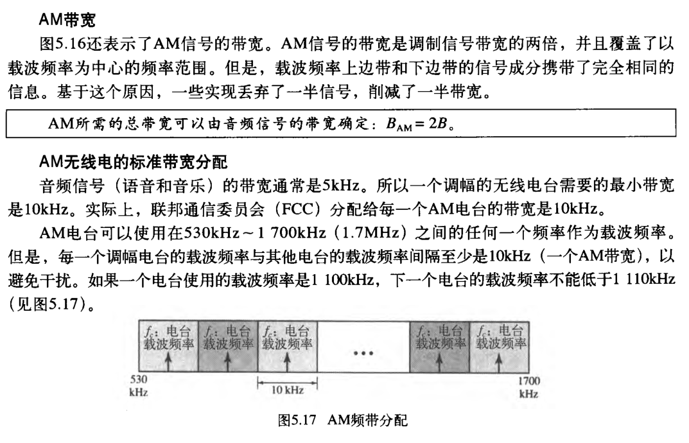

# 基本概念

## 数据、信号、码元

通信的目的是传送信息，如文字、图像、视频等

**数据**是指传送信息的实体。

**信号**是数据的电气或电磁表现，是数据在传输过程中的存在形式。

数据和信号都可用“模拟的”或“数字的”来修饰：①连续变化的数据（或信号）称为**模拟数据（或模拟信号）**；②取值仅允许为有限的几个离散数值的数据（或信号）称为**数字数据（或数字信号）**。

**数据传输方式**可分为**串行传输和并行传输**。串行传输是指1比特1比特地按照时间顺序传输(远距离通信通常采用串行传输)，并行传输是指若干比特通过多条通信信道同时传输。

**码元**是指用一个固定时长的信号波形（数字脉冲）表示一位k进制数字，代表不同离散数值的基本波形，是数字通信中数字信号的计量单位，这个时长内的信号称为k进制码元，而该时长称为**码元宽度**。1码元可以携带若干比特的信息量。例如，在使用二进制编码时，只有两种不同的码元：一种代表0状态，另一种代表1状态。

## 信源、信道、信宿

**数据通信**是指数字计算机或其他数字终端之间的通信。一个**数据通信系统**主要划分为**信源、信道和信宿**三部分。

**信源**是产生和发送数据的源头。

**信宿**是接收数据的终点，它们通常都是计算机或其他数字终端装置。发送端信源发出的信息需要通过变换器转换成适合于在信道上传输的信号，而通过信道传输到接收端的信号先由反变换器转换成原始信息，再发送给信宿。

**信道**与电路并不等同，信道是信号的传输媒介。一个信道可视为一条线路的**逻辑部件**，一般用来表示向某个方向传送信息的介质，因此一条通信线路往往包含一条**发送信道**和一条**接收信道**。**噪声源**是信道上的噪声（即对信号的干扰）及分散在通信系统其他各处的噪声的集中表示。

信道按**传输信号形式**的不同，可分为传送模拟信号的**模拟信道**和传送数字信号的**数字信道**；

信道按**传输介质**的不同可分为**无线信道**和**有线信道**；

信道上传送的信号有**基带信号**和**宽带信号**。

- **基带信号将数字信号1和0直接用两种不同的电压表示，然后送到数字信道上传输（称为基带传输）**

- **宽带信号将基带信号进行调制后形成频分复用模拟信号，然后送到模拟信道上传输（称为宽带传输）**

从通信双方信息的交互方式看，分为三种基本方式：

- **单向通信**。只有一个方向的通信而没有反方向的交互，仅需要一条信道。例如，无线电广播、电视广播就属于这种类型。
- **半双工通信**。通信的双方都可以发送或接收信息，但任何一方都不能同时发送和接收信息，此时需要两条信道。
- **全双工通信**。通信双方可以同时发送和接收信息，也需要两条信道。信道的极限容量是指信道的最高码元传输速率或信道的极限信息传输速率。

**信道的极限容量**是指信道的**最高码元传输速率**或信道的**极限信息传输速率**。

## 速率、波特、带宽

**速率**也称为数据率，指的是数据传输速率，表示单位时间内传输的数据量。**可以用码元传输速率和信息传输速率表示。**

- **码元传输速率**。又称**波特率**。**表示单位时间内数字通信系统所传输的码元个数**（也可称为脉冲个数或信号变化的次数），单位是**波特（Baud）**。1波特表示数字通信系统每秒传输1个码元。**码元可以是多进制的，也可以是二进制的，码元速率与进制数无关。**
- **信息传输速率**。又称**信息率、比特率**等，**表示单位时间内数字通信系统传输的二进制码元个数（即比特数）**，单位是**比特/秒（b/s）**。

注意：波特和比特是两个不同的概念，**码元传输速率也称调制速率、波形速率或符号速率**。但码元传输速率与信息传输速率在数量上却又有一定的关系。**若一个码元携带n比特的信息量，则M波特率的码元传输速率所对应的信息传输速率为Mn比特/秒。**

**带宽**，**原指信号具有的频带宽度，单位是赫兹（Hz）**。在实际网络中，由于数据率是信道最重要的指标之一，而带宽与数据率存在数值上的互换关系，因此**常用来表示网络的通信线路所能传输数据的能力**。**因此，带宽表示单位时间内从网络的某一点到另一点所能通过的“最高数据率”。显然，此时带宽的单位不再是Hz，而是b/s。**

# 奈奎斯特定理与香农定理

具体的信道所能通过的频率范围总是有限的。信号中的许多高频分量往往不能通过信道，否则在传输中会衰减，导致接收端收到的信号波形失去码元之间的清晰界限，这种现象称为**码间串扰**。

## 奈奎斯特定理

**奈奎斯特定理，又称为奈氏准则，它规定：在理想的低通（没有噪声、带宽有限）的信道中，为了避免码间串扰，极限码元传输速率为2W波特，其中W是理想低通信道的带宽。若用V表示每个码元离散电平的数目（码元的离散电平数目是指有多少种不同的码元，比如有16钟不同的码元，则需要4个二进制位，因此数据传输速率是码元传输速率的4倍），极限数据率为：理想低通条件下的极限数据传输速率=2Wlog~2~(V)，单位是b/s。**

对于奈氏准则，可以得出以下结论：

- 在任何信道中，码元传输速率是有上限的。若传输速率超过次上限，就会出现严重的码间串扰问题，使得接收端不可能完全正确识别码元。
- 信道的频带越宽（即通过的信号高频分量越多），就可用更高的速率进行码元的有效传输。
- 奈氏准则给出了码元传输速率的限制，但并未对信息传输速率给出限制，即未对一个码元可以对应多少个二进制位给出限制。

由于码元传输速率受奈氏准则的制约，所以要提高数据传输速率，就必须设法使每个码元携带更多比特的信息量，此时就需要采用多元制的调制方法。

## 香农定理

香农定理给出带宽受限且有高斯白噪声干扰的信道的极限数据传输速率，当用此速率进行传输时，可以做到不产生误差。

香农定理定义为：信道的极限数据传输速率=Wlog~2~(1+S/N)，单位为b/s，式中，W为信道的带宽，S为信道所传输信号的平均功率，N为信道内部的高斯噪声功率。S/N为信噪比，即信号的平均功率与噪声的平均功率之比，信噪比=10log~10~(S/N)，单位为dB。

对应香农定理，可以得出以下结论：

- 信道的带宽或信道中的信噪比越大，信息的极限传输速率越高。
- 对一定的传输带宽和一定的信噪比，信息传输速率的上限是确定的。
- 只要信息传输速率低于信道的极限传输速率，就能找到某种方法来实现无差错的传输。
- 香农定理得出的是极限信息传输速率，实际信道能达到的传输速率要比它低不少。

奈氏准则只考虑了带宽与极限码元传输速率的关系，而香农定理不仅考虑到了带宽，也考虑到了信噪比。这从另一个侧面表明，一个码元对应的二进制位数是有限的。

# 编码和调制（数据---->信号）

数据无论是数字的还是模拟的，为了传输的目的都必须转变成信号。

调制：把数据变换为**模拟信号**的过程称为调制。

编码：把数据变换为**数字信号**的过程称为编码

信号是数据的具体表现形式，它和数据有一定的关系，但又和数据不同。

**数字数据**可以通过**数字发送器**转换为**数字信号**传输，也可以通过**调制器**转换成**模拟信号**传输；

**模拟数据**可以通过**PCM编码器**转换成**数字信号**传输，也可以通过**放大调制器**转换城**模拟信号**传输。

4钟编码方式：

1. 数字数据编码为数字信号
2. 数字数据调制为模拟信号
3. 模拟数据编码为数字信号
4. 模拟数据调制为模拟信号

**自同步**：为了正确地解释从发送方接收到的信号，接收方的位间隔必须与发送方的位间隔严格对应。如果接收方的时钟快了或者慢了，位间隔就不会匹配，接收方可能会错误地解释信号

**基线偏移**：在解码数字信号时，接收方计算接收到信号功率的运行平均值。这个平均值称为基线(baseline) 。输入信号的功率会与基线比较来确定数据元素的值。一个0或 1 的长字符串会引起基线偏移(baseline wandering) ，使得接收方不能正确地进行解码。一个好的线路
编码方案需要防止基线偏移。

**直流成分**：当数字信号中的电平保持一段时间的恒定时，频谱会产生很低的频率(傅里叶分析的结果)。这些接近于零的频率称为 **DC** (直流)成分，会给不允许通过低频率的系统或者使用电子搞合的系统(如变压器)带来问题。例如，电话线不能通过低于200Hz的频率。还有，长距离的链路可能使用一个或多个变压器来隔离线路的不同部分。对于这些系统，我们使用无直流成分(DC component)的方案。

## 1、数字数据编码为数字信号

数字数据编码用于基带传输中，即在基本不改变数字数据信号频率的情况下，直接传输数字信号。具体用什么样的数字信号表示0及用什么样的数字信号表示1就是所谓的编码。编码的规则有多种，只要能有效把1和0区分开即可。

单极编码方案：在单级编码方案中，所有的信号电平都在时间轴的一边，或者时间轴的上面或者时间轴的下面。

- **单级编码方案**：
  - 一般，单级编码方案设计成**单极不归零（单极NRZ）方案**，在此方案中**正电平定义成位 1 而零电平定义成位0**。之所以称为 NRZ ，是因为在位中间信号不会回到零。
  - 与它的极性对应方案相比，这个方案成本很高。正如我们很快会看到的，标准功率(每个单元线路阻抗发送 1 位所需的功率)是极性NRZ方案的两倍。基于这个原因，现在这个方案不用于数据通信中。
  - 

**极性编码方案**：在极性编码方案中，电平在时间轴的两边。例如，0的电平可能是正的，而 1 的电平可能是负的。

- **（极性）不归零编码(NRZ)** 在极性NRZ (polar NRZ) 编码中，信号的振幅使用两个电平。极性NRZ有两种常见形式：NRZ-L和NRZ-I 。
  - **NRZ-L (NRZ 电平编码，NRZ-Level) ，信号电平决定了位值。**
  - **NRZ-I (NRZ反相编码 NRZ-Invert) ，信号电平是否反相转或跳变决定了位值。**若没有跳变，位值是0 ，如果有跳变，位值是 1。
  - 
  - **在NRZ-L中，电平决定了位值。在NRZ-I中电平是否反相转决定了位值。**
  - NRZ-L和NRZ-I都有N/2Bd的平均信号速率。N是数据速率(bps)
  - NRZ-L和NRZ-I都有 DC成分问题。

- **归零编码（RZ）**：
  - 它使用三个值:正值、负值和零。在RZ中，信号不在两个位之间变化而是在位中变化。
  - 在每个位中间信号变成0。它保持到下一个位开始。
  - RZ编码的主要缺点：是它需要两个信号变化来编码一个位，因此占用更大的带宽。
  - 极性意外改变会导致所有的 0被解释成所有的 1 ，而所有的 1 被解释成所有的0的问题同样存在，但
    **没有 DC成分问题。**
  - RZ使用三个电平，这样生成和辨别更加困难。这些缺陷使得今天不再使用这个方案
  - 

**双相编码**：**曼彻斯特编码**和**差分曼彻斯特编码**。

- **曼彻斯特编码**（1爬升、0下降）：RZ的思想（位中间跳变）和NRZ-L（电平决定了位值）的思想共同组成了曼彻斯特(Manchester) 编码方案。位的持续时间被二等分。在前半部分电平保持一个水平，后半部分变成另一个水平。位中间的跳变提供了同步。
- **差分曼彻斯特**（1不反相，0反相）： 组合了 RZ（位中间跳变）和 NRZ-I（电平是否反相转决定了位值）的思想。在位中间总是有一个跳变，但是位值在位开始时确定。如果下一个位是0 ，就有一个跳变。如果下一个位是 1 ，则没有跳变。
- 
- 在曼彻斯特和差分曼彻斯特编码中，位中间的跳变用于同步。
- 没有基线偏移
- 因为每个位是正负电平值，所以没有 DC成分
- 唯一的缺点是信号速率。曼彻斯特编码和差分曼彻斯特编码的信号速率是 NRZ的两倍。原因是每个位中间都有一个跳变，而在每个位结束可能有一个跳变。

**双极性方案**：在双极编码(也称为多电平二进制)中，有三个电平:正负值和零。一个数据元素的电平是0 ，而另一个数据元素的电平在正值、负值间交替。

- AMI和伪三元编码
- 

**多电平方案(mBnL方案)**：在mBnL方案中，m个数据元素模式编码成 n个信号元素模式 ，2^m^<=L^n^ 。

- 2B1Q方案：两个二元一个四元，使用长度为 2的 2位数据模式编码成一个4 电平信号元素。在这个编码类型中，m=2 、n=1 、L=4。
- 8B6T方案：一个很有趣的方案是8个二元、6个三元。这个编码用于 100BASE-4T电缆。
- 4D-PAM5：4维5级脉冲摄幅调制

**多线路传输: **

- **MLT-3**： 三电平多线路传输方案使用三个电平(+V 、0 、-V) 和三个跳变规则在电平间变动。
  - 如果下一个位是 0，没有跳变。
  - 如果下一个位是 1 而且当前电平不是0，下一个电平是0 。
  - 如果下一个位是 1而且当前电平是 0，下一个电平是最后一个非零电平的相反值。

**编码方案小结**

**块编码**

我们需要某种元余以确保同步，并提供一些内在的差错检测。块编码可以给出这种冗余并提高线路编码的性能。一般 ， 块编码
把m位的块变成n位的块，这里n大于m 。块编码称为 mB/nB编码技术。

- 4B/5B编码
  - 在4B/5B编码中，将**4位输入**置换为 **5位输出**仅包含不超过一个前导0 (左边的位)和两个后缀0(右边的位)。因此当不同的组组合形成新的序列时，最多只会有三个连续的0。
  - 4位组只有 16个不同的组合，而5位组有 32个不同的组合。这意味着有 16个组没有用于4B/5B编码。**这些不用的组当中，一些用于控制，另一些仍然没有使用，可以提供一些差错检测。如果收到的5位组属于表中没有使用的部分，接收方知道传输中出现了差错。**

## 2、数字信号调制为模拟信号

数字数据调制技术在发送端将数字信号转换为模拟信号，而在接收端将模拟信号还原为数字信号，分别对应于**调制解调器**的**调制**和**解调**过程。

基本的数字调制方法有如下几种：

1. **幅移键控（ASK）**：通过改变载波信号的振幅来表示数字信号1和0，而载波的频率和相位都不改变。比较容易实现，但抗干扰能力差。

2. **频移键控（FSK）**：通过改变载波信号的频率来表示数字信号1和0，而载波的振幅和相位都不改变。**容易实现，抗干扰能力强**，目前应用较为广泛。

3. **相移键控（PSK）**：通过改变载波信号的相位来表示数字信号1和0，而载波的振幅和频率都不改变。它又分为**绝对调相**和**相对调相**。

4. **正交振幅调制（QAM）**：在频率相同的前提下，将**幅移键控（ASK）**与**相移键控（PSK）**结合起来，形成叠加信号。

   设波特率为B，采用m个相位，每个相位有n种振幅，则该QAM技术的数据传输速率R为：R=Blog~2~(mn)，单位为b/s。

## 3、模拟数据编码为数字信号

这种编码方式最典型的例子是**常用于对音频信号进行编码的脉码调制（PCM）**

PCM主要包括三个步骤：**采样、量化、编码**

**采样定理**：在通信领域，带宽是指信号最高频率与最低频率之差，单位为Hz。因此，将模拟信号转换为数字信号时，假设原始信号中的最大频率为f，那么**采样频率f~采样~必须大于或等于最大频率f的两倍，才能保证采样后的数字信号完整保留原始模拟信号的信息。**另外采样定理又称奈奎斯特定理。

- **采样**是指对模拟信号进行周期性扫描，把时间上连续的信号变成时间上离散的信号。
  - 根据采样定理，当采样的频率大于或等于模拟数据的频带带宽（最高变换频率）的两倍时，所得的离散信号可以无失真的代表被采用的模拟数据。
- **量化**是把采样取得的电平幅值按照一定的分级标度转化为对应的数字值并取整数，这样就把连续的电平幅值转换为了离散的数字量。采样和量化的实质就是分割和转换。
- **编码**是把量化的结果转换为与之对应的二进制编码。

## 4、模拟数据调制为模拟信号

**为了实现传输的有效性，可能需要较高的频率。**这种调制方式还可以使用**频分复用（FDM）**技术，充分利用带宽资源。电话机和本地局交换机采用模拟信号传输模拟数据的编码方式，**模拟的声音数据是加载到模拟的载波信号中传输的**。

# 电路交换、报文交换、分组交换（数据报与虚电路）

## 电路交换

**在进行数据传输前，两个结点之间必须先建立一条专用（双方独占）的物理通信路径（有通信双方之间的交换设备和链路逐段连接而成），该路径可能经过许多中间结点。这一路径在整个数据传输期间一直被独占，直到通信结束后才被释放。**因此，电路交换技术分为三个阶段：**连接建立、数据传输、连接释放**

从通信资源的分配角度看，“交换”就是按照某种方式动态的分配传输线路的资源。电路交换的关键点是，在数据传输的过程中，用户始终占用端到端的固定传输带宽。

电路交换技术的**优点**：

1. **通信时延小**。由于通信线路为通信双方用户专用，数据直达，因此传输数据的时延非常小。当传输的数据量较大时，这一优点非常明显。
2. **有序传输**。双方通信时按发送顺序传送数据，不存在失序问题。
3. **没有冲突**。不同的通信双方应有不同的信道，不会出现争用物理信道的问题。
4. **适用范围广**。电路交换既适用于传输模拟信号，又适用于传输数字信号。
5. **实时性强**。通信双方之间的物理通路一旦建立，双方就可以随时通信。
6. **控制简单**。电路交换的设备（交换机等）及控制均较简单。

电路交换技术的**缺点**：

1. **建立连接时间长**。电路交换的平均连接建立时间对计算机通信来说太长。
2. **线路独占**，使用效率低。电路交换连接建立后，物理通路被通信双方独占，即使通信线路空闲，也不能供其他用户使用，因而信道利用率低。
3. **灵活性差**。只要在通信双方建立的通路中的任何一点出了故障，就必须重新拨号建立新的连接，这对十分紧急和重要的通信是很不利的。
4. **难以规格化**。电路交换时，数据直达，不同类型、不同规格、不同速率的终端很难相互通信，也难以在通信过程中进行差错控制。

电路建立后，除源结点和目的结点外，**电路上的任何结点都采取“直通方式”接收数据和发送数据**，即不会存在存储转发所耗费的时间。

## 报文交换

数据交换的单位是**报文**，报文携带有**目标地址、源地址**等信息。**报文交换**在**交换结点**采用的是**存储转发**的传输方式。

报文交换技术的**优点**：

1. **无须建立连接**。报文交换不需要为通信双方预先建立一条专用的通信线路，不存在建立连接时延，用户可以随时发送报文。
2. **动态分配线路**。当发送方把报文交给交换设备时，交换设备先存储整个报文，然后选择一条合适的空闲线路，将报文发送出去。
3. **提高线路可靠性**。如果某条传输路径发生故障，那么可重新选择另一条路径传输数据，因此提高了传输的可靠性。
4. **提高线路利用率**。通信双方不是固定占有一条通信线路，而是在不同的时间一段一段地部分占有这条物理通道，因而大大提高了通信线路的利用率。
5. **提供多目标服务**。一个报文可以同时发送给多个目的地址，这在电路交换中是很难实现的。

报文交换技术的**缺点**：

1. **转发时延**。由于数据进入交换结点后要经历存储、转发这一过程，因此会引起转发时延（包括接收报文、检验正确性、排队、发送时间等)。
2. **较大的缓存空间**。报文交换对报文的大小没有限制，这就要求网络结点需要有较大的缓存空间。

## 分组交换

同报文交换一样，分组交换也采用**存储转发**方式，但**解决了报文交换中大报文传输的问题**。分组交换限制了每次传送的数据块大小的上限，把大的数据块划分为合理的小数据块，再加上一些必要的控制信息（如源地址、目的地址和编号信息等)，构成**分组**(Packet)。网络结点根据控制信息把分组送到下一个结点，下一个结点接收到分组后，暂时保存并排队等待传输，然后根据分组控制信息选择它的下一个结点，直到到达目的结点。

分组交换的**优点**：

1. **无建立时延**。不需要为通信双方预先建立一条专用的通信线路，不存在连接建立时延，用户可随时发送分组。
2. **线路利用率高**。通信双方不是固定占有一条通信线路，而是在不同的时间一段一段地部分占有这条物理通路，因而大大提高了通信线路的利用率。
3. **简化了存储管理（相对于报文交换）**。因为分组的长度固定，相应的缓冲区的大小也固定，在交换结点中存储器的管理通常被简化为对缓冲区的管理，相对比较容易。
4. **加速传输**。分组是逐个传输的，可以使后一个分组的存储操作与前一个分组的转发操作并行，这种流水线方式减少了报文的传输时间。此外，传输一个分组所需的缓冲区比传输一次报文所需的缓冲区小得多，这样因缓冲区不足而等待发送的概率及时间也必然少得多。
5. **减少了出错概率和重发数据量**。因为分组较短，其出错概率必然减小，所以每次重发的数据量也就大大减少，这样不仅提高了可靠性，也减少了传输时延。

分组交换的**缺点**：

1. **存在存储转发时延**。尽管分组交换比报文交换的传输时延少，但相对于电路交换仍存在存储转发时延，而且其结点交换机必须具有更强的处理能力。
2. **需要传输额外的信息量**。每个小数据块都要加上源地址、目的地址和分组编号等信息，从而构成分组，因此使得传送的信息量增大了5%~10%，一定程度上降低了通信效率，增加了处理的时间，使控制复杂，时延增加。
3. **当分组采用数据报服务时，可能会出现失序、丢失或重复分组，分组到达目的结点时，要对分组按编号进行排序等工作，因此很麻烦。若采用虚电路服务，虽无失序问题，但有呼叫建立、数据传输、虚电路释放三个过程。**

## 三种数据交换方式的比较

要传送的数据量很大且其传送时间远大于呼叫时间时，采用电路交换较为合适。

端对端的通路由多端链路组成时，采用分组交换传送数据较为合适。

从提高整个网络的信道利用率上看，报文交换和分组交换优于电路交换，其中分组交换必报文交换的时延小，尤其适合于计算机之间的突发式数据通信。

## 数据报与虚电路（分组交换）

分组交换根据其通信子网向端点系统提供的服务，还可进一步分为面向连接的虚电路方式和无连接的数据报方式。这两种服务方式都由网络层提供。

数据报方式和虚电路方式是分组交换的两种方式。

### 数据报

作为通信子网用户的端系统发送一个报文时，在端系统中实现的高层协议先把报文拆成若干带有序号的数据单元，并在网络层加上地址等控制信息后形成数据报分组（即网络层的PDU)。中间结点存储分组很短一段时间，找到最佳的路由后，尽快转发每个分组。不同的分组可以走不同的路径，也可以按不同的顺序到达目的结点。

1. 主机A先将分组逐个发往与它直接相连的交换结点A，交换结点A缓存收到的分组。
2. 然后查找自己的转发表。由于不同时刻的网络状态不同，因此转发表的内容可能不完全相同，所以有的分组转发给交换结点C,有的分组转发给交换结点D。
3. 网络中的其他结点收到分组后，类似地转发分组，直到分组最终到达主机B。

当分组正在某一链路上传送时，分组并不占用网络的其他部分资源。因为采用存储转发技术，资源是共享的，所以主机A在发送分组时，主机B也可同时向其他主机发送分组。

通过上面的例子，我们可以总结出数据报服务具有如下特点：

1. 发送分组前**不需要建立连接**。发送方可随时发送分组，网络中的结点可随时接收分组。
2. 网络尽**最大努力交付**，传输不保证可靠性，所以可能丢失：网络为每个分组独立地选择路由，转发的路径可能不同，因而分组不一定按序到达目的结点。
3. 发送的分组中要包括**发送端和接收端的完整地址**，以便可以独立传输。
4. 分组在交换结点存储转发时，需要**排队等候处理**，这会带来一定的时延。通过交换结点的通信量较大或网络发生拥塞时，这种时延会大大增加，交换结点还可根据情况丢弃部分分组。
5. 网络具有**冗余路径**，当某个交换结点或一条链路出现故障时，可相应地更新转发表，寻找另一条路径转发分组，对故障的适应能力强。
6. 存储转发的延时一般较小，**提高了网络的吞吐量**。
7. 收发双方不独占某条链路，**资源利用率较高**。

### 虚电路

虚电路方式试图将数据报方式与电路交换方式结合起来，充分发挥两种方法的优点，以达到最佳的数据交换效果。**在分组发送之前，要求在发送方和接收方建立一条逻辑上相连的虚电路，并且连接一旦建立，就固定了虚电路所对应的物理路径**。与电路交换类似，整个通信过程分为三个阶段：**虚电路建立、数据传输与虚电路释放。**

在虚电路方式中，端系统每次建立虚电路时，选择一个未用过的**虚电路号**分配给该虚电路，以区别于本系统中的其他虚电路。在传送数据时，**每个数据分组不仅要有分组号、校验和等控制信息，还要有它要通过的虚电路号**，以区别于其他虚电路上的分组。在虚电路网络中的每个结点上都维持一张**虚电路表**，**表中的每项记录了一个打开的虚电路的信息，包括在接收链路和发送链路上的虚电路号、前一结点和下一结点的标识**。**数据的传输是双向进行的**，上述信息是在虚电路的建立过程中确定的。

虚电路方式的工作原理如图2.6所示。

1. 为进行数据传输，主机A与主机B之间先建立一条逻辑通路，主机A发出一个特殊的**“呼叫请求”分组**，该分组通过中间结点送往主机B,若主机B同意连接，则发送**“呼叫应答”分组**予以确认。
2. 虚电路建立后，主机A就可向主机B发送数据分组。当然，主机B也可在该虚电路上向主机A发送数据。
3. 传送结束后主机A通过发送**“释放请求”分组**来拆除虚电路，逐段断开整个连接。

通过上面的例子，可以总结出虚电路服务具有如下特点：

1. **虚电路通信链路的建立和拆除需要时间开销，对交互式应用和小量的短分组情况显得很浪费，但对长时间、频繁的数据交换效率较高。**
2. **虚电路的路由选择体现在连接建立阶段，连接建立后，就确定了传输路径。**
3. 虚电路提供了**可靠的通信功能，能保证每个分组正确且有序到达。**此外，还可以**对两个数据端点的流量进行控制**，当接收方来不及接收数据时，可以通知发送方暂缓发送。
4. **虚电路有一个致命的弱点，即当网络中的某个结点或某条链路出现故障而彻底失效时，所有经过该结点或该链路的虚电路将遭到破坏。**
5. **分组首部不包含目的地址，包含的是虚电路标识符，相对于数据报方式，其开销小。**

虚电路之所以是“虚”的，是因为这条电路不是专用的，每个结点到其他结点之间的链路可能同时有若干虚电路通过，也可能同时与多个结点之间建立虚电路。每条虚电路支持特定的两个端系统之间的数据传输，两个端系统之间也可以有多条虚电路为不同的进程服务，这些虚电路的实际路由可能相同也可能不同。

注意，图2.6所示的数据传输过程是有确认的传输（由高层实现），主机B收到分组后要发回相应分组的确认。网络中的传输是否有确认与网络层提供的两种服务没有任何关系。

数据报服务和虚电路服务的比较见表2.1。

# 传输介质

## 双绞线、同轴电缆、光纤与无线传输介质

**传输介质**也称传输媒体，它是**数据传输系统中发送设备和接收设备之间的物理通路**。

传输介质可分为**导向传输介质**和**非导向传输介质**。
导向传输介质中，电磁波被导向沿着固体媒介（铜线或光纤)传播
非导向传输介质可以是空气、真空或海水等。

### 双绞线

双绞线是最常用的古老传输介质，它**由两根采用一定规则并排绞合的、相互绝缘的铜导线组成。绞合可以减少对相邻导线的电磁干扰。**

为了进一步提高抗电磁干扰的能力，可在双绞线的外面再加上一层，即用金属丝编织成的屏蔽层，这就是**屏蔽双绞线(STP)**。

无屏蔽层的双绞线称为**非屏蔽双绞线(UTP)**。

双绞线的**价格便宜**，是最常用的传输介质之一，在**局域网和传统电话网**中普遍使用。**双绞线的带宽取决于铜线的粗细和传输的距离。模拟传输和数字传输都可使用双绞线**，其通信距离一般为**几千米到数十千米**。**距离太远时，对于模拟传输，要用放大器放大衰减的信号：对于数字传输，要用中继器将失真的信号整形。**

### 同轴电缆

**同轴电缆由内导体、绝缘层、网状编织屏蔽层和塑料外层构成**，如图2.8所示。

按**特性阻抗数值**的不同，通常将同轴电缆分为两类：**50Ω同轴电缆**和**75Ω同轴电缆**

- **50Ω同轴电缆，主要用于传送基带数字信号，又称基带同轴电缆，它在局域网中应用广泛**；
- **75Ω同轴电缆，主要用于传送宽带信号，又称宽带同轴电缆，主要用于有线电视系统。**

由于外导体屏蔽层的作用，同轴电缆具有**良好的抗干扰特性，被广泛用于传输较高速率的数据，其传输距离更远，但价格较双绞线贵。**

### 光纤

**光纤通信就是利用光导纤维（简称光纤）传递光脉冲来进行通信**。有光脉冲表示1，无光脉冲表示0.可见光的频率约为10^8^MHz，因此光纤通信系统的带宽范围极大。

光纤主要由**纤芯**和**包层**构成，纤芯很细，其直径只有8至100微米，**光波通过纤芯进行传导，包层较纤芯有较低的折射率**。当光线从高折射率的介质射向低折射率的介质时，其折射角将大于入射角。因此入射角大于某个临界角度时，就会出现**全反射**，即光线碰到包层时就会折射回纤芯，这个过程不断重复，光也就沿着光纤传输下去。

- **多模光纤**：利用光的全反射特性，可以将从不同角度入射的多条光线在一根光纤中传输，这种光纤称为**多模光纤**，
  - 多模光纤的光源为**发光二极管**。
  - **光脉冲在多模光纤中传输时会逐渐展宽，造成失真，因此多模光纤只适合于近距离传输。**
  - 
- **单模光纤**：光纤的直径减小到只有一个光的波长时，光纤就像一根波导那样，可使光线一直向前传播，而不会产生多次反射，这样的光纤就是单模光纤（见图2.11）。
  - 单模光纤的纤芯很细，直径只有几微米，**制造成本较高**。
  - 单模光纤的光源为定向性很好的**半导体激光器**，因此单模光纤的衰减较小，可传输数公里甚至数十千米而不必采用中继器，**适合远距离传输。**
  - 

光纤不仅具有通信容量非常大的优点，还具有如下特点：

1. **传输损耗小，中继距离长，对远距离传输特别经济。**
2. **抗雷电和电磁干扰性能好。**这在有大电流脉冲干扰的环境下尤为重要。
3. **无串音干扰，保密性好，也不易被窃听或截取数据。**
4. **体积小，重量轻**。这在现有电缆管道已拥塞不堪的情况下特别有利。

### 无线传输介质

无线通信已广泛应用于**移动电话领域**，构成**蜂窝式无线电话网**。随着便携式计算机的出现，以及在军事、野外等特殊场合下移动通信联网的需要，促进了**数字化移动通信**的发展，现在**无线局域网**产品的应用已非常普遍。

#### 无线电波

无线电波具**有较强的穿透能力，可以传输很长的距离**，所以它被广泛应用于通信领域，如**无线手机通信、计算机网络中的无线局域网(WLAN)**等。因为**无线电波使信号向所有方向散播**，因此**有效距离范围内的接收设设备无须对准某个方向**，就可与无线电波发射者进行通信连接，大大简化了通信连接。这也是无线电传输的最重要优点之一

#### 微波、红外线和激光

目前**高带宽的无线通信**主要使用三种技术：**微波、红外线和激光**。

它们都需要发送方和接收方之间存在一条**视线通路，有很强的方向性，都沿直线传播**，有时统称这三者为**视线介质**。

不同的是，红外通信和激光通信把要传输的信号分别转换为各自的信号格式，即红外光信号和激光信号，再直接在空间中传播。

微波通信的频率较高，频段范围也很宽，载波频率通常为2~40GHz,因而通信信道的容量大。例如，一个带宽为2MHz的频段可容纳500条语音线路，若用来传输数字信号，数据率可达数兆比特/秒。与通常的无线电波不同，微波通信的信号是沿直线传播的，因此在地面的传播距离有限，超过一定距离后就要用**中继站**来接力。

**卫星通信利用地球同步卫星作为中继来转发微波信号，可以克服地面微波通信距离的限制。三颗相隔120°的同步卫星几乎能覆盖整个地球表面，因而基本能实现全球通信。卫星通信的优点是通信容量大、距离远、覆盖广，缺点是保密性差、端到端传播时延长。**

# 物理层接口的特性

物理层考虑的是如何在连接到各种计算机的传输媒体上传输数据比特流，而不指具体的传输媒体。网络中的硬件设备和传输介质的种类繁多，通信方式也各不相同。物理层应尽可能屏蔽这些差异，让数据链路层感觉不到这些差异，使数据链路层只需考虑如何完成本层的协议和服务。

物理层的主要任务可以描述为确定与传输媒体的接口有关的一些特性：

1. **机械特性。指明接口所用接线器的形状和尺寸、引脚数目和排列、固定和锁定装置等。**
2. **电气特性。指明在接口电缆的各条线上出现的电压的范围。**
3. **功能特性。指明某条线上出现的某一电平的电压表示何种意义。**
4. **过程特性。或称规程特性。指明对于不同功能的各种可能事件的出现顺序。**

常用的物理层接口标准有EIA RS-232-C、ADSL和SONET/SDH等。

# 物理层设备

## 中继器

中继器的主要**功能**是**将信号整形并放大再转发出去，以消除信号经过一长段电缆后而产生的失真和衰减，使信号的波形和强度达到所需要的要求，进而扩大网络传输的距离**。

**中继器放大的是数字信号，原理是将衰减的信号整形再生。**

**原理**是**信号再生**（而非简单地将衰减的信号放大）。中继器有两个端口，数据从一个端口输入，再从另一个端口发出。端口仅作用于信号的电气部分，而不管是否有错误数据或不适于网段的数据。

中继器是用来**扩大网络规模**的最简单廉价的互连设备。

中继器**两端的网络部分是网段**，而不是子网，使用中继器连接的几个网段**仍然是一个局域网**。

中继器若出现故障，对相邻两个网段的工作都将产生影响。

由于中继器**工作在物理层**，因此它**不能连接两个具有不同速率的局域网**。

**注意：如果某个网络设备具有存储转发的功能，那么可以认为它能连接两个不同的协议；如果该网络设备没有存储转发功能，那么认为它不能连接两个不同的协议。中继器没有存储转发功能，因此它不能连接两个速率不同的网段，中继器两端的网段一定要使用同一个协议。**

从理论上讲，中继器的使用数目是无限的，网络因而也可以无限延长。但事实上这不可能，**中继器不仅传送有用信号，而且也传送噪声和冲突信号**，因为网络标准中对信号的延迟范围做了具体的规定，中继器只能在此规定范围内进行有效的工作，否则会引起网络故障。例如，**在采用粗同轴电缆的10BASE5以太网规范中，互相串联的中继器的个数不能超过4个，而且用4个中继器串联的5段通信介质中只有3段可以挂接计算机，其余两段只能用作扩展通信范围的链路段，不能挂接计算机。这就是所谓的“5-4-3规则”。**

## 放大器

**放大器和中继器都起放大作用**，只不过**放大器放大的是模拟信号，原理是将衰减的信号放大**，而**中继器放大的是数字信号，原理是将衰减的信号整形再生。**

## 集线器

集线器(Hub)实质上是**一个多端口的中继器**。当Hub工作时，一个端口接收到数据信号后，由于信号在从端口到Hub的传输过程中已有衰减，所以Hub便将该信号进行整形放大，使之再生（恢复）到发送时的状态，紧接着**转发到其他所有（除输入端口外）处于工作状态的端**
**口**。如果同时有两个或多个端口输入，那么输出时会发生冲突，致使这些数据都无效。从Hub的工作方式可以看出，**它在网络中只起信号放大和转发作用，目的是扩大网络的传输范围，而不具备信号的定向传送能力，即信息传输的方向是固定的，是一个标准的共享式设备。**

Hub主要使用**双绞线**组建共享网络，是从服务器连接到桌面的最经济方案。在交换式网络中，**Hub直接与交换机相连**，将交换机端口的数据送到桌面上。使用Hub**组网灵活**，它把所有结点的通信集中在以其为中心的结点上，对结点相连的工作站进行集中管理，不让出问题的工作站影响整个网络的正常运行，并且用户的加入和退出也很自由。由Hub组成的网络是**共享式网络，但逻辑上仍是一个总线网**。

**Hub的每个端口连接的网络部分是同一个网络的不同网段，同时Hub也只能在半双工状态下工作，网络的吞吐率因而受到限制。**

多台计算机必然会发生同时通信的情形，**因此集线器不能分割冲突域，所有集线器的端口都属于同一个冲突域**。集线器在一个时钟周期中只能传输一组信息，如果一台集线器连接的机器数目较多，且多台机器经常需要同时通信，那么将导致**信息碰撞**，使得集线器的工作效率很差。

# 同步和异步、同步通信与异步通信

在计算机网络中，同步（Synchronous)的意思很广泛，没有统一的定义。例如，**协议的三个要素之一就是“同步”**。**在网络编程中常提到的“同步”则主要指某函数的执行方式，即函数调用者需等待函数执行完后才能进入下一步。**异步(Asynchronous)可简单地理解为“非同步”。

在数据通信中，同步通信与异步通信区别较大。

**同步通信**的通信双方**必须先建立同步**，即**双方的时钟要调整到同一个频率**。收发双方不停地发送和接收连续的**同步比特流**。主要有两种同步方式：

- **全网同步，即用一个非常精确的主时钟对全网所有结点上的时钟进行同步；**
- **准同步，即各结点的时钟之间允许有微小的误差，然后采用其他措施实现同步传输。同步通信数据率较高，但实现的代价也较高。**

**异步通信**在发送字符时，**所发送的字符之间的时间间隔可以是任意的，但接收端必须时刻做好接收的准备。**发送端可以在任意时刻开始发送字符，因此必须在**每个字符开始和结束的地方加上标志**，即**开始位**和**停止位**，**以便使接收端能够正确地将每个字符接收下来**。异步通信也可以帧作为发送的单位。这时，帧的首部和尾部必须设有一些特殊的比特组合，使得接收端能够找出一帧的开始（即**帧定界**）。**异步通信的通信设备简单、便宜，但传输效率较低（因为标志的开销所占比例较大)**。

# 宽带利用

分时、分频、分码

频分多路复用（FDM）

时分多路复用（TDM） ，可用于数字传输，而FDM不行

统计时分多路复用（STDM）动态分配时隙

波分多路复用（WDM）光的频分多路复用

码分多路复用（CDM） 码分多址（CDMA）各站点的码片序列相互正交，用A站点的码内积结果为1-》1，-1》0

信道划分介质访问控制将使用介质的每个设备与来自同一通信信道上的其他设备的通信隔离开来，把时域和频域资源合理地分配给网络上的设备。

多路复用技术，当传输介质的带宽超过传输单个信号所需的带宽时，人们就通过在一条介质上同时携带多个传输信号的方法来提高传输系统的利用率，这就是所谓的多路复用，也是实现信道划分介质访问控制的途径。多路复用技术把多个信号组合在一条物理信道上进行传输，使多个计算机或终端设备共享信道资源，提高了信道的利用率。

采用多路复用技术可把多个输入通道的信息整合到一个复用通道中，在接收端把收到的信息分离出来并传送到对应的输出通道，如图3.13所示。

信道划分的实质就是通过**分时、分频、分码**等方法把原来的一条广播信道，逻辑上分为几条用于两个结点之间通信的互不干扰的子信道，实际上就是把广播信道转变为点对点信道。

信道划分介质访问控制分为以下4种：

## 1、频分多路复用（FDM）

## 2、时分多路复用（TDM）与 统计时分多路复用（STDM）

## 3、波分多路复用（WDM) 

## 4、码分多路复用（CDM）

## 扩频

扩频包括：调频扩频（PHSS）、直接序列扩频（DSSS）、红外线（IR）。

# 宽带接入技术 

电话网原来是为语音通信而设计的，由于数据通信的需要导致拨号调制解调器的发明。因特网的出现带来数据高速的下载和上传的需要，但调制解调器速度还是太慢。电话公司增加一种数字用户线路(DSL) 新技术。尽管拨号调制解调器现还仍旧存在全世界许多地方，但 DSL 已通过电话网提供快速接入因特网。

## ADSL（非对称数字用户线）

## 光纤同轴电缆混合网（HFC）网络

# FTTx

光纤到“x”(FTTx) 是一个集合术语，用于描述利用光纤实现部分或全部最后一英里连接的各种宽带网络架构选项。以“x”表示光纤终端点，FTTx 技术包含光纤部署，例如 FTTH、FTTA、FTTB 和 FTTC。

光纤到 x 是下一代接入 (NGA) 的核心组成部分，是宽带基础设施朝着提高速度和服务质量 (QoS) 方向发展的特征。

高清电视、虚拟现实 (VR) 和其他需要大量带宽的应用已经突破了这项技术的界限。随着 FTTx 的高速、低延迟应用不断增加，物联网、5G、智能城市和区块链技术正在迅速取得进展。 

FTTx是“光纤到x（Fiber To The x）”,是光纤通信中光纤接入的总称，x代表光纤线路的目的地。如 x = H(Fiber to the Home)光纤到户,x = O(Fiber to the Office)光纤到办公室， x = B(Fiber to the Building) 光纤到楼。FTTx技术范围从区域电信机房的局端设备到用户终端设备，包括光线路终端OLT（Optical Line Terminal），光网络单元ONU（Optical Network Unit）,光网络终端ONT（Optical Network Terminal）。

根据光网络单元ONU在用户端的位置不同，FTTx有多种类型，可分成光纤到交换箱（FTTCab）、光纤到路边（FTTC）、光纤到大楼（FTTB）、光纤到户（FTTH）、光纤到办公室（FTTO）等服务形态。美国运营商Verizon将FTTB及FTTH合称光纤到驻地（FTTP）。

# 电话网络

