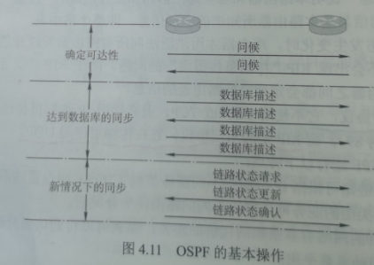
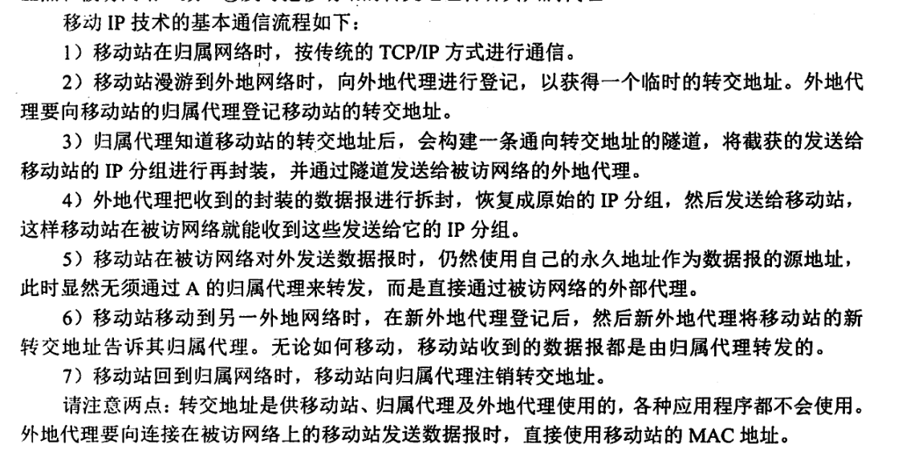

# 网络层功能

## 异构网络互联

中继系统：

1. 物理层：转发器、集线器
2. 链路层：网桥或交换机
3. 网络层：路由器
4. 网络层以上：网关。

路由器是一台专用计算器，用于在互联网中进行路由选择。

虚拟互联网，也就是逻辑互联网，IP协议可以使性能各异的网络在网络层看起来好像使一个统一的网络，这种使用IP协议的虚拟互连网可简称为IP网络，好处是，看不见互连的各网络的具体异构细节。

## 路由和转发

路由器的两个功能：**路由选择**、**分组转发**

路由选择：指按照复杂的分布式算法，根据各相邻路由器所得到的关于整个网络拓扑的变化情况，动态的改变所选择的路由。

分组转发：指路由器根据转发表将用户的IP数据报从合适的端口转发出去。

路由表是根据路由选择算法得出的，而转发表是从路由表得出的。转发表的结构应当使查找过程最优化，路由表则需要对网络拓扑结构变化的计算最优化。在讨论路由选择的原理时，往往不去区分转发表和路由表，而笼统地使用路由表一词。

### 软件定义网络（SDN）

可以将网络层抽象为：

1. **数据平面（转发平面），转发**
2. **控制平面，路由选择**

采用**集中式的控制平面**和**分布式的数据平面**，两个平面**相互分离**。
路由器之间不在相互交换路由信息
在网络的控制平面有一个逻辑上的**远程控制器**（可以由多个服务器组成），远程控制器掌握各主机和整个网络状态，为每个分组计算出最佳路由，通过**OpenFlow协议**（也可以通过其他途径）将转发表（在SDN中称为**流表**）下发给路由器。

SDN的可编程性，使得网络具有很好的**编程性**，SDN提供的变成接口称为**北向接口**。

SDN控制器和转发设备建立双向会话的接口称为**南向接口**，通过不同的南向接口协议（如OpenFlow），SDN控制器就可以兼容不同的硬件设备，同时可以在设备上实现上层应用逻辑。

SDN控制器集群内部控制器之间的通信接口称为**东西向接口**，用于增强整个控制平面的可靠性和可拓展性。

SDN 的优点:

1. 全局集中式控制和分布式高速转发，既利于控制平面的全局优化，又利于高性能的网络转发。
2. 灵活可编程与性能的平衡，控制和转发功能分离后，使得网络可以由专有的自动化工具以编程方式配置。
3. 降低成本，控制和数据平面分离后，尤其是在使用开放的接口协后，就实现了网络设备的制造与功能软件的开发相分离，从而有效降低了成本。

SDN的问题:

1. 安全风险，集中管理容易受攻击，如果崩溃，整个网络会受到影响。
2. 瓶颈问题，原本分布式的控制平面集中化后，随着网络规模扩大，控制器可能成为网络性能的瓶颈

### 拥塞控制

拥塞：在通信子网中，因出现过量的分组而引起网络性能下降的现象称为拥塞

**判断网络是否进入拥塞状态的方法**：观察网络的**吞吐量与网络负载的关系**，如果随着网络负载的增加，**网络的吞吐量明显小于正常的吞吐量**，那么网络就可能已进入**“轻度拥塞”状态**；如果**网络的吞吐量随着网络负载的增大而下降**，那么网络就可能已经进入**拥塞状态**；如果网络的负载继续增大，而**网络的吞吐量下降到零**，那么网络就可能已进入**死锁状态**

拥塞控制**作用**：**确保子网能够承载所达到的流量**，这是一个全局性的过程，涉及各方面的行为:主机、路由器及路由器内部的转发处理过程等。

单一地增加资源并不能解决拥塞。

**流量控制和拥塞控制的区别**:

1. **流量控制**往往是指在发送端和接收端之间的**点对点通信量**的控制。流量控制所要做的是**抑制发送端发送数据的速率，以便使接收端来得及接收。**
2. **拥塞控制**必须确保**通信子网**能够传送待传送的数据，是一个**全局性**的问题，涉及网络中所有的主机、路由器及导致网络传输能力下降的所有因素。

拥塞控制的两种方法：

1. 开环控制：

   静态的预防方法。一旦整个系统启动并运行，**中途就不再需要修改**。

   开环控制**手段**包括确定何时可接收新流量、何时可丢弃分组及丢弃哪些分组，确定何调度策略等。

   所有这些手段的共性是，在做决定时**不考虑当前网络的状态**。

2. 闭环控制：

   事先不考虑有关发生拥塞的各种因素，采用监测网络系统去监控，及时检测哪里发生了拥塞，然后将拥塞信息传到合适的地方，以便调整网络系统的运行，并解决出现的问题

   闭环控制是**基于反馈环路的概念，是一种动态的方法**。

# 路由算法

从能否随网络的通信量或拓扑适应地进调整变化来划分，路由算法分为如下两大类：

1. **静态路由算法**（非自适应路由算法）。手动配置，适合小型网络，简便、开销小。

2. **动态路由算法**（自适应路由算法）。

   路由器上地路由表项是通过相互连接地路由器之间彼此交换信息，然后按照一定的算法优化出来的，而这些路由信息会在一定时间间隙里不断更新，以适应不断变化的网络，随时获得最优的寻路效果。
   **能改善网络的性能并有助于流量控制；但算法复杂，会增加网络负担。**
   常用的动态路由算法分为两类：**距离-向量路由算法** 和  **链路状态路由算法**

### 距离-向量路由算法

所有结点定期将其整个路由选择表传送给所有与之相邻的结点。路由选择表包含：每条路径的目的地(另一结点)、路径的代价(距离)
此处的距离为抽象概念。例如跳数。

所有结点都必须参与距离向量交换，以保证路由的有效性和一致性。

所有结点监听传来的路由选择更新信息，在下列情况下会更新其路由选择表：

1. 被通告一条新的路由
2. 有一条到达某目的地的路由且其有较短的距离（较小的代价）

实质是迭代计算一条路由中的站段数或延迟时间。要求每个结点在每次更新时都将其全部路由表发给所有的相邻结点。

最常见的距离-向量路由算法是**RIP算法**，其采用“跳数”作为距离的度量。

### 链路状态路由算法

要求每个参与算法的结点都具有**完全的网络拓扑信息**，它们执行下述两项任务：第一，主动测试所有邻接结点的状态；第二，定期地将链路状态传播给所有其他结点。

典型的链路状态算法是：OSPF算法。

一个结点检查所有直接链路的状态，并将所得的状态信息发送给网上的所有其他结点。每个结点都用这种方式从网上所有其他的结点接收包含直接链路状态的路由选择信息。

结点对更新的网络图，利用 Dijkstra 最短路径算法重新计算路由从单一的源出发计算到达所有目的结点的最短路径。

路状态路由算法主要有三个特征:

1. 向本自治系统中所有路由器发送信息，这里使用的方法是**洪泛法**，即路由器通过所有端口向所有相邻的路由器发送信息。而每个相邻路由器又将此信息发往其所有相邻路由器(但不再发送给刚刚发来信息的那个路由器)。
2. **发送的信息是与路由器相邻的所有路由器的链路状态**，但这只是路由器所知道的部分信息。所谓“链路状态”，是指说明本路由器与哪些路由器相邻及该链路的“度量”。对于OSPF 算法，链路状态的“度量”主要用来表示费用、距离、时延、带宽等。
3. **只有当链路状态发生变化时，路由器才向所有路由器发送此信息。**

由于**一个路由器的链路状态只涉及相邻路由器的连通状态**，而与整个互联网的规模并无直接关系，因此链路状态路由算法可以用于大型的或路由信息变化聚敛的互联网环境。

链路状态路由算法的主要**优点**是：

1. 每个路由结点都使用同样的原始状态数据独立地计算路径，而不依赖中间结点的计算;
2. 链路状态报文不加改变地传播，因此采用该算法易于查找故障。
3. 当一个结点从所有其他结点接收到报文时，它可以在本地立即计算正确的通路，保证一步汇聚
4. 由于链路状态报文仅运载来自单个结点关于直接链路的信息，其大小与网络中的路由结点数目无关，因此链路状态算法比距离-向量算法有更好的规模可伸展性。

距离-向量路由算法与链路状态路由算法的**比较**：

在距离-向量路由算法中，每个结点仅与的直接邻居交谈，它为它的邻居提供从自己到网络中所有其他结点的最低费用估计。
在链路状态路由算法中，每个结点通过广播的方式与所有其他结点交谈，但它仅告诉它们与它直接相连的链路的费用
相较之下，**距离-向量路由算法有可能遇到路由环路等问题**

### 路径向量路由选择算法

BGP 采用的是**路径向量路由选择协议**

### 层次路由

当网络规模扩大时，路由器的路由表成比例地增大。这不仅会消耗越来越多的路由器缓冲区空间，而且需要用更多CPU 时间来扫描路由表，用更多的带宽来交换路由状态信息。因此路由选择必须按照层次的方式进行。

因特网将整个互联网划分为许多较小的自治系统，每个自治系统有权自主地决定本系统内应采用何种路由选择协议。

如果两个自治系统需要通信，那么就需要一种在两个自治系统之间的协议来屏蔽这些差异。据此，因特网把路中选择协议划分为两大类:

1. 一个自治系统内部所使用的路由选择协议称为**内部网关协议(IGP)**，也称域内路由选择具体的协议有 **RIP和OSPF 等**。
2. 自治系统之间所使用的路由选择协议称为**外部网关协议 (EGP)**，也称域间路由选择，用在不同自治系统的路由器之间交换路由信息，并负责为分组在不同自治系统之间选择最优的路径。**具体的协议有 BGP**。

使用层次路由时，OSPF 将一个自治系统再划分为若于区域 (Area)，每个路由器都知道在本区域内如何把分组路由到目的地的细节，但不用知道其他区域的内部结构。
采用分层次划分区域的方法虽然会使交换信息的种类增多，也会使 OSPF 协议更加复杂。但这样做却**能使每个区域内部交换路由信息的通信量大大减小，因而使 OSPF 协议能够用于规模很大的自治系统中。**

# IPv4

## IPv4分组

IP协议定义数据传送的基本单元：IP分组。

### IPv4分组的格式

由**首部**和**数据部分**组成

首部前一部分的长度固定，**固定部分(20B)**，固定部分后是一些可选字段，其长度可变，用来提供错误检测及安全等机制。

**首部长度：4位，以4B为单位**，最大值为15*4B=60B

**总长度：16位，首部和数据之和的长度，单位为字节**，最大长度为2^16^-1=65535B。以太网帧的最大传送单元（MTU）为1500B，因此一个IP数据报封装成帧时，数据报的总长度（首部加数据）一定不能超过下面的数据链路层的MTU值。

**标识：16位。**他是一个计数器，每产生一个数据报就加1，并赋值给标识字段。但它并不是“序号”，IP是无连接服务。当一个数据报的长度超过网络的MTU时，必须分片，此时每个数据报片都复制一次标识号，以便能正确重装成原来的数据报。

**标志：占3位。最低位为MF，MF=1表示后面还有分片**，MF=0表示最后一个分片。标志中间的以为时DF，只有**DF=1时才允许分片**。

**片偏移：占13位。**片偏移**以8个字节为单位**。**除最后一个分片外，每个分片的长度一定时8B的整数倍。**

**生存时间（TTL）：占8位。**在网络中可通过的路由器数的最大值，确保分组不会永远在网络中循环。路由器在转发分组前，先把TTL减1，若TTL被减为0，则该分组必须被丢弃。

**协议：占8位，**指出次分组携带的数据使用何种协议。**值为6表示TCP、值为17表示UDP。**

**首部校验和：占16位（2B）。**首部校验和只校验分组的首部，而不校验数据部分。

**源地址字段：32位，4B**

**目的地址字段：32位，4B**

### IP数据报分片

片：分片后较小的IP数据报

片在目的地的网络层被重新组装。目的主机根据标识、标志、片偏移来完成重组。

## IPv4与NAT

### IPv4地址

无论哪类IP 地址，都由网络号和主机号两部分组成。即 IP 地址::= <网络号>,<主机号>，其中网络号标志主机(或路由器)所连接到的网络。一个网络号在整个因特网范围内必须是唯的。主机号标志该主机(或路由器)。一台主机号在它前面的网络号所指明的网络范围内必须是
唯一的。由此可见，一个IP 地址在整个因特网范围内是唯一的。

主机号全为0表示本网络本身

主机号全为1表示本网络的广播地址

127.x.x.x保留为环回自检(Loopback Test) 地址，此地址表示任意主机本身，目的地址为环回地址的 IP 数据报永远不会出现在任何网络上。

32 位全为 0，即 0.0.0.0 表示本网络上的本主机。

32位全为1，即 255.255.255.255 表示整个 TCP/IP 网络的广播地址，又称受限广播地址；实际使用时，由于路由器对广播域的隔离，255.255.255.255 等效为本网络的广播地址。

A 类地址可用的网络数为 2-2，减2的原因是:第一，网络号字段全为0的IP地址是保留地址，意思是“本网络”;第二，网络号为 127的IP 地址是环回自检地址。

IP地址特点：

1. 每个IP 地址都由网络号和主机号两部分组成，因此IP 地址是一种分等级的地址结构。分等级的好处是:①IP 地址管理机构在分配 IP 地址时只分配网络号，而主机号则由得到该网络的单位自行分配，方便了IP 地址的管理②路由器仅根据目的主机所连接的网络号来转发分组(而不考虑目标主机号)，从而减小了路由表所占的存储空间。
2. IP 地址是标志一台主机(或路由器)和一条链路的接口。当一台主机同时连接到两个网络时，该主机就必须同时具有两个相应的 IP 地址，每个IP 地址的网络号必须与所在网络的网络号相同，且这两个IP 地址的主机号是不同的。因此IP 网络上的一个路由器必然至
   少应具有两个IP 地址(路由器每个端口必须至少分配一个IP 地址)。
3. 用转发器或桥接器(网桥等)连接的若 LAN 仍然是同一个网络(同一个广播域)，因此该LAN 中所有主机的 IP 地址的网络号必须相同，但主机号必须不同。
4. 在IP 地址中，所有分配到网络号的网络(无论是 LAN还是 WAN)都是平等的。 
5. 同一个局域网上的主机或路由器的IP 地址中的网络号必须是一样的。路由器总是具有两个或两个以上的IP 地址，路由器的每个端口都有一个不同网络号的IP地址。

近年来，由于广泛使用无分类IP 地址进行路由选择，这种传统分类的IP地址已成为历史

### 网络地址转换 (NAT)

网络地址转换 (NAT)是指通过将专用网络地址(如Intranet)转换为公用地址(如Internet)，从而对外隐藏内部管理的IP 地址。

它使得整个专用网只需要一个全球IP 地址就可以与因特网连通，由于专用网本地 IP地址是可重用的，所以NAT 大大节省了 IP 地址的消耗。同时，它隐藏了内部网络结构，从而降低了内部网络受到攻击的风险。

私有地址（可重用地址）网段
A类:1个A类网段，即 10.0.0.0~10.255.255.255
B类:16个B 类网段，即172.16.0.0~172.31.255.255
C类: 256个C类网段，即192.168.0.0~192.168.255.255

在因特网中的所有路由器，对目的地址时私有地址的数据报一律不进行转发。

NAT路由器至少有一个有效的外部全球IP地址。使用**NAT转换表**进行本地IP地址和全球IP地址。NAT转换表存放着{本地IP地址：端口}到{全球IP地址：端口}的映射。这种映射方式可以让多个私有地址映射到一个全球IP地址。

### 子网划分

#### 子网划分

二级IP地址的缺点：IP地址空间的利用率有时很低；给每个物理网络分配一个网络号会使路由表变得太大而使网络性能变坏;两级的 IP 地址不够灵活。

**增加一个“子网号字段”**，使二级IP地址变为三级IP地址。这种做法称为子网划分。

**子网划分的基本思路如下:**
①**子网划分纯属一个单位内部的事情。单位对外仍然表现为没有划分子网的网络。**
②**从主机号借用若干比特作为子网号，当然主机号也就相应减少了相同的比特。三级 IP 地址的结构如下:IP 地址={<网络号>,<子网号>,<主机号>}。**
③**凡是从其他网络发送给本单位某台主机的IP数据报,仍然是根据IP数据报的目的网络号,先找到连接到本单位网络上的路由器。然后该路由器在收到IP 数据报后，按目的网络号和子网号找到目的子网。最后把 IP 数据报直接交付给目的主机。**

划分子网只是把 IP 地址的主机号这部分进行再划分，而不改变 IP 地址原来的网络号。因注意:此，从一个 IP 地址本身或 I 数据报的首部，无法判断源主机或目的主机所连接的网络是否进行了子网划分。

RFC 950规定，对分类的 IPv4 地址进行子网划分时，子网号不能为全1或全0。但随着CIDR的广泛使用，现在全1和全0的子网号也可使用，但一定要谨慎使用，要弄清你的路由器所用的路由选择软件是否支持全0或全1的子网号。

不论是分类的 IPv4 地址还是 CIDR，其子网中的主机号为全0或全1的地址都不能被指派。子网中主机号全0的地址为子网的网络号，主机号全1的地址为子网的广播地址

#### 子网掩码

为了告诉主机或路由器对一个 A 类、B 类、C类网络进行了子网划分，使用子网掩码来表达对原网络中主机号的借位。

子网掩码是一个与IP 地址相对应的、长 32bit 的二进制串，它由一串 1和跟随的一串 0组成其中，1 对应于 IP 地址中的网络号及子网号，而0对应于主机号。

计算机只需将 IP 地址和其对应的子网掩码逐位“与”(逻辑 AND 运算)，就可得出相应子网的网络地址。

A、B、C 类地址的默认子网掩码分别为 255.0.0.0、255.255.0.0、255.255.255.0

路由器在相互之间交换路由信息时，必须把自己所在网络(或子网)的子网掩码告诉对方。路由表中的每个条目，除要给出目的网络
地址和下一跳地址外，还要同时给出该目的网络的子网掩码。

在使用子网掩码的情况下:

1. 一台主机在设置 IP 地址信息的同时，必须设置子网掩码。
2. 同属于一个子网的所有主机及路由器的相应端口，必须设置相同的子网掩码
3. 路由器的路由表中，所包含信息的主要内容有目的网络地址、子网掩码、下一跳地址。

#### 无分类编址 CIDR

无分类域间路由选择 CIDR 是在变长子网掩码的基础上提出的一种消除传统 A、B、C 类网络划分，并且可以在软件的支持下实现超网构造的一种 IP 地址的划分方法。

可以大幅度提高 地址空间的利用率，减小路由器的路由表大小，提高路由转发能力。

IDR 消除了传统 A、B、C 类地址及划分子网的概念，因而可以更有效地分配 IPv4 的地址空间。CIDR 使用“网络前缀”的概念代替子网络的概念，与传统分类IP 地址最大的区别就是**网络前缀的位数不是固定的**，可以任意选取。

IP:: = {<网络前缀>，<主机号>}
地址/网络前缀所占比特数

将网络前缀都相同的连续 IP 地址组成“CIDR 地址块”。一个 CIDR 地址块可以表示很多地址，这种地址的聚合称为**路由聚合**，或称**构成超网**。路由聚合使得路由表中的一个项目可以表示名个原来传统分类地址的路由，有利于减少路由器之间的信息的交换，从而提高网络性能。

CIDR 的优点在于网络前缀长度的灵活性

**最长前缀匹配(最佳匹配)**: 使用 CIDR 时，路由表中的每个项目由“网络前缀”和“下跳地址”组成。在查找路由表时可能会得到不止一个匹配结果。此时，应当从匹配结果中选择具有最长网络前缀的路由，因为网络前缀越长，其地址块就越小，因而路由就越具体。
**CIDR 查找路由表的方法**:为了更加有效地查找最长前缀匹配，通常将无分类编址的路由表存放在一种层次式数据结构中，然后自上而下地按层次进行查找。这里最常用的数据结构就是二叉线索。

#### 网络层转发分组过程

分组转发都是基于目的主机所在的网络的

当分组到达路由器后，路由器根据目的IP地址的网络前缀来查找转发表，确定下一跳应当到哪个路由器。因此，在转发表中，每条路由必须包含<目的网络，下一跳地址>

采用 CIDR 编址时，如果一个分组在转发表中可以找到多个匹配的前缀，那么应当选择前缀最长的一个作为匹配的前缀，称为最长前缀匹配。

转发表还可以增加两种特殊路由：

1. 主机路由: 对特定目的主机的 IP 地址专门指明一个路由，以方便网络管理员控制和测试网络。若特定主机的 IP 地址是 a.b.c.d，则转发表中对应项的目的网络是 a.b.c.d/32。/32表示的子网掩码没有意义，但这个特殊的前缀可以用在转发表中。
2. 默认路由: 用特殊前缀 0.0.0.0/0 表示默认路由，全0掩码和任何目的地址进行按位与运算，结果必然为全0,即必然和转发表中的 0.0.0.0/0 相匹配。只要目的网络是其他网络(不在转发表中)，就一律选择默认路由。

综上所述，归纳出路由器执行的分组转发算法如下:
1) 从收到的 IP 分组的首部提取目的主机的 P 地址 D(即目的地址)。
2) 若查找到特定主机路由(目的地址为 D)，就按照这条路由的下一跳转发分组;否则从转发表中的下一条 (即按前缀长度的顺序) 开始检查，执行步骤 3。
3) 将这一行的子网掩码与目的地址 D 进行按位与运算。若运算结果与本行的前缀匹配，则查找结束，按照“下一跳”指出的进行处理(或者直接交付本网络上的目的主机，或通过指定接口发送到下一跳路由器)。否则，若转发表还有下一行，则对下一行进行检查，重新执行步骤 3。否则，执行步骤 4。
    4)若转发表中有一个默认路由，则把分组传送给默认路由:否则，报告转发分组出错。值得注意的是，转发表(或路由表) 并未给分组指明到某个网络的完整路径(即先经过哪个路由器，然再经过哪个路由器等)。转发表指出，到某个网络应当先到某个路由器(即下一跳路
    由器)，在到达下一跳路由器后，再继续查找其转发表，知道下一步应当到哪个路由器。这样步一步地查找下去，直到最后到达目的网络。
    注意:得到下一跳路由器的 IP 地址后，并不是直接将该地址填入待发送的数据报，而是该IP 地址转换成 MAC 地址 (通过 ARP)，将此MAC 地址放到 MAC 首部中，然后根据这MAC 地址找到下一跳路由器。在不同网络中传送时，MAC 中的源地址和目的地址要发生变化但是网桥在转发帧时，不改变帧的源地址，请注意区分。

### ARP、DHCP、ICMP

#### IP地址和硬件地址

IP 地址是网络层使用的地址，它是分层次等级的。

硬件地址是数据链路层使用的地址(MAC地址)，它是平面式的。

在网络层及网络层之上使用 IP 地址，IP 地址放在 IP 数据报的首部，而MAC 地址放在 MAC 帧的首部。通过数据封装，把 数据报分组封装为 MAC 帧后，数据链路层看不见数据报分组中的 IP 地址。

由于路由器的隔离，IP 网络中无法通过广播MAC地址来完成跨网络的寻址，因此在网络层只使用 IP 地址来完成寻址。寻址时，每个路由器依据其路由表(依靠路由协议生成) 选择到目标网络(即主机号全为0的网络地址)需要转发到的下一跳(路由器的物理端口号或下网络地址)，而IP 分组通过多次路由转发到达目标网络后，改为在目标 LAN 中通过数据链路层的 MAC 地址以广播方式寻址。这样可以提高路由选择的效率。
1)在 IP 层抽象的互联网上只能看到IP数据报。
2)虽然在IP 数据报首部中有源IP 地址，但路由器只根据目的IP 地址进行转发。
3)在局域网的链路层，只能看见 MAC 帧。IP 数据报被封装在 MAC 帧中，通过路由器转发IP 分组时，IP 分组在每个网络中都被路由器解封装和重新封装，其 MAC 帧首部中的源地址和目的地址会不断改变。这也决定了无法使用 MAC 地址跨网络通信。
4)尽管互连在一起的网络的硬件地址体系各不相同，但 IP 层抽象的互联网却屏蔽了下层这些复杂的细节。只要我们在网络层上讨论问题就能够使用统一的、抽象的 IP 地址研究主机与主机或路由器之间的通信。
注意: 路由器由于互连多个网络，因此它不仅有多个 IP地址，也有多个硬件地址。

#### 地址解析协议(ARP)

无论网络层使用什么协议，在实际网络的链路上传送数据帧时，最终必须使用硬件地址。

一种方法来完成 **IP 地址到 MAC 地址的映射**，这就是地址解析协议(Address ResolutionProtocol，ARP)。

每台主机都设有一个 ARP 高速缓存，用来存放本局域网上各主机和路由器的IP地址到 MAC 地址的映射表，称 **ARP 表**。使用 ARP 来动态维护此 ARP 表。

ARP 工作在网络层，其工作原理如下:

1. 主机 A 欲向本局域网上的某台主机B 发送 数据报时，先在其 ARP 高速缓存中查看有无主机 B的IP 地址。
2. 如果有，就可查出其对应的硬件地址，再将此硬件地址写入 MAC帧 ，然后通过局域网将该 MAC 发往此硬件地址。
3. 如果没有，那么就通过使用目的 MAC 地址为 FFFF-FF-FF-FF-FF 的来封装并广播 ARP 请求分组(广播发送),使同一个局域网里的所有主机都收到此 ARP 请求。主机 B 收到该 ARP 请求后，向主机 A 发出ARP 响应分组(单播发送)，分组中包含主机 B 的IP 与MAC 地址的映射关系，主机A 收到ARP响应分组后就将此映射写入 ARP 缓存，然后按查询到的硬件地址发送 MAC 。
4. **ARP** 由于“看到了”IP 地址，所以它工作在**网络层**，而**NAT** 路由器由于“看到了”端口，所以它工作在**传输层**

#### 动态主机配置协议 (DHCP)

动态主机配置协议(Dynamic Host Configuration Protocol，DHCP) 常用于给主机**动态地分配IP 地址**，它提供了**即插即用**的联网机制，这种机制允许一台计算机加入新的网络和获取 IP 地而不用手工参与。

DHCP 是**应用层协议**，它是**基于 UDP** 的。**端口号，67（服务器端），68（客户端）**

DHCP 的工作原理如下:使用**客户/服务器模式**。

需要IP 地址的主机在启动时就向 DHCP服务器**广播**发送**发现报文**，这时该主机就成为DHCP 客户。本地网络上所有主机都能收到此广播报文，但只有 DHCP 服务器才回答此广播报文。DHCP 服务器先在其数据库中查找该计算机的配置信息。若找到，则返回找到的信息。若找不到，则从服务器的 IP地址池中取一个地址分配给该计算机。DHCP 服务器的回答报文称为**提供报文**。

DHCP 服务器和 DHCP 客户端的交换过程如下:

1. DHCP **客户机广播“DHCP 发现”消息**，试图找到网络中的 DHCP 服务器，以便从DHCP服务器获得一个P 地址。源地址为 0.0.0.0，目的地址为 255.255.25.255
2. DHCP **服务器**收到“DHCP 发现”消息后，**广播“DHCP 提供”消息**，其中包括提供给DHCP 客户机的 IP 地址。源地址为 DHCP 服务器地址，目的地址为 255.255.255.255。
3. DHCP **客户机**收到“DHCP 提供”消息，如果接受该IP 地址，那么就**广播“DHCP 请求"消息**向 DHCP 服务器请求提供 IP 地址。源地址为 0.0.0.0，目的地址为 255.255.255.255
4. DHCP **服务器广播“DHCP 确认”消息**，将IP 地址分配给 DHCP 客户机。源地址为 DHCP服务器地址，目的地址为 255.255.255.255。

DHCP 允许网络上配置多台 DHCP 服务器;通常挑选最先到达的

DHCP 服务器分配给 DHCP 客户的IP 地址是**临时的**，因此 DHCP 客户只能在一段有限的时间内使用这个分配到的 IP 地址。DHCP 称这段时间为**租用期**。租用期的数值应由 DHCP 服务器自己决定，DHCP 客户也可在自己发送的报文中提出对租用期的要求。

DHCP 的客户端和服务器端需要通过广播方式来进行交互，原因是在 DHCP 执行初期，客户端不知道服务器端的 IP 地址，而在执行中间，客户端并未被分配 IP 地址，从而导致两者之间的通信必须采用广播的方式。

采用UDP 而不采用TCP 的原因也很明显:TCP 需要建立连接，如果连对方的IP 地址都不知道，那么更不可能通过双方的套接字建立连接。

DHCP 是应用层协议，因为它是通过客户/服务器模式工作的，DHCP 客户端向 DHCP 服务器请求服务，而其他层次的协议是没有这两种工作方式的。

#### 网际控制报文协议 (ICMP)

为了提高 IP 数据报交付成功的机会，在网络层使用了网际控制报文协议 (Internet Control Message Protocol，ICMP)来让主机或路由器**报告差错和异常情况**。

ICMP 报文作为IP 层数据报的数据，加上数据报的首部，组成 IP 数据报发送出去。**ICMP 是网络层协议**。

ICMP 报文的种类有两种，即**ICMP 差错报告报文**和**ICMP 询问报文**

ICMP 差错报告报文用于目标主机或到目标主机路径上的路由器向源主机报告差错和异常情况。共有以下5 种常用的类型:

1. **终点不可达**。当路由器或主机不能交付数据报时，就向源点发送终点不可达报文
2. **源点抑制。**当路由器或主机由于拥塞而丢弃数据报时，就向源点发送源点抑制报文，使源点知道应当把数据报的发送速率放慢。
3. **时间超过。**当路由器收到生存时间(TTL)为零的数据报时，除丢弃该数据报外，还要向源点发送时间超过报文。当终点在预先规定的时间内不能收到一个数据报的全部数据报片时，就把已收到的数据报片都丢弃，并向源点发送时间超过报文。
4. **参数问题。**当路由器或目的主机收到的数据报的首部中有的字段的值不正确时，就丢弃该数据报，并向源点发送参数问题报文。
5. **改变路由(重定向)**。路由器把改变路由报文发送给主机，让主机知道下次应将数据报发送给另外的路由器(可通过更好的路由)。

**不应发送 ICMP 差错报告报文的几种情况如下:**

1. **ICMP 差错报告报文不再发送 ICMP 差错报告报文。**
2. **对第一个分片的数据报片的所有后续数据报片都不发送ICMP 差错报告报文**
3. **对具有组播地址的数据报都不发送ICMP 差错报告报文。**
4. **对具有特殊地址(如127.0.0.0或0.0.0.0)的数据报不发送ICMP 差错报告报文。**

ICMP 询问报文有 4 种类型:

1. **回送请求和回答报文**

2. **时间戳请求和回答报文**

3. **地址掩码请求和回答报文**

4. **路由器询问和通告报文**

   最常用的是前两类。

ICMP 的两个常见应用是**分组网间探测 PING (用来测试两台主机之间的连通性)**和 Traceroute(UNX中的名字，在 Windows 中是 Tracert,可以用来跟踪分组经过的路由)其中 PING使用了ICMP回送请求和回答报文，Traceroute (Tracert) 使用了ICMP 时间超过报文。
注意: PING工作在应用层，它直接使用网络层的ICMP，而未使用传输层的 TCP或UDP。Traceroute/Tracert 工作在网络层

## 特殊用途地址

# IPv6

##  IPv6的主要特点

解决“IP 地址耗尽”问题的措施有以下三种:

1. 采用无类别编址 CIDR，使IP 地址的分配更加合理
2. 采用网络地址转换 (NAT) 方法以节省全球 IP 地址: 
3. 采用具有更大地址空间的新版本的 IPv6。

其中前两种方法只是延长了 IPv4 地址分配完毕的时间，只有第三种方法从根本上解决了IP 地址的耗尽问题。

Pv6 的主要特点如下:

1. 更大的地址空间。IPv6 将地址从 IPv4 的 32 位增大到了 128 位。IPv6 的字节数(16B)是IPv4 字节数 (4B)的平方

2) 扩展的地址层次结构。
3) 灵活的首部格式。
4) 改进的选项。
5) 允许协议继续扩充。
6) 支持即插即用 (即自动配置)。
7) 支持资源的预分配。
8) IPv6 只有在包的源结点才能分片，是端到端的，传输路径中的路由器不能分片，所以从一般意义上说，IPv6 不允许分片 (不允许类似IPv4 的路由分片)。 
9) IPv6 首部长度必须是 8B 的整数倍，而 IPv4 首部是4B 的整数倍。 首部固定长度部分40B。
10) 增大了安全性。身份验证和保密功能是 IPv6 的关键特征。

IPv6减少了头部字段数目，仅包含8个字段。

虽然 v6与v4 不兼容，但总体而言它与所有其他的因特网协议兼容，包括TCP、UDPICMP、IGMP、OSPF、BGP 和 DNS，只是在少数地方做了必要的修改(大部分是为了处理长的地址)。IPv6 相当好地满足了预定的目标，主要体现在:
1)首先也是最重要的，IPv6 有比 IPv4 长得多的地址。
2)简化了IP 分组头，
3)更好地支持选项。此外，表示选项的方式的改变还能加快分组的处理速度。

## IPv6地址

IPv6数据报的目的地址可以是以下三种基本类型地址之一：

1. 单播。单播就是传统的点对点通信
2. 多播。多播是一点对多点的通信，分组被交付到一组计算机的每台计算机。
3. 任播。这是IPv6增加的一种类型。任播的目的站是一组计算机，但数据报在交付时只交付其中的一台计算机，通常是距离最近的一台计算机。

区分服务字段( DS字段) , 后2 位是显式拥塞通知(ECN) 字段或指示位

流标号（flow label）：占20位。所谓“流”是指互联网从指定源点到终点的一系列数据报，**所有属于同一个流的数据报都具有同样的流标号**。用来标记那些需要IPv6路由器特殊处理(如一种非默认服务质量或实时服务)的信息包顺序。

有效载荷长度（payload length）：占16位，它指明IPv6数据报除了基本首部以外的字节数（**所有扩展首部部都算在有效载荷之内**）。这个字段最大值是64KB。

下一个首部（next header）：占8位。相当于IPv4的协议字段或可选字段。当IPv6数据报没有扩展首部时，“下一个首部”字段的作用和IPv4协议字段一样，指明了基本首部后面的数据应交付IP上面的高层协议（如6或17分别表示交付给TCP或UDP）。如果有扩展首部，其表示的含义因该字段值有所不同

 **IPv6地址：长度128位**

**IPv6寻址及表达式**

（1）**首选格式**：**分8段，每段16比特，十六进制表示**，并**使用冒号等间距分隔**。例如。F00D:4598:7304:3210:FEDC:BA98:7654:3210

（2）**压缩格式**：使用冒号(::)来取代一连串的0，注意**在一个地址中只能出现一次双冒号**。如可将1080:0:0:0:8:8000:200C:417A表示为1080::8:8000:200C:417A。

（3）**内嵌IPv4的IPv6地址**：在IPv4和IPv6混合环境中，为实现IPv4和IPv6互通，可将IPv4嵌入到IPv6地址中。**格式为：x:x:x:x:x:x:d.d.d.d**（注意有6个x），前96比特采用冒分十六进制表示，后32比特使用IPv4的点分十进制表示。如0:0:0:0:0:0:192.168.0.1或者::192.168.0.1的压缩形式

（4）**“IPv6地址/前缀长度”表示法**。其中的“前缀长度”是一个十进制数，表示该地址前缀。如F00D:4598:7304:3210:FEDC:BA98:7654:3210，其地址前缀是64位，可以表示为F00D:4598:7304:3210:FEDC:BA98:7654:3210/64。

一个IPv6节点中需要一组地址, 包括组播地址 

链路本地IPv6地址( 和一些全球性IPv6地址) 使用接口标识符( IID ) 作为一个单播IPv6地址的分配基础。除了地址是以二进制值000 开始之外，IID 在所有情况下都作为一个IPv6地址的低序位, 这样它们必须在同一网络中有唯一前缀。 IID 的长度通常是64位, 并直接由一个网络接日相关的链路层MAC 地址形成。

Pv6 扩展了 IPv4 地址的分级概念，它使用以下3 个等级:第一级(顶级)指明全球都知道的公共拓扑;第二级(场点级) 指明单个场点，第三级指明单个网络接口。IPv6 地址采用多级体系主要是为了使路由器能够更快地查找路由。

## 特殊用途地址

## IPv4到IPv6的过度

从IPv4 向IPv6 过渡只能采用**逐步演进**的办法，同时还必须使新安装的 IP6 系统能够向后兼容。IPv6 系统必须能够接收和转发 IPv4 分组，并且能够为 IP4 分组选择路由。
从IPv4 向IPv6 过渡可以采用**双协议栈**和**隧道技术**两种策略:
**双协议栈**是指在一台设备上同时装有 IPv4和IPv6协议，那么这台设备既能和IPv4 网络通信，又能和IPv6 网络通信。如果这台设备是一个路由器，那么在路由器的不同接口上分别配置了 IPv4 地址和 IPv6地址，并很可能分别连接了 IPv4 网络和 IPv6 网络;如果这台设备是一台计算机，那么它将同时拥有 IPv4 地址和IPv6 地址，并具备同时处理这两个协议地址的功能。
**隧道技术**的要点是在IPv6数据报要进入 IPv4 网络时，把整个IPv6 数据报封装到 IPV4数据报的数据部分使得 IPv6 数据报就好像在 IPv4 网络的隧道中传输

# 路由协议

## 自治系统

自治系统(Autonomous System，AS):单一技术管理下的一组路由器，这些路由器**使用一种AS 内部的路由选择协议和共同的度量来确定分组在该 AS 内的路由**，**同时还使用一种 AS 之间的路由选择协议来确定分组在 AS 之间的路由**。
一个自治系统内的所有网络都由一个行政单位(如一家公司、一所大学、一个政府部门等)管辖，一个自治系统的所有路由器在本自治系统内都必须是连通的。

## 域内路由与域间路由

自治系统内部的路由选择称为**域内路由选择**，自治系统之间的路由选择称为**域间路由选择**。

因特网有两大类路由选择协议。
1.**内部网关协议 (Interior Gateway Protocol，IGP)**
内部网关协议即在一个**自治系统内部使用的路由选择协议**，它与互联网中其他自治系统选用什么路由选择协议无关。目前这类路由选择协议使用得最多，如 **RIP 和 OSPF**。
2.**外部网关协议 (External Gateway Protocol，EGP)**
若源站和目的站处在不同的自治系统中，当数据报传到一个自治系统的边界时(两个自治系统可能使用不同的IGP)，就需要使用一种协议将路由选择信息传递到另一个自治系统中。这样的协议就是外部网关协议 (EGP)。目前使用最多的外部网关协议是 **BGP-4**。

## 路由信息协议(RIP)

**RIP 是一种分布式的基于距离向量的路由选择协议，其最大优点就是简单。**

### **RIP规定:**

1. 网络中的每个路由器都要维护从它自身到其他每个目的网络的**距离记录**(因此这是一组距离，称为距离向量)。
2. 距离也称**跳数** (Hop Count)，规定从一个路由器到直接连接网络的距离(跳数)为1。而每经过一个路由器，距离(跳数)加1。
3. RIP 认为好的路由就是它通过的路由器的数目少，即**优先选择跳数少的路径**。
4. RIP 允许一条路径最多只能包含 15 个路由器 (即**最多允许 15 跳**)。因此**距离等于 16 时它表示网络不可达**。可见 RIP 只适用于小型互联网。距离向量路由可能会出现环路的情况，规定路径上的最高跳数的目的是为了防止数据报不断循环在环路上，减少网络拥塞的可能性
5. RIP **默认**在任意两个使用 RIP 的路由器之间**每 30秒广播一次 RIP 路由更新信息，以便自动建立并维护路由表(动态维护)**。
6. 在 RIP 中不支持子网掩码的 RIP 广播，所以 RIP 中每个网络的子网掩码必须相同。但在**新的RIP2中，支持变长子网掩码和 CIDR。**

### **RIP 的特点 (注意与OSPF 的特点比较):**

1) **仅和相邻路由器交换信息**
2) **路由器交换的信息是当前路由器所知道的全部信息，即自己的路由表**
3) **按固定的时间间隔交换路由信息，如每隔 30 秒。**

RIP 通过距离向量算法来完成路由表的更新。最初，每个路由器只知道与自己直接相连的网络。通过每 30 秒的 RIP 广播，相邻两个路由器相互将自己的路由表发给对方。于是经过第一次RIP 广播，每个路中器就知道了与自己相邻的路由器的路由表 (即知道了距离自己跳数为 1的网络的路由)。同理,经过第二次RIP 广播,每个路由器就知道了距离自己跳数为2的网络的路由·······因此，经过若干RIP 广播后，所有路由器都最终知道了整个IP 网络的路由表，称为 **RIP 最终是收敛的**。通过 RIP 收敛后，每个路由器到每个目标网络的路由都是距离最短的(即跳数最少，最短路由），哪怕还存在另一条高速 (低时延)但路由器较多的路由。

### 距离向量算法

每个路由表项目都有三个关键数据:**<目的网络 N，距离 d，下一跳路由器地址 X>**

对于每个相邻路由器发送过来的 RIP 报文，执行如下步骤:

1. **对地址为的相邻路由器发来的 RIP 报文，先修改此报文中的所有项目:把“下一跳字段中的地址都改为X，并把所有“距离”字段的值加 1。**
2. 对修改后的 RIP 报文中的每个项目，执行如下步骤:**①当原来的路由表中没有目的网络 N时，把该项目添加到路由表中。②当原来的路由表中有目的网络 N，且下一跳路由器的地址是X时，用收到的项目替换原路由表中的项目。③当原来的路由表中有目的网络 N，且下一跳路由器的地址不是X时，如果收到的项目中的距离 d小于路由表中的距离，那么就用收到的项目替换原路由表中的项目:否则什么也不做。**
3. **如果 180秒(RIP 默认超时时间为 180秒)还没有收到相邻路由器的更新路由表，那么把此相邻路由器记为不可达路由器，即把距离设置为 16(距离为 16 表示不可达)。**
4. **返回。**

RIP 最大的优点是**实现简单、开销小、收敛过程较快**。

RIP 的缺点如下:
1)RIP **限制了网络的规模**，它能使用的最大距离为 15 (16 表示不可达)。
2)路由器之间交换的是路由器中的完整路由表，因此**网络规模越大，开销也越大**.
3)网络出现故障时，会出现慢收敛现象(即需要较长时间才能将此信息传送到所有路由器)，俗称“**坏消息传得慢**”，使更新过程的收敛时间长。
RIP 是**应用层协议**，它使用 **UDP 传送数据(端口 520)**。

**RIP 选择的路径不一定是时间最短的，但一定是具有最少路由器的路径。因为它是根据最少跳数进行路径选择的。**

## 开放最短路径优先 (OSPF) 协议

开放最短路径优先(OSPF) 协议是使用分布式链路状态路由算法的典型代表，也是内部网关协议 (IGP) 的一种。

基于链路状态的自治系统内部网关协议

### OSPF基本特点

OSPF 与 RIP 相比有以下 4 点主要区别:

1. **OSPF 向本自治系统中的所有路由器发送信息**，这里使用的方法是**洪泛法**。而 RIP 仅向自己相邻的几个路由器发送信息。
2. **发送的信息是与本路由器相邻的所有路由器的链路状态**，但这只是路由器所知道的部分信息。“链路状态”说明本路由器和哪些路由器相邻及该链路的“度量”(或代价)。而在RIP 中，发送的信息是本路由器所知道的全部信息，即整个路由表。
3. **只有当链路状态发生变化时，路由器才用洪泛法向所有路由器发送此信息，并且更新过程收敛得快**，不会出现 RIP“坏消息传得慢”的问题。而在 RIP 中，不管网络拓扑是否发生变化，路由器之间都会定期交换路由表的信息。
4. OSPF 是**网络层协议**，它不使用UDP或TCP，而**直接用IP数据报传送**(其IP 数据报首部的**协议字段为 89**)。而 RIP 是**应用层协议**，它在传输层使用 UDP。

除以上区别外，OSPF 还有以下特点:

1. OSPF 对不同的链路**可根据分组的不同服务类型(TOS)而设置成不同的代价**。因此OSPF 对于不同类型的业务可计算出不同的路由，十分灵活。
2. 如果到同一个目的网络有多条**相同代价的路径**，那么可以将通信量分配给这几条路径。这称为**多路径间的负载平衡**。
3. 所有在 OSPF 路由器之间交换的分组都具有**鉴别功能**，因而**保证了仅在可信赖的路由器之间交换链路状态信息**。
4. **支持可变长度的子网划分和无分类编址 CIDR。**
5. **每个链路状态都带上一个 32 位的序号，序号越大，状态就越新**

### OSPF的基本工作原理

由于各路由器之间频繁地交换链路状态信息，因此**所有路由器最终都能建立一个链路状态数据库**。这个数据库实际上就是全网的拓扑结构图，它在全网范围内是一致的(称为链路状态数据库的同步)。然后，每个路由器根据这个全网拓扑结构图，使用 Diikstra 最短路径算法计算从自己到各目的网络的最优路径，以此构造自己的路由表。此后，当链路状态发生变化时，每个路由器重新计算到各目的网络的最优路径，构造新的路由表。

虽然使用 Diikstra 算法能计算出完整的最优路径，但**路由表中不会存储完整路径，而只存储“下一跳”**。

为使 OSPF 能够用于规模很大的网络，OSPF 将一个自治系统再划分为若干更小的范围，称为**区域**。划分区域的好处是，**将利用洪泛法交换链路状态信息的范围局限于每个区域而非整个自治系统，减少了整个网络上的通信量**。**在一个区域内部的路由器只知道本区域的完整网络拓扑，而不知道其他区域的网络拓扑情况。**这些区域也有层次之分。处在上层的域称为主千区域，负责连通其他下层的区域，并且还连接其他自治域。

### OSPF的五种分组类型

OSPF 共有以下五种分组类型:
1) 问候分组，用来发现和维持邻站的可达性。
2) 数据库描述分组，向邻站给出自己的链路状态数据库中的所有链路状态项目的摘要信息
3) 链路状态请求分组，向对方请求发送某些链路状态项目的详细信息。
4) 链路状态更新分组，用洪泛法对全网更新链路状态。
5) 链路状态确认分组，对链路更新分组的确认。

在网络运行的过程中，只要一个**路由器的链路状态发生变化**，该路由器就要使用**链路状态更新分组**，用**洪泛法向全网更新链路状态**。其他路由器在**更新后**，**发送链路状态确认分组**对更新分组进行确认。

为了确保链路状态数据库与全网的状态保持一致，OSPF 还规定每隔一段时间 (如 30 分钟）就刷新一次数据库中的链路状态。由于一个路由器的链路状态只涉及与相邻路由器的连通状态因而与整个互联网的规模并无直接关系。因此，**当互联网规模很大时，OSPF 要比 RIP 好得多而且 OSPF 协议没有“坏消息传播得慢”的问题。**

## 边界网关协议 (BGP)

边界网关协议(Border Gateway Protocol，BGP) 是**不同自治系统的路由器之间交换路由信息的协议**，**是一种外部网关协议**。边界网关协议常用于互联网的网关之间。

BGP 采用的是**路径向量路由选择协议**

内部网关协议主要设法使数据报在一个 AS 中尽可能有效地从源站传送到目的站。在一个AS内部不需要考虑其他方面的策略。然而 BGP 使用的环境却不同，主要原因如下:

1. 因特网的规模太大，使得自治系统之间路由选择非常困难。
2. 对于自治系统之间的路由选择，要寻找最佳路由是很不现实的
3. 自治系统之间的路由选择必须考虑有关策略。

边界网关协议 (BGP)只能**力求寻找一条能够到达目的网络且比较好的路由(不能兜圈子)，而并非寻找一条最佳路由。**BGP 采用的是**路径向量路由选择协议**，它与距离向量协议和链路状态协议有很大的区别。

**BGP 是应用层协议，它是基于 TCP 的。**

BGP 的工作原理如下:每个自治系统的管理员要选择至少一个路由器(可以有多个)作为该自治系统的“**BGP 发言人**”。一个 **BGP 发言人与其他自治系统中的 BGP 发言人要交换路由信息**，就要**先建立TCP 连接(**可见BGP 报文是通过 TCP 传送的，也就是说 BGP 报文是TCP 报文的数据部分)，然后**在此连接上交换 BGP 报文以建立 BGP 会话，再利用 BGP 会话交换路由信息。当所有 BGP 发言人都相互交换网络可达性的信息后，各 BGP 发言人就可找出到达各个自治系统的较好路由。**

每个 BGP 发言人除必须运行 BGP 外，还必须运行该 AS 所用的内部网关协议，如 OSPF 或RIP。BGP 所交换的网络可达性信息就是要到达某个网络 (用网络前缀表示)所要经过的一系列AS。

BGP 的特点如下:
1) **BGP 交换路由信息的结点数量级是自治系统的数量级**，比这些自治系统中的网络数少很多
2) **每个自治系统中 BGP 发言人(或边界路由器)的数目是很少的。**这样就使得自治系统之间的路由选择不致过分复杂。
3) **BGP 支持 CIDR**，因此 **BGP 的路由表也就应当包括目的网络前缀、下一跳路由器，以及到达该目的网络所要经过的各个自治系统序列。**
4) **在 BGP 刚运行时，BGP 的邻站交换整个 BGP 路由表，但以后只需在发生变化时更新有变化的部分。**这样做对节省网络带宽和减少路由器的处理开销都有好处。

**BGP-4 共使用4 种报文:**

1) **打开 (Open) 报文**。用来与相邻的另一个 BGP 发言人建立关系。
2) **更新 (Update) 报文**。用来发送某一路由的信息，以及列出要撤销的多条路由
3) **保活 (Keepalive) 报文**。用来确认打开报文并周期性地证实邻站关系。
4) **通知(Notification) 报文**。用来发送检测到的差错

## 三个协议的比较

# IP组播

## 组播概念

为了能够支持像视频点播和视频会议这样的多媒体应用，网络必须实施某种有效的组播机制。

人们所需要的组播机制是**让源计算机一次发送的单个分组可以抵达用一个组地址标识的若干目标主机，并被它们正确接收**。

**组播一定仅应用于 UDP**，它对将报文同时送往多个接收者的应用来说非常重要。而 TCP 是一个面向连接的协议，它意味着分别运行于两台主机(由 地址来确定)内的两个进程(由端口号来确定) 之间存在一条连接，因此会一对一地发送。

使用组播的**缘由**是，有的应用程序要把一个分组发送给多个目的地主机。不是让源主机给每个目的地主机都发送一个单独的分组，而是让源主机把单个分组发送给一个组播地址，该组播地址标识一组地址。网络(如因特网)把这个分组的副本投递给该组中的每合主机。主机可以选择加入或离开一个组，因此一台主机可以同时属于多个组。

**因特网中的 IP 组播也使用组播组的概念，每个组都有一个特别分配的地址，要给该组发送的计算机将使用这个地址作为分组的目标地址。在 IPv4 中，这些地址在 D 类地址空间中分配，而IPv6也有一部分地址空间保留给组播组。**

主机使用一个称为 **IGMP(因特网组管理协议)**的协议加入组播组。它们使用该协议通知本地网络上的路由器关于要接收发送给某个组播组的分组的愿望。通过扩展路由器的路由选择和转发功能，可以在许多路由器互连的支持硬件组播的网络上面实现因特网组播。

**主机组播时仅发送一份数据，只有数据在传送路径出现分岔时才将分组复制后继续转发**。因此，对发送者而言，数据只需发送一次就可发送到所有接收者，大大减轻了网络的负载和发送者的负担。组播需要路由器的支持才能实现，**能够运行组播协议的路由器称为组播路由器**。

****

## IP 组播地址

IP 组播使用 D 类地址格式。D 类地址的前四位是 1110，因此 D 类地址范围是 224.0.0.0 ~ 239.255.255.255。每个D类IP 地址标志一个组播组。

组播数据报和一般的 IP 数据报的区别是，前者使用D类IP 地址作为目的地址，并且**首部中的协议字段值是 2，表明使用IGMP**。

需要注意的是:

1. 组播数据报也是“**尽最大努力交付**”，**不提供可靠交付**。

2) **组播地址只能用于目的地址**，而不能用于源地址。
3) **对组播数据报不产生ICMP 差错报文**。因此，若在 PING 命令后面键入组播地址，将永远不会收到响应。
4) **并非所有的 D类地址都可作为组播地址。**

IP 组播可以分为两种:

1. **一种只在本局域网上进行硬件组播**
2. **另一种则在因特网的范围内进行组播**。

在因特网上进行组播的最后阶段，还是要把组播数据报在局域网上用硬件组播交付给组播组的所有成员。

**IANA** 拥有的**以太网组播地址**的范围是从 **01-00-5E-00-00-00 到 01-00-5E-7F-FF-FF**。**不难看出在每个地址中，只有23 位可用作组播。**这只能和D类IP 地址中的23 位有一一对应关系。**D类IP地址可供分配的有 28 位，可见在这 28 位中，前 5 位不能用来构成以太网的硬件地址**。

**IP组播28位（32-4=28）-------->MAC组播23位**  ，  **01-00-5E-**加上一位**0（共25位）**。MAC地址6字节（48位），IP地址4字节（32位）

例如，IP 组播地址 224.128.64.32 (即 E0-80-40-20) 和另一个 IP 组播地址 224.0.64.32(即E0-00-40-20) 转换成以太网的硬件组播地址都是 01-00-5E-00-40-20。**由于组播 IP 地址与以太网硬件地址的映射关系不是唯一的，因此收到组播数据报的主机，还要在 IP 层利用软件进行过滤，把不是本主机要接收的数据报丢弃。**

## IGMP 与组播路由算法

要使路由器知道组播组成员的信息，需要利用**因特网组管理协议 (Internet GroupManagement Protocol，IGMP)**。

**封装在IP数据报，协议号为2**

**连接到局域网上的组播路由器还必须和因特网上的其他组播路由器协同工作，以便把组播数据报用最小代价传送给所有组成员，这就需要使用组播路由选择协议。**

IGMP 并不是在因特网范围内对所有组播组成员进行管理的协议。**IGMP 不知道组播组包含的成员数，也不知道这些成员分布在哪些网络上。IGMP 让连接到本地局域网上的组播路由器知道本局域网上是否有主机参加或退出了某个组播组。**

IGMP 应视为网际协议 IP 的一个组成部分，其工作可分为**两个阶段**：

1. **第一阶段**：**当某台主机加入新的组播组时，该主机应向组播组的组播地址发送一个IGMP 报文，声明自己要成为该组的成员。本地的组播路由器收到IGMP 报文后，将组成员关系转发给因特网上的其他组播路由器。**
2. **第二阶段**：因为组成员关系是动态的，**本地组播路由器要周期性地探询本地局域网上的主机**,以便知道这些主机是否仍继续是组的成员。**只要对某个组有一台主机响应，那么组播路由器就认为这个组是活跃的。但一个组在经过几次的探询后仍然没有一台主机响应时，则不再将该组的成员关系转发给其他的组播路由器。**

组播路由选择实际上就是要**找出以源主机为根结点的组播转发树**，其中**每个分组在每条链路上只传送一次(即在组播转发树上的路由器不会收到重复的组播数据报)**。

**不同的多播组对应于不同的多播转发树;同一个多播组，对不同的源点也会有不同的多播转发树。**

**在许多由路由器互连的支持硬件多点传送的网络上实现因特网组播时，主要有三种路由算法:**

1. 第一种是**基于链路状态的路由选择;**
2. 第二种是**基于距离-向量的路由选择;**
3. 第三种可以建立在任何路由器协议之上，因此称为**协议无关的组播 (PIM)**。

IGMP有两种版本，我们讨论现在的版本是 IGMPv2。IGMPv2 有三种类型的报文：:查询 、成员报告 和离开报告，其中查询报文
有两种类型:普通的 和特殊的。

报文格式

IGMP是本地运行的。连接到网络的多播路由器有一个**组多播地址表**，该表内至少有一个忠实的成员

组标识符

主机或路由器可通过发送成员关系报告报文加入到一个组中，也可通过发送一个离开报告离开一个组。

监视成员关系：这个路由器周期性地(默认值为 125秒)发送一个普通的查询报文。

延迟晌应策略：当一个主机或路由器接收到查询报文后，它并不立即响应而是经过一定的时间间隔后才发出响应。每一个主机或路由器使用一个随机数建立一个计时器，计时器在 1 秒到 10秒之间。

查询路由器：询查报文可以生成许多响应。为了防止不必要的通信，IGMP为每一个网络设计了一个路由器作为查询路由器(query router) 。只有这个路由器发送查询报文，其他路由器都是被动的(它们接收响应井更新它们的列表)。

在网络层封装：

对于 IGMP协议，IP分组的协议字段的值是 2 。
携带 IGMP分组的 IP分组的 TTL字段的值为 1 。

在数据链路层的封装。（在上面写了）

netstat应用程序可以用来得到接口所支持的多播地址。

# 网络层设备

## 传递

网络层负责用底层物理网络处理分组，我们定义这种处理为分组的传递。

### 直接传递和间接传递

直接传递(direct delivery) 就是分组的最终目的端的主机是与发送方都连接在同一个物理网络上。当分组的源端和目的端都在同一个物理网络上，或传递是在最后一个路由器与目的主机之间进行时，就出现直接传递。发送方很容易确定传递是否是直接传递，它只要提取出分组目的端的网络地址(用掩码) ,并与它所连接的网络地址进行比较。如果相同，则传递就是直接的。

间接传递，如果目的主机与发送方不在同一个网络上，分组就是间接传递。在间接传递(indirect delivery) 时，分组从一个路由器传送到另一个路由器，直到它到达与最终目的端连接在同一个物理网络上的路由器为止。注意:一个传递永远包含一个直接传递和0个或多个间接传递。还要注意:最后的传递总是直接传递。

## 冲突域和广播域

这里的“域”表示冲突或广播在其中发生传播的区域

### 冲突域

冲突域是指连接在同一物理介质上的所有结点的集合，这些结点之间存在介质争用的现象。

在 OSI参考模型中

1. 冲突域被视为第 1 层概念，**像集线器、中继器等简单无脑复制转发信号的第1层设备所连接的结点都属于同一个冲突域，也就是说它们不能划分冲突域**。
2. **而第 2 层(网桥交换机)、第3 层(路由器) 设备都可以划分冲突域。**

### 广播域

**广播域是指接收同样广播消息的结点集合。**也就是说，在该集合中的任何一个结点发送一个广播帧，其他能收到这个帧的结点都被认为是该广播域的一部分。

在 OSI 参考模型中，广播域被视为第 2 层概念，像第 1层(集线器等)、第 2层(交换机等)设备所连接的结点都属于同一个广播域。
而**路由器，作为第 3 层设备，则可以划分广播域，即可以连接不同的广播域.**

**通常所说的局域网 (LAN) 特指使用路由器分割的网络，也就是广播域。**

## 路由器的组成和功能

路由器是一种具有多个输入/输出端口的专用计算机，其**任务是连接不同的网络(连接异构网络)并完成路由转发**。在多个逻辑网络 (即多个广播域) 互连时必须使用路由器

当源主机要向目标主机发送数据报时，路由器先检查源主机与目标主机是否连接在同一个网络上。如果源主机和目标主机在同一个网络上，那么直接交付而无须通过路由器。如果源主机和目标主机不在同一个网络上，那么路由器按照转发表(路由表) 指出的路由将数据报转发给下个路由器，这称为间接交付。可见，在同一个网络中传递数据无须路由器的参与，而跨网络通信必须通过路由器进行转发。例如，路由器可以连接不同的 LAN，连接不同的 VLAN，连接不同的WAN，或者把 LAN和 WAN 互连起来。路由器隔离了广播域。

从结构上看，路由器由**路由选择**和**分组转发**两部分构成。

**从模型的角度看路由器是网络层设备，它实现了网络模型的下三层，即物理层、数据链路层和网络层。**

**如果一个存储转发设备实现了某个层次的功能，那么它就可以互连两个在该层次上使用不同协议的网段 (网络)。**
如**网桥实现了物理层和数据链路层**，那么网桥可以**互连两个物理层和数据链路层不同的网段**；
但**中继器实现了物理层**后，却**不能互连两个物理层不同的网段**，这是因为中继器**不是存储转发设备**，它属于**直通式设备**。

**路由选择部分**也称**控制部分**，其核心构件是**路由选择处理机**。路由选择处理机的任务是**根据所选定的路由选择协议构造出路由表，同时经常或定期地和相邻路由器交换路由信息而不断更新和维护路由表。**

**分组转发部分由三部分组成**:

1. 交换结构、
2. 一组输入端口
3. 一组输出端口

输入端口在从物理层接收到的比特流中提取出数据链路层帧，进而从帧中提取出网络层数据报，输出端口则执行恰好相反的操作。

交换结构是路由器的关键部件，它根据转发表对分组进行处理，将某个输入端口进入的分组从一个合适的输出端口转发出去。

有三种常用的交换方法: **通过存储器进行交换**、**通过总线进行交换**和**通过互联网络进行交换**。

1. 通过**存储器**：当路由器的某个输入端口收到一个分组时，就用中断方式通知路由选择处理机。然后分组就从输入端口**复制到存储器**中。 路由器**处理机从分组首部提取目的地址，查找路由表， 再将分组复制到合适的输出端口的缓存中**。若存储器的带宽（读或写）为每秒M个分组，那么路由器的交换速率（即分组从输入端口传送到输出端口的速 率）一定小于M/2。
2. 通过**总线** ：数据报从**输入端口通过共享的总线直接传送到合适的输出端口**，而不需要路由选择处理机的干预。因为每一个要转发的分组都要通过这一条总线，因此路由器的转发带宽就受总线速率的限制。**现代的技术已经可以将总线的带宽提高到每秒吉比特的速率，因此许多的路由器产品都采用这种通过总线的交换方式。**
3. 通过**纵横交换结构**(crossbar switch fabric)：这种交换结构常称为**互连网络**(interconnection network)。 它有2N条总线，可以使N个输入端口和N个输出端口相连接。当输入端口收到一个分组时，就将它发送到与该输入端口相连的水平总线上。若通向所要转发的输出端口的垂直总线是空闲的，则在这个结点将垂直总线与水平总线接通，然后将该分组转发到这个输出 端口。但若该垂直总线已被占用（有另一个分组正在转发到同一个输出端口），则后到达的分组就被阻塞，必须在输入端口排队。

交换结构本身就是一个网络。

路由器主要完成两个功能：一是**分组转发**，二是**路由计算（路由选择）**。前者处理通过路由器的数据流，关键操作是转发表查询、转发及相关的队列管理和任务调度等；后者通过和其他路由器进行基于路由协议的交互，完成路由表的计算。

路由器和网桥的重要区别是: 网桥与高层协议无关，而**路由器是面向协议的，它依据网络地址进行操作，并进行路径选择、分段、帧格式转换、对数据报的生存时间和流量进行控制等**。现今的路由器一般都提供多种协议的支持，包括 OSI、TCP/IP、IPX 等

## 路由表与路由转发

**路由表**是根据路由选择算法得出的，主要用途是路由选择。

**标准的路由表有4个项目:目的网络IP 地址、子网掩码、下一跳IP 地址、接口。**

**转发表**是从**路由表**得出的，**其表项和路由表项有直接的对应关系**。但转发表的格式和路由表的**格式不同**，**其结构应使查找过程最优化(而路由表则需对网络拓扑变化的计算最优化)**。

**转发表**中含有一个分组将要发往的**目的地址**，以及**分组的下一跳**(即下一步接收者的目的地址，实际为 **MAC 地址**)。为了减少转发表的重复项目，可以使用一个默认路由代替所有具有相同”下一跳“的项目，并将默认路由设置得比其他项目的优先级低。

路由表总是用软件来实现的；转发表可以用软件来实现，甚至也可以用特殊的硬件来实现。

注意转发和路由选择的区别：

1. “转发”是路由器根据转发表把收到的 IP 数据报从合适的端口转发出去，它仅涉及一个路由器。
2. “路由选择”则涉及很多路由器，路由表是许多路由器协同工作的结果。这些路由器按照复杂的路由算法，根据从各相邻路由器得到的关于网络拓扑的变化情况，动态地改变所选择的路由，并由此构造出整个路由表。

在讨论路由选择的原理时，往往不去区分转发表和路由表的区别，但要注意路由表不等于转发表。分组的实际转发是靠直接查找转发表，而不是直接查找路由表。

## “尽最大努力交付”有哪些含义?

1. 不保证源主机发送的 IP数据报一定无差错地交付到目的主机。
2. 不保证源主机发送的 IP数据报都在某一规定的时间内交付到目的主机。
3. 不保证源主机发送的 IP数据报一定按发送时的顺序交付到目的主机。
4. 不保证源主机发送的 IP数据报不会重复交付给目的主机。
5. 不故意丢弃IP数据报。丢弃 数据报的情况是:路由器检测出首部校验和有错误:或由于网络中通信量过大，路由器或目的主机中的缓存已无空闲空间。

但要注意，IP数据报的首部中有一个“首部校验和”。当它检验出 IP数据报的首部出现了差错时，就丢弃该数据报。因此，凡交付给目的主机的 IP 数据报都是 IP 首部没有差错的或没有检测出差错的。也就是说，在传输过程中，出现差错的 IP 数据报都被丢弃了。

现在因特网上绝大多数的通信量都属于“尽最大努力交付”。如果数据必须可靠地交付给目的地，那么使用 IP 的高层软件必须负责解决这一问题。

# 移动IP

**支持移动性的因特网体系结构与协议合起来称为移动IP**

移动IP标准由三部分组成：

- 代理发现。移动IP定义了一个归属代理或外部代理用来向移动节点通告其服务的协议，以及移动节点请求一个外部代理或归属代理的服务所使用的协议。
- 向归属代理注册。移动IP定义了移动节点和/或外部代理向一个移动节点的归属代理注册或注销COA所使用的协议。
- 数据报的间接路由选择。该标准也定义了数据报被一个归属代理转发给移动节点的方式，包括转发数据报使用的规则、处理差错情况的规则和几种不同的封装形式

在整个移动IP标准中安全性的考虑是很重要的

## 移动IP寻址

在一个网络环境中，一个移动节点(如一台便携机或智能手机)的永久居所被称为**归属网络(home network)**,在归属网络中代表移动节点执行下面讨论的移动管理功能的实体叫**归属代理(home agent)**。

移动节点当前所在网络叫作**外部网络(foreign network)**或被访网络(visited network),在外部网络中帮助移动节点做移动管理功能的实体称为**外部代理(foreign agent)**。

**外部代理**的作用之一就是为移动节点创建一个所谓的**转交地址**（Care-Of Address, **COA**） ，该COA的网络部分与外部网络的网络部分相匹配。

**永久地址**（permanent address）（类比于流动青年的家庭地址）

**转交地址COA**，也叫外部地址（foreign address）（类比于流动青年当前居住的房屋地址）

路由选择到移动节点

### 移动节点的间接路由选择

其中②的封装/拆封概念等同于隧道的概念

### 移动节点的直接路由选择

三角路由选择问题：该问题是指即使在通信者与移动节点之间存在一条更有效的路由，发往移动节点的数据报也要先发给归属代理，然后再发送到外部网络。在最坏情况下，设想一个移动用户正在访问一位同行所在的外部网络，两人并排坐在一起且正在通过网络交换数据。从通信者(在该例中为该访问者的同行)处发出的数据报被路由选择到该移动用户的归属代理，然后再回到该外部网络

直接路由选择(direct routing)克服了三角路由选择的低效问题，但却是以增加复杂性为代价的。在直接路由选择方法中，通信者所在网络中的一个**通信者代理**先知道该移动节点的COA。这可以通过让通信者代理向归属代理询问得知，这里假设与间接路由选择情况类似，移动节点具有一个在归属代理注册过的最新的COA.与移动节点可以执行外部代理的功能相类似，通信者本身也可能执行通信者代理的功能。在图7・26中显示为步骤1和步骤2。通信者代理然后将数据报直接通过隧道技术发往移动节点的COA,这与归属代理使用的隧道技术相类似

尽管直接路由选择克服了三角路由选择问题，但它引入了两个重要的其他挑战：

- 需要一个移动用户定位协议（mobile-user location protocol）,以便通信者代理向归属代理查询获得移动节点的COA （图7・26中的步骤1和步骤2）。
- 当移动节点从一个外部网络移到另一个外部网络时，如何将数据报转发到新的外部网络？在间接路由选择的情况下，这个问题可以容易地通过更新由归属代理维持的COA来解决。然而，使用直接路由选择时，归属代理仅在会话开始时被通信者代理询问一次COA。因此，当必要时在归属代理中更新COA，这并不足以解决将数据路由选择到移动节点新的外部网络的问题。

一种解决方案是创建一个新的协议来告知通信者变化后的COA。
另一种方案也是在GSM网络实践中所采用的方案，它的工作方式如下。假设数据当前正转发给位于某个外部网络中的移动节点，并且在会话刚开始时该移动节点就位于该网络中（图7・27中的步骤l）。我们将首次发现移动节点的外部网络中的外部代理标识为**锚外部代理**。当移动节点到达一个新外部网络后（图7・27中的步骤2）,移动节点向新的外部代理注册（步骤3）,并且新外部代理向锚外部代理提供移动节点的新COA （步骤4）。当锚外部代理收到一个发往已经离开的移动节点的封装数据报后，它可以使用新的COA重新封装数据报并将其转发给该移动节点（步骤5）。如果移动节点其后又移到另一个外部网络中，在该被访网络中的外部代理随后将与锚外部代理联系，以便建立到该新外部网络的转发。

## 代理发现

到达一个新网络的某移动IP节点，不管是连到一个外部网络还是返回其归属网络，它都必须知道相应的外部代理或归属代理的身份。的确，这是新外部代理的发现，通过一个新的网络地址，才使移动节点中的网络层知道它已进入一个新的外部网络。这个过程被称为代理发现（agent discovery）。

代理发现可以通过下列两种方法之一实现：经**代理通告**或者经**代理请求**。

借助于代理通告（agent advertisement）,外部代理或归属代理使用一种现有**路由器发现协议**的扩展协议［RFC 1256］ 来通告其服务。该代理周期性地在**所有连接的链路上广播一个类型字段为9 （路由器发现）的ICMP报文**。路由器发现报文也包含路由器（即该代理）的IP地址，因此允许一个移动节点知道该代理的IP地址。路由器发现报文还包括了一个移动性代理通告扩展，其中包含了该移动节点所需的附加信息。在这种扩展中有如下一些较重要的字段：

- 归属代理比特（H） 。指出该代理是它所在网络的一个归属代理。
- 外部代理比特（F） 。指出该代理是它所在网络的一个外部代理。
- 注册要求比特（R） 。指出在该网络中的某个移动用户必须向某个外部代理注册。特别是，一个移动用户不能在外部网络（如使用DHCP） 中获得一个转交地址，并假定由它自己承担外部代理的功能，无须向外部代理注册。
- M、G封装比特。指出除了 “IP中的IP" （ IP-in-IP） 封装形式外，是否还要用其他的封装形式。
- 转交地址（COA） 字段。由外部代理提供的一个或多个转交地址的列表。在下面的例子中，COA将与外部代理关联，外部代理将接收发给该COA的数据报，然后再转发到适当的移动节点。移动用户在向其归属代理注册时将选择这些地址中的一个作为其C0A。

使用代理请求（agent solicitation） , —个想知道代理的移动节点不必等待接收代理通告，就能广播一个代理请求报文，该报文只是一个**类型值为10的ICMP报文**。收到该请求的代理将直接向该移动节点单播一个代理通告，于是该移动节点将继续处理，就好像刚收到一个未经请求的通告一样。

## 向归属代理注册

一旦某个移动IP节点收到一个COA,则该地址必须要向归属代理注册。
这可通过外部代理（由它向归属代理注册该C0A） 或直接通过移动IP节点自己来完成。
我们下面考虑前一种情况，共涉及4个步骤。

1. 当收到一个外部代理通告后，一个移动节点立即向外部代理发送一个移动IP注册报文。注册报文承载在一个UDP数据报中并通过端口 434发送。注册报文携带以下内容:一个由外部代理通告的C0A、归属代理的地址（HA） 、移动节点的永久地址（MA） 、请求的注册寿命和一个64比特的注册标识。请求的注册寿命指示了注册有效的秒数。如果注册没有在规定的时间内在归属代理上更新，则该注册将变得无效。注册标识就像一个序号，用于收到的注册回答与注册请求的匹配（下面会讨论）。
2. 外部代理收到注册报文并记录移动节点的永久IP地址。外部代理知道现在它应该查找这样的数据报，即它封装的数据报的目的地址与该移动节点的永久地址相匹配。外部代理然后向归属代理的434端口发送一个移动IP注册报文（同样封装在UDP数据报中）。这一报文包括COA、HA、MA、封装格式要求、请求的注册寿命以及注册标识。
3. 归属代理接收注册请求并检查真实性和正确性。归属代理把移动节点的永久IP地址与C0A绑定在一起。以后，到达该归属代理的数据报与发往移动节点的数据报将被封装并以隧道方式给C0Ao归属代理发送一个移动IP注册回答，该响应报文中包含有HA、MA、实际注册寿命和被认可的请求报文注册标识。
4. 外部代理接收注册响应，然后将其转发给移动节点。到此，注册便完成了，移动节点就能接收发送到其永久地址的数据报。图7・29说明了这些步骤。注意到归属代理指定的寿命比移动节点请求的寿命要小。

当某个移动节点离开其网络时，外部代理无须显式地取消某个COA的注册。当移动节点移动到一个新网（不管是另一个外部网络还是其归属网络）并注册一个新COA时,上述情况将自动发生。

## 王道

## 有线等效保密（Wired Equivalent Privacy, WEP） 

